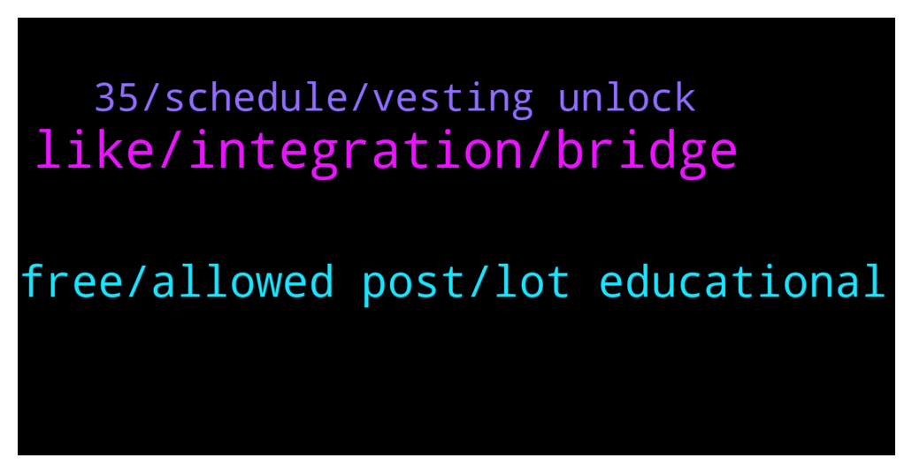

# **@chainlinkofficial**
 ## Analysis for **2022-01-28** - **2022-01-29**.

---

## 📊 **Basic Stats**

**n_messages_sent**: 49

---

---

## 🔝 **Top keywords and related messages**

1. **like, integration, bridge**

    @oldangusred --- *Hi! I'd like to know if there's some insurance dapp on Chainlink, like Ethereum has Nexus Mutual and Etherisc. I'm writing and article about this and this information is hard to get on Google, etc. Thank you!* **--->** [TG Discussion](https://t.me/chainlinkofficial/370342)

    @marcromeron --- *BEP20 is a Binance token standard which allows users to deploy fungible tokens or cryptocurrencies on Binance Smart Chain.* **--->** [TG Discussion](https://t.me/chainlinkofficial/370099)

    @borodonne --- *I would like to buy Chain link bep20* **--->** [TG Discussion](https://t.me/chainlinkofficial/370101)

    @noahmc --- *Are there any chainlink news tgchannels?* **--->** [TG Discussion](https://t.me/chainlinkofficial/370072)

    @Sylvarantt --- *You can independently verify the LINK token contracts for several chains here: https://docs.chain.link/docs/link-token-contracts/#binance-smart-chain* **--->** [TG Discussion](https://t.me/chainlinkofficial/370102)

    @Linkederic --- *Chainlink isn’t a blockchain, it’s a framework for building oracle networks, and in fact powers Etherisc* **--->** [TG Discussion](https://t.me/chainlinkofficial/370345)

2. **free, allowed post, lot educational**

    @Jeancgarcia --- *I really love that you guys provide a lot of educational material for free. Just want to take a moment to say thank you for your effort in helping others 🙌* **--->** [TG Discussion](https://t.me/chainlinkofficial/370239)

    @tygene140 --- *Am i allowed to post teeets?* **--->** [TG Discussion](https://t.me/chainlinkofficial/370043)

    @Joypokkamol --- *Hi all! Welcome! Feel free to check out our group guidelines https://t.me/chainlinkofficial/325011* **--->** [TG Discussion](https://t.me/chainlinkofficial/370336)

    @Linkederic --- *Cheers Jean, that’s what it’s all about!* **--->** [TG Discussion](https://t.me/chainlinkofficial/370240)

    @FPGeek --- *Remember no one will talk to you privately* **--->** [TG Discussion](https://t.me/chainlinkofficial/369983)

    @FPGeek --- *I helped a guy too. Im at zero* **--->** [TG Discussion](https://t.me/chainlinkofficial/369981)

3. **35, schedule, vesting unlock**

    @Timur_Gareev --- *Hi. Where can I stake link? As a single asset* **--->** [TG Discussion](https://t.me/chainlinkofficial/370237)

    @Turtles08 --- *Best yield farming option with Link?* **--->** [TG Discussion](https://t.me/chainlinkofficial/370068)

    @ogmudebone69 --- *Hello admin, when will the staking be available for the use?* **--->** [TG Discussion](https://t.me/chainlinkofficial/369936)

    @ZEEos133 --- *Tokenomics says 35% of total supply is for node operators. When these will be used?* **--->** [TG Discussion](https://t.me/chainlinkofficial/369933)

    @Shogun187 --- *Team doesn't comment on token transactions and there is no vesting/unlock schedule* **--->** [TG Discussion](https://t.me/chainlinkofficial/369939)

    @harrumphharrumph --- *There is no price, market, or trading discussion allowed here. @cryptoduke_i @CryptoDuke_ii* **--->** [TG Discussion](https://t.me/chainlinkofficial/369859)

