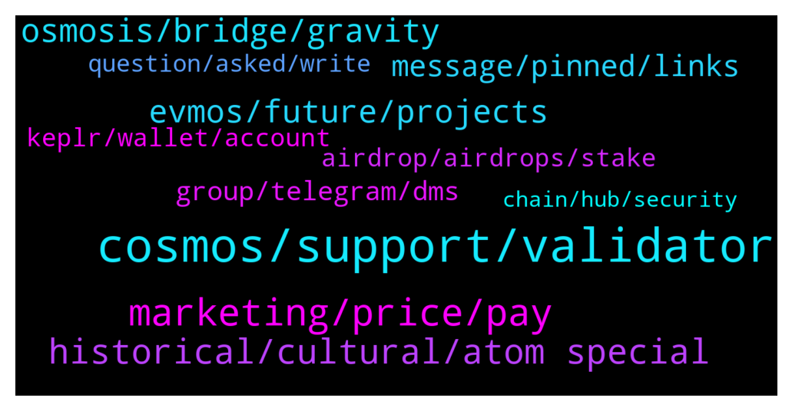

# **@cosmosproject**
 ## Analysis for **2022-01-28** - **2022-01-29**.

---

## 📊 **Basic Stats**

**n_messages_sent**: 305

---

---

## 🔝 **Top keywords and related messages**

1. **cosmos, support, validator**

    @ZoltanAtom --- *💥INTERCHAIN SECURITY COMING TO COSMOS HUB! 💥   🟪Interchain Security will allow Cosmos chains to lease security to each other. What this means, in practice, is that validators on one chain (the security provider) will be able to validate on another (the security consumer).  Earning Rewards On Many Chains  🟪Interchain Security will allow ATOM holders to earn staking rewards on a large number of Cosmos chains, just by staking their ATOMs. Consumer chains will benefit both from robust security from the Cosmos Hub validator set, and by getting their tokens in the hands of the Cosmos community of early adopters.  📄 For More Details Read This Blog Post* **--->** [TG Discussion](https://t.me/cosmosproject/482259)

    @AtomJazz --- *Cosmos doesn't really need to try that hard to attract users. There's hundreds of projects building on Cosmos stack because it's that good* **--->** [TG Discussion](https://t.me/cosmosproject/482538)

    @staycat1on --- *Kinda of holy city of cosmos* **--->** [TG Discussion](https://t.me/cosmosproject/482646)

    @ZoltanAtom --- *💥2021 has been an interstellar year for Cosmos!🚀  But we’re only at the start of this amazing journey w/ so many exciting plans on the horizon & plenty of developments already in the pipeline for 2022.  ⚛️Ready for “CosmosYear”?⚛️  Check out the highlights & prepare for what's coming* **--->** [TG Discussion](https://t.me/cosmosproject/482335)

    @ShashidharS1 --- *Yes true Btw Where can i learn more in specifics? Can u guide me to a video ot blogpost? I am new to cosmos network in general* **--->** [TG Discussion](https://t.me/cosmosproject/482540)

    @oldangusred --- *Hi! I'd like to know if there's some insurance dapp on Cosmos, like Ethereum has Nexus Mutual and Etherisc. I'm writing and article about this and this information is hard to get on Google, etc. Thank you!* **--->** [TG Discussion](https://t.me/cosmosproject/483034)

2. **marketing, price, pay**

    @Satoshi_2009 --- *But Users are concerned about investment* **--->** [TG Discussion](https://t.me/cosmosproject/482316)

    @tokenativo --- *see in the view of the investor... that is what really counts...* **--->** [TG Discussion](https://t.me/cosmosproject/482274)

    @ShashidharS1 --- *Why aren't they doing any marketing? Its the most potential cryptocurrency i have seen to the date* **--->** [TG Discussion](https://t.me/cosmosproject/482501)

    @AtomJazz --- *Community can't be bought so easily tho* **--->** [TG Discussion](https://t.me/cosmosproject/482635)

    @ShashidharS1 --- *No like its better to do marketing before someone else comes along with almost same specs and marketing* **--->** [TG Discussion](https://t.me/cosmosproject/482511)

    @tokenativo --- *we could have a launchpad for new businesses, and charge for it is not beign bad... of course, the project owners will still have to order some AKASH machines, all of that as part of an ATOM deposit to fund the project...* **--->** [TG Discussion](https://t.me/cosmosproject/482255)

3. **historical, cultural, atom special**

    @staycat1on --- *There should be some cultural spiritual historical uniqueness to make Atom special* **--->** [TG Discussion](https://t.me/cosmosproject/482637)

    @AtomJazz --- *Not just ATOM but the whole Cosmos ecosystem* **--->** [TG Discussion](https://t.me/cosmosproject/482526)

    @AtomJazz --- *ATOMs community should do the same and the same goes for Sifchain* **--->** [TG Discussion](https://t.me/cosmosproject/482490)

    @staycat1on --- *Historical and cultural difference only, but L1 is created equal in structure. So atom is exactly L1, but with historical/cultural/spiritual uniqueness.* **--->** [TG Discussion](https://t.me/cosmosproject/482644)

    @Johnson --- *Not trying to fud, is there a particular reason why atom is down at the moment ? Did I miss any announcements ?* **--->** [TG Discussion](https://t.me/cosmosproject/482660)

    @tokenativo --- *That makes really hard to Value ATOM.... the contribution to bottomline is not clear...* **--->** [TG Discussion](https://t.me/cosmosproject/482262)

4. **osmosis, bridge, gravity**

    @abratusz --- *"I think Osmosis governance should choose one bridge solution to use as its primary service provider to bring over assets from Ethereum" – @sunnya97* **--->** [TG Discussion](https://t.me/cosmosproject/482486)

    @crypto4life4eva --- *Can I transfer my UST on osmosis to ETH or TERRA on gravity? I can’t seem to work it out* **--->** [TG Discussion](https://t.me/cosmosproject/482120)

    @Wu57an6 --- *Please vote on osmosis proposal 132 for sifchain to list rowan+eth+erc20 tokens on osmosis.  Need interoperability, connectivity and colaboration to grow and expand as is the vision of cosmos.* **--->** [TG Discussion](https://t.me/cosmosproject/482475)

    @TicoJohnny --- *Gravity Bridge isn't totally connected yet, you can move ust to Terra, best to ask in Osmosis channel please: https://t.me/osmosis_chat* **--->** [TG Discussion](https://t.me/cosmosproject/482122)

    @ZoltanAtom --- *Oh so you are saying that osmosis, Juno are not successful ? Their business plan was a bad idea ?* **--->** [TG Discussion](https://t.me/cosmosproject/482268)

    @AtomJazz --- *For Osmosis questions pls join https://t.me/osmosis_chat* **--->** [TG Discussion](https://t.me/cosmosproject/482670)

5. **evmos, future, projects**

    @DrCryptulien --- *It's still underdeveloped compared to ETH or Avalanche* **--->** [TG Discussion](https://t.me/cosmosproject/482102)

    @AtomJazz --- *They could but since they have a large attack surface (smart contracts) it probably wouldn't be the smartest idea.* **--->** [TG Discussion](https://t.me/cosmosproject/482630)

    @tokenativo --- *Ok, but the PoS base still need to be built...* **--->** [TG Discussion](https://t.me/cosmosproject/482260)

    @ZoltanAtom --- *We have already Starport. Have a look at;  https://discord.gg/passage* **--->** [TG Discussion](https://t.me/cosmosproject/482257)

    @ZoltanAtom --- *Also yes,Starport will support new projects. Look at this one too;  https://twitter.com/starporthq/status/1486764190144479233?s=21* **--->** [TG Discussion](https://t.me/cosmosproject/482258)

    @ShashidharS1 --- *No i mean in the future If someone comes up with the same layer 1? Not like there is a patent to this right?* **--->** [TG Discussion](https://t.me/cosmosproject/482519)

6. **message, pinned, links**

    @Cordtus --- *They are there. It's more of a CVS receipt than a message though lol. Probably scrolled past it.* **--->** [TG Discussion](https://t.me/cosmosproject/482477)

    @TicoJohnny --- *There is not a way to do this.* **--->** [TG Discussion](https://t.me/cosmosproject/482081)

    @Contents_unknown --- *How do i do the verification again jazz link?* **--->** [TG Discussion](https://t.me/cosmosproject/482365)

    @TicoJohnny --- *At the moment you’ll have to manually check your eligibility, the Emeris dashboard will have this kind of information at Public launch* **--->** [TG Discussion](https://t.me/cosmosproject/482187)

    @TicoJohnny --- *I assume it's all the ones available taken at the snapshot. But maybe it's just the main ones? Good question! lol* **--->** [TG Discussion](https://t.me/cosmosproject/482798)

    @AtomJazz --- *All direct links are in the pinned message* **--->** [TG Discussion](https://t.me/cosmosproject/482684)

7. **group, telegram, dms**

    @G --- *Also, have been spammed 4 times since joining this group this morning.  WTF.  I even got spammed by someone using this pages title as their telegram handle asking about some cosmos rewards or something. That's another reason why telegram is such shit.  And will be leaving this group because of the level of dirtbag scammers with shitty grammar always trying to con people disguised as admins.  Cowardly shitbags who are incapable of taking property directly from people's hands because they know what the results would be.  This group is infested with them.* **--->** [TG Discussion](https://t.me/cosmosproject/482861)

    @Contents_unknown --- *Where can I report a admin scammer* **--->** [TG Discussion](https://t.me/cosmosproject/482385)

    @V727165 --- *Can somebody send me invite to trading chat* **--->** [TG Discussion](https://t.me/cosmosproject/482871)

    @mahyarblue --- *I'm not sure that they have a Telegram group  Neither seen nor heard of it* **--->** [TG Discussion](https://t.me/cosmosproject/482802)

    @Cordtus --- *Yeah I'm just bugging. It is a great and comprehensive list many groups don't have any* **--->** [TG Discussion](https://t.me/cosmosproject/482480)

    @KingC0sm0s --- *Got it sir. Ill join and share this. ❤️* **--->** [TG Discussion](https://t.me/cosmosproject/482436)

8. **keplr, wallet, account**

    @bmx777 --- *Keprl and ledger live with the same account show a different balance* **--->** [TG Discussion](https://t.me/cosmosproject/482559)

    @ggwashinton1 --- *LUNA is part of IBC.  you can just send to keplr wallet (terra network)* **--->** [TG Discussion](https://t.me/cosmosproject/482852)

    @mike_limas --- *Guys, if i create a new account in keplr it means i create a new wallet?* **--->** [TG Discussion](https://t.me/cosmosproject/482323)

    @perry11741 --- *To add another account to my keplr for ATOM - must I add account and choose the import existing account option?* **--->** [TG Discussion](https://t.me/cosmosproject/482439)

    @Cordtus --- *Keplr wallet. There's prob a link in here somewhere.* **--->** [TG Discussion](https://t.me/cosmosproject/482468)

    @AtomJazz --- *Yes Keplr is THE cosmos IBC wallet.* **--->** [TG Discussion](https://t.me/cosmosproject/482355)

9. **airdrop, airdrops, stake**

    @GerryOkwy --- *This is showing me Airdrop and not where to stake atom* **--->** [TG Discussion](https://t.me/cosmosproject/482466)

    @zstupar33 --- *SHD Airdrop date announced guys! https://twitter.com/Shade_Protocol/status/1487078262983565319?s=20&t=3ilE98De2XHSVSoUanKb8w* **--->** [TG Discussion](https://t.me/cosmosproject/482729)

    @Condor247 --- *Did atom holders receive hua airdrop?* **--->** [TG Discussion](https://t.me/cosmosproject/482177)

    @karolmaciej --- *When i claim sth from airdrop, is there any case that i will give someone access to my wallet by mistake ? Or claiming airrop is safe?* **--->** [TG Discussion](https://t.me/cosmosproject/482925)

    @crypt0evil --- *Where i can check all my airdrops? :)* **--->** [TG Discussion](https://t.me/cosmosproject/482185)

    @memegoldfrog --- *how can i see if i got the stars airdrop* **--->** [TG Discussion](https://t.me/cosmosproject/482124)

10. **question, asked, write**

    @teddus --- *Can you elaborate please, I don't  understand properly* **--->** [TG Discussion](https://t.me/cosmosproject/482710)

    @TolayHaytham --- *Even  it asked me need to write , but maybe write  anything  cause  it's  unnecessary* **--->** [TG Discussion](https://t.me/cosmosproject/482205)

    @mahyarblue --- *I've already asked another question there 😂 which reminds unanswered* **--->** [TG Discussion](https://t.me/cosmosproject/482790)

    @ZoltanAtom --- *Have a look at this one;  https://youtu.be/tIUIW-330WI* **--->** [TG Discussion](https://t.me/cosmosproject/482297)

    @AtomJazz --- *But it's open to different interpretations I guess* **--->** [TG Discussion](https://t.me/cosmosproject/482627)

    @ShashidharS1 --- *Yes yes thats what i meant to say* **--->** [TG Discussion](https://t.me/cosmosproject/482530)

