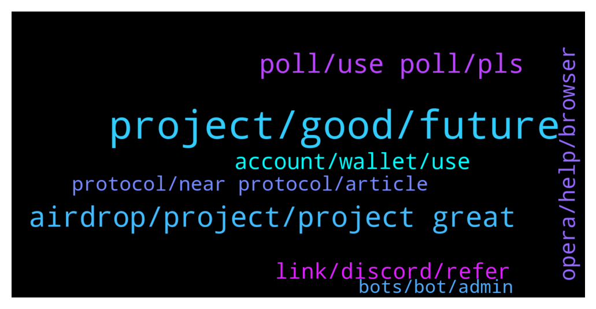

# **@cryptonear**
 ## Analysis for **2022-01-28** - **2022-01-29**.

---

## 📊 **Basic Stats**

**n_messages_sent**: 508

---

---

## 🔝 **Top keywords and related messages**

1. **project, good, future**

    @momotazchy --- *A good project and strong team in a predictable and transparent road map, planned and projected. I think in the near future we will see an unprecedented growth of this project.* **--->** [TG Discussion](https://t.me/cryptonear/300862)

    @upance --- *This is excellent project for the future with strong team, a transparent, planned and project roadmap. it will be successfulI. Always be waiting for the progress of this project.* **--->** [TG Discussion](https://t.me/cryptonear/301438)

    @demafx --- *There is a lot of info😅* **--->** [TG Discussion](https://t.me/cryptonear/313580)

    @praveen9008 --- *That's a really amazing project. I'm so excited and happy to be participating in this project. I hope this project will gain more popularity in the future. ❤️🎉* **--->** [TG Discussion](https://t.me/cryptonear/315516)

    @iamkemoo --- *Sorry but we don’t do that. Good luck with your project 👍 🍀* **--->** [TG Discussion](https://t.me/cryptonear/319090)

    @arthag --- *This is a really amazing project 🚀🚀* **--->** [TG Discussion](https://t.me/cryptonear/304964)

2. **airdrop, project, project great**

    @bailey_12 --- *Hey gangz, 1 Airdrop from Bitstore is not enough ?? Bow Bow, another Airdrop is on the line to hunt down  https://twitter.com/BaileyVu12/status/1486980604097089538* **--->** [TG Discussion](https://t.me/cryptonear/303901)

    @larry_lang --- *Hello all, welcome to NEAR Protocol Official channel. Thanks for joining us on the NEAR X Bit.Store special airdrop 😍😍 https://twitter.com/NEAR_Blockchain/status/1486904937925812225    With that being said, we would love u to: - Check the pinned welcome message for useful links + community rules 🎉  - For further support feel free to DM our admins  @kv9990 @larry_lang @Kripto_Raptor @iamkemoo @FritzWagner @iforbusiness2 @GeorgePro1 @bailey_12   ( ADMINS NEVER DM FIRST,BEWARE OF SCAMMERS)* **--->** [TG Discussion](https://t.me/cryptonear/300567)

    @spectre011 --- *https://t.me/fusotao Hello guys we are happy to announce that fusotao protocol first airdrop will commence tomorrow (no specific time) stay tuned on our official account/channel As information will be passed before then Thanks* **--->** [TG Discussion](https://t.me/cryptonear/300153)

    @kv9990 --- *Hey new people, don't forget to checkout this AIRDROP!!!!* **--->** [TG Discussion](https://t.me/cryptonear/304119)

    @mayanktanwar2 --- *Hey i submit form i m eligible to Airdrop?* **--->** [TG Discussion](https://t.me/cryptonear/300458)

    @spectre011 --- *🔥FUSOTAO AIRDROP ANNOUNCEMENT🔥  We are super excited to announce Fusotao Airdrop is coming!🥳  💰 Total: 150,000 TAO(Fusotao) 📅 Deadline: April 30th, 6pm UTC  🌟All users participating in this airdrop will be rewarded with $TAO, which will be distributed according to the entries. The more invitations, the higher entries, the more rewards.  💥 Join here: https://gleam.io/4UDKu/fusotao-1st-airdrop-round  More info👇 https://medium.com/@FusotaoProtocol/fosotao-protocol-airdrop-is-live-fusotao-airdrop-guidance-d17a2fce6e86 🚀🚀🚀* **--->** [TG Discussion](https://t.me/cryptonear/314766)

3. **poll, use poll, pls**

    @NearFritz --- *Hey welcome, how are you ? share something about you with us please* **--->** [TG Discussion](https://t.me/cryptonear/313483)

    @GeorgePro1 --- *Good morning 🌞  Where did you hear about near?* **--->** [TG Discussion](https://t.me/cryptonear/315411)

    @zenkert --- *We are just humans. I hope you got my point, positively.* **--->** [TG Discussion](https://t.me/cryptonear/313926)

    @thanano46 --- *Hey Buddy 🥱🥱🥱 Good Morning 🌞* **--->** [TG Discussion](https://t.me/cryptonear/300285)

    @BoboiBoyyyyyyyyyy --- *Hello mate, glad to be here* **--->** [TG Discussion](https://t.me/cryptonear/304439)

    @cryptoinflu --- *hello friends, good morning for all members* **--->** [TG Discussion](https://t.me/cryptonear/301061)

4. **account, wallet, use**

    @Tom --- *Error when try to recover passphrase* **--->** [TG Discussion](https://t.me/cryptonear/300118)

    @DaandiS --- *I had created at early stage when was not launched in exchange  through Chrome extension and only not down the passphrase after some time   my laptop was not workable so now i dont have address* **--->** [TG Discussion](https://t.me/cryptonear/300161)

    @DaandiS --- *I had also created wallet  at early stage but I'm  unable to access using passphrase and getting message like this* **--->** [TG Discussion](https://t.me/cryptonear/300152)

    @kv9990 --- *Select passphrase as recovery method then enter your desired account id then fund your wallet by single use deposit address then you'll get your account_id.near address 😋😄* **--->** [TG Discussion](https://t.me/cryptonear/300091)

    @kv9990 --- *It's not your wallet that's deleted but your single use funding address is deleted, please use your account_id.near as your address now!  Btw if you'll fund this address, it'll be reactivated.* **--->** [TG Discussion](https://t.me/cryptonear/313235)

    @Tom --- *the problem is i cannot create near account* **--->** [TG Discussion](https://t.me/cryptonear/300122)

5. **opera, help, browser**

    @NearFritz --- *Yep chrome is having some issues, you can try OPERA browser, is what I use and never got into any problem* **--->** [TG Discussion](https://t.me/cryptonear/300129)

    @Tom --- *if browser not support must be notice.* **--->** [TG Discussion](https://t.me/cryptonear/300128)

    @Tom --- *Also tried Chrome, Edge, Firefox, Opera, Opera+VPN* **--->** [TG Discussion](https://t.me/cryptonear/300130)

    @larry_lang --- *how can help you, can you be more specific* **--->** [TG Discussion](https://t.me/cryptonear/304760)

    @NearFritz --- *Mmm I dont know about any guide, but I will love to make one if there is a need, that's why I asked what specific you are looking for* **--->** [TG Discussion](https://t.me/cryptonear/314254)

    @larry_lang --- *more information abt it here, sir. https://twitter.com/NEAR_Blockchain/status/1486904937925812225* **--->** [TG Discussion](https://t.me/cryptonear/303519)

6. **link, discord, refer**

    @larry_lang --- *here u are. discord channel. https://discord.gg/QaSSDCGD* **--->** [TG Discussion](https://t.me/cryptonear/304904)

    @Xnba --- *I need a subscribers for my youtube channel if you gladly wont to help late me know and will send my link* **--->** [TG Discussion](https://t.me/cryptonear/319089)

    @isonar --- *Hey admins, I still can't post any links is that correct behavior?* **--->** [TG Discussion](https://t.me/cryptonear/302270)

    @Ayush_ff --- *I want refer is discord 😄 Shall u able.* **--->** [TG Discussion](https://t.me/cryptonear/304779)

    @NearFritz --- *There is the link to the forum 🤟* **--->** [TG Discussion](https://t.me/cryptonear/313549)

    @larry_lang --- *i meant i saw that when u send the link it got deleted by bot( which is our mechanism for new members btw, so it's normal)  and i just simply looked for the link that u sent that's all* **--->** [TG Discussion](https://t.me/cryptonear/300333)

7. **protocol, near protocol, article**

    @Backtobtc --- *Which year did Near Protocol establish?* **--->** [TG Discussion](https://t.me/cryptonear/313367)

    @Backtobtc --- *What is the token of Near Protocol?* **--->** [TG Discussion](https://t.me/cryptonear/313364)

    @oppzsmoKe --- *How’s it going team any new news on near protocol* **--->** [TG Discussion](https://t.me/cryptonear/300253)

    @extremelybullish --- *Is near protocol offering any grant for developers looking to build a cross chain bridge to other networks?* **--->** [TG Discussion](https://t.me/cryptonear/317897)

    @Xdiamond8989 --- *Can't we buy in near protocol using a dex* **--->** [TG Discussion](https://t.me/cryptonear/310440)

    @Jash --- *Hello, newbie here. Does Near protocol has burning supply?* **--->** [TG Discussion](https://t.me/cryptonear/314028)

