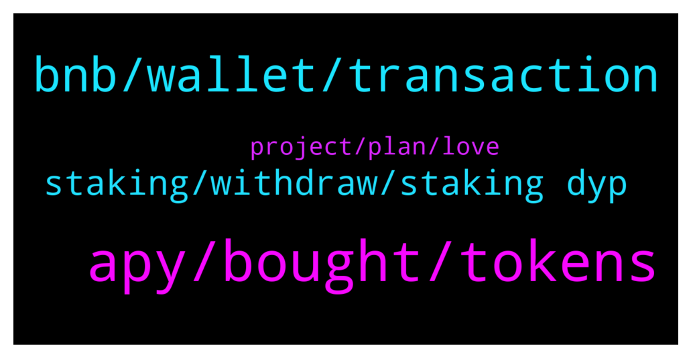

# **@dypfinance**
 ## Analysis for **2022-01-28** - **2022-01-29**.

---

## 📊 **Basic Stats**

**n_messages_sent**: 117

---

---

## 🔝 **Top keywords and related messages**

1. **apy, bought, tokens**

    @timdyp --- *The tokens were bought using ETH from our treasury.* **--->** [TG Discussion](https://t.me/dypfinance/243123)

    @timdyp --- *The tokens were bought from Uniswap and KuCoin directly. We will provide more information in the next days.* **--->** [TG Discussion](https://t.me/dypfinance/243118)

    @Barry --- *Hmm… does the recent price drop of the DYP token have anything to do with this? Because a couple days ago when BTC was at 34k, apy was still 300+* **--->** [TG Discussion](https://t.me/dypfinance/243223)

    @H --- *Tvl 139k  And dyp said 6m too much down* **--->** [TG Discussion](https://t.me/dypfinance/243176)

    @cryptoninja1990 --- *Hey DeFi Yield Family, this is listing manager from BitMart. We are interested in listing IDYP token. Could you tell me who I can talk to? I am not a Scammer, you could verify me via BitMart Official website* **--->** [TG Discussion](https://t.me/dypfinance/243143)

    @timdyp --- *Sure, more info will be provided. I can confirm that 1,084,513.08 DYP was purchased from Uniswap and KuCoin open market.* **--->** [TG Discussion](https://t.me/dypfinance/243132)

2. **bnb, wallet, transaction**

    @DhoniMSD516 --- *Ok I checked contract and I noticed that your friend transactions are failed with error insufficient amount, which mean there is no DYP to claim or reinvest but he is doing it so it is failing* **--->** [TG Discussion](https://t.me/dypfinance/243355)

    @DhoniMSD516 --- *Hey can you please dm me his wallet address so that I can check what error he got, or if you can please let me know his error* **--->** [TG Discussion](https://t.me/dypfinance/243347)

    @Nubarv --- *My friend attempted to complete the transaction twice, his bnb got deducted, but transaction failed* **--->** [TG Discussion](https://t.me/dypfinance/243346)

    @Hemwhy34 --- *I have been pressing the approve button but it’s not working* **--->** [TG Discussion](https://t.me/dypfinance/243310)

    @Nubarv --- *As far as i remember, his transaction was failing because it showed $0 bnb durring claim,   but in his wallet he does have bnb* **--->** [TG Discussion](https://t.me/dypfinance/243350)

    @DhoniMSD516 --- *It does show 0 bnb on top and network fee shows how much it costs but when confirmed the txn goes through* **--->** [TG Discussion](https://t.me/dypfinance/243351)

3. **staking, withdraw, staking dyp**

    @AcKpA --- *I can't withdraw my tokens from stake* **--->** [TG Discussion](https://t.me/dypfinance/243284)

    @Vage --- *Hi I’m hes friend here is my dyp and I can’t do anything. I keep getting declined but I have everything covered. I had previously reinvested from dyp rewards and it worked but now it’s failing* **--->** [TG Discussion](https://t.me/dypfinance/243375)

    @Ion --- *Hy, I have one question on staking pools : plecase e plain why I lost >20% of my  capital after staking în pool?* **--->** [TG Discussion](https://t.me/dypfinance/243317)

    @Tettluft --- *How much eth should I leave in the wallet to get to pay fees when staking dyp?* **--->** [TG Discussion](https://t.me/dypfinance/243242)

    @madlytanvir --- *If i wat to closed everything and want to takeback eth what shouldbi do?* **--->** [TG Discussion](https://t.me/dypfinance/243038)

    @Ali pajoo --- *Hi how can I join this giveaway?* **--->** [TG Discussion](https://t.me/dypfinance/243025)

4. **project, plan, love**

    @MJMuppet_JayJay --- *Love the openess around this Tim. It must really be noted that what you just mentioned in this group would have been tucked away as best as possible by A LOT of other projects* **--->** [TG Discussion](https://t.me/dypfinance/243103)

    @hemanrock --- *hey, admins never DM first. please ask if you have Q regarding project or marketing.* **--->** [TG Discussion](https://t.me/dypfinance/243283)

    @Alejandrogonzalezespinosa --- *Do you have plan in the future create your blochain* **--->** [TG Discussion](https://t.me/dypfinance/243279)

    @hemanrock --- *there no plan yet. please check roadmap https://dyp.finance/roadmap* **--->** [TG Discussion](https://t.me/dypfinance/243280)

    @iamJubi --- *Hello. Kindly email your proposal to contact@dyp.finance* **--->** [TG Discussion](https://t.me/dypfinance/243149)

    @umarbisyir --- *Very serious project, love it !!! Very bullish indeed!!* **--->** [TG Discussion](https://t.me/dypfinance/243129)

