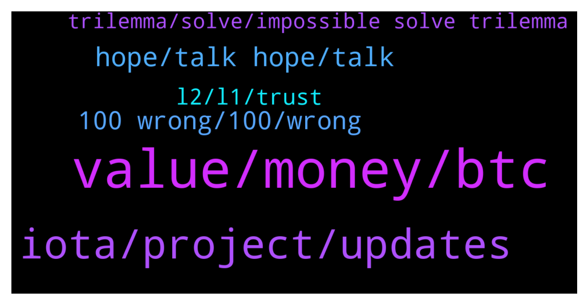

# **@iotatangle**
 ## Analysis for **2022-01-28** - **2022-01-29**.

---

## 📊 **Basic Stats**

**n_messages_sent**: 180

---

---

## 🔝 **Top keywords and related messages**

1. **value, money, btc**

    @fudleur --- *if bitcoin can be replaced as a store of value, then no cryptocurrency can compete with gold, as gold has that function since 5k and more years, while bitcoin is here since 13* **--->** [TG Discussion](https://t.me/iotatangle/307835)

    @StefanoDellaValle --- *Bitcoin does only one simple application: move bitcoin. That's all.* **--->** [TG Discussion](https://t.me/iotatangle/307932)

    @fudleur --- *gold did not evolve in millions of years. did development stop because of that?* **--->** [TG Discussion](https://t.me/iotatangle/307844)

    @PiernasLocas --- *Its time that people start to understand that the real value from this world it is in the "information" because is the only stuff in the world that is usefull to every life even it is usefull to the machines.. and not a piece of rock that only it is usefull to industrial use...  who controls the information, can control the life* **--->** [TG Discussion](https://t.me/iotatangle/307846)

    @HolgerKoether --- *I still don’t understand what Bitcoin and Gold should have in common beside Bitcoin being marketed as digital gold 😬😬😬* **--->** [TG Discussion](https://t.me/iotatangle/307856)

    @StefanoDellaValle --- *again a myth ... Price are stable since more than 5 years and in some cases are lower. In many case index gained so even 1 usd invested produced more than the inflaction.  But the real reason why you are wrong is because BTC has no value if not exchanged in Fiat. Let's imagine that there are no exchanges granting to sell BTC for USD, what you will you get for a BTC? nothing, because the base price of everything is the cost of productions that is made of human time and energy, both element not currently available in BTC ... so what? If Fiat looses BTC gain? maybe .. and maybe not as we are seeing in this period. The fact is that all the romantic history around the independent money is necessary only to attract other users, so other money, so grant advantage for those how entered in the game in an earlier stage. Nothing to do with money,  so much to do with speculation and "use" of the community to become reach* **--->** [TG Discussion](https://t.me/iotatangle/307920)

2. **iota, project, updates**

    @PiernasLocas --- *White list open to everyone, to buy a rustyrobot nft* **--->** [TG Discussion](https://t.me/iotatangle/307740)

    @⠠⠵ Lucas! --- *Nice argumentation on both sides of the table. I am happy to see that we are finally, after all these years of life, getting to the point where the only real concern is whether IOTA will achieve its roadmap (being coordicide the most prominent milestone, yes), and not whether it is an absolutely disruptive, more efficient and superior in so many areas, technology for us humans.* **--->** [TG Discussion](https://t.me/iotatangle/307990)

    @StefanoDellaValle --- *Anyway .. I've never read form someone in IOTA community that IOTA will replace bitcon ... so what?* **--->** [TG Discussion](https://t.me/iotatangle/307872)

    @StefanoDellaValle --- *Even IOTA is a community, but here the romantic history is a little bit different: real adoption in the industry to build more transparent and secure applications* **--->** [TG Discussion](https://t.me/iotatangle/307921)

    @fudleur --- *i like iota for what it is, but i hate the vision that dom has for this project.* **--->** [TG Discussion](https://t.me/iotatangle/307841)

    @SwitchAndy --- *IOTA 2.0 Coordinator will be removed* **--->** [TG Discussion](https://t.me/iotatangle/307809)

3. **hope, talk hope, talk**

    @StefanoDellaValle --- *thank for the talk. I hope the silent readers enjoyed.* **--->** [TG Discussion](https://t.me/iotatangle/307971)

    @StefanoDellaValle --- *ok. please tell us at least a second.* **--->** [TG Discussion](https://t.me/iotatangle/307936)

    @fudleur --- *thanks for responding antonio. so this really looks like a hard promise* **--->** [TG Discussion](https://t.me/iotatangle/307815)

    @antonionardella --- *This is not amateur hour amymore where stuff is published to make the news..* **--->** [TG Discussion](https://t.me/iotatangle/307823)

    @fudleur --- *i hope some more people will take up on it. thanks :)* **--->** [TG Discussion](https://t.me/iotatangle/307972)

    @fudleur --- *hope they don’t postpone it too much* **--->** [TG Discussion](https://t.me/iotatangle/307817)

4. **100 wrong, 100, wrong**

    @fudleur --- *or what is this point based on?* **--->** [TG Discussion](https://t.me/iotatangle/307925)

    @fudleur --- *no, this is not true at all man* **--->** [TG Discussion](https://t.me/iotatangle/307964)

    @fudleur --- *really this statement is 100% wrong, every single word in it* **--->** [TG Discussion](https://t.me/iotatangle/307958)

    @fudleur --- *sorry but this is 100% wrong* **--->** [TG Discussion](https://t.me/iotatangle/307954)

    @fudleur --- *yea this is true, but this is not my point* **--->** [TG Discussion](https://t.me/iotatangle/307933)

    @Basti --- *What are you talking about exactly?* **--->** [TG Discussion](https://t.me/iotatangle/307849)

5. **l2, l1, trust**

    @StefanoDellaValle --- *I understand very well: you trust intermediary nodes.... so you moved away from the P2P paradigma ... and therfore you need to trust third paty.* **--->** [TG Discussion](https://t.me/iotatangle/307959)

    @StefanoDellaValle --- *so you are hoping to scale a secure L1 with an unsecure L2 ... best wishes* **--->** [TG Discussion](https://t.me/iotatangle/307953)

    @StefanoDellaValle --- *no, the the reason is that is not really so secure to grant what the ledger based L1 is able to grant.* **--->** [TG Discussion](https://t.me/iotatangle/307952)

    @fudleur --- *scalability is solved by the second layer* **--->** [TG Discussion](https://t.me/iotatangle/307867)

    @StefanoDellaValle --- *ok. So, you belive that the solution is on the layer 2. Well, pls explain why, if we can build a layer 2 secure and scalable, able to support unlimited applications, we should not move that technology on the layer 1?* **--->** [TG Discussion](https://t.me/iotatangle/307947)

    @fudleur --- *if you use bluewallet for example and create a lightning wallet, then yes, by default you trust others. you can always select your own node tho, in every serious lightning wallet app.* **--->** [TG Discussion](https://t.me/iotatangle/307966)

6. **trilemma, solve, impossible solve trilemma**

    @fudleur --- *my take is: it is impossible to solve the trilemma in only one layer* **--->** [TG Discussion](https://t.me/iotatangle/307951)

    @fudleur --- *this btw it the “decentralized” part of the trilemma :)* **--->** [TG Discussion](https://t.me/iotatangle/307946)

    @ash1taka1997 --- *Ok, so some believe it is unsolvable while some others think it is solvable. The latter are still trying hard…* **--->** [TG Discussion](https://t.me/iotatangle/307910)

    @fudleur --- *it did not solve it on the main layer and people in the bitcoin community say that the trilemma is not solvable within the main layer. i also don’t see how, but i’m also not a mathematician.* **--->** [TG Discussion](https://t.me/iotatangle/307909)

    @fudleur --- *yes. my point is, that it’s impossible to solve the trilemma* **--->** [TG Discussion](https://t.me/iotatangle/307906)

    @fudleur --- *bitcoin maxis say the trilemma is unsolvable, which i agree with. Scalability, Security, Decentralization* **--->** [TG Discussion](https://t.me/iotatangle/307808)

