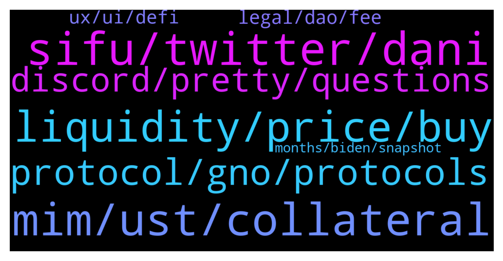

# **@lobsters_chat**
 ## Analysis for **2022-01-28** - **2022-01-29**.

---

## 📊 **Basic Stats**

**n_messages_sent**: 615

---

---

## 🔝 **Top keywords and related messages**

1. **sifu, twitter, dani**

    @SuperMassiveONE --- *Hey gang, just posted an interview with @andrecronje such an interesting conversation. Hopefully give some insight into the good Doctor https://www.youtube.com/watch?v=ZYvO1UNMD_c* **--->** [TG Discussion](https://t.me/lobsters_chat/320375)

    @SpikeSpiege1 --- *Dude needs a nap.  Someone take his Twitter privileges please https://mobile.twitter.com/danielesesta/status/1486759008895524865* **--->** [TG Discussion](https://t.me/lobsters_chat/320075)

    @GR33DY1 --- *Hey guys, wondering if anyone who was around could shed light on cream finance's past relationship with Sifu?  I see that Machi was early in frog nation & also Leo Cheng from cream is a multisig for Abracadabra but I didn't realise Sifu (also multisig for Abracadabra) was on creams team in 2020?  Oops I see people have already brought this up* Nethertheless theirs a clear connection in that Sifu was in cream when it was "exploited" (as was Leo Cheng) & they are both now getting paid  team funds from Abracadabra.   It seems to me that Abracadabra multisig is completely centralised around people that primarily have close ties to Sifu & Merlin (Who are both Italian)   See: https://milkovercream.medium.com/the-cream-team-history-of-suspicious-activity-and-questionable-decision-making-4ffc47960069* **--->** [TG Discussion](https://t.me/lobsters_chat/320915)

    @Sdtsll --- *Props to them for stating facts .. true to the hustle lol https://twitter.com/mgnr_io/status/1487258646018887684* **--->** [TG Discussion](https://t.me/lobsters_chat/320791)

    @ivangbi --- *I hope the suits in the pentagon are. Imho this is a lonely yet crowded hill to die on. It’s part of the shady non-public stuff. Uniswap doesn’t seem to have bad intentions (they are just close minded) which is not as bad as sifu* **--->** [TG Discussion](https://t.me/lobsters_chat/320945)

    @ivangbi --- *That is no related to popsicle actual hack, that is totally different* **--->** [TG Discussion](https://t.me/lobsters_chat/320906)

2. **mim, ust, collateral**

    @hasufly --- *Leveraged MIM farmers can be blown up. Further, it would be interesting how much MIM is backed by TIME and SPELL* **--->** [TG Discussion](https://t.me/lobsters_chat/320071)

    @PmRiviere --- *Liquidators need to buy $MIM to liquidate* **--->** [TG Discussion](https://t.me/lobsters_chat/320077)

    @tracksuitcat --- *Hey! I'm with a DAO that wants to move out of $MIM (1.3mm) but doesn't know - should we panic? What's the best route? We haven't done anything like this before 😰* **--->** [TG Discussion](https://t.me/lobsters_chat/320581)

    @pjsm1508 --- *lusd pool in curve not looking much better* **--->** [TG Discussion](https://t.me/lobsters_chat/320207)

    @forcey01 --- *the mim pool on curve getting interesting, 96% mim* **--->** [TG Discussion](https://t.me/lobsters_chat/320171)

    @AAA --- *6.19% 3crv left in the MIM pool, and the peg is still off by 1.5% only. That A=2000 holds it so far..* **--->** [TG Discussion](https://t.me/lobsters_chat/320195)

3. **liquidity, price, buy**

    @zeThrouzz --- *this is the real quesiton, if there are  huge liquidations and some market are not liquid enough it can create a big problem* **--->** [TG Discussion](https://t.me/lobsters_chat/320076)

    @fozzysbo --- *Why do you assume their are billions waiting to buy* **--->** [TG Discussion](https://t.me/lobsters_chat/320091)

    @Mringz --- *So based on the interaction I had with them. With the V3 liquidity you stack majority of the liquidity just below price of governance token you want to support. That's the wall. It's like stacking up the order book with a lot of buy orders at a specific price. So you have deep liquidity at a specific price. But the wall can be broken if all the buy order get filled and there is no more liquidity to support the set price.* **--->** [TG Discussion](https://t.me/lobsters_chat/320403)

    @tesslerc --- *Well, in his defense no one knows if its sustainable long-term since it has been running for a very short period of time. Real test will be what happens when the markets cool down, no?* **--->** [TG Discussion](https://t.me/lobsters_chat/320332)

    @Felix --- *If the are selling hundreds of millions of terra… but the price still up many times over the past year, is that an issue?* **--->** [TG Discussion](https://t.me/lobsters_chat/320226)

    @ivangbi --- *Ye I asked more follow-up info hehe. “a liquidity wall with the collateral to buy up the governance token essentially absorbing sell pressure” - how ser* **--->** [TG Discussion](https://t.me/lobsters_chat/320396)

4. **protocol, gno, protocols**

    @ivangbi --- *1. these protocols are likely not getting much usage, the idea of them is silly to me 2. mgnr went for this mercenary trade, and the protocol had nothing else to do and approved it cause otherwise it wouldn’t be able to show usage and revenue 3. the protocol hoped TVL numbers would be fine for everyone to eat the narrative 4. bad washing was uncovered, showing people r not is using the protocol  -> now the question is, does anybody give a f  there is likely a level of insider bs for such approvals, can’t go without it? is that criminal?  i dunno what their kyc terms blabla are if they allow for re-entering* **--->** [TG Discussion](https://t.me/lobsters_chat/320676)

    @ivangbi --- *They give a fkload to GNO holders and almost 0 to those who actually used the protocol* **--->** [TG Discussion](https://t.me/lobsters_chat/320605)

    @ivangbi --- *https://twitter.com/MonetSupply/status/1486845287213719554?s=20&t=1SQWsPuaIhMpSWdXGKvJ5g  Why is this tweet so liked?   There isn't much context either, so let me throw something in...  The token model of allowing other DAOs / opportunists use your protocol - is very viral. It is similar to marketing binary options via referral programs or selling courses. You get to build ur own product / brand and make $ while the underlying platform is actually the winner.* **--->** [TG Discussion](https://t.me/lobsters_chat/320323)

    @alexinlife --- *Its not necessarily a failure of the protocol or the system if they made a misjudement which produced data which can be relied on for future use.* **--->** [TG Discussion](https://t.me/lobsters_chat/320808)

    @adrianleb --- *also user of the protocol and no tokens, let’s start a support group* **--->** [TG Discussion](https://t.me/lobsters_chat/320615)

    @alejoamiras --- *who is the n0b managing this txs and why are they not using private relayers ?* **--->** [TG Discussion](https://t.me/lobsters_chat/320179)

5. **discord, pretty, questions**

    @defiahab --- *You can go look into the CREAM discord yourself* **--->** [TG Discussion](https://t.me/lobsters_chat/320749)

    @kindeagle --- *I enjoyed this twitter space sid from maple & index coop https://twitter.com/indexcoop/status/1486816981735153669?s=21* **--->** [TG Discussion](https://t.me/lobsters_chat/320934)

    @degengineer --- *The discord is pretty helpful https://discord.gg/nansen* **--->** [TG Discussion](https://t.me/lobsters_chat/320737)

    @Hariseldon23 --- *This is why this group is so valuable to the broader community. Will check them out* **--->** [TG Discussion](https://t.me/lobsters_chat/320238)

    @tracksuitcat --- *DM me if you a smart guy and I'll invite you to our team call on Discord* **--->** [TG Discussion](https://t.me/lobsters_chat/320582)

    @Sunny --- *I've been in this chat for months now and I still have no idea how tf to get one* **--->** [TG Discussion](https://t.me/lobsters_chat/320714)

6. **legal, dao, fee**

    @DeadMeatHK --- *Anyone here have experience with how a DAO interacts with traditional commercial entities? In particular, if a DAO controlled protocol wants to open an account with a CEX, how is the KYC managed? Do DAOs often (at all?) have a legal entity that can interact with other companies?* **--->** [TG Discussion](https://t.me/lobsters_chat/320266)

    @ivangbi --- *Tldr, most can’t get a bank account or a CEX account, or anything like that. You don’t really need those except foe maybe paying for devops stuff and salaries, which most end up doing vis their own pocket and then reimbursing via the usual DAO salary (which the contributors explain to their banking counterparts themselves, cause personal crypto is much easier than corporate crypto).Most DAOs do not have a legal entity because there is no proven proper way to make one except for Switzerland as that worked since before the last cycle. American lawyers can bill you for 7 fig creating complex structures as DAO legal wrappers which you wouldn’t be sure even work. Why go people go for that? Because of fear that in the absence of a legal wrapper, core team / contributors are seen as general partnership and get fked. TLDR read lex and jake on twitter, they post on this sometimes. Legal off //* **--->** [TG Discussion](https://t.me/lobsters_chat/320269)

    @DeadMeatHK --- *As some context, I'm asking from the position of a regulated service provider. We could only onboard legal entities (not individuals).* **--->** [TG Discussion](https://t.me/lobsters_chat/320277)

    @pandastoke --- *Sorry to bump this again but y’all should check out what the lawyers are building at LexDAO. They’ve built a one click Ricardian LLC that wraps the multisig holders into a Delaware LLC structure. Ross from that project is a beast.* **--->** [TG Discussion](https://t.me/lobsters_chat/320595)

    @eth2enthusiast --- *most investors dont really ask for a legal entity ime, some do.  as banteg said, pretty easy to get someone to pay for stuff or you take it on as a dev/first user and get reimbursed* **--->** [TG Discussion](https://t.me/lobsters_chat/320272)

    @jrrrFFFF --- *give me a sec, setting up my LLC* **--->** [TG Discussion](https://t.me/lobsters_chat/320659)

7. **ux, ui, defi**

    @adrianleb --- *“Check out our new UI and innovative UX” bruh either give me free money or remove stress from my life I don’t care how pretty your buttons are* **--->** [TG Discussion](https://t.me/lobsters_chat/320399)

    @adrianleb --- *Like governments building tax reporting websites with improved UX, it won’t make more ppl excited about filing their taxes* **--->** [TG Discussion](https://t.me/lobsters_chat/320363)

    @ivangbi --- *Tbh these discussions been so frequent about the quality of UX in DeFi, that maybe the core protocols don’t need to focus on it. They need to be d2b kinda (dao to business?) and allow the likes of nexo and CEXes to throw their $ in there.* **--->** [TG Discussion](https://t.me/lobsters_chat/320348)

    @ivangbi --- *https://twitter.com/The3D_/status/1486827635082776579?s=20&t=FqT8R9-5LcT4T-_8-OmUhw  I like every builder, but let’s be honest this UI sucks, yearn UI sucks, compound UI sucks, and yes gearbox UI sucks too so I am not biased there. And it’s fine. The UIs need to suck so we keep more money for crypto-native while centralized platforms build secure retail-focused products and then ape into those exact pools* **--->** [TG Discussion](https://t.me/lobsters_chat/320340)

    @tesslerc --- *Did you perform user research to confirm this thesis? or is it based on a gut feeling? My gut feeling is that currently crypto is a huge mess and 99% of the people that might have come into DeFi haven't since it's a pretty shitty experience (all included, including UI/UX).* **--->** [TG Discussion](https://t.me/lobsters_chat/320425)

    @adrianleb --- *if you're building a product which will keep ppl awake a night afraid of being liquidated, or paying a higher or lower tax (fee) or having to monitor your activity for tax returns etc, improving the UX is like boiling frogs, you're not improving user's quality of life, you're just making it less painful* **--->** [TG Discussion](https://t.me/lobsters_chat/320405)

