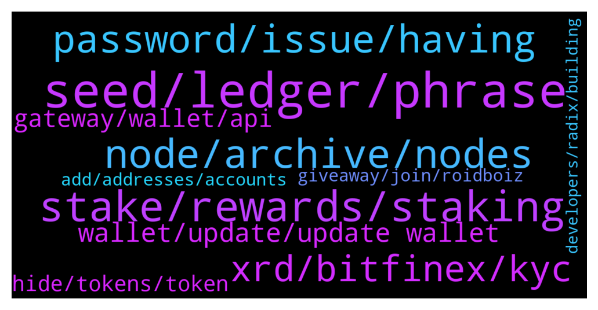

# **@radix_dlt**
 ## Analysis for **2022-01-28** - **2022-01-29**.

---

## 📊 **Basic Stats**

**n_messages_sent**: 645

---

---

## 🔝 **Top keywords and related messages**

1. **seed, ledger, phrase**

    @Vorgesetzter --- *Just googled it. Ledger also supports 12-words: "Note: Ledger hardware wallets only generate 24-word recovery phrases. You can also enter a 12, 18 or 24 word recovery phrase you received from a different wallet provider." From: https://www.ledger.com/academy/crypto/what-is-a-recovery-phrase* **--->** [TG Discussion](https://t.me/radix_dlt/347041)

    @fpieper --- *No, not from the old 12 words seed phrase. Anyway you shouldn't do it. Just unstake and be safe.* **--->** [TG Discussion](https://t.me/radix_dlt/347026)

    @Magal36 --- *Well, you now have the software wallet on two devices. Software wallets can be compromised if your device is compromised. You just doubled the chance on two devices. Read:. https://learn.radixdlt.com/article/using-a-crypto-software-wallet-securely* **--->** [TG Discussion](https://t.me/radix_dlt/347911)

    @Magal36 --- *anyway, as Florian said, you should never import the seed phrase into a ledger hw unless that seed phrase came from a previous broken ledger hw. If you import your seed from the desktop wallet, you loose the security of the hardware, because that seed was already in a device connected to the internet, whereas the seed that came with the ledger never has been connected, has zero chance of being exposed.* **--->** [TG Discussion](https://t.me/radix_dlt/347062)

    @Bent --- *This isn't great advice imo. If your realistic alternative is to keep using the software wallet then moving that over to hardware by importing seed phrase is still an improvement in security. It's not nearly as good as creating a new seed phrase from scratch on the ledger would be but still far superior to continuing with the software wallet.* **--->** [TG Discussion](https://t.me/radix_dlt/347101)

    @Kansuler --- *I think the new seed phrase feature is excellent. A lot of people weren't able to move swiftly to the ledger because of the 12-word seed phrase. You have to unstake and move XRD. With the introduction of 18 and 24-words you'd be able to move to Ledger with seed phrase recovery.  It's also about how much effort is needed for the benefit, my guess that introducing more seed phrases was a very easy change.* **--->** [TG Discussion](https://t.me/radix_dlt/347020)

2. **stake, rewards, staking**

    @Radstakes --- *There is no risk to your tokens from staking, they never actually leave your wallet.  In future, slashing will be implemented which will put funds at risk if a validator acts maliciously.* **--->** [TG Discussion](https://t.me/radix_dlt/346856)

    @Bitbay --- *I was asked and told them that it is impossible to lose your original coins by staking. I mean you can lose stake by choosing a poor validator but not your original coins.   That was correct wasnt it?* **--->** [TG Discussion](https://t.me/radix_dlt/347799)

    @Gekko_0x --- *is staking on anon person's validator node puting my radix at risk?* **--->** [TG Discussion](https://t.me/radix_dlt/346852)

    @Krypto --- *Will we still get rewards while instaking* **--->** [TG Discussion](https://t.me/radix_dlt/347969)

    @fersarra --- *What is the current staking API? I am staking but since a while I have the same amount of tokens* **--->** [TG Discussion](https://t.me/radix_dlt/347415)

    @Blind5ight --- *You can not lose original stake, only the rewards* **--->** [TG Discussion](https://t.me/radix_dlt/347800)

3. **node, archive, nodes**

    @fpieper --- *You don't need to reenter the seed. Matt already stated the problem above.  You just need to use an old version to set the archive nodes to mainnet (not using community nodes) and then upgrade to 1.3  Or wait until 1.3.1 is fully released ;)* **--->** [TG Discussion](https://t.me/radix_dlt/346901)

    @Al_Bunderino --- *It's not mainnet vs stokenet - it's about the nodes. Switch from community node to official before you update.* **--->** [TG Discussion](https://t.me/radix_dlt/346840)

    @Kansuler --- *Perhaps you're going against an archive node that hasn't been updated yet?* **--->** [TG Discussion](https://t.me/radix_dlt/347199)

    @Al_Bunderino --- *But it shows how needed this update was - so many used community nodes...* **--->** [TG Discussion](https://t.me/radix_dlt/346869)

    @Jonn --- *Strange, I'm already on the mainnet* **--->** [TG Discussion](https://t.me/radix_dlt/346839)

    @radixmatt --- *Bizarrely... Github itself seems to be down right now, which is kind of mind-boggling, but is causing problems for us.* **--->** [TG Discussion](https://t.me/radix_dlt/346914)

4. **password, issue, having**

    @StesyD --- *guys just updated to the new version and seems password is not working anymore , I tried to restore and still stuck to this ...not letting me delete the wallet  any advice?* **--->** [TG Discussion](https://t.me/radix_dlt/346791)

    @NewYearTree --- *Updated wallet to 1.3.0 and it says now that my password is incorrect. But on older versions it's ok.* **--->** [TG Discussion](https://t.me/radix_dlt/346820)

    @radixmatt --- *It would be helpful if you who are having trouble with passwords could let me know what version you were updating from.* **--->** [TG Discussion](https://t.me/radix_dlt/346691)

    @fpieper --- *If someone has problems with their password after the wallet update, they can install the old wallet from Github until the issue is solved:  https://github.com/radixdlt/olympia-wallet/releases/tag/v1.2.6  (there are also other releases here https://github.com/radixdlt/olympia-wallet/releases)* **--->** [TG Discussion](https://t.me/radix_dlt/346762)

    @radixmatt --- *That's very strange - there is no reason why password would have changed. You've checked caps lock and such things?* **--->** [TG Discussion](https://t.me/radix_dlt/346681)

    @radixmatt --- *Did your passwords happen to have whitespace in them?* **--->** [TG Discussion](https://t.me/radix_dlt/346698)

5. **xrd, bitfinex, kyc**

    @Didier24 --- *Hi guys, maybe a stupid question but i hope for serious answers. Whats the different between xrd and exrd. I'm asking because i wanted to buy xrd on bitfinex (the only exchange, which has xrd) but the kyc was very complicated. And i have already an account on mexc but on mexc is only exrd.* **--->** [TG Discussion](https://t.me/radix_dlt/347151)

    @satoshixy --- *I have some e-XRD, what did you guys say is the best way to convert to XRD. Cannot use instapass* **--->** [TG Discussion](https://t.me/radix_dlt/347471)

    @nicolaiibrahim --- *ok thanks. I dont see Exrd pairs on bitfinex though* **--->** [TG Discussion](https://t.me/radix_dlt/347786)

    @nicolaiibrahim --- *hello  i am wondering why, in a permissionless network, i need KYC to get Access to the native token.  Bitfinex i need KYC and for Instabridge as well....* **--->** [TG Discussion](https://t.me/radix_dlt/347780)

    @diov0 --- *what you want do with eXRD? is just an useless eth token for the price when the network was not launched, i dont get it* **--->** [TG Discussion](https://t.me/radix_dlt/347517)

    @ttsg99 --- *this 1.6B is just for xrd I think. we need combine both xrd and e-xrd* **--->** [TG Discussion](https://t.me/radix_dlt/347439)

6. **wallet, update, update wallet**

    @Kafkafrate --- *you can also change the colors of the wallets now, if you long press the wallet for edit. Never asked actually how obvious this edit of wallets is* **--->** [TG Discussion](https://t.me/radix_dlt/346657)

    @W_W_C_10_H_15_N --- *Why is the wallet aways slow?* **--->** [TG Discussion](https://t.me/radix_dlt/347194)

    @erbseyer --- *Anybody experienced updating the wallet and can't find the other wallet address?* **--->** [TG Discussion](https://t.me/radix_dlt/347009)

    @Wolf Speakers --- *Manually download the wallet from the website, if the auto updater does that* **--->** [TG Discussion](https://t.me/radix_dlt/347741)

    @radixmatt --- *Yes, no change there at all. This is just a wallet version update that won't affect your accounts or anything else at all.* **--->** [TG Discussion](https://t.me/radix_dlt/346669)

    @Tamás --- *Awesome update, wallet is much much quicker now* **--->** [TG Discussion](https://t.me/radix_dlt/346670)

7. **gateway, wallet, api**

    @Adam_XRD --- *Radix Desktop Wallet v1.3 has been released!  Get the latest at https://wallet.radixdlt.com/ - or accept the automatic update if you're on the latest v1.2.6.  This is an important update that we strongly recommend everyone take. Details below.  This release is mostly about migrating to the new API and Gateway service under the hood. That's important because once everyone has moved to this version, we will be able to obsolete our old Archive nodes that were severely limiting our ability to scale to peak demand, causing periodic problems with not being able to connect. Use of the Gateway service also resolves some spotty issues a few people were having with balances being shown incorrectly or inconsistently.  Features: * Seed phrases can now be 12, 18, or 24 words. For the more security-conscious, you may wish to create a new wallet using a longer seed phrase. (It is not possible to upgrade an existing address to one using a different seed phrase.)  * You can now hide tokens you aren't interested in. These tokens will no longer appear on your balances screen and shall upset you no further. If you change your mind, you can unhide a token in the wallet's settings.  * A warning is now presented whenever sending or staking of XRD would drop your balance below 10 XRD. This is to help prevent the "oops" situation of not having sufficient XRD to pay for further transactions.  Fixes: * Error messages are much improved overall. This is a direct consequence of the new API and hopefully should provide a more clear idea why a transaction wasn't possible.  * When connecting to a custom Gateway node, the wallet now offers a clear warning that you must trust the Gateway to not present you with bogus transactions. This is a very important bit of information that we communicated socially when we first added custom archive node capability to the wallet, but we overlooked adding a clear warning in the wallet itself. Thanks to community member @devmannic  for pointing out the lack of this warning message.  * More information about staking and unstaking status is shown in your list of validators. In particular, we now show "pending stake" for stake that is awaiting the end of the epoch to take effect - and thus cannot yet be requested to be unstaked.  * A validator that is not currently in the top-100 now presents a visible warning, indicating that it is not currently producing emissions XRD for you.  * Password fields now show if you're typing a password with caps lock set.  * Improved handling when a hardware wallet is disconnected during usage.  * Wallet now remembers the last account that you had selected when you last quit.* **--->** [TG Discussion](https://t.me/radix_dlt/346753)

    @loveprotein00 --- *Radix wallet devs, should take a close look at Luna desktop wallet. prob 1 of the best looking and performing wallets ive tried in the last 5 years. the UI is great aswell* **--->** [TG Discussion](https://t.me/radix_dlt/347270)

    @Jazzer9F --- *🎉  Network Gateway v1 🎉   Along with the v1.1.0 release of the radix node, we are pleased to announce the release of a production-ready v1.0.0 of the Network Gateway: https://github.com/radixdlt/radixdlt-network-gateway/releases/tag/1.0.0  The Network Gateway exposes the Gateway API, and is intended to replace Archive node functionality. For information on how to interact with the Radix-run Gateway API, check out our docs site here: https://docs.radixdlt.com/main/apis/gateway-api.html or the code on github here: https://github.com/radixdlt/radixdlt-network-gateway  Requests to https://mainnet.radixdlt.com with a X-Radixdlt-Target-Gw-Api header will get routed to the new Gateway API. An example request is shared below.  New versions of the Explorer and Wallet will be released in the coming days to move over to using the Gateway API.  Whilst Archive Nodes will continue to function, we recommend those running Archive Nodes migrate to running a Network Gateway. We will continue to update the docs site in the coming days with more information on how to run your own Network Gateway.  We'll keep an eye on the #node-runners channel for any questions.* **--->** [TG Discussion](https://t.me/radix_dlt/347814)

    @radixmatt --- *Radix Desktop Wallet v1.3 has been released! Get the latest at https://wallet.radixdlt.com/ - or accept the automatic update if you're on the latest v1.2.6.  This is an important update that we strongly recommend everyone take. Details below.  This release is mostly about migrating to the new API and Gateway service under the hood. That's important because once everyone has moved to this version, we will be able to obsolete our old Archive nodes that were severely limiting our ability to scale to peak demand, causing periodic problems with not being able to connect. Use of the Gateway service also resolves some spotty issues a few people were having with balances being shown incorrectly or inconsistently.* **--->** [TG Discussion](https://t.me/radix_dlt/346661)

    @Adam_XRD --- *The latest Radix Report is now live! 📑  In this update, the big news is that the Radix Wallet and Explorer now utilize the Gateway API, so should consistently feel faster and more responsive.   Read the full report here: https://www.radixdlt.com/post/radix-report-27th-jan-2022* **--->** [TG Discussion](https://t.me/radix_dlt/346809)

    @Jazzer9F --- *Radix Desktop Wallet v1.3 has been released!  Get the latest at https://wallet.radixdlt.com/ - or accept the automatic update if you're on the latest v1.2.6.  This is an important update that we strongly recommend everyone take. Details below.  This release is mostly about migrating to the new API and Gateway service under the hood. That's important because once everyone has moved to this version, we will be able to obsolete our old Archive nodes that were severely limiting our ability to scale to peak demand, causing periodic problems with not being able to connect. Use of the Gateway service also resolves some spotty issues a few people were having with balances being shown incorrectly or inconsistently.  Features: * Seed phrases can now be 12, 18, or 24 words. For the more security-conscious, you may wish to create a new wallet using a longer seed phrase. (It is not possible to upgrade an existing address to one using a different seed phrase.)  * You can now hide tokens you aren't interested in. These tokens will no longer appear on your balances screen and shall upset you no further. If you change your mind, you can unhide a token in the wallet's settings.  * A warning is now presented whenever sending or staking of XRD would drop your balance below 10 XRD. This is to help prevent the "oops" situation of not having sufficient XRD to pay for further transactions.  Fixes: * Error messages are much improved overall. This is a direct consequence of the new API and hopefully should provide a more clear idea why a transaction wasn't possible.  * When connecting to a custom Gateway node, the wallet now offers a clear warning that you must trust the Gateway to not present you with bogus transactions. This is a very important bit of information that we communicated socially when we first added custom archive node capability to the wallet, but we overlooked adding a clear warning in the wallet itself. Thanks to community member @devmannic  for pointing out the lack of this warning message.  * More information about staking and unstaking status is shown in your list of validators. In particular, we now show "pending stake" for stake that is awaiting the end of the epoch to take effect - and thus cannot yet be requested to be unstaked.  * A validator that is not currently in the top-100 now presents a visible warning, indicating that it is not currently producing emissions XRD for you.  * Password fields now show if you're typing a password with caps lock set.  * Improved handling when a hardware wallet is disconnected during usage.  * Wallet now remembers the last account that you had selected when you last quit.* **--->** [TG Discussion](https://t.me/radix_dlt/347924)

8. **hide, tokens, token**

    @BlAzAk --- *Who will keep all our RC Tokens visibles ? 😂* **--->** [TG Discussion](https://t.me/radix_dlt/346843)

    @Avaunt --- *Love the token hide feature as well* **--->** [TG Discussion](https://t.me/radix_dlt/346778)

    @Kafkafrate --- *With the hide/show tokens implementation would be easier to just select the ones you want because there will be always fewer clicks than removing all spam one by one. A filter option would be good, show favorites and that's it. but maybe now it was faster to implement this one.* **--->** [TG Discussion](https://t.me/radix_dlt/346885)

    @Katy --- *May I suggest a similar button to the HIDE- and that is HIDE NFT, HIDE CURRENCY, HIDE other - I have so many different token types that my wallet is still really full - but I cant transfer some of the NFTs out - love to have different HIDE sections - so I can organise and see them at a glance. That would make it even more awesome!!!! 💥💥* **--->** [TG Discussion](https://t.me/radix_dlt/346875)

    @Mini_Isshin --- *Hide token feature ...👀 Why do we have the feeling we are somehow responsible for this feature to be a must have  😂😜 (just kidding). Nice update team !! Congrats* **--->** [TG Discussion](https://t.me/radix_dlt/346807)

    @Katy --- *I love it coz I see them all in one place! ❤️ You should be honoured! All those tokens in their own wallet!! 😂👏👏* **--->** [TG Discussion](https://t.me/radix_dlt/346848)

9. **giveaway, join, roidboiz**

    @Jacob_XRD --- *Members meet every month, things are being worked on in background, just takes a while to put together!* **--->** [TG Discussion](https://t.me/radix_dlt/347838)

    @rmf55 --- *What happened to Goodfi? It has been silent for months.* **--->** [TG Discussion](https://t.me/radix_dlt/347836)

    @PeachyKeehn --- *If anyone has a Medium account, take a few minutes to "clap" on my response to Andre so that it gets to the top of the comments. Thanks! https://andrecronje.medium.com/not-so-smart-contracts-8c9ab4368d21* **--->** [TG Discussion](https://t.me/radix_dlt/347823)

    @Enigma_xrd --- *2 days left on current Roidboiz Twitter giveaway - https://twitter.com/roidboiz/status/1487233509882163204?s=20&t=3yElzi3Th60qpNMwRvwrmA* **--->** [TG Discussion](https://t.me/radix_dlt/347340)

    @bonafideplug --- *We already have gotten almost 50 participants already to our giveaway and it has not even been a day yet! 🔥👀  In 3 days, we will announce the winner 🏆 so you still have time to win one of our 3 giveaway NFT’s.  Make sure to join our Telegram too: https://t.me/radishroot* **--->** [TG Discussion](https://t.me/radix_dlt/347297)

    @gummy558 --- *45 members left until we launch, join up! https://t.me/windowsradix* **--->** [TG Discussion](https://t.me/radix_dlt/347193)

10. **add, addresses, accounts**

    @Radstakes --- *Hi erbs, if you click add account they should reappear* **--->** [TG Discussion](https://t.me/radix_dlt/347010)

    @Inspector_Crypto --- *Is there a way to delete addresses in the wallet? I accidentally clicked on 'add account' too many times.* **--->** [TG Discussion](https://t.me/radix_dlt/346966)

    @Al_Bunderino --- *Just add addresses - your wallet addresses will come up again* **--->** [TG Discussion](https://t.me/radix_dlt/346817)

    @radixmatt --- *Just "add" them - they're there. This should be the last time you have to do that.* **--->** [TG Discussion](https://t.me/radix_dlt/346739)

    @Katy --- *Have the wallet 1.3.0 on now - "HIDE BALANCE" button awesome! However in 1.2.2 I had 4 wallet addresses..... it gives me the main one in 1.3.0  ...,. but how do I get the other 3 accounts on the new one?????* **--->** [TG Discussion](https://t.me/radix_dlt/346811)

    @AboThamer00 --- *I just did the update, I have win 10 and wallet works fine however only the main account is showing and other accounts are not showing, how can I restore them?* **--->** [TG Discussion](https://t.me/radix_dlt/346735)

