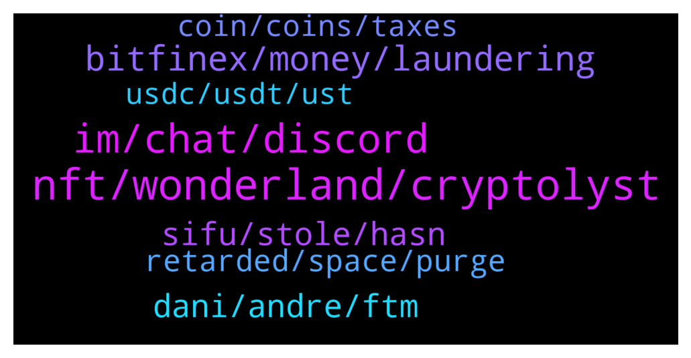

# **@shitpool**
 ## Analysis for **2022-01-28** - **2022-01-29**.

---

## 📊 **Basic Stats**

**n_messages_sent**: 376

---

---

## 🔝 **Top keywords and related messages**

1. **nft, wonderland, cryptolyst**

    @da0man --- *cryptotwitter be like: "I still trust Daniele"* **--->** [TG Discussion](https://t.me/shitpool/721395)

    @kentkadewell --- *Hell tell you next big crypto taking over the space, mu mu inu, dev is a personal friend of his, tokenomics are 100% tax on each buy into his doggy bowl* **--->** [TG Discussion](https://t.me/shitpool/721164)

    @yesbutalsono --- *imagine all of those who quit their jobs to go full time crypto lol* **--->** [TG Discussion](https://t.me/shitpool/720881)

    @ptsolorid --- *yeh nobody in crypto really gives a shit about that though.* **--->** [TG Discussion](https://t.me/shitpool/721437)

    @da0man --- *What a genius. He is going to kill crypto* **--->** [TG Discussion](https://t.me/shitpool/721230)

    @OxZilla --- *Wonderland run by quadrigq / bitfinex cfo behind MIM, depegging of 2 stablecoins, platypus breaking, curve getting fucked and alemeda pulling out, Biden executive order in the past 12 hours* **--->** [TG Discussion](https://t.me/shitpool/720906)

2. **im, chat, discord**

    @Horselorde --- *You’re still going on about this lmao* **--->** [TG Discussion](https://t.me/shitpool/721394)

    @kentkadewell --- *Hahahaha nah, I still think it’s good but I’m not gunna be some fagit that gets all emotional when some one says jog on* **--->** [TG Discussion](https://t.me/shitpool/721150)

    @Horselorde --- *All jokes aside tho, hard pass* **--->** [TG Discussion](https://t.me/shitpool/721143)

    @Bigjoeyf --- *I know few who did even myself lmao* **--->** [TG Discussion](https://t.me/shitpool/720887)

    @trollkotze --- *so you would get banned for saying this* **--->** [TG Discussion](https://t.me/shitpool/721322)

    @Horselorde --- *It could also be programmed to ban them if they recently joined the chat as opposed to someone who’s been here for months* **--->** [TG Discussion](https://t.me/shitpool/721323)

3. **bitfinex, money, laundering**

    @MoneroPal --- *Have you been living under a rock? Daniele is in person with this guy in Dubai. They collaborated on this project and dumped on investors from day 1. They did this by getting their 5% of free time as salary, per the whitepaper, wrapped it into wMEMO, then borrowed MIM against wMEMO on Abra, then dumped this into fiat via USDT. This was the “lick” the robbery, this allowed them to exit without moving price and maintaining that they too got liquidated when it did, but they received the token for free, the investors did not...  Daniele is linked to known Italian money launders, he has a company in Switzerland where the person was a director, the person was convicted and is serving prison time.   Sifu is a gigacriminal, the entire Wonderland, Abra, Popsicle team is non-doxxed outside of Dani and now Sifu, they’re all Bitfinex employees, 0xMerlin has been uncovered to be the CFO of Bitfinex* **--->** [TG Discussion](https://t.me/shitpool/721393)

    @MoneroPal --- *100% US prosecutors will go after Daniele and he will be extradicted from Dubai to New York to face crimianal charges for running an unregulated investment fund that targeted American Citizens and fradulently claimed it was managed by a financial professional with prior asset managmenet experience. Not to mention the connection to money laundering, Bitfinex, and faux investments such as Betswap to continue to maintain a positive image for the purpose of exit liquidity.* **--->** [TG Discussion](https://t.me/shitpool/721417)

    @MoneroPal --- *The lies and fronts are not to mention all the laundering they likely did through the project for Bitfinex and the mob backers* **--->** [TG Discussion](https://t.me/shitpool/721435)

    @onchainjoe --- *apparently sesta got scammed by dokwon* **--->** [TG Discussion](https://t.me/shitpool/721398)

    @Rjknew --- *Idk if your plan is to get a reaction out of me or not but, Everytime something happens people point at bitfinex it gets old* **--->** [TG Discussion](https://t.me/shitpool/721540)

    @jjj1616 --- *it is possible that tether/bfxs might have connections to  italian mafia, imagine the business they run and that's interesting thing for criminal organisations to lauder funds. No evidence but just common sense* **--->** [TG Discussion](https://t.me/shitpool/720868)

4. **sifu, stole, hasn**

    @yesbutalsono --- *dude presumably faked his death. Not sifu but the other founder.* **--->** [TG Discussion](https://t.me/shitpool/720943)

    @Horselorde --- *From what at I’ve gathered there hasn’t been any actual proof Sifu stole anything though* **--->** [TG Discussion](https://t.me/shitpool/721401)

    @MoneroPal --- *No the clown is asking about if Sifu actually stole anything, motherfucker has been under a rock or some shit* **--->** [TG Discussion](https://t.me/shitpool/721396)

    @Bigjoeyf --- *Wait 2 sec  need to refind a tweet which was saying someone from finex was part of sifu and time shit* **--->** [TG Discussion](https://t.me/shitpool/720853)

    @ptsolorid --- *Any evidence that 0xsifu actually stole anything from wonderland?* **--->** [TG Discussion](https://t.me/shitpool/721384)

    @michael_ssss --- *or Sifu poisoned or had him killed in India* **--->** [TG Discussion](https://t.me/shitpool/721171)

5. **dani, andre, ftm**

    @Blazmeen --- *Thoughts on Andre Conje backing Dan? That makes me think he has poor judgement and makes me weary of FTM overall* **--->** [TG Discussion](https://t.me/shitpool/720918)

    @MoneroPal --- *Andre is honestly a fucking clown. He sounds really naive and really inexperienced in business, he maybe smart and all, but intelliect in this space is second to marketability which reins supreme in an unregulated and unsophisticated environment of prue clowns.* **--->** [TG Discussion](https://t.me/shitpool/720982)

    @MoneroPal --- *Daniele is my daddy, well whoever is backing him* **--->** [TG Discussion](https://t.me/shitpool/721056)

    @pizza_dog --- *the funny theory im hearing in the discord is that andre = sifu and that dani+andre paid the whistleblower twitter account to assert that sifu = dhanani as a way to clear andre* **--->** [TG Discussion](https://t.me/shitpool/721018)

    @yesbutalsono --- *Why would andre do that mmmm* **--->** [TG Discussion](https://t.me/shitpool/721040)

    @MoneroPal --- *@Rjknew why do you know about Daniele and TIME, dear former frog ser?* **--->** [TG Discussion](https://t.me/shitpool/721511)

6. **retarded, space, purge**

    @OxZilla --- *Honestly this is a much much needed purge from the space.* **--->** [TG Discussion](https://t.me/shitpool/720928)

    @Horselorde --- *But tbh the “frog nation” stuff is retarded* **--->** [TG Discussion](https://t.me/shitpool/721404)

    @Alwayscooked --- *Also seen some pretty retarded things happen over the space of the last 18 months so 🤷‍♂️* **--->** [TG Discussion](https://t.me/shitpool/721370)

    @kentkadewell --- *Others migrate not care either, but it’s an opinion* **--->** [TG Discussion](https://t.me/shitpool/721125)

    @Horselorde --- *Yeah but so many people got rekt because of it* **--->** [TG Discussion](https://t.me/shitpool/720930)

    @Bigjoeyf --- *Top is more like billions are coming ect too much fud not to be* **--->** [TG Discussion](https://t.me/shitpool/720859)

7. **usdc, usdt, ust**

    @MoneroPal --- *I don’t understand why USDT, UST, or USDC would be threatened* **--->** [TG Discussion](https://t.me/shitpool/720973)

    @MoneroPal --- *usdc is fine, mim is rekt though, and likely all his projects will go belly u p* **--->** [TG Discussion](https://t.me/shitpool/720962)

    @ptsolorid --- *meanwhile there is no existential threat to anyone using, certainly Anchor, Mirror aUST UST* **--->** [TG Discussion](https://t.me/shitpool/721432)

    @jjj1616 --- *from one perspective usdt should be a bit more us-legislationproof than usdc, but from the fundaments and the narrative about these coins, usdc and us based stable coins such as usdp are better and generally feel safer than offshore creations* **--->** [TG Discussion](https://t.me/shitpool/720850)

    @yesbutalsono --- *yeah usd rn looks safer then usdc* **--->** [TG Discussion](https://t.me/shitpool/720848)

    @sumtemm --- *so what do i do with my usdc* **--->** [TG Discussion](https://t.me/shitpool/720954)

