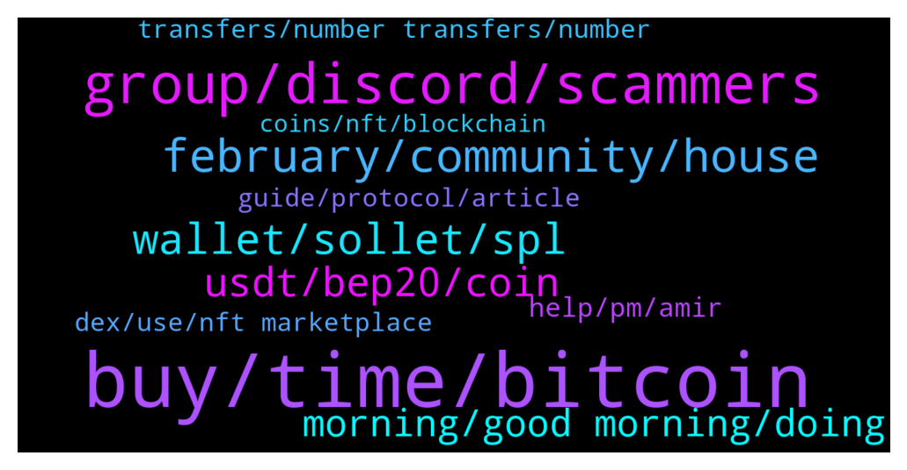

# **@solana**
 ## Analysis for **2022-01-28** - **2022-01-29**.

---

## 📊 **Basic Stats**

**n_messages_sent**: 345

---

---

## 🔝 **Top keywords and related messages**

1. **buy, time, bitcoin**

    @Tumull --- *That said, if things fall in place for the star altcoin, it could rise above Bitcoin, provided the ETH 2.0 arrives prior to Bitcoin’s spot ETF.* **--->** [TG Discussion](https://t.me/solana/923556)

    @marthinae --- *Successively, crypto folks are now pondering over the possibility of the economic differences giving rise to flippening.* **--->** [TG Discussion](https://t.me/solana/923504)

    @BabyLixin --- *Is it a good time to buy?* **--->** [TG Discussion](https://t.me/solana/922068)

    @Cigeratteo --- *120$ end of jan and then 200$ of feb* **--->** [TG Discussion](https://t.me/solana/923134)

    @marthinae --- *However, if the alt season gears up, the altcoins which may adopt the huge bullish trend immediately and rally high* **--->** [TG Discussion](https://t.me/solana/923399)

    @prem_msws --- *How much sol do you have ? Just curious* **--->** [TG Discussion](https://t.me/solana/922376)

2. **group, discord, scammers**

    @H4n0nc0q --- *Damn my messages gets deletet because I want to ask a guy where he read a certain thing?* **--->** [TG Discussion](https://t.me/solana/922452)

    @H4n0nc0q --- *Hmm. I get it. Maybe we have to reset the group. 95k members, i don’t know man.* **--->** [TG Discussion](https://t.me/solana/922473)

    @pnzfox --- *no one can slove the trilemma.* **--->** [TG Discussion](https://t.me/solana/922959)

    @H4n0nc0q --- *Alright I understand! Damn.. this groups needs to find a way to get rid of spamers. It’s insane.. the traders group is already dead and that’s not sooo good for the community* **--->** [TG Discussion](https://t.me/solana/922459)

    @McNicholas --- *It's because you used a banned word: message. We have scammers who ask people to send a dm or message, so both are banned.* **--->** [TG Discussion](https://t.me/solana/922455)

    @Afrodesiac --- *But what if you are colour blind? 🤔* **--->** [TG Discussion](https://t.me/solana/922161)

3. **february, community, house**

    @mozart_invest --- *How many groups of Solana are?* **--->** [TG Discussion](https://t.me/solana/922567)

    @mahib45 --- *📣 Introducing the Solana Hacker House Inaugural World Tour  Solana builders are hitting the road — and you’re invited.  Come join some of the brightest minds at Solana Labs and the developers in your own community for the official Solana Hacker House World Tour, a series of six week-long hacker houses around the globe.  Each Hacker House will give builders a place to work, find collaborators, and learn from some of the greats in the Solana ecosystem. You’ll have all the essentials: good WiFi, food, power, and (of course) swag.  If you’re interested in joining a Solana Hacker House, you must be a developer and register ahead of time. Each house has limited capacity, so submit your application early!  The world tour includes:  Los Angeles, California, USA 1-5 February   Seattle, Washington, USA 9-13 February   Singapore 15-20 February   Dubai, UAE 15-20 February   Moscow, Russia 22-27 February   Hong Kong 28 February-6 March   Prague, Czechia 1-6 March   👉 https://solana.com/news/solana-hacker-house-world-tour* **--->** [TG Discussion](https://t.me/solana/922413)

    @mahib45 --- *Hello 👋  You can  explore the run-through of core innovations around Solana.  https://medium.com/solana-labs/7-innovations-that-make-solana-the-first-web-scale-blockchain-ddc50b1defda* **--->** [TG Discussion](https://t.me/solana/922474)

    @mahib45 --- *Hello 👋  You may explore the run-through of core innovations around Solana.  https://medium.com/solana-labs/7-innovations-that-make-solana-the-first-web-scale-blockchain-ddc50b1defda* **--->** [TG Discussion](https://t.me/solana/922554)

    @ViratRitesh --- *Hey admin solana pro is real or fake* **--->** [TG Discussion](https://t.me/solana/923594)

    @KingOfTheTown --- *Solana ecosystem is going to create the biggest community (bag holders) in 2022* **--->** [TG Discussion](https://t.me/solana/923444)

4. **wallet, sollet, spl**

    @Amir --- *I need 0.00001 sol for withdrawal  Who can help??* **--->** [TG Discussion](https://t.me/solana/922710)

    @Ogoochi --- *please how do I get my withdrawal ID and Txid from sollet. my withdrawal hasn't arrived* **--->** [TG Discussion](https://t.me/solana/923662)

    @Sevith --- *messaging me to authenticate my wallet and resync* **--->** [TG Discussion](https://t.me/solana/921446)

    @AA_SI --- *I've used web wallet on mobile not installed app* **--->** [TG Discussion](https://t.me/solana/921259)

    @Charles_lily --- *Try to uninstall your app and installed it again* **--->** [TG Discussion](https://t.me/solana/921256)

    @Queenlucy1 --- *Most of my tokens are in trustwallet* **--->** [TG Discussion](https://t.me/solana/921312)

5. **usdt, bep20, coin**

    @Alliwantishere --- *Could someone help? I want to get SOL on Kucoin (SOL/USDT pair) but new to using USDT.  My plan is to swap my Mcontent (Bep20) for USDT on PancakeSwap in Trustwallet, then send the USDT to Kucoin for the final exchange to SOL.  In this process do I need to worry about whether I'm using USDT ERC20 or USDT Bep20?  Thank you.* **--->** [TG Discussion](https://t.me/solana/923197)

    @Mustafa 🇧🇦 --- *Hi does anyone know how can i change token from BEP20 to ERC20?* **--->** [TG Discussion](https://t.me/solana/922887)

    @Floris_9 --- *I tried but I receibe wormhole usdt. I dont receive correct usdt* **--->** [TG Discussion](https://t.me/solana/922972)

    @cryptolover1987 --- *Before send your bep-20 usdt , make sure your are copying bep-20 usdt deposit address from kucoin* **--->** [TG Discussion](https://t.me/solana/923249)

    @Genesis_Solidity --- *No matter what you name it BEP20, YOU20 or whatever it's ERC20 originally and the contract uses the functions and will pick it up no matter what you name the interface* **--->** [TG Discussion](https://t.me/solana/922896)

    @cryptolover1987 --- *I am talking about swap on kucoin with your usdt.* **--->** [TG Discussion](https://t.me/solana/923218)

6. **morning, good morning, doing**

    @Monterrey_Rice --- *Good Morning! How are you doing today fam?* **--->** [TG Discussion](https://t.me/solana/922387)

    @pan --- *okay thanks bud ! have a great day ❤️* **--->** [TG Discussion](https://t.me/solana/923288)

    @Monterrey_Rice --- *Dang, bro, not even a good morning back?? :)* **--->** [TG Discussion](https://t.me/solana/922377)

    @ProstoPesniya --- *For one its morning for another good evening)* **--->** [TG Discussion](https://t.me/solana/922398)

    @Monterrey_Rice --- *but Good Evening to you sir!* **--->** [TG Discussion](https://t.me/solana/922405)

    @DEAD --- *Good morning sir (no one said back it so here am i)* **--->** [TG Discussion](https://t.me/solana/922383)

7. **help, pm, amir**

    @mahib45 --- *Don't reply to anyone who PM first!* **--->** [TG Discussion](https://t.me/solana/921270)

    @mahib45 --- *Hello  Feel free to PM me* **--->** [TG Discussion](https://t.me/solana/922454)

    @Zouhair_kech --- *Hi sorry if I don’t speak good English* **--->** [TG Discussion](https://t.me/solana/921586)

    @mahib45 --- *Hello 👋  Always block anyone who PM first!* **--->** [TG Discussion](https://t.me/solana/921502)

    @cryptolover1987 --- *Hello How can I help you ?* **--->** [TG Discussion](https://t.me/solana/923291)

    @mahib45 --- *Hello 👋  How may I help you?* **--->** [TG Discussion](https://t.me/solana/921537)

8. **transfers, number transfers, number**

    @Amir_Emami --- *Yes, there isn't the number of transfers or holders here* **--->** [TG Discussion](https://t.me/solana/922357)

    @Amir_Emami --- *So, solana does not have any explorer that shows number of transfers of each token? Seriously? 😐* **--->** [TG Discussion](https://t.me/solana/922352)

    @ANKA --- *Hello, I have not received a solano for the airfield. tell me what to do?* **--->** [TG Discussion](https://t.me/solana/922420)

    @cryptolover1987 --- *Hello Vicky! Just search your Solana address in Solana explorer to know about your all previous transactions in history section* **--->** [TG Discussion](https://t.me/solana/923692)

    @Amir_Emami --- *Can you please answer admin?  Hi, I want to know is there any place that I can see the number of transfers of solana tokens?  For example same as etherscan for eth tokens. I found solscan, but it only shows holders, not transfers.* **--->** [TG Discussion](https://t.me/solana/922327)

    @Amir_Emami --- *Hi, I want to know is there any place that I can see the number of transfers of solana tokens?  For example same as etherscan for eth tokens. I found solscan, but it only shows holders, not transfers.* **--->** [TG Discussion](https://t.me/solana/922306)

9. **guide, protocol, article**

    @Aleksandar --- *Hi. What tokens can be farmed on solana?* **--->** [TG Discussion](https://t.me/solana/922770)

    @mahib45 --- *Hello 👋  Beware of scam!  Always do your own research! Solana is a blockchain that anyone can build on!  The latest update can be found here  https://twitter.com/Solana_Mates* **--->** [TG Discussion](https://t.me/solana/923597)

    @mahib45 --- *Please read this article to know everything about Solana staking system  📎https://solana.com/staking  👇🏻Check this out for APY👇🏻  1️⃣ Solana validators list 📎 https://solanabeach.io/validators  2️⃣ Staking reward(%) 📎 https://www.stakingrewards.com/earn/solana/providers?sort=balance_DESC  3️⃣ Solana validators performance ranking 📎 https://stakeview.app/* **--->** [TG Discussion](https://t.me/solana/922773)

    @cryptolover1987 --- *Please read this article to know everything about Solana staking system  📎https://solana.com/staking  👇🏻Check this out for APY👇🏻  1️⃣ Solana validators list 📎 https://solanabeach.io/validators  2️⃣ Staking reward(%) 📎 https://www.stakingrewards.com/earn/solana/providers?sort=balance_DESC  3️⃣ Solana validators performance ranking 📎 https://stakeview.app/* **--->** [TG Discussion](https://t.me/solana/922261)

    @mahib45 --- *○ There are ten 🔟 options to stake your SOL token ! 📒 https://docs.solana.com/staking 1️⃣ Phantom App  https://phantom.app/blog/solana-staking-in-just-3-clicks Tutorial: https://twitter.com/stakefish/status/1428924822424363015   2️⃣ SOLFLARE  》Stake SOL token on solflare without ledger:   🎦 Video guide : https://www.youtube.com/watch?v=5Tf0os-JRcs  📝 Article guide: https://medium.com/@stakingfac/how-to-stake-on-solana-with-solflare-a-keystore-file-9f7cd5fba169  Staking SOL with Solflare Crypto-Wallet” by Víctor | melea:  https://link.medium.com/q872cfJqLab  》 Stake SOL token using solflare and ledger Nano S:  🎦 Video guide: https://www.youtube.com/watch?v=EAWJ12Y4v_M  📝 Article guide : https://medium.com/@stakingfac/how-to-stake-on-solana-with-solflare-a-ledger-nano-s-bdcc90d769c7  Website: https://solflare.com Telegram: @SolFlare_Wallet  ➖➖➖➖➖➖➖➖➖➖➖➖➖➖➖➖➖➖➖➖➖  3️⃣ ON LEDGER  》Stake SOL token using Command Line Interface (CLI) and Ledger Nano S  🎦 Video Guide : https://youtu.be/jg2WQcfAXHo  📝 Article Guide: (On ledger Nano X & S) https://link.medium.com/duLh90X9pab  📋https://docs.solana.com/cli/delegate-stake  📖  More tutorials are available :   https://stake2earn.com/how-to-stake-solana-with-ledger-nano-x.html   https://stake2earn.com/how-to-stake-solana-with-keystore-file.html ➖➖➖➖➖➖➖➖➖➖➖➖➖➖➖  4️⃣ Moonlet  https://bit.ly/2MV4muZ  5️⃣  FTX http://ftx.com/staking  6️⃣ Binance  https://www.binance.com/en/support/announcement/a5c507485f7843d8b3a3800fee3c1f84  7️⃣ Exodus https://www.exodus.com/blog/how-to-stake-solana-on-exodus/  8️⃣ Atomic wallet  https://atomicwallet.io/solana-staking 9️⃣ Kraken  https://www.kraken.com/u/funding/staking  🔟 OKex  https://www.okex.com/earn/announce* **--->** [TG Discussion](https://t.me/solana/921228)

    @mahib45 --- *Hello !!  Try this👇🏻👇🏻 Yield farming/ lending/borrowing platforms :  1️⃣ Oxygen  It is a DeFi Prime Brokerage Protocol built for the future to support 100s of millions of people. It can help you, as a holder of digital assets, generate liquidity, earn yield, borrow assets to go short, get trading leverage against portfolio of assets.   🔗https://www.oxygen.org/  2️⃣Solaris  It is a Lending/Borrowing protocol that brings Flashloans to Solana blockchain (inspired by Aave and Compound)  🔗https://solana.com/ecosystem/solaris  3️⃣ Orca  you can provide liquidity to a trading pool to earn trading fees.  🔗https://www.orca.so/pools  4️⃣ Raydium  🔗 https://raydium.io/farms/  5️⃣ Jet protocol  Jet Protocol is a borrowing and lending protocol built on the Solana blockchain.  🔗 https://www.jetprotocol.io  6️⃣ Solfarm SolFarm is the first yield aggregation platform built on Solana with auto-compounding vault strategies.  🔗 https://solfarm.io  7️⃣ Solend Soled is an algorithmic, decentralized protocol for lending and borrowing.   🔗 https://solend.fi* **--->** [TG Discussion](https://t.me/solana/922771)

10. **dex, use, nft marketplace**

    @Billion509 --- *Which dex can I use to buy solana* **--->** [TG Discussion](https://t.me/solana/921343)

    @McNicholas --- *Have you tried this one? https://explorer.solana.com/* **--->** [TG Discussion](https://t.me/solana/922356)

    @Floris_9 --- *Hello what dex is recommend to use for solana? Or an AMM?* **--->** [TG Discussion](https://t.me/solana/922874)

    @mahib45 --- *List of DEX to buy   1. https://solible.com  2. https://www.dexlab.space  3. https://swap.doce.finance  4. https://lunadex.com  4. https://dex.bonfida.com  5. https://dex.projectserum.com  6. https://dex.raydium.io  7. https://bonfida.com  8. https://www.orca.so* **--->** [TG Discussion](https://t.me/solana/921376)

    @Floris_9 --- *And which one for AGGREGIATOR? like 1inch* **--->** [TG Discussion](https://t.me/solana/922883)

    @cryptolover1987 --- *Yea but there are lots of Solana nft marketplace’s. Which one you used ?* **--->** [TG Discussion](https://t.me/solana/921855)

