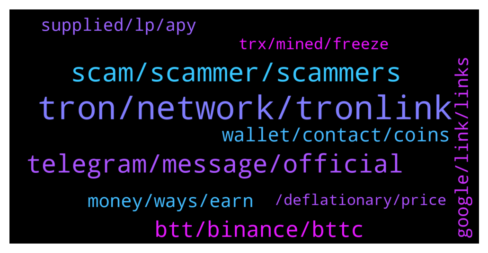

# **@tronnetworkEN**
 ## Analysis for **2022-01-28** - **2022-01-29**.

---

## 📊 **Basic Stats**

**n_messages_sent**: 275

---

---

## 🔝 **Top keywords and related messages**

1. **tron, network, tronlink**

    @geniuswithluck --- *Am I now finally real tron official group? I am tired of scam message about tron..* **--->** [TG Discussion](https://t.me/tronnetworkEN/3860601)

    @Papa Mamour --- *bonjour je suis un débutant Sénégalais qui peut offrir des trons s'il* **--->** [TG Discussion](https://t.me/tronnetworkEN/3859408)

    @hzakaryan --- *Guys something wrong with tron network? Have sendet usdt from binance to kucoin confirmed but didn’t receive* **--->** [TG Discussion](https://t.me/tronnetworkEN/3859337)

    @Anthony Udoka --- *I needed a loan from Tron how possible it is* **--->** [TG Discussion](https://t.me/tronnetworkEN/3859843)

    @Habeeb'llah --- *Good day everyone, can anyone tell me how to unstake in tronlink app* **--->** [TG Discussion](https://t.me/tronnetworkEN/3859862)

    @Alina --- *Tron coin and its affiliated currencies disappointed me, in terms of price and market value compared to the great services provided by the network.. On the level of transfer and exchange, it is much cheaper than Ethereum and Binance Smart Chain. So why these big differences in price, while some services are superior to Tron over others?!!!!* **--->** [TG Discussion](https://t.me/tronnetworkEN/3860477)

2. **scam, scammer, scammers**

    @babak_niroomand --- *Dude just answer my question if you know the answer and If you don't, there's no need to call me scammer! I'm just asking!* **--->** [TG Discussion](https://t.me/tronnetworkEN/3861012)

    @babak_niroomand --- *Some of my friends are risking on this in the past two months. And they have received profits til now!* **--->** [TG Discussion](https://t.me/tronnetworkEN/3860989)

    @Alei1122 --- *Like if I buy 1000 he will add 50% of amount I will buy as promotions but I need to send money first* **--->** [TG Discussion](https://t.me/tronnetworkEN/3861048)

    @davedine --- *Many scammer trying to advertise here* **--->** [TG Discussion](https://t.me/tronnetworkEN/3860987)

    @Jay --- *Buddy of mine was scammed from a shit hole in India, but they didn't know he was US Marine,...and was stationed out there. He is putting together a task force of some of his military buddies to show up and kick doors in pretty crazy* **--->** [TG Discussion](https://t.me/tronnetworkEN/3861300)

    @agentpiki --- *Nah. You seem excited about promoting this scam platform. The audacity.  If you don't delete those scams, you are one click away* **--->** [TG Discussion](https://t.me/tronnetworkEN/3861005)

3. **telegram, message, official**

    @Paiwandfuad --- *They do not have live chat* **--->** [TG Discussion](https://t.me/tronnetworkEN/3859631)

    @Banuhn --- *Hello. Can anybody read my messages? 😊* **--->** [TG Discussion](https://t.me/tronnetworkEN/3858391)

    @Habeeb'llah --- *Have been receiving a lot of private messages telling me that they can help* **--->** [TG Discussion](https://t.me/tronnetworkEN/3859890)

    @simon866 --- *Talk here please to avoid impersonators in private chat* **--->** [TG Discussion](https://t.me/tronnetworkEN/3859790)

    @davedine --- *Who invite me into some groups or message me by private , i will BLOCK and REPORT. GO !* **--->** [TG Discussion](https://t.me/tronnetworkEN/3860976)

    @Paiwandfuad --- *Can you guide me at private?* **--->** [TG Discussion](https://t.me/tronnetworkEN/3859620)

4. **btt, binance, bttc**

    @Fabs_trx --- *Bittorrent made a tweet saying that binance named it bttc* **--->** [TG Discussion](https://t.me/tronnetworkEN/3858876)

    @Innocen_luk_in_devil --- *does BTT delisted from binance? because Im not able to search it* **--->** [TG Discussion](https://t.me/tronnetworkEN/3858802)

    @Moneyversac --- *In the medium article they called it BTTC too 😂 Like why* **--->** [TG Discussion](https://t.me/tronnetworkEN/3858857)

    @Banuhn --- *what can I do with binance?* **--->** [TG Discussion](https://t.me/tronnetworkEN/3858423)

    @Ghostq2 --- *Yes I want to swap the old btt to the new.* **--->** [TG Discussion](https://t.me/tronnetworkEN/3859594)

    @Paiwandfuad --- *@Carlos_TRX   I sent new BTT from OKX to BTTOLD address at Gate io exchange But did not recived yet* **--->** [TG Discussion](https://t.me/tronnetworkEN/3859599)

5. **wallet, contact, coins**

    @Alei1122 --- *He asked me the wallet address* **--->** [TG Discussion](https://t.me/tronnetworkEN/3860700)

    @Alei1122 --- *In Trust wallet or any wallet?* **--->** [TG Discussion](https://t.me/tronnetworkEN/3860680)

    @Alei1122 --- *Can anyone lock our wallet via address?* **--->** [TG Discussion](https://t.me/tronnetworkEN/3860675)

    @Peter --- *Can someone guide me on how to use tokenpocket wallet* **--->** [TG Discussion](https://t.me/tronnetworkEN/3859588)

    @Carlos_TRX --- *Contact their support team, they are two different coins* **--->** [TG Discussion](https://t.me/tronnetworkEN/3859615)

    @Samsonioc --- *I mean the coins that was moved from your trust wallet should be either peb20 or erc20 based coins* **--->** [TG Discussion](https://t.me/tronnetworkEN/3861310)

6. **money, ways, earn**

    @Ruzgartyn --- *I am not very rich, I am poor, I have a lot of debt, I asked for help for this, please do not write to deceive me* **--->** [TG Discussion](https://t.me/tronnetworkEN/3858202)

    @Fabs_trx --- *You give me all your secrets then? I want become rich* **--->** [TG Discussion](https://t.me/tronnetworkEN/3858896)

    @simon866 --- *You can check the platform for the different types of crypto that can be used as there are many options* **--->** [TG Discussion](https://t.me/tronnetworkEN/3859966)

    @MilNoslen --- *Can't, need money to make money* **--->** [TG Discussion](https://t.me/tronnetworkEN/3859861)

    @Carlos_TRX --- *The ways that u can earn 👍🏻* **--->** [TG Discussion](https://t.me/tronnetworkEN/3859568)

    @simon866 --- *Nope only way is to earn* **--->** [TG Discussion](https://t.me/tronnetworkEN/3859452)

7. **google, link, links**

    @Moneyversac --- *Btw my new Tutorial is uploaded* **--->** [TG Discussion](https://t.me/tronnetworkEN/3858135)

    @MilNoslen --- *Compile the links and titles and send it to @PiterSpain so we can update your beloved #moneyversac command haha* **--->** [TG Discussion](https://t.me/tronnetworkEN/3858137)

    @eva_247 --- *A message direct would help you* **--->** [TG Discussion](https://t.me/tronnetworkEN/3858895)

    @simon866 --- *If you use Google or go to their main website you will see links to their channels* **--->** [TG Discussion](https://t.me/tronnetworkEN/3859627)

    @Moneyversac --- *@PiterSpain could you add another Video to the list about Energy?  https://youtu.be/LmC3BglKuDY* **--->** [TG Discussion](https://t.me/tronnetworkEN/3858961)

    @Fabs_trx --- *I was looking for it already hehe* **--->** [TG Discussion](https://t.me/tronnetworkEN/3858883)

8. **supplied, lp, apy**

    @WoxFi --- *but how to calculate the pooled tokens against the LP tokens* **--->** [TG Discussion](https://t.me/tronnetworkEN/3858934)

    @agentpiki --- *You can compute your own, if you know when you supplied.  If you supplied several times and did not record manually, then you have to go through tronscan and check the time when you supplied and go back to the chart by 1minute to check how much you got them.* **--->** [TG Discussion](https://t.me/tronnetworkEN/3858954)

    @agentpiki --- *Nah you can't get it it is too complicated.  What if I got in yesterday, and supplied again today? The calculation is too complex* **--->** [TG Discussion](https://t.me/tronnetworkEN/3858946)

    @WoxFi --- *does anyone know how do i calculate liquidity supplied by specific address* **--->** [TG Discussion](https://t.me/tronnetworkEN/3858921)

    @WoxFi --- *how does sunswap shows my supply* **--->** [TG Discussion](https://t.me/tronnetworkEN/3858950)

    @John --- *Ok so I supply "jst" at 18%apy...I borrow 2% apy from btc as margin collateral...now do I need to supply btc out full 2%apy & borrow from jst to create a fully automatic self growing/compounding algorithm?* **--->** [TG Discussion](https://t.me/tronnetworkEN/3858676)

9. **trx, mined, freeze**

    @Abelrajuz --- *I was unaware of trx that time lol* **--->** [TG Discussion](https://t.me/tronnetworkEN/3859789)

    @Alei1122 --- *Someone want me to buy his TRX with promotion.* **--->** [TG Discussion](https://t.me/tronnetworkEN/3861047)

    @Konasshh --- *What's the minimum amount of trx to freeze* **--->** [TG Discussion](https://t.me/tronnetworkEN/3858752)

    @Konasshh --- *Regardless,  how do I freeze trx* **--->** [TG Discussion](https://t.me/tronnetworkEN/3858745)

    @agentpiki --- *You need trx to unlock the potential of earning* **--->** [TG Discussion](https://t.me/tronnetworkEN/3859565)

    @lastbro3 --- *will trx go to ATH again?* **--->** [TG Discussion](https://t.me/tronnetworkEN/3861396)

10. **, deflationary, price**

    @maclunk3y --- *How will the max supply being reached affect the price in the long term?* **--->** [TG Discussion](https://t.me/tronnetworkEN/3858380)

    @davedine --- *Because the liquidity change every seconds. Peoples are curious for what computer do 😅😅* **--->** [TG Discussion](https://t.me/tronnetworkEN/3858947)

    @ChulSooTVMain --- *so I wonder it is only deflationary or still Inflationary + deflationary system* **--->** [TG Discussion](https://t.me/tronnetworkEN/3860322)

    @Carlos_TRX --- *There is a burning mechanism which we convert in a deflationary cryptocurrency so the price will go up* **--->** [TG Discussion](https://t.me/tronnetworkEN/3858390)

    @ChulSooTVMain --- *no more distribution right ? 100,000,000,000 is all already distributed right ?* **--->** [TG Discussion](https://t.me/tronnetworkEN/3860341)

    @ChulSooTVMain --- *no more inflation from now ?* **--->** [TG Discussion](https://t.me/tronnetworkEN/3860340)

