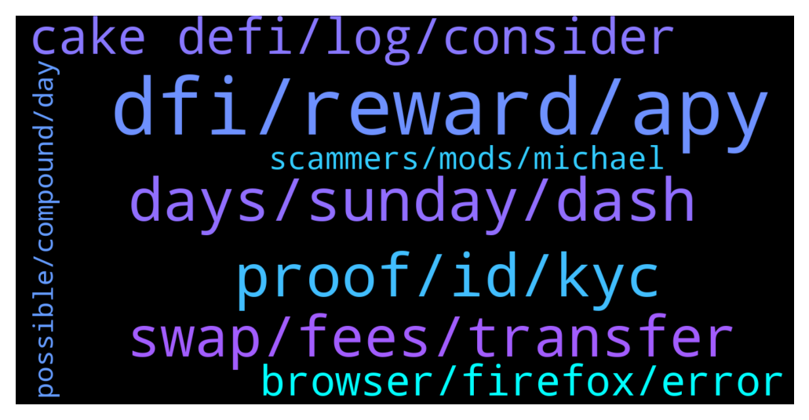

# **@CakeDeFi_EN**
 ## Analysis for **2022-01-29** - **2022-01-30**.

---

## 📊 **Basic Stats**

**n_messages_sent**: 200

---

---

## 🔝 **Top keywords and related messages**

1. **dfi, reward, apy**

    @Griffithchandar --- *pairs i had 1 month ago slowly transited to full defi* **--->** [TG Discussion](https://t.me/CakeDeFi_EN/169847)

    @CPT Cool --- *What's wrong with pump and dump. Your sorhai hosp encourage people to arbitrage anyway* **--->** [TG Discussion](https://t.me/CakeDeFi_EN/169785)

    @xavier_pwm --- *Hi everyone, would like to ask how do the rewards are determined backend. It seems that the estimated APY and actual reward payout is different by about 30%. In my case, I did a 10 year freezing, hoping to get the indicated 90+% apy return, only to be receiving about 30% less. Any advice?* **--->** [TG Discussion](https://t.me/CakeDeFi_EN/169438)

    @YyeapY --- *does the apy% shown at LM/Staking is excluded reward fee?* **--->** [TG Discussion](https://t.me/CakeDeFi_EN/169422)

    @Emonkhan05 --- *I pass 180 Days  I have 26.14 Dfi in my account  So I going to unstake My all Dfi I only unstake 5 Dfi 20.66 Dfi Frozen why sir?* **--->** [TG Discussion](https://t.me/CakeDeFi_EN/169831)

    @zachgax --- *Let’s have a feature discussion.   Personally, It triggers my inner OCD the longer I use the product, the more fractional entries I have in the freezer. Especially with promos and bonuses like now. Would be great if there were some updates to enhance the Freezer functionality.   1. Batch extension and entry consolidation.   I understand that a new entry has to be made when we freeze because duration is calculated at time of entry. But, if I were to extend an entry, it recalculates duration at time of extension right? So, if I can batch extend multiple Freezer entries and consolidate them into one, it would make my freezer so much neater.  2. Auto batch freezing as a sub-function for auto-staking.   Right now, I manually freeze my auto-staked rewards when it reaches a certain size. I think this would be a great to have something like a submenu to auto-staking where I can set Auto-freeze of staked DFI when it reaches a set amount. Say every 50 DFI.   What do you guys think?* **--->** [TG Discussion](https://t.me/CakeDeFi_EN/169432)

2. **proof, id, kyc**

    @papai699 --- *Thank you i have submitted a request as the adress proof was again rejected, the income tax return file is the last government adress proof available now.. And it is of year 2021-22* **--->** [TG Discussion](https://t.me/CakeDeFi_EN/169791)

    @DmgBautista --- *Your country is accepted by the current singaporean rules. I would double check on the number you gave, maybe the international code is incorrect?  If really is all good, I would submit a support ticket explaining the situation. You can contact them in the below link   https://cake.zendesk.com/hc/en-us/requests/new* **--->** [TG Discussion](https://t.me/CakeDeFi_EN/169536)

    @AkiraPL --- *id tried with bill on my name and that address, but it wont pass* **--->** [TG Discussion](https://t.me/CakeDeFi_EN/169393)

    @Michael_Schredl --- *Depends on the country you are in - if you only have the passport option you cannot use national ID* **--->** [TG Discussion](https://t.me/CakeDeFi_EN/169902)

    @ekopurwanto69 --- *can you answer my questions sir? can i submit kyc with national id or it must be with passport sir? coz theres no option national id on the apps, only passport and driving license ( us only)* **--->** [TG Discussion](https://t.me/CakeDeFi_EN/169901)

    @papai699 --- *Can i attach income tax return file as government address proof document? @admin* **--->** [TG Discussion](https://t.me/CakeDeFi_EN/169485)

3. **days, sunday, dash**

    @TheRaskoln --- *Which days do we withdraw crypto* **--->** [TG Discussion](https://t.me/CakeDeFi_EN/169743)

    @BerndMack --- *Please check out the link to the FAQ and the withdrawal times, 🙏* **--->** [TG Discussion](https://t.me/CakeDeFi_EN/169915)

    @CPT Cool --- *Every single withdrawal delays at least 1-2 days. This is ridiculous* **--->** [TG Discussion](https://t.me/CakeDeFi_EN/169911)

    @mm_phoenix --- *for me it is from monday to sunday, but you should see in the mail the timeframe :)* **--->** [TG Discussion](https://t.me/CakeDeFi_EN/169841)

    @CmrtMuhammed --- *How many days does it take for the shots to be approved?* **--->** [TG Discussion](https://t.me/CakeDeFi_EN/169566)

    @Ct --- *When is the lending payout happening? Mine doesn’t show up…* **--->** [TG Discussion](https://t.me/CakeDeFi_EN/169505)

4. **swap, fees, transfer**

    @Christian Horn - --- *Hey Guys, one simple question... Yesterday I was about to buy some BTC in the CakeDefi platform and since I wanted to do a monet transfer from my account, the Company I had to give the money to was this one. However, when I did the transfer the Bank warned me it could be a Spam so I just cancel it. I don't think it is a spam but well I prefer to ask here first before completing the operation.   Also, what have less interest when buying... using the Credit Card or the Transfer between banks ?   Thanks :)* **--->** [TG Discussion](https://t.me/CakeDeFi_EN/169690)

    @Tim --- *Hi Michael, is there a way to swap LTE to USDC on Cake?* **--->** [TG Discussion](https://t.me/CakeDeFi_EN/169699)

    @Tim --- *Thanks.. I’m just wondering how you arbitrage the LTC-DFI to USDC-DFI pools on the DEX?? Do you also need to include a CEX?* **--->** [TG Discussion](https://t.me/CakeDeFi_EN/169702)

    @Goracasta --- *What is cheapest way to swap defi back to btc/usdt/doge/xlm ?* **--->** [TG Discussion](https://t.me/CakeDeFi_EN/169802)

    @weng --- *Transfer from cake to dex takes forever.* **--->** [TG Discussion](https://t.me/CakeDeFi_EN/169826)

    @Kassius84 --- *If you swap via DeFiChain DEX, you have to go back via Cake DeFi to unwrap the dTokens in "normal" Coins. Withdrawl fee to wallet, Swap fees, network fee to Cake DeFi and than withdrawl fee to final wallet* **--->** [TG Discussion](https://t.me/CakeDeFi_EN/169809)

5. **cake defi, log, consider**

    @DmgBautista --- *It's not on the list of approved documents, but thus, is an officialy government issued document, so it could work. Only Cake support will be able to answer that. You can contact them in the below link  https://cake.zendesk.com/hc/en-us/requests/new* **--->** [TG Discussion](https://t.me/CakeDeFi_EN/169517)

    @DmgBautista --- *Honestly, I would only trust in the official partners that appear in the Cakedefi partners list when you try in the website or app. If any other existed, Cake would have made a statement on it. My bank never had any issue with Cake official partners, if your bank has made that statement, I would consider that an alert signal.* **--->** [TG Discussion](https://t.me/CakeDeFi_EN/169729)

    @DmgBautista --- *Hi! What do you mean? You should had received one. Are you sure the phone number you gave at Cake is ok?  Also, please consider the country in which you are. Is it a country in which Cake can provide its services? (I don't know if it could be a reason, but please consider it)* **--->** [TG Discussion](https://t.me/CakeDeFi_EN/169527)

    @d1788 --- *This CakeDefi app on AppStore are official ?* **--->** [TG Discussion](https://t.me/CakeDeFi_EN/169685)

    @nonesoilder --- *how can i delete my cake defi acc* **--->** [TG Discussion](https://t.me/CakeDeFi_EN/169817)

    @Chris --- *Is cakedefi considered a foreign asset in the USA for taxes?* **--->** [TG Discussion](https://t.me/CakeDeFi_EN/169757)

6. **browser, firefox, error**

    @zachgax --- *👍 I never really notice this before because I manually manage. But with this Tiger promo, all the small fractional entries are stuck there for 12 months. And my eye twitches every time I see 0.746274, 4.638264, 1.638264 etc etc etc. 🤣🤣🤣* **--->** [TG Discussion](https://t.me/CakeDeFi_EN/169439)

    @Sunny02 --- *I get this with Chrome, the Cake App (a red dot instead of the error message) and Safari* **--->** [TG Discussion](https://t.me/CakeDeFi_EN/169519)

    @Griffithchandar --- *weirdly thinks wallet is a tracker, only gui glitch* **--->** [TG Discussion](https://t.me/CakeDeFi_EN/169855)

    @Griffithchandar --- *not a glitch there are really unethical trackes on the web page* **--->** [TG Discussion](https://t.me/CakeDeFi_EN/169858)

    @zachgax --- *Ah so it’s just a gui glitch because of your browser. 😅* **--->** [TG Discussion](https://t.me/CakeDeFi_EN/169857)

    @Griffithchandar --- *i'm on browser already but nvm its the privacy badger extension* **--->** [TG Discussion](https://t.me/CakeDeFi_EN/169853)

7. **scammers, mods, michael**

    @Sunny02 --- *ok thank you. BTW I am constantly getting PMd by you and "Michael" via DM since we startet chatting here 🙂 Probably scammers?* **--->** [TG Discussion](https://t.me/CakeDeFi_EN/169526)

    @Robert --- *So who contact me? If u dont DM first?* **--->** [TG Discussion](https://t.me/CakeDeFi_EN/169719)

    @Kassius84 --- *Please send ref codes only via DM.* **--->** [TG Discussion](https://t.me/CakeDeFi_EN/169938)

    @Goracasta --- *No dms scammers i'm just curious* **--->** [TG Discussion](https://t.me/CakeDeFi_EN/169803)

    @Michael_Schredl --- *Mods will never DM you first - make sure it isn't a fake account* **--->** [TG Discussion](https://t.me/CakeDeFi_EN/169721)

    @Michael_Schredl --- *Take a look at the link Fabio posted* **--->** [TG Discussion](https://t.me/CakeDeFi_EN/169482)

