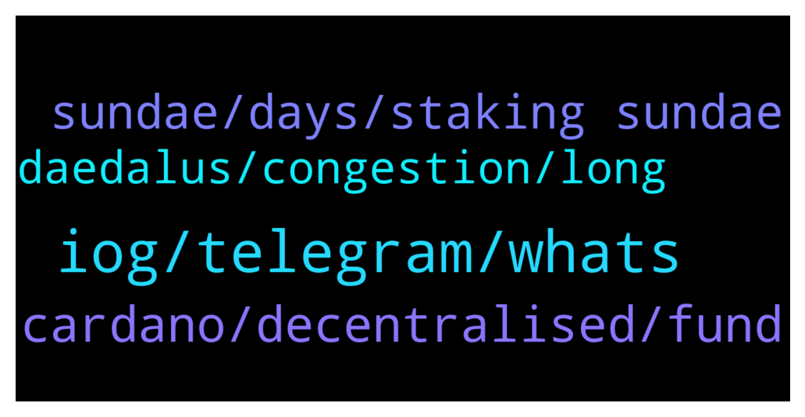

# **@Cardano**
 ## Analysis for **2022-01-29** - **2022-01-30**.

---

## 📊 **Basic Stats**

**n_messages_sent**: 61

---

---

## 🔝 **Top keywords and related messages**

1. **iog, telegram, whats**

    @Khan --- *How can ppls like me be part of it ?  For all I know I have some ada coins that's all haha 😅* **--->** [TG Discussion](https://t.me/Cardano/776624)

    @glitch04 --- *Nope, for updates stay tuned to their projects channels for the latest information* **--->** [TG Discussion](https://t.me/Cardano/776681)

    @Lgbeano --- *Of course.  A good place for some of the catalyst community is this telegram channel here  This IOG blog also has many great links here  IOG also run a weekly town hall you can get involved in or just watch on YouTube every Wednesday here* **--->** [TG Discussion](https://t.me/Cardano/776631)

    @Lgbeano --- *I couldn't get it to link so here:   Telegram:  https://t.me/ProjectCatalystChat  YouTube:  https://youtube.com/c/IohkIo  IOG blog: https://iohk.zendesk.com/hc/en-us/articles/900006490763-Project-Catalyst-FAQ* **--->** [TG Discussion](https://t.me/Cardano/776632)

    @Ravi --- *Hi. Am new to this group* **--->** [TG Discussion](https://t.me/Cardano/776857)

    @crnicripto81 --- *it could be good for Ada .....* **--->** [TG Discussion](https://t.me/Cardano/776987)

2. **cardano, decentralised, fund**

    @Lgbeano --- *This is a great community built map which shows just some of what's happening on Cardano   https://www.cardanocube.io/cardano-ecosystem-interactive-map* **--->** [TG Discussion](https://t.me/Cardano/776637)

    @jared1996z --- *What's this got to do with cardano?* **--->** [TG Discussion](https://t.me/Cardano/777012)

    @Lgbeano --- *You also definitely have more than just ₳.. there are many amazing projects developing and deployed on cardano for you to get involved in. It's a great eco system only ever growing..  With your ₳ you can stake it, which is safe as the ₳ never leaves your wallet and is never locked up. You will earn passive ₳ rewards. You can stake directly from your wallet. Youtube has many great videos for guidance. It is a very simple process.  You can also vote with your ₳ for projects you believe should receive funding.   No matter if you're looking for Decentralised exchages, finance, real world use case in Africa and around the world, decentralised identity, staking, NFTs and more, the list is endless.. you will find it here in cardano with some awesome community groups around* **--->** [TG Discussion](https://t.me/Cardano/776636)

    @georgelovegrove --- *Cardano Contributors League update with more analysis - https://twitter.com/cardanopace/status/1487450385463791618  Make sure you vote during fund 7 and whilst you're there consider voting for the challenge setting Cardano Contributors League 🤝🎉* **--->** [TG Discussion](https://t.me/Cardano/776833)

    @Lgbeano --- *June*   You should watch the Cardano 360 episodes. These are project updates from the team. They release two every month.   Check out the pinned message for the latest* **--->** [TG Discussion](https://t.me/Cardano/776842)

    @Khan --- *Dang   I always knew cardano is an awesome project but didn't know that all these runs on the project   Feeling awesome to be part of this community* **--->** [TG Discussion](https://t.me/Cardano/776639)

3. **sundae, days, staking sundae**

    @Angeri8 --- *Guys I staked my ada to receive Sundaep: when am I going to receive them?* **--->** [TG Discussion](https://t.me/Cardano/777041)

    @MikeAlano --- *hello, just checking if anybody started receiving Sundae tokens from the stakepools?  thanks* **--->** [TG Discussion](https://t.me/Cardano/776672)

    @ExInfernis --- *The staking for sundae awards started before several days. After 4 or 5 epochs it will be clear how they will be distributed.* **--->** [TG Discussion](https://t.me/Cardano/777052)

    @fptphuong --- *When's my first reward send back?* **--->** [TG Discussion](https://t.me/Cardano/776960)

    @ExInfernis --- *The staking for sundae rewards will finish then.* **--->** [TG Discussion](https://t.me/Cardano/777053)

    @glitch04 --- *takes 3 full epochs before you see #rewards 15-20 days depending on when you delegated you can read more at the FAQ linked below* **--->** [TG Discussion](https://t.me/Cardano/776966)

4. **daedalus, congestion, long**

    @Fibbow --- *Will it take more data and download times to use Daedalus?  Will Daedalus LITE us the same keyphrase? I'm on a metered internet and it's getting tough to synch Daedalus with each wallet upgrade* **--->** [TG Discussion](https://t.me/Cardano/776873)

    @JamesDao --- *Is daedalus taking long to verify and load ?* **--->** [TG Discussion](https://t.me/Cardano/777057)

    @cabfam --- *I heard that people were having a hard time even using their own node with no backlog due to overall network congestion.* **--->** [TG Discussion](https://t.me/Cardano/776733)

    @glitch04 --- *It mainly depends on if you are using a endpoint with a backlog of transactions* **--->** [TG Discussion](https://t.me/Cardano/776732)

    @glitch04 --- *load is down from the peak but still in the high range* **--->** [TG Discussion](https://t.me/Cardano/776730)

    @glitch04 --- *It does as it is a full node and needs to sync every transaction on the block chain* **--->** [TG Discussion](https://t.me/Cardano/777060)

