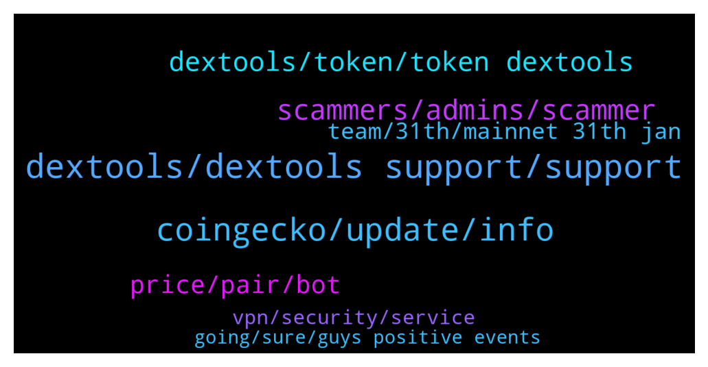

# **@DEXToolsCommunity**
 ## Analysis for **2022-01-28** - **2022-01-30**.

---

## 📊 **Basic Stats**

**n_messages_sent**: 147

---

---

## 🔝 **Top keywords and related messages**

1. **dextools, dextools support, support**

    @golh30 --- *From where dext chart data is coming* **--->** [TG Discussion](https://t.me/DEXToolsCommunity/329591)

    @Cryptojosu563 --- *I want to learn Dextools work* **--->** [TG Discussion](https://t.me/DEXToolsCommunity/329109)

    @leech_dev --- *Can you tell me where I can find the APIs of DexTools and How I can use that?* **--->** [TG Discussion](https://t.me/DEXToolsCommunity/329204)

    @ilkeratalay --- *hello where can i write for dextools trend information* **--->** [TG Discussion](https://t.me/DEXToolsCommunity/328978)

    @leech_dev --- *Oh, I see... So it means there's no way to get "Dext score" like Dextools, right?* **--->** [TG Discussion](https://t.me/DEXToolsCommunity/329207)

    @Jhongamadeo --- *Hi is dex only on uniswap for buying* **--->** [TG Discussion](https://t.me/DEXToolsCommunity/329475)

2. **coingecko, update, info**

    @bastardganpunk --- *About social Information for your token, please update etherscan.io or bscscan.com or coingecko.com  We pull info from there.    For the logo please update coinGecko or TrustWallet.* **--->** [TG Discussion](https://t.me/DEXToolsCommunity/329403)

    @stanes --- *About social Information for your token, please update etherscan.io or bscscan.com or coingecko.com  We pull info from there.    For the logo please update coinGecko or TrustWallet.* **--->** [TG Discussion](https://t.me/DEXToolsCommunity/329378)

    @stanes --- *Sure, just click the Swap button and connect your wallet.* **--->** [TG Discussion](https://t.me/DEXToolsCommunity/329349)

    @MasterCryptoHolic --- *Else for previously bought token that's not possible automatically ?* **--->** [TG Discussion](https://t.me/DEXToolsCommunity/329560)

    @MasterCryptoHolic --- *In "my position" doesn't it auto track where I bought in and where I am currently for a token ?* **--->** [TG Discussion](https://t.me/DEXToolsCommunity/329556)

    @TarikAljanabi --- *Hello, please is it possible to update my token info like logo on the platform?* **--->** [TG Discussion](https://t.me/DEXToolsCommunity/329377)

3. **scammers, admins, scammer**

    @bastardganpunk --- *That means a scammer DMed you! Careful please, no admin will ever DM you first!* **--->** [TG Discussion](https://t.me/DEXToolsCommunity/329668)

    @bastardganpunk --- *For ads and marketing please send a DM to @guillermorodriguez78  Admins NEVER DM FIRST* **--->** [TG Discussion](https://t.me/DEXToolsCommunity/329400)

    @kingkhalil --- *Sorry, I only talk to admins 🤐* **--->** [TG Discussion](https://t.me/DEXToolsCommunity/329663)

    @arv_23 --- *It is a sea of scammers when i made my message unbelievable* **--->** [TG Discussion](https://t.me/DEXToolsCommunity/329619)

    @ValentineFlokiCEO --- *that same guy dmed me he is a scammer* **--->** [TG Discussion](https://t.me/DEXToolsCommunity/329418)

    @stanes --- *Hi, Please DM @guillermorodriguez78 he is the person-in-charge.  Be aware of scammers, HE WILL NEVER DM YOU FIRST.* **--->** [TG Discussion](https://t.me/DEXToolsCommunity/329254)

4. **dextools, token, token dextools**

    @whisardly --- *Hey can someone tell me what this contract is? I used dextools to purchase tokens and it interacted here.  https://bscscan.com/address/0xdef1c0ded9bec7f1a1670819833240f027b25eff* **--->** [TG Discussion](https://t.me/DEXToolsCommunity/329520)

    @farhad13345 --- *How can i trend my token in dextools* **--->** [TG Discussion](https://t.me/DEXToolsCommunity/329598)

    @BaymaxCommunityAd --- *Do I need to pay to update logo to Dextool ?* **--->** [TG Discussion](https://t.me/DEXToolsCommunity/329700)

    @Jonatanm94 --- *Does anyone know how advertising can be contracted in dextools to promote a token?* **--->** [TG Discussion](https://t.me/DEXToolsCommunity/329399)

    @Astromooner --- *Hi how does a token update their details that are not showing on dextool eg website address* **--->** [TG Discussion](https://t.me/DEXToolsCommunity/329402)

    @CryptoCruzin --- *Hi! How can I update the twitter and website links for out token on dextools?* **--->** [TG Discussion](https://t.me/DEXToolsCommunity/329181)

5. **price, pair, bot**

    @kingkhalil --- *The issue is that I have set the price bot in the group but it does not let us know about the price* **--->** [TG Discussion](https://t.me/DEXToolsCommunity/329670)

    @Jack_the_Crypto --- *Got some issue by adding dex price bot. Setted pair, but after adking price its shows no pair found 😂  Used command to set price /set_pair 1 bsc 0xfbd57367524b389425c4adfb5a6f97b0e7ad3690* **--->** [TG Discussion](https://t.me/DEXToolsCommunity/329253)

    @kingkhalil --- *Can we add price pair list inside in dex pricing bot and then add it to group?* **--->** [TG Discussion](https://t.me/DEXToolsCommunity/329685)

    @kingkhalil --- *What does it mean I have set DexScreener price bot to the group but it gives this message??????????* **--->** [TG Discussion](https://t.me/DEXToolsCommunity/329664)

    @NoOne19944991 --- *Hi BSC hot pairs has issue Not show all of them* **--->** [TG Discussion](https://t.me/DEXToolsCommunity/329116)

    @bastardganpunk --- *I think you’re talking about the price bot for setting up in other groups (sorry there are a few bots 😅)  Here is a guide on how to set it up. Does this answer your question?  https://youtu.be/nntj0q9sap4* **--->** [TG Discussion](https://t.me/DEXToolsCommunity/329691)

6. **team, 31th, mainnet 31th jan**

    @MasterCryptoHolic --- *Ok would love to see this feature in near future.* **--->** [TG Discussion](https://t.me/DEXToolsCommunity/329563)

    @leech_dev --- *Btw, what I can get if I get pro plan there?* **--->** [TG Discussion](https://t.me/DEXToolsCommunity/329210)

    @Qulironeharo807 --- *Heard about polytrade launching its mainnet on 31th Jan. Is it a worthy one?* **--->** [TG Discussion](https://t.me/DEXToolsCommunity/329241)

    @stanes --- *Check this page for the differences between plans: https://www.dextools.io/#chooseyourplan* **--->** [TG Discussion](https://t.me/DEXToolsCommunity/329222)

    @JoeyDieleman --- *Yes there were more who requested this. As many other features I think its on there big backlog too 😇* **--->** [TG Discussion](https://t.me/DEXToolsCommunity/329565)

    @hmk18990 --- *nope not yet, public api planned but can't give you an ETA* **--->** [TG Discussion](https://t.me/DEXToolsCommunity/329208)

7. **vpn, security, service**

    @Madsumo --- *I have tried both UK and US servers and it is the same for both.* **--->** [TG Discussion](https://t.me/DEXToolsCommunity/329742)

    @JoeyDieleman --- *This has to do with cloudflare not trusting the vpn its ip address* **--->** [TG Discussion](https://t.me/DEXToolsCommunity/329739)

    @Madsumo --- *Hi.  Recently my laptop was compromised and so I rebuilt it from the bottom up, i.e. complete reinstall from the OS up.  I have then set all apps where possible to 2FA and installed Norton360 plus their SecureVPN service.  On startup, with the VPN enabled, I can still access all my apps, exchanges, and wallets but I cannot access the DEXTools App. I get an error stating your site has security to stop security attacks. If I stop the VPN, connect to your site first, and then restart the VPN, it is fine.  I believe this is then bypassing my VPN as the session was started without it enabled.  I am not a security expert but is there anything I can do so I do not have to stop and re-enable the VPN?* **--->** [TG Discussion](https://t.me/DEXToolsCommunity/329736)

    @napascual --- *Maybe try with different countries then uk/us as well, check that the ip comes from a trusted ASN* **--->** [TG Discussion](https://t.me/DEXToolsCommunity/329752)

    @napascual --- *I remember a user that had norton 360 vpn service using non trusted ASNs. I encourage you to use a different vpn provider* **--->** [TG Discussion](https://t.me/DEXToolsCommunity/329750)

    @JoeyDieleman --- *You could try, if the vpn supports, to connect to another node/country or try another vpn service* **--->** [TG Discussion](https://t.me/DEXToolsCommunity/329740)

