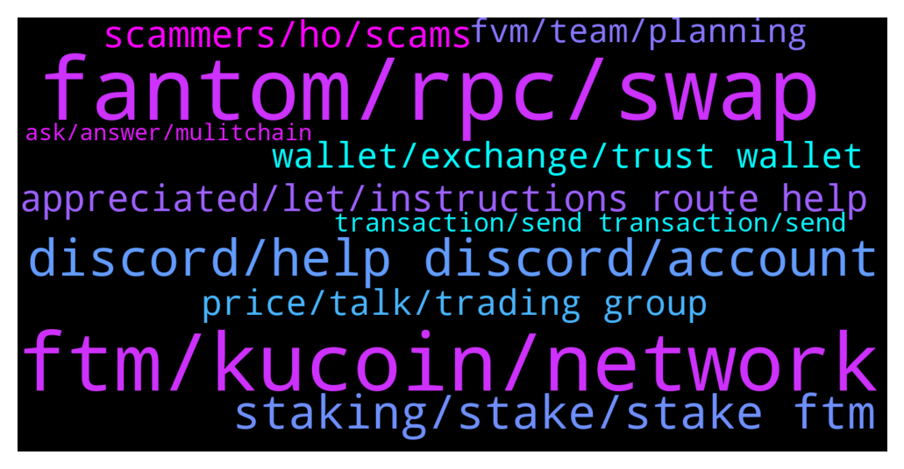

# **@Fantom_English**
 ## Analysis for **2022-01-29** - **2022-01-30**.

---

## 📊 **Basic Stats**

**n_messages_sent**: 178

---

---

## 🔝 **Top keywords and related messages**

1. **fantom, rpc, swap**

    @Janevietani --- *also please make sure have back up RPC  Fantom RPC : 1. https://rpc.ftm.tools/ 2. https://rpc.ankr.com/fantom 3. https://ftmrpc.ultimatenodes.io/   ChainID: 250 Symbol: FTM Browser : https://ftmscan.com  Another explorer is  https://explorer.fantom.network  check gas price here https://ftm.guru/fantomscan.html* **--->** [TG Discussion](https://t.me/Fantom_English/643842)

    @Janevietani --- *Fantom RPC : 1. https://rpc.ftm.tools/ 2. https://rpc.ankr.com/fantom 3. https://ftmrpc.ultimatenodes.io/   ChainID: 250 Symbol: FTM Browser : https://ftmscan.com  Another explorer is  https://explorer.fantom.network* **--->** [TG Discussion](https://t.me/Fantom_English/644389)

    @Janevietani --- *how to resolve pending txs ?  1. reset metamask go to metamask setting -> advanced -> reset reset metamask will only clear pending tx   2. add other RPC for back up Fantom RPC : a. https://rpc.ftm.tools/ b. https://rpc.ankr.com/fantom c. https://ftmrpc.ultimatenodes.io/   ChainID: 250 Symbol: FTM Browser : https://ftmscan.com  3. after reset metamask and add new rpc re-do your tx, check gas price here https://ftm.guru/fantomscan.html* **--->** [TG Discussion](https://t.me/Fantom_English/644185)

    @Lustock --- *Hi, I would like to make a question maybe the admin could help me I bought Fantom in Binance today, the idea was to storage in nano ledger under the ETH’s address but Instead of that I put under Fantom network and Binance allowed me to complete the transaction successfully; but I never received the Fantom in my ETH address after ( I add in advance the token). What can I do?  Thanks a lot* **--->** [TG Discussion](https://t.me/Fantom_English/644086)

    @Ambiora --- *That's really not good  for Fantom's growth man. We really need this if we want to be a market leader. Fantom has only 50 validator node which makes him not fully decentralized to attract DeFi protocols. We need FVM so that validator node can be increased in order to make Fantom really big. We had heard about FVM in 2018 but since then we are waiting for the same. And still there is not promising date. Hope you can convey these concerns to Andre Cronje* **--->** [TG Discussion](https://t.me/Fantom_English/644413)

    @Racing_spirit1 --- *Surely there must be an easy way to bridge to fantom?* **--->** [TG Discussion](https://t.me/Fantom_English/644502)

2. **ftm, kucoin, network**

    @xeyespablox --- *I transferred FTM from Metamask to Kucoin a week ago and never received it!* **--->** [TG Discussion](https://t.me/Fantom_English/643906)

    @librosagrado --- *I sent my FTM from my MetaMask wallet to my kucoin wallet a long time ago through the correct network and I still haven't received anything* **--->** [TG Discussion](https://t.me/Fantom_English/644333)

    @BinK18 --- *As per my knowledge, KuCoin had no FTM network liquidity last week , only ERC-20 withdrawals were available . KuCoin can help retrieve if funds were sent in wrong network* **--->** [TG Discussion](https://t.me/Fantom_English/643920)

    @pajamasfreak --- *you might get anyFTM/anyUSDC. when there is no liquidity, bridge you will give you anyFTM/anyUSDC , you can wait until there is liquidity so you can swap anyFTM/anyUSDC to FTM/anyUSDC or if you dont wanna wait liquidity, you can bridge it back to origin chain  check it on https://app.multichain.org/#/pool go to Pool -> FTM -> Remove -> anyFTM/anyUSDC to FTM/USDC ( which one network that have liquidity )* **--->** [TG Discussion](https://t.me/Fantom_English/644109)

    @xeyespablox --- *oh cause FTM network appeared available thats why I did it* **--->** [TG Discussion](https://t.me/Fantom_English/643929)

    @Alfred1580 --- *They have FTM network, same here I just sent FTM from my MM 2 days agi now, it was successful transfer on ftmscan but until now it has not deposited in my kucoin account...* **--->** [TG Discussion](https://t.me/Fantom_English/643961)

3. **discord, help discord, account**

    @TaniRay --- *yes, get chat support they sort it out fast* **--->** [TG Discussion](https://t.me/Fantom_English/644601)

    @taymcmahxn --- *Hi guys, could I please have my discord account unblocked? My account was hacked last week and got removed but I have fixed the issue.* **--->** [TG Discussion](https://t.me/Fantom_English/644488)

    @MODOdekunle --- *Have you tried to join again* **--->** [TG Discussion](https://t.me/Fantom_English/644490)

    @avekcrypto --- *Yoo  Can i talk with manager I have youtube channel* **--->** [TG Discussion](https://t.me/Fantom_English/644172)

    @taymcmahxn --- *You’re best bet is to use the discord man. Much safer app* **--->** [TG Discussion](https://t.me/Fantom_English/644511)

    @taymcmahxn --- *That’s why telegram sucks! I need to get back in the discord* **--->** [TG Discussion](https://t.me/Fantom_English/644500)

4. **staking, stake, stake ftm**

    @javadi1998 --- *How can I take out my Spirit Token from staking ? Thanks  I made my tokens at Beethoven staking!* **--->** [TG Discussion](https://t.me/Fantom_English/644778)

    @Michael_Gatsby --- *Guys, where to do you stake your fantoms these days?* **--->** [TG Discussion](https://t.me/Fantom_English/644216)

    @stephensiew --- *Is it true that Tarot cannot work with native fWallet?* **--->** [TG Discussion](https://t.me/Fantom_English/644166)

    @Karlastar --- *Were Can I stake my FTM? The best Option?* **--->** [TG Discussion](https://t.me/Fantom_English/644348)

    @fashi0nable --- *i want to know in what situations a person would receive/mint from the address* **--->** [TG Discussion](https://t.me/Fantom_English/643972)

    @Mazhar908 --- *Helllo @Johnnyfantom please tell about coin base listing ?* **--->** [TG Discussion](https://t.me/Fantom_English/644872)

5. **appreciated, let, instructions route help**

    @Johnnyfantom --- *Reset metamask, go to settings, advanced* **--->** [TG Discussion](https://t.me/Fantom_English/644540)

    @taymcmahxn --- *Yeah it won’t let me because I’m using the same email address and mobile number* **--->** [TG Discussion](https://t.me/Fantom_English/644498)

    @xeyespablox --- *any help would be appreciated thabj you* **--->** [TG Discussion](https://t.me/Fantom_English/643907)

    @bingo_inu --- *Really? Okay let me try that. Thanks* **--->** [TG Discussion](https://t.me/Fantom_English/644630)

    @bingo_inu --- *Hello, i have a problem and i need some assistance* **--->** [TG Discussion](https://t.me/Fantom_English/644608)

    @MODOdekunle --- *Ooh so sorry about that I guessed you should try to message one of the Admin or Dev for help* **--->** [TG Discussion](https://t.me/Fantom_English/644501)

6. **scammers, ho, scams**

    @Racing_spirit1 --- *Jeez never seen a group with so many scammers* **--->** [TG Discussion](https://t.me/Fantom_English/644499)

    @DrNonStrange --- *Yeah too many scammers contacting me outside of this group* **--->** [TG Discussion](https://t.me/Fantom_English/644936)

    @Dustin --- *Note scammers pop up here then anywhere lol* **--->** [TG Discussion](https://t.me/Fantom_English/644583)

    @Racing_spirit1 --- *Loads of scammers, transactions taking forever, bridge not working* **--->** [TG Discussion](https://t.me/Fantom_English/644527)

    @Perpendiculate --- *To all you scammers out there/ I'm not a complete moron, but you are. Save your time! You're not going to trick me. Its unbelievable how many scam DMs I got within 2 minutes of asking a simple question. Be gone scammers!* **--->** [TG Discussion](https://t.me/Fantom_English/644477)

    @Im_CarpeDiem_Now --- *Ho ho ho, how many scams* **--->** [TG Discussion](https://t.me/Fantom_English/644277)

7. **price, talk, trading group**

    @pgngm --- *Why bro? You can't make money if you don't listen carefully to the market rumours* **--->** [TG Discussion](https://t.me/Fantom_English/643862)

    @zenith22 --- *It's not even a local grocery store, so why is there so little liquidity?* **--->** [TG Discussion](https://t.me/Fantom_English/644118)

    @Johnnyfantom --- *Please no price talk, moon, pump, dump etc, go to trading group* **--->** [TG Discussion](https://t.me/Fantom_English/644843)

    @pajamasfreak --- *No price talk here, trading group can scroll above* **--->** [TG Discussion](https://t.me/Fantom_English/644740)

    @pajamasfreak --- *No price talk here and do read trading group above* **--->** [TG Discussion](https://t.me/Fantom_English/644672)

    @kumar3060 --- *Is this place to talk price* **--->** [TG Discussion](https://t.me/Fantom_English/644662)

8. **wallet, exchange, trust wallet**

    @librosagrado --- *look I have a problem with a transaction since everything is correct but it does not reach the intended Wallet* **--->** [TG Discussion](https://t.me/Fantom_English/644328)

    @TaniRay --- *mine is sorted. turned out was an exchange issue* **--->** [TG Discussion](https://t.me/Fantom_English/644599)

    @tCollector --- *no idea why I sent the address here instead of DMing you @Janevietani 😅 attention issues 🤓* **--->** [TG Discussion](https://t.me/Fantom_English/643832)

    @TaniRay --- *hm thx for pointing  out.  i can see my coins on  blockchain wallet  but not on exchange itself . contacting support* **--->** [TG Discussion](https://t.me/Fantom_English/644570)

    @TaniRay --- *just sent from wallet to exchange . addresses r correct network too😒 done it before* **--->** [TG Discussion](https://t.me/Fantom_English/644563)

    @TetherNetworkadmin --- *I can’t stake in my trust wallet? Admin pls help me* **--->** [TG Discussion](https://t.me/Fantom_English/644394)

9. **fvm, team, planning**

    @Janevietani --- *I dont know but probably  end of 2022 or 2023 earlier* **--->** [TG Discussion](https://t.me/Fantom_English/644136)

    @Janevietani --- *we dont have eta for FVM, FVM will be release when its ready* **--->** [TG Discussion](https://t.me/Fantom_English/644126)

    @Ambiora --- *I didn't get you. Actually wanted to check by when team is planning to bring FVM and it could be a part of their road map and hence asked this question* **--->** [TG Discussion](https://t.me/Fantom_English/644124)

    @pajamasfreak --- *There is no roadmap for sometime now* **--->** [TG Discussion](https://t.me/Fantom_English/644123)

    @Ambiora --- *That's true but do we have any plan by when team is targetting to bring FVM?* **--->** [TG Discussion](https://t.me/Fantom_English/644135)

    @Ambiora --- *But team is planning this from so long and still there is not fixed date? Where are we in terms of EVM? Any expected date,month or quarter?* **--->** [TG Discussion](https://t.me/Fantom_English/643917)

10. **transaction, send transaction, send**

    @TaniRay --- *is it possible to push  send transaction faster  after success ?  mine taking over 2 days ...* **--->** [TG Discussion](https://t.me/Fantom_English/644519)

    @aidfx --- *I've been waiting 30 minutes so far for transactions today, is there congestion?* **--->** [TG Discussion](https://t.me/Fantom_English/644177)

    @TaniRay --- *if network will be this slow my transaction will take 210days to clear🥶 😤* **--->** [TG Discussion](https://t.me/Fantom_English/644559)

    @TaniRay --- *how will it help with success transaction . its not pending its just  very slow* **--->** [TG Discussion](https://t.me/Fantom_English/644541)

    @James --- *Can you send the transaction harsh on here. ?* **--->** [TG Discussion](https://t.me/Fantom_English/643962)

    @James --- *Can you send in the transaction harsh ?* **--->** [TG Discussion](https://t.me/Fantom_English/643957)

