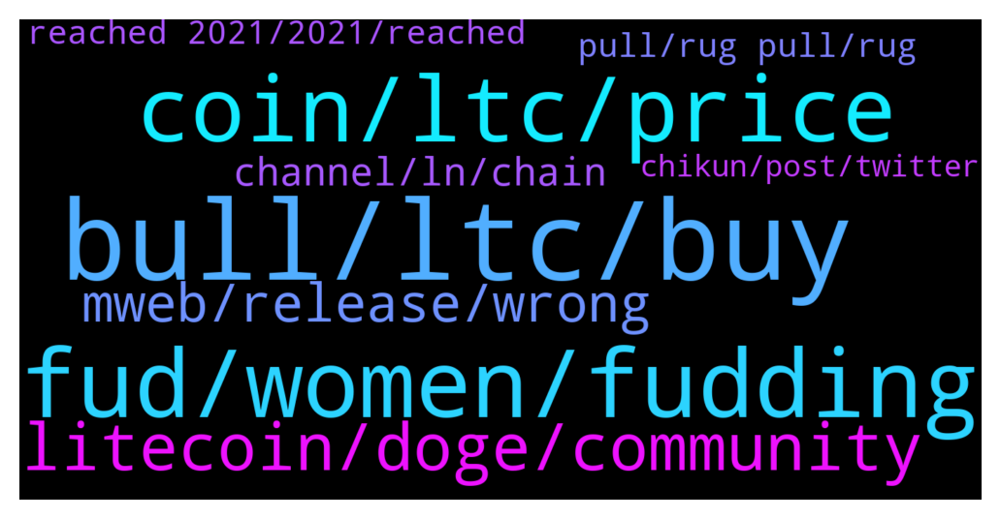

# **@Litecoin**
 ## Analysis for **2022-01-29** - **2022-01-30**.

---

## 📊 **Basic Stats**

**n_messages_sent**: 251

---

---

## 🔝 **Top keywords and related messages**

1. **bull, ltc, buy**

    @Safu_LTC --- *Imagine a day when the price of LTC exceeds $1000.  This group will explode.  🙈👀* **--->** [TG Discussion](https://t.me/Litecoin/2055127)

    @Safu_LTC --- *$27k will be the last chance for buying IMO, but its not 100% programmed and we may goes up from here to reach $40k+* **--->** [TG Discussion](https://t.me/Litecoin/2054846)

    @starman42069 --- *we are about to start the bear market and pp stlll bullish* **--->** [TG Discussion](https://t.me/Litecoin/2054675)

    @Carlos_PRO_Holder --- *We are in a bear market, just check the charts 😭* **--->** [TG Discussion](https://t.me/Litecoin/2054932)

    @Jefry --- *Hi guys i am buy ltc on 200 dollars and still holding i am crazy? :D* **--->** [TG Discussion](https://t.me/Litecoin/2054584)

    @starman42069 --- *Guys open your eyes. LTC is sitting at 110 which is 1/4th of its ATH which has not changed in 4 years including 2021 bull run which was the biggest bull run in financial history.* **--->** [TG Discussion](https://t.me/Litecoin/2054658)

2. **fud, women, fudding**

    @ForDaTek --- *We just sit here and complain all day.* **--->** [TG Discussion](https://t.me/Litecoin/2054510)

    @Musashi_Kansai --- *We have people who show up like it’s their job to fud.* **--->** [TG Discussion](https://t.me/Litecoin/2054583)

    @Musashi_Kansai --- *We all want what’s best for the community and many voices are being silenced. Thanks.* **--->** [TG Discussion](https://t.me/Litecoin/2054577)

    @JohnTheApostle --- *Or simply uneducated on the issue* **--->** [TG Discussion](https://t.me/Litecoin/2054466)

    @finitemaz --- *I think he meant many voices choose to not participate at all because of relentless FUD they are exposed to initially.* **--->** [TG Discussion](https://t.me/Litecoin/2054606)

    @RabbitL0v3r --- *So your solution is to silence more voice? Interesstin reasoning* **--->** [TG Discussion](https://t.me/Litecoin/2054591)

3. **coin, ltc, price**

    @arnego2 --- *Its stupid to blame crypto for laundering issuies. Wirh argument you need  to prohibit $ and the €.* **--->** [TG Discussion](https://t.me/Litecoin/2054463)

    @Notbiden --- *Better transparency on what is happening and a better communication line to developers and really they need to get people excited about the project* **--->** [TG Discussion](https://t.me/Litecoin/2054506)

    @bake_Crypto --- *it just has changed and mass adoption means tech or decentralization or "idologi" against banks is not important. imo.* **--->** [TG Discussion](https://t.me/Litecoin/2054719)

    @RorschachTesst --- *How cute that you think this group is going to control the price of a coin with millions in circulating supply.  Secondly, if you guys think the coin doesn't need any marketing and the tech will do the talk then stop worrying about fud.* **--->** [TG Discussion](https://t.me/Litecoin/2054698)

    @RorschachTesst --- *If you want to do something good for the coin stop trying to promote news to the declining telegram group and instead focus on reddit and Twitter. A new user isn't gonna come straight to this group. They're gonna read up on online forums and guess what? Everyone out there thinks Charlie dumped at the top. Focus on social media and not this group. We all know why he sold. The rest of the crypto space doesn't* **--->** [TG Discussion](https://t.me/Litecoin/2054620)

    @finitemaz --- *I would argue it's somewhat more balanced than what you're making it seem.  There's always a few that are convinced they move markets by complaining here, but unlike centralized scams, we dont censor in our groups as long as it's within @termsconditions* **--->** [TG Discussion](https://t.me/Litecoin/2054537)

4. **litecoin, doge, community**

    @YuumuraKirika --- *The problem with doge is that trying to pump it is like trying to count all of the grains of sand in a desert. It has infinite supply and is highly inflationary... It dilutes it's own value at such a fast rate that it's a botomless pit of value depreciation* **--->** [TG Discussion](https://t.me/Litecoin/2054513)

    @RorschachTesst --- *Doge literally started out as a meme coin but has more word of mouth than ltc and is being accepted by tesla. Shiba is being accepted by amc. So yeah, I wouldn't resort to whataboutism..a useless coin can eventually demonstrate utility. Rather let's talk about why ltc has a defect in its price and what can be done to overcome it* **--->** [TG Discussion](https://t.me/Litecoin/2054715)

    @ForDaTek --- *Litecoin holders should start shilling Litecoin to Billionaires on their social media. Dogecoin holders are so active and here we have people just complain all day. LTC buyers are just the most low energy people ever and don’t do anything whilst dogecoin holders actually get together and even spend the dogecoin for sponsorships etc to get recognised, what do litecoin holders do here?* **--->** [TG Discussion](https://t.me/Litecoin/2054474)

    @finitemaz --- *No, Litecoin doesnt "need" better marketing.  The ones who think it does need to learn what separates the litecoin network from 'new coins from vietnam that mastered community engagement'* **--->** [TG Discussion](https://t.me/Litecoin/2054644)

    @professional --- *Maybe better for you leave Litecoin community and join to doge community* **--->** [TG Discussion](https://t.me/Litecoin/2054485)

    @Notbiden --- *Fuk doge should have been demerge mined that coin is biggest joke and Elon played them fools* **--->** [TG Discussion](https://t.me/Litecoin/2054501)

5. **mweb, release, wrong**

    @coblee --- *MWEB will definitely change the game. What affect that will have on price is anyone’s guess though.* **--->** [TG Discussion](https://t.me/Litecoin/2054406)

    @T bird --- *So no MWEB in January? How many times will we be lied to?* **--->** [TG Discussion](https://t.me/Litecoin/2054744)

    @RorschachTesst --- *Let's see how the rest of the market reacts when mweb is out(no idea when that's happening anymore, it keeps getting pushed forever)* **--->** [TG Discussion](https://t.me/Litecoin/2054694)

    @cloudlite15 --- *I pray that I will live long enough to see mweb release in my lifetime. 🙏* **--->** [TG Discussion](https://t.me/Litecoin/2054937)

    @Yhtrcgtfv566 --- *There's more to mweb than coding* **--->** [TG Discussion](https://t.me/Litecoin/2054882)

    @dilc11 --- *The release will be in January, but the activation will take several months, most likely they will activate at the end of March* **--->** [TG Discussion](https://t.me/Litecoin/2054747)

6. **channel, ln, chain**

    @Wateriswater --- *Is it needed to actually transfer between channels though* **--->** [TG Discussion](https://t.me/Litecoin/2054564)

    @Wateriswater --- *So if it hides amounts it really only can obscure how much collateral is in the channel* **--->** [TG Discussion](https://t.me/Litecoin/2054557)

    @Wateriswater --- *But doesn't LN basically hide it anyways* **--->** [TG Discussion](https://t.me/Litecoin/2054543)

    @finitemaz --- *No, from what I understand it breaks transaction linkability. MWEB to hide amounts. Both working together is another gem in itself.* **--->** [TG Discussion](https://t.me/Litecoin/2054548)

    @finitemaz --- *That could mean pegging in/out from LN, or running 2 separate LNs (existing one and MWEB one) with the ability to seamlessly move coins from one to the other without an on-chain tx.* **--->** [TG Discussion](https://t.me/Litecoin/2054561)

    @Wateriswater --- *Ln is an off chain channel, so settlement happens in the channel* **--->** [TG Discussion](https://t.me/Litecoin/2054555)

7. **pull, rug pull, rug**

    @starman42069 --- *I used to think ylike you till we experienced that rug pull in december* **--->** [TG Discussion](https://t.me/Litecoin/2054680)

    @mauri_maurizio --- *Toooooooooooooo the Mooooonnn. Go go go  buy buyyyyy.   Pump Puuuuump* **--->** [TG Discussion](https://t.me/Litecoin/2054985)

    @FFCosta --- *You need start to buy to dat happen. But most of the time is rug pull and drama .* **--->** [TG Discussion](https://t.me/Litecoin/2054852)

    @FFCosta --- *They rug pull and buy a paradise with jerome muns* **--->** [TG Discussion](https://t.me/Litecoin/2054815)

    @LemuelE03 --- *Yeah i guess another two months of accumulation* **--->** [TG Discussion](https://t.me/Litecoin/2054748)

    @coblee --- *Sorry to hear that. If you’re not joking, I hope things turn around for you.* **--->** [TG Discussion](https://t.me/Litecoin/2054402)

8. **reached 2021, 2021, reached**

    @coblee --- *We reached it again in 2021* **--->** [TG Discussion](https://t.me/Litecoin/2054412)

    @TonyNakamoto --- *there was BearDiv between the tops, but BullDiv between the bottoms (assuming we can call this a bottom)* **--->** [TG Discussion](https://t.me/Litecoin/2055064)

    @@bamboo --- *so we reached to top in 2021 for sure? pretty sobering insight* **--->** [TG Discussion](https://t.me/Litecoin/2054432)

    @coblee --- *No one thought that was the top either* **--->** [TG Discussion](https://t.me/Litecoin/2054413)

    @FCKtheBULLrun --- *You knew the top in 2018* **--->** [TG Discussion](https://t.me/Litecoin/2054407)

    @IsmailOtis --- *Where is the enthausiast that you had?* **--->** [TG Discussion](https://t.me/Litecoin/2054984)

9. **chikun, post, twitter**

    @YuumuraKirika --- *Twitter.. give our chikun an icon! #Solana shit gets one, why tf don't we?* **--->** [TG Discussion](https://t.me/Litecoin/2054788)

    @YuumuraKirika --- *Retweet, etc. Whatever the fuck 😝. Trying standing up to the chikun army!!!* **--->** [TG Discussion](https://t.me/Litecoin/2054731)

    @YuumuraKirika --- *See a reply defending chikun? Post it here and we will go on there and like the shit out of it* **--->** [TG Discussion](https://t.me/Litecoin/2054730)

    @YuumuraKirika --- *How about this, if you see a Twitter post that needs some love... Post it here* **--->** [TG Discussion](https://t.me/Litecoin/2054727)

    @YuumuraKirika --- *Guiz... This is the ultimate sign. Arise chikun.. arise...* **--->** [TG Discussion](https://t.me/Litecoin/2054460)

    @YuumuraKirika --- *If we all acted like a unit, we could be the top post on most Twitter threads* **--->** [TG Discussion](https://t.me/Litecoin/2054729)

