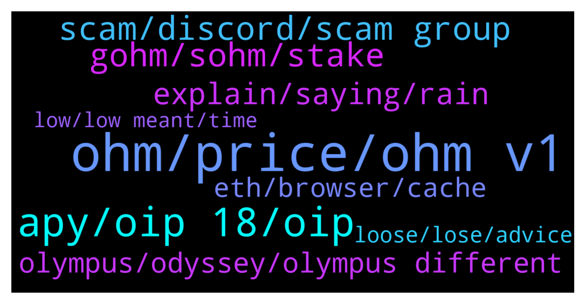

# **@OlympusTG**
 ## Analysis for **2022-01-29** - **2022-01-30**.

---

## 📊 **Basic Stats**

**n_messages_sent**: 960

---

---

## 🔝 **Top keywords and related messages**

1. **ohm, price, ohm v1**

    @nfwaple --- *people who bought at 1k mark would have doubled the OHM every 2 months, essentially cutting the cost in half* **--->** [TG Discussion](https://t.me/OlympusTG/174848)

    @rasputen1 --- *If it’s dead so is ohm then* **--->** [TG Discussion](https://t.me/OlympusTG/174272)

    @Host_Matt --- *why invest in ohm if you dont get it* **--->** [TG Discussion](https://t.me/OlympusTG/174647)

    @Alden_168 --- *Never $10 per ohm. Either you buy now, or wait for $100 😄* **--->** [TG Discussion](https://t.me/OlympusTG/173651)

    @SecuriTech24 --- *You bought at the wrong time. Simple. I did it too more than once. Difference with OHM is the rebases, you get more ohm every 8 hours. Now when the bear market is finished and it goes bullish, you will have loads more ohm than you had to start with, so when the price goes up you start to make your money back way faster and hopefully make profit. Key takeaway - PATIENCE!* **--->** [TG Discussion](https://t.me/OlympusTG/174901)

    @Cixex --- *Looks like the price has stabilized.  One dip from BTC is needed.  I want $10 ohms* **--->** [TG Discussion](https://t.me/OlympusTG/173650)

2. **apy, oip 18, oip**

    @rasputen1 --- *The fact most of the mcap is staked shows that a lot of people wanted to capitalise off the high apy imo* **--->** [TG Discussion](https://t.me/OlympusTG/174392)

    @assimj --- *I hope APY stops at 1K% and doesn’t go further below ⬇️* **--->** [TG Discussion](https://t.me/OlympusTG/175020)

    @rasputen1 --- *But what I will say is that this project hasn’t had low apy, and thinking dropping it to low levels will increase price can’t be guaranteed* **--->** [TG Discussion](https://t.me/OlympusTG/174323)

    @eatsandtravels --- *I got out! APY from 5000% to 1300% and $350 to $60* **--->** [TG Discussion](https://t.me/OlympusTG/174924)

    @ccryii --- *Not dead . Look at apy and the decisions already taken. The team is doing what they meant* **--->** [TG Discussion](https://t.me/OlympusTG/173453)

    @safuking --- *i mean apy decreased so much by now* **--->** [TG Discussion](https://t.me/OlympusTG/173454)

3. **scam, discord, scam group**

    @nfwaple --- *🥲🥲 scammers everywhere, wonder how they got your email address* **--->** [TG Discussion](https://t.me/OlympusTG/173649)

    @cryp1223 --- *How much were you scammed ?* **--->** [TG Discussion](https://t.me/OlympusTG/174222)

    @nfwaple --- *was it their admin or just community member?* **--->** [TG Discussion](https://t.me/OlympusTG/173555)

    @chitangxxx --- *yes am pretty sure it is - if you ban people for calling the project a scam instead of engaging them in a conversation and explain why it's not then they are obviously a scam* **--->** [TG Discussion](https://t.me/OlympusTG/173994)

    @hootie1233 --- *got an email from metamask asking to verify for some regulations. Think it's a scam so beware. Mine is locked with trezor but others may be easy to get at if not* **--->** [TG Discussion](https://t.me/OlympusTG/173648)

    @cdp279 --- *we don’t really want to speak about other projects here. Try wonderland discord. You might get blocked 🤣* **--->** [TG Discussion](https://t.me/OlympusTG/173998)

4. **gohm, sohm, stake**

    @nfwaple --- *where do you see your gOHM from then?* **--->** [TG Discussion](https://t.me/OlympusTG/174178)

    @Deepdiver --- *I have multiple options. Move to gOhm v2?* **--->** [TG Discussion](https://t.me/OlympusTG/173700)

    @nfwaple --- *yea move to gOHM means v2, gOHM only exists on v2* **--->** [TG Discussion](https://t.me/OlympusTG/173701)

    @ishaqniz --- *ok than how can i unstake gohm* **--->** [TG Discussion](https://t.me/OlympusTG/174954)

    @nfwaple --- *you swap gOHM using a dex, like Uniswap* **--->** [TG Discussion](https://t.me/OlympusTG/173753)

    @Pallas1111 --- *I'm on the stake page. And yes I do see a higher sOhm number that before. But the gohm is the same. That's normal correct?* **--->** [TG Discussion](https://t.me/OlympusTG/174180)

5. **explain, saying, rain**

    @Host_Matt --- *i know but i want to hear him explain will be fun* **--->** [TG Discussion](https://t.me/OlympusTG/174277)

    @Host_Matt --- *why the hell should we listen to you after making a comment like that* **--->** [TG Discussion](https://t.me/OlympusTG/173845)

    @Host_Matt --- *might even think they are saying something that makes sense but cant explain it* **--->** [TG Discussion](https://t.me/OlympusTG/174282)

    @Host_Matt --- *people love to say stuff without understanding what theyre saying* **--->** [TG Discussion](https://t.me/OlympusTG/174281)

    @Host_Matt --- *they don't have to but it would be nice for people to make a statement, and then have 1-2 sentence explaining it* **--->** [TG Discussion](https://t.me/OlympusTG/174289)

    @Host_Matt --- *wonder if people say stuff without realizing they have no idea what theyre saying 😆* **--->** [TG Discussion](https://t.me/OlympusTG/174291)

6. **olympus, odyssey, olympus different**

    @Derrick --- *You shouldn't invest in Olympus my friend if you can't be patient* **--->** [TG Discussion](https://t.me/OlympusTG/174660)

    @Derrick --- *Olympus is a genius idea, despite the market being bearish I'm bullish on Olympus!* **--->** [TG Discussion](https://t.me/OlympusTG/174514)

    @elmaestro123 --- *My $5000 investment in Olympus is now $250. Would I laugh for cry* **--->** [TG Discussion](https://t.me/OlympusTG/173601)

    @MiaRomeo --- *We all trust Olympus even though we do not know the team right?* **--->** [TG Discussion](https://t.me/OlympusTG/174686)

    @(3'3) --- *and if someone gets to Zeus, it would be convenient to enter the IOTA tangle that has zero transfer fees, better for everyone!!!😉👍* **--->** [TG Discussion](https://t.me/OlympusTG/174036)

    @nfwaple --- *what is it? Klima is a friend, thay gave Olympus some Klima* **--->** [TG Discussion](https://t.me/OlympusTG/175073)

7. **eth, browser, cache**

    @hootie1233 --- *Still no reply? I saw this post this morning. Something not right* **--->** [TG Discussion](https://t.me/OlympusTG/174154)

    @Deepdiver --- *I cannot add a screenshot here. But it tells me that I am migrated and at the same time it asks me to migrate* **--->** [TG Discussion](https://t.me/OlympusTG/173704)

    @nfwaple --- *try clearing your browser cache, make sure connected to the right wallet and ETH mainnet* **--->** [TG Discussion](https://t.me/OlympusTG/174955)

    @nfwaple --- *it is probably because you haven't migrated* **--->** [TG Discussion](https://t.me/OlympusTG/173697)

    @Tha_bag_man --- *I can’t connect my safepal wallet for some reason* **--->** [TG Discussion](https://t.me/OlympusTG/174037)

    @Tha_bag_man --- *Already cleared cache not sure what to do* **--->** [TG Discussion](https://t.me/OlympusTG/174096)

8. **loose, lose, advice**

    @ocelotquick --- *You didn’t understand the investment before aping and still dont?* **--->** [TG Discussion](https://t.me/OlympusTG/175176)

    @RecoDedon --- *Of course he can still loose more. How can you say that he "won't (loose) if he keeps it"?!? What you are doing is giving financial advice which is strictly forbidden. You can get to jail for telling such things.* **--->** [TG Discussion](https://t.me/OlympusTG/173488)

    @RecoDedon --- *If you watch the YouTube channels, almost all of them always emphasize that they do not give financial advice.* **--->** [TG Discussion](https://t.me/OlympusTG/173496)

    @PLUTO 007 --- *I don’t check every 5 mins I invested and left it to hopefully grow but it done the opposite* **--->** [TG Discussion](https://t.me/OlympusTG/173852)

    @RecoDedon --- *Yes. It's a formal disclosure. And whatever they say stays generic. They never say if someone will loose or will earn money. They show different sides and let the audience decide for themselves what to do.* **--->** [TG Discussion](https://t.me/OlympusTG/173506)

    @Host_Matt --- *im not calling you anything but its not a good idea to invest in stuff without understanding it* **--->** [TG Discussion](https://t.me/OlympusTG/174648)

