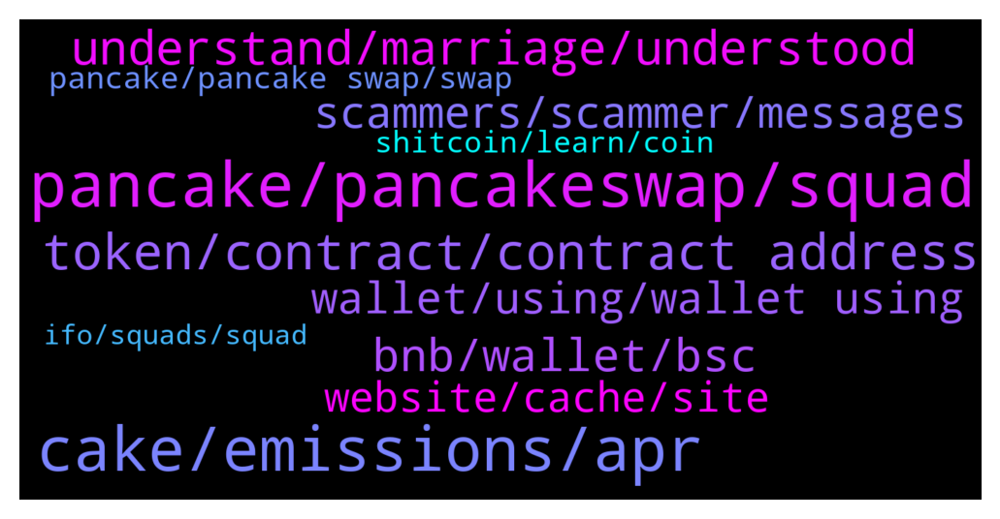

# **@PancakeSwap**
 ## Analysis for **2022-01-29** - **2022-01-30**.

---

## 📊 **Basic Stats**

**n_messages_sent**: 866

---

---

## 🔝 **Top keywords and related messages**

1. **pancake, pancakeswap, squad**

    @uputkutelegram --- *Hey guys i have bought a bitpunks and they want to get listed on pancakeswap like other nfts are listed is it possible to list a dear pancakesquad 9260 holder :)* **--->** [TG Discussion](https://t.me/PancakeSwap/2309675)

    @humblebee17 --- *dont make the pancakesquad floor price lower lol* **--->** [TG Discussion](https://t.me/PancakeSwap/2310376)

    @QV_zz --- *only bep20 coins can be swapped on pancakeswap* **--->** [TG Discussion](https://t.me/PancakeSwap/2310981)

    @Carco_Guardian --- *buy pancakesquad and take a seat with popcorn... it is on fire for private pool of IFO.. ❤👈* **--->** [TG Discussion](https://t.me/PancakeSwap/2309454)

    @Carco_Guardian --- *https://t.me/pancakesquadtrade join pancake squad telegram group (non-official)* **--->** [TG Discussion](https://t.me/PancakeSwap/2309552)

    @BigV123 --- *Any special reason PancakeSquad nft price has increased 100% since last month?* **--->** [TG Discussion](https://t.me/PancakeSwap/2309633)

2. **cake, emissions, apr**

    @hardeep_arora29 --- *I bought cake at 38 usdt now the cake price is 7 usdt, in huge huge loss, what happen to cake from long time not bullish behavior in cake* **--->** [TG Discussion](https://t.me/PancakeSwap/2311263)

    @ha --- *+15% rise from the bottom of Bitcoin, +7% rise in Cake coin... What the heck is the reason?... Alienation from the market😞😞* **--->** [TG Discussion](https://t.me/PancakeSwap/2310727)

    @Ceddi200 --- *👩‍🏫 There are 2 common requests we see about CAKE.  1) Increase APR 2) Stop all Emissions  👏They👏cannot👏both👏happen.  ———  Q. Where does APR on farms and the CAKE-CAKE Syrup Pools come from? A. From CAKE emissions.   ⚠️If all CAKE emissions were cut to 0, APR would also drop to 0!  The CAKE you earn from the pools and farms are the CAKE that are emitted each block. Emmissions produce APR.  ———  So what are we doing about inflation?  📉We reduce emissions gradually, every month. We've already reduced from 40 to 14.5 CAKE /block.  🔥We burn CAKE every week + add burning mechanisms in new products.  The goal is, and always has been, for more CAKE to leave circulation than enters.  https://docs.pancakeswap.finance/tokenomics/cake/cake-tokenomics* **--->** [TG Discussion](https://t.me/PancakeSwap/2311329)

    @xandercakes --- *CAKE vs UNI (30 days)  If you bought $100 (2021-12-30) of CAKE Today (2022-01-29) you have $59.77 of CAKE  If you bought $100 (2021-12-30) of UNI Today (2022-01-29) you have $62.12 of UNI  Provided by 🤖 @BSC_Price_BOT* **--->** [TG Discussion](https://t.me/PancakeSwap/2309956)

    @jason5401 --- *….uni back to 11$ cake still in 7.1$* **--->** [TG Discussion](https://t.me/PancakeSwap/2309943)

    @hardeep_arora29 --- *Uniswap performing much better than cake right now bro* **--->** [TG Discussion](https://t.me/PancakeSwap/2311300)

3. **token, contract, contract address**

    @ManBlyat --- *Yes you can, with write contract. make sure you're owner that contract of token* **--->** [TG Discussion](https://t.me/PancakeSwap/2311604)

    @Ceddi200 --- *Have you communicated with the team. Where you able to buy other tokens recently* **--->** [TG Discussion](https://t.me/PancakeSwap/2311138)

    @octa9 --- *may be you bought a fake token* **--->** [TG Discussion](https://t.me/PancakeSwap/2311076)

    @Luukku1 --- *Sure you didnt buy scam one? I see only few holders on that token and found another coingecko token with thousands of holders* **--->** [TG Discussion](https://t.me/PancakeSwap/2312631)

    @ManBlyat --- *i understand ser, haha sorry just woke up 😂 what name token contract btw ?* **--->** [TG Discussion](https://t.me/PancakeSwap/2311612)

    @RangerApos --- *https://honeypot.rugdoc.io/ you can use this tool to check if token is buyable and sellable* **--->** [TG Discussion](https://t.me/PancakeSwap/2310334)

4. **understand, marriage, understood**

    @CakeCompounder --- *Sorry - I do not understand 🙁* **--->** [TG Discussion](https://t.me/PancakeSwap/2309577)

    @Bberko32 --- *I know why but can’t say it here* **--->** [TG Discussion](https://t.me/PancakeSwap/2309620)

    @CakeCompounder --- *I don’t understand why you are trying to say??* **--->** [TG Discussion](https://t.me/PancakeSwap/2310252)

    @Million --- **From experience not from wishful thinking* **--->** [TG Discussion](https://t.me/PancakeSwap/2311209)

    @ManBlyat --- *it's an emotion to be silent* **--->** [TG Discussion](https://t.me/PancakeSwap/2310253)

    @Vishaljain2 --- *That's an Good Example. Thanks 👍😊  Understood 😁.* **--->** [TG Discussion](https://t.me/PancakeSwap/2311822)

5. **bnb, wallet, bsc**

    @Cheeerman --- *Hello how are you. Could someone help me, I have some Anchor in my trust wallet. I want to convert them to bnb of binance smart chain bep-20. And have them in my smart chain of trust wallet to be able to buy. I look forward to a helpful response. Thank you.* **--->** [TG Discussion](https://t.me/PancakeSwap/2310837)

    @C Mom 🇳🇱 --- *Can someone help me. I want to move some coins in trust wallet.   ETH to BNB to CAKE  What is the fastest way.* **--->** [TG Discussion](https://t.me/PancakeSwap/2311962)

    @ManBlyat --- *just transfer to binance dude, swap to BNB then you can withdraw BNB bep-20* **--->** [TG Discussion](https://t.me/PancakeSwap/2310861)

    @aimarketing_support --- *A week a week ago I swapped BNBs against Tron on Pancakeswap unfortunately the BNBs were taken and I did not receive my trun bizarre thing is that on the site Pancakeswap when I connect my wallets* **--->** [TG Discussion](https://t.me/PancakeSwap/2312063)

    @Zuberkh --- *I have only dep20 busd i don't have Dep20 bnb unfortunately I faced big problem* **--->** [TG Discussion](https://t.me/PancakeSwap/2310995)

    @QV_zz --- *you'll need to buy some bnb* **--->** [TG Discussion](https://t.me/PancakeSwap/2311004)

6. **scammers, scammer, messages**

    @CakeCompounder --- *ANYONE who sends you a message will be a SCAMMER* **--->** [TG Discussion](https://t.me/PancakeSwap/2311030)

    @Ama --- *To many scammer  here  please attantione* **--->** [TG Discussion](https://t.me/PancakeSwap/2312697)

    @Johnmart8611 --- *You are looking for who to DM you scammer* **--->** [TG Discussion](https://t.me/PancakeSwap/2309621)

    @Nuno --- *But ONLY because i joined this site which makes me believe that this site is a scam* **--->** [TG Discussion](https://t.me/PancakeSwap/2310698)

    @Tni --- *Why is yours account tagged with scam ?* **--->** [TG Discussion](https://t.me/PancakeSwap/2312757)

    @forc3r --- *Lol scamer is trolling with reaction 😂* **--->** [TG Discussion](https://t.me/PancakeSwap/2311995)

7. **wallet, using, wallet using**

    @Sheila Fuller --- *I can’t see it on my wallet* **--->** [TG Discussion](https://t.me/PancakeSwap/2311439)

    @ajj2882 --- *Do you look for the transaction that they are missing?  Do you know how? Just create a new wallet and move things there to be safe and do not log into things you do not know what they are.  Read the addresses very carefully* **--->** [TG Discussion](https://t.me/PancakeSwap/2310875)

    @ajj2882 --- *If your wallet is compromised you need a new one.  Surely you are smart enough to understand this.  Do you see the transaction where they were taken?   Keep your old one if you want to chance it, but that would be like living in a house where everyone has a key to come in and you refusing to change the locks then wondering why things were stolen later.  Use some common sense.* **--->** [TG Discussion](https://t.me/PancakeSwap/2310882)

    @Zuberkh --- *Admin send me personal message i will show you my wallet fund* **--->** [TG Discussion](https://t.me/PancakeSwap/2311023)

    @Fahim --- *But they showin in a real amount its 5,500$ in my wallet* **--->** [TG Discussion](https://t.me/PancakeSwap/2312396)

    @TomorrowlandForLife --- *I don't know but a few people have reported this.  Where are you from and which wallet are you using?* **--->** [TG Discussion](https://t.me/PancakeSwap/2312386)

8. **website, cache, site**

    @DaviSant02 --- *Good afternoon, does any ADM know if the Pancakeswap website is experiencing any problems? Well, I'm trying to access and it doesn't even give a result, the site page doesn't load!* **--->** [TG Discussion](https://t.me/PancakeSwap/2309315)

    @jcosta004 --- *Anyone having problem to conect PANCAKESWAP via Metamask? Even the site is out.* **--->** [TG Discussion](https://t.me/PancakeSwap/2311566)

    @Wegetables --- *I can’t even load the website on my phone.  Is something down?* **--->** [TG Discussion](https://t.me/PancakeSwap/2312372)

    @Wegetables --- *Hi is Pancake swap down? The webpage isn’t loading for me* **--->** [TG Discussion](https://t.me/PancakeSwap/2312362)

    @TomorrowlandForLife --- *try what I told you with the 3 www.* **--->** [TG Discussion](https://t.me/PancakeSwap/2312382)

    @Wegetables --- *That worked thank you.  Why did I need to add the www this time? Never had to before* **--->** [TG Discussion](https://t.me/PancakeSwap/2312384)

9. **pancake, pancake swap, swap**

    @hameedshaikh03 --- *Hi Admin,   I have staked cake in pancakeswap since last year, today I have visited pancakeswap that shows 0 stake, I visited Bscan.com that shows my cake transfer to unknown wallet address, I surprised how is possible scammer Transfer my cake, I did not share my wallet seed pharse to anyone,  Help me* **--->** [TG Discussion](https://t.me/PancakeSwap/2312586)

    @TopAtlantis --- *but your support say my wrong send to Pancake wallet but I dont send back, you know that money already got at pancake wallet .* **--->** [TG Discussion](https://t.me/PancakeSwap/2311894)

    @TopAtlantis --- *Pancake can send back money to me but not do.* **--->** [TG Discussion](https://t.me/PancakeSwap/2311930)

    @TopAtlantis --- *then your support customer how ? what is support mean on this world ?   you send different way to Pancake wallet you got money but I can not send money back.* **--->** [TG Discussion](https://t.me/PancakeSwap/2311895)

    @TopAtlantis --- *That is good community and good platform but I don't understand how you do with free money I wrong send to Pancake.  If can not to swap you can send back right ?* **--->** [TG Discussion](https://t.me/PancakeSwap/2311923)

    @n98765432m --- *The transaction cannot succeed due to error: cannot estimate gas; transaction may fail or may require manual gas limit.* **--->** [TG Discussion](https://t.me/PancakeSwap/2311181)

10. **shitcoin, learn, coin**

    @ManBlyat --- *you're amazing, buy shitcoin withoud know tax fees 😂 did you know what is waste money ? like you do, buy shitcoin* **--->** [TG Discussion](https://t.me/PancakeSwap/2311162)

    @Rush_lover --- *depence on the coin u want to sell. Some shitcoins take 100% fee.* **--->** [TG Discussion](https://t.me/PancakeSwap/2310890)

    @og13_13 --- *Kanye says that coin is the devil and has aids, allegedly* **--->** [TG Discussion](https://t.me/PancakeSwap/2311826)

    @Skp9119 --- *thanks for the advice bro I understand and I will do it..The coins are in an account that has $ 300,000 there I do not know anything else..* **--->** [TG Discussion](https://t.me/PancakeSwap/2310896)

    @SuperTech777 --- *Hi Can i ask a question plz How would i know about launching new coins in time?* **--->** [TG Discussion](https://t.me/PancakeSwap/2309903)

    @Owen --- *I have minerum coins what do I do with them ?* **--->** [TG Discussion](https://t.me/PancakeSwap/2312739)

