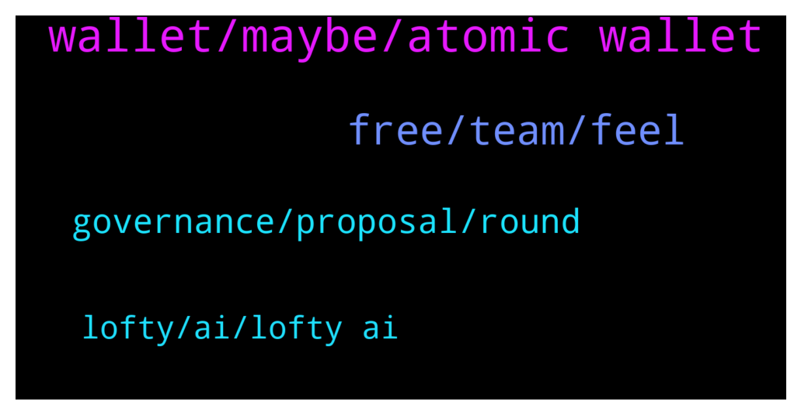

# **@algorand**
 ## Analysis for **2022-01-29** - **2022-01-30**.

---

## 📊 **Basic Stats**

**n_messages_sent**: 56

---

---

## 🔝 **Top keywords and related messages**

1. **wallet, maybe, atomic wallet**

    @Am --- *what do you mean please? because i'm planing to use it. and doesn't seem to support internal exchange to algorand* **--->** [TG Discussion](https://t.me/algorand/335948)

    @bloodeagglee --- *Hello, can u guys suggest me algo wallet?* **--->** [TG Discussion](https://t.me/algorand/335924)

    @marcooo_98 --- *Hi, at the moment I have my Algorand on Algorand wallet that give me 5%apy, there are platform that give a better return?* **--->** [TG Discussion](https://t.me/algorand/336025)

    @KAPIBAYSIDE --- *Any plans to update the official alogrand wallet to view nfts ?* **--->** [TG Discussion](https://t.me/algorand/335921)

    @MackDenver --- *The APY for staking has reduced a bit. Maybe you can use official Algorand wallet.* **--->** [TG Discussion](https://t.me/algorand/336002)

    @Brightmoon23 --- *Atomic wallet works great for staking. I received my staking reward* **--->** [TG Discussion](https://t.me/algorand/335965)

2. **free, team, feel**

    @NightAlgorand --- *You can drop me a Pm regarding that 🙂* **--->** [TG Discussion](https://t.me/algorand/335855)

    @Iamjamiefox --- *Hi all Does the Rand have a Telegram page ??   Appreciated* **--->** [TG Discussion](https://t.me/algorand/335847)

    @Noskilljustluck --- *Ok thank you very much. Have a great day everyone* **--->** [TG Discussion](https://t.me/algorand/336006)

    @Cryptodecko_thor --- *Hey there I'm from cryptodecko. com  I would like to invite your team to have a AMA session with our community who is the concerned person here?* **--->** [TG Discussion](https://t.me/algorand/335854)

    @NightAlgorand --- *We are currently focused on expanding our ecosystem, bringing more use cases, and onboard new projects 🙂 You can find more about us here https://algorand.foundation/ecosystem* **--->** [TG Discussion](https://t.me/algorand/335972)

    @MackDenver --- *Feel free to pm me if you have any questions* **--->** [TG Discussion](https://t.me/algorand/335914)

3. **governance, proposal, round**

    @SavoryMonkey --- *I wish the new governance proposal nailed down more of the basic details or at the least committed to the rules resulting from the proposal would be voted on rather than merely "discussed" with the community.* **--->** [TG Discussion](https://t.me/algorand/335917)

    @MackDenver --- *You can join the governance for extra APY.* **--->** [TG Discussion](https://t.me/algorand/336026)

    @fiskmen --- *I missed the Community Governance signup period unfortunately.. This is a long shot but is there any way to apply for period 2 anyways or do I have to wait for the next round?* **--->** [TG Discussion](https://t.me/algorand/336020)

    @yabris --- *Hey what was the final apy of period 1 governance vs the first list of eligible?* **--->** [TG Discussion](https://t.me/algorand/336018)

    @MackDenver --- *You will need to wait for the next round* **--->** [TG Discussion](https://t.me/algorand/336021)

    @MackDenver --- *Hello there, Governance 1 APY was about 16%.* **--->** [TG Discussion](https://t.me/algorand/336019)

4. **lofty, ai, lofty ai**

    @IAmWhoIam777 --- *thats the way from where algorand was taked contract* **--->** [TG Discussion](https://t.me/algorand/335908)

    @MackDenver --- *Happening on Algorand: Lofty AI shared that non-US investors can now receive daily property rental income directly to their Algorand wallets in ALGO & USDCa. Lofty AI has already tokenized $13M+ of real estate on Algorand. Learn more and check out the available properties: https://www.lofty.ai/deals* **--->** [TG Discussion](https://t.me/algorand/335992)

    @Mass_Hodler --- *Sean Lee is no longer with Algorand? https://www.linkedin.com/in/sean-lee-4b7a98* **--->** [TG Discussion](https://t.me/algorand/335856)

    @MackDenver --- *In Algorand, there is grant opportunities. Please take a look here: https://algorand.foundation/grants-program/the-algorand-foundation-values-community-engagement* **--->** [TG Discussion](https://t.me/algorand/336012)

    @Pablo_cast --- *Not related to algorand or not directly. You can't use on sites* **--->** [TG Discussion](https://t.me/algorand/335951)

    @gregcardo --- *You guys, what do we refer to ourselves, Algonauts?* **--->** [TG Discussion](https://t.me/algorand/335930)

