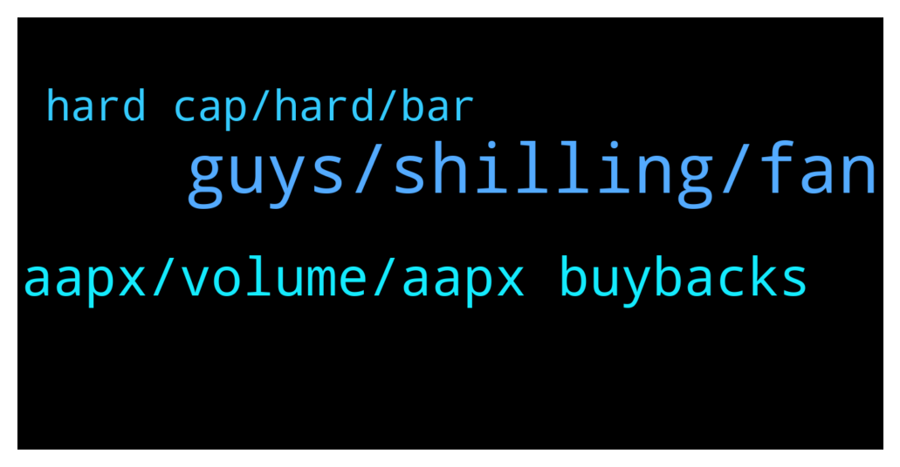

# **@ampnetapxchat**
 ## Analysis for **2022-01-25** - **2022-01-30**.

---

## 📊 **Basic Stats**

**n_messages_sent**: 58

---

---

## 🔝 **Top keywords and related messages**

1. **guys, shilling, fan**

    @North --- *I didn't mean you guys 😂 that's what we are here for. And frankly we will probably do it anyway unless you say the timing is unwise* **--->** [TG Discussion](https://t.me/ampnetapxchat/36781)

    @jakovtradingmentor --- *but the community, you guys, you can do so if you're motivated to* **--->** [TG Discussion](https://t.me/ampnetapxchat/36780)

    @North --- *Are we as the community allowed to talk about it here even or will posts be deleted? I had no idea it was even running yet, I thought you guys were still working on tokenomics and going to release more info* **--->** [TG Discussion](https://t.me/ampnetapxchat/36740)

    @North --- *@jakovtradingmentor what do you think about timing of any shilling to Chiliz community? They obviously have aligned interests and so would probably be interested here too, but we should take care to not get ahead of ourselves* **--->** [TG Discussion](https://t.me/ampnetapxchat/36775)

    @Braam --- *I see the Vatreni token is 80% funded. However it's only until the 2 feb.  Jakov please explain what happens if the 2nd comes and goes when the funding has reached $500000. And then conversely what happens if it does fulfill the total amount? Thanks* **--->** [TG Discussion](https://t.me/ampnetapxchat/36856)

    @Tinus_Tussengas_1984 --- *is there somewhere we can see the progress on the prudenzzafc fan token seed sale?* **--->** [TG Discussion](https://t.me/ampnetapxchat/36828)

2. **aapx, volume, aapx buybacks**

    @MelonHusk --- *Don't tell me Ampnet is raising more money?* **--->** [TG Discussion](https://t.me/ampnetapxchat/36814)

    @jakovtradingmentor --- *well i'm told we as ampnet cant really go around and shill the projects on our platform, something about the legality around it doesnt allow us to do so* **--->** [TG Discussion](https://t.me/ampnetapxchat/36779)

    @jakovtradingmentor --- *ofc if raise is successful, which seems like it is, a percentage of that raise is going to ampnet for aapx buybacks* **--->** [TG Discussion](https://t.me/ampnetapxchat/36817)

    @North --- *Fomo will increase as it gets towards  $500K. No way this doesn't get funded. Great news and hopefully we get some more details for AmpNet once we know it's going ahead* **--->** [TG Discussion](https://t.me/ampnetapxchat/36773)

    @matejmz --- *Yeah I expected more info. Also maybe give a recap what role AAPX has in this. What are the buybacks etc. There is hardly any community around AMPnet anymore, so we can't carry this and I guess most of the OGs don't want to shill anymore... Anyway it looks good that 40% was already sold.* **--->** [TG Discussion](https://t.me/ampnetapxchat/36743)

    @jakovtradingmentor --- *which is a project that's using the ampnet platform* **--->** [TG Discussion](https://t.me/ampnetapxchat/36816)

3. **hard cap, hard, bar**

    @mislavjavor --- *Hey all, the bar counts until hard cap is reached, the percentage until the hard cap i* **--->** [TG Discussion](https://t.me/ampnetapxchat/36808)

    @Tinus_Tussengas_1984 --- *thanks m8. that loading bar is looking strange btw... i assume its to see the progress in time to the deadline instead of the percentage of funding 😋* **--->** [TG Discussion](https://t.me/ampnetapxchat/36806)

    @mislavjavor --- *there should be a dot like this, where the soft cap is* **--->** [TG Discussion](https://t.me/ampnetapxchat/36812)

    @mislavjavor --- *there is a bug though, it seems* **--->** [TG Discussion](https://t.me/ampnetapxchat/36811)

    @<UNK> --- *It's a microcap yes, and with microcaps you need to accept certain things like huge price fluctuations, but it doesnt make this project a waste.* **--->** [TG Discussion](https://t.me/ampnetapxchat/36758)

    @mislavjavor --- *so the percentage can be 130%, 150%, etc...* **--->** [TG Discussion](https://t.me/ampnetapxchat/36810)

