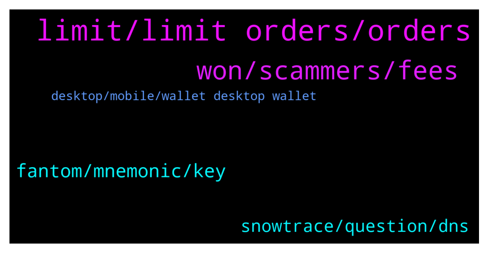

# **@avalancheavax**
 ## Analysis for **2022-01-29** - **2022-01-30**.

---

## 📊 **Basic Stats**

**n_messages_sent**: 142

---

---

## 🔝 **Top keywords and related messages**

1. **limit, limit orders, orders**

    @ravasude --- *Is there a way to get free AVAX for staking purpose? (Similar to Matic Vault)* **--->** [TG Discussion](https://t.me/avalancheavax/325370)

    @arcterex --- *Thanks.  I've followed Avalaunch, Avaxholic, AvxLaunchpad, Avalanche Today....any other ones for new projects?* **--->** [TG Discussion](https://t.me/avalancheavax/325385)

    @lclouis7 --- *i would like to start my own token on the avax blockchain i have unlimited time but no avax so if you donate i would be very appreciative if you did* **--->** [TG Discussion](https://t.me/avalancheavax/325367)

    @CypherBlock --- *25 avax might be smallest amount to delegate. To validate 2000* **--->** [TG Discussion](https://t.me/avalancheavax/325140)

    @CypherBlock --- *You can delegate avax using the wallet.avax.network website . You don't need a "place" like Binance or anything if you have your own wallet.* **--->** [TG Discussion](https://t.me/avalancheavax/325137)

    @CryptoPoly1 --- *Tried limit orders on 1 inch, but not one limit order got filled. Even though market price crossed limit price several times.  Any tips to modify slippage on limit orders?   Or order things that could help limit orders getting filled?* **--->** [TG Discussion](https://t.me/avalancheavax/325301)

2. **won, scammers, fees**

    @Amatio12 --- *from all direction the say we can solve the issue but all are scammers* **--->** [TG Discussion](https://t.me/avalancheavax/325101)

    @oathtobarbatos --- *Be careful with anyone's DM, guys* **--->** [TG Discussion](https://t.me/avalancheavax/325333)

    @Rugpull_Prevention --- *It's the native token to the WAGMI sub-network. Anyone can build on it just like with avalanche. I think it's more of a showcase of technology, a great way to do it and get attention as well.* **--->** [TG Discussion](https://t.me/avalancheavax/325275)

    @Nicolas_A --- *I don't use it myself so can't give you tips. Perhaps ask in 1inch channels* **--->** [TG Discussion](https://t.me/avalancheavax/325302)

    @Nicolas_A --- *Solana takes the approach of putting everything on 1 single high performance chain  Avalanche takes a more modular approach via subnets* **--->** [TG Discussion](https://t.me/avalancheavax/325464)

    @lovingcrypto_mytelegram --- *Guys what's the key difference between solana and avalanche* **--->** [TG Discussion](https://t.me/avalancheavax/325461)

3. **fantom, mnemonic, key**

    @Alp --- *I am really afraiding to ask question. Lots of scammers are calling me. I am not beginner. Just wondering that i can access to avax wallet with my Fantom mnemomic key. It is normal?* **--->** [TG Discussion](https://t.me/avalancheavax/325131)

    @Alp --- *If Fantom and Avax generate the same mnemomic keys what will happen? I can enter avax wallet with Fantom key. I can send Avax to this wallet. It is strange for me. Maybe somebody has the same wallet. I didnt generate it. Just restore it with Fantom key.* **--->** [TG Discussion](https://t.me/avalancheavax/325157)

    @Nicolas_A --- *You generated it when you used Fantom. The probability of someone generating the same key as you is close to 0* **--->** [TG Discussion](https://t.me/avalancheavax/325158)

    @CypherBlock --- *A mnemonic is just a bunch of words used to generate keys from. So yes you can in theory use a mnemonic from another blockchain as long as word list and number of words is compatible, but you won't see any funds there of course if you haven't used that mnemonic on that particular chain before. So Alp does that explain things?* **--->** [TG Discussion](https://t.me/avalancheavax/325149)

    @Alp --- *No funds at Avax wallet. Bu in the Fantom wallet there is 1 Fantom.* **--->** [TG Discussion](https://t.me/avalancheavax/325145)

    @Alp --- *I have Fantom mnemomic key. I have tried this key at the wallet.avax.network. and i can access.* **--->** [TG Discussion](https://t.me/avalancheavax/325142)

4. **snowtrace, question, dns**

    @CypherBlock --- *I heard there was maintanence earlier.* **--->** [TG Discussion](https://t.me/avalancheavax/325165)

    @BeIntrinsic --- *Nothing is wrong, I had a question* **--->** [TG Discussion](https://t.me/avalancheavax/325438)

    @Nicolas_A --- *There was a maintenance earlier today. There are probably still working on some stuff* **--->** [TG Discussion](https://t.me/avalancheavax/325153)

    @Escalicha --- *is snowtrace working for you guys?  Im getting this error ERR_SSL_VERSION_OR_CIPHER_MISMATCH* **--->** [TG Discussion](https://t.me/avalancheavax/325133)

    @Nicolas_A --- *It was under maintenance the DNS might take some time to propagate* **--->** [TG Discussion](https://t.me/avalancheavax/325123)

    @geekmidget --- *Maybe they have bots just waiting for the question mark* **--->** [TG Discussion](https://t.me/avalancheavax/325132)

5. **desktop, mobile, wallet desktop wallet**

    @vampyren --- *Yes i use that now but he mention a new wallet....* **--->** [TG Discussion](https://t.me/avalancheavax/325294)

    @Nicolas_A --- *Wallets being developed ? It's desktop, mobile and browser extension* **--->** [TG Discussion](https://t.me/avalancheavax/325292)

    @vampyren --- *I watch the latest video from Emin and he mention a wallet, is that a desktop wallet or what? anyone knows?* **--->** [TG Discussion](https://t.me/avalancheavax/325290)

    @Nicolas_A --- *Yes you can use the web wallet but there is no desktop wallet, mobile wallet or browser extension publicly available as they are still being worked on* **--->** [TG Discussion](https://t.me/avalancheavax/325295)

    @Nicolas_A --- *Right now you can use the web wallet wallet.avax.network* **--->** [TG Discussion](https://t.me/avalancheavax/325293)

    @MountainButWithK --- *When will we get a avalanche native mobile wallet?* **--->** [TG Discussion](https://t.me/avalancheavax/325096)

