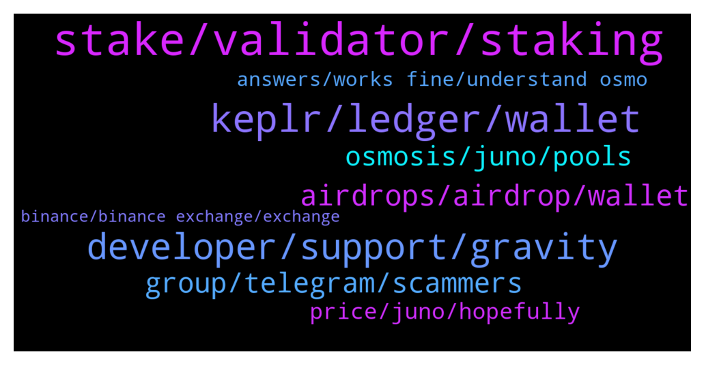

# **@cosmosproject**
 ## Analysis for **2022-01-29** - **2022-01-30**.

---

## 📊 **Basic Stats**

**n_messages_sent**: 220

---

---

## 🔝 **Top keywords and related messages**

1. **stake, validator, staking**

    @VLPLZ --- *👍 for me took about 30 mins.* **--->** [TG Discussion](https://t.me/cosmosproject/483400)

    @AtomJazz --- *There's actually liquid staking feature coming soon* **--->** [TG Discussion](https://t.me/cosmosproject/483431)

    @NikoDMT --- *Because it delivers suboptimal returns, because it centralizes voting power, because they don't actively take part in governance, because you're not custoding your own crypto in your own wallet.* **--->** [TG Discussion](https://t.me/cosmosproject/483530)

    @Ilpaliuz --- *So the advice when i want unbonding it's wrong: "Trying to switch validators? Use the ‘Redelegate’ feature to instantly stake your assets to another validator."* **--->** [TG Discussion](https://t.me/cosmosproject/483056)

    @AtomJazz --- *Yeah you can redelegate instantly but only once per 21 days.* **--->** [TG Discussion](https://t.me/cosmosproject/483057)

    @AtomJazz --- *Instant but you can only do it once before having to wait 21 days* **--->** [TG Discussion](https://t.me/cosmosproject/483456)

2. **keplr, ledger, wallet**

    @Vasko --- *Has anybody been experiencing problems with keplr. I cannot switch validators , been trying to do it for a couple of days but all transactions fail , even though the tx cost is take out of my balance* **--->** [TG Discussion](https://t.me/cosmosproject/483321)

    @AtomJazz --- *Use Keplr with your ledger device* **--->** [TG Discussion](https://t.me/cosmosproject/483544)

    @Fabien --- *hello anyone has any issue to get the rewards on ledgerlive? I have always the same message which fails (API HTTP 400)* **--->** [TG Discussion](https://t.me/cosmosproject/483543)

    @oldyouth1 --- *anyone seeing some delay transferring out of CB to Keplr ?* **--->** [TG Discussion](https://t.me/cosmosproject/483092)

    @LVpoker --- *I can stake on keplr though right?* **--->** [TG Discussion](https://t.me/cosmosproject/483271)

    @Cordtus --- *How one you say the keplr is not safe?* **--->** [TG Discussion](https://t.me/cosmosproject/483298)

3. **developer, support, gravity**

    @TalcHands --- *Using the wallet that is the dex it shows and I don't see a browser function* **--->** [TG Discussion](https://t.me/cosmosproject/482675)

    @oldangusred --- *Hi! I'd like to know if there's some insurance dapp on Cosmos, like Ethereum has Nexus Mutual and Etherisc. I'm writing and article about this and this information is hard to get on Google, etc. Thank you!* **--->** [TG Discussion](https://t.me/cosmosproject/483034)

    @TicoJohnny --- *You can use the Gravity Dex through Emeris or use Osmosis on their website. There's also Junoswap but you will need a Keplr wallet to access these. You can import your Cosmostation mnemonic into Keplr to easily access your funds on the browser.  https://junoswap.com/ https://app.osmosis.zone https://app.emeris.com* **--->** [TG Discussion](https://t.me/cosmosproject/482679)

    @Believehero --- *Is there a way already live to send eth into cosmos ?* **--->** [TG Discussion](https://t.me/cosmosproject/482686)

    @Butra1 --- *Hi, will there be a bridge between polygon and cosmos?* **--->** [TG Discussion](https://t.me/cosmosproject/483104)

    @ZoltanAtom --- *Please check it pinned message and there is stats and Cosmos explorers links.* **--->** [TG Discussion](https://t.me/cosmosproject/482909)

4. **airdrops, airdrop, wallet**

    @Sof_vet --- *Hi i have a qst Some of airdrops are elegible if you hild atom. Where to hold atom . I have 500 atom ..should i hold it in some wallet or what* **--->** [TG Discussion](https://t.me/cosmosproject/483118)

    @TicoJohnny --- *Stake ATOM on non custodial wallet like Keplr or Cosmostation, links are in the pinned post and you can ask more question about airdrops here: https://t.me/CosmosAirdrops* **--->** [TG Discussion](https://t.me/cosmosproject/483146)

    @karolmaciej --- *When i claim sth from airdrop, is there any case that i will give someone access to my wallet by mistake ? Or claiming airrop is safe?* **--->** [TG Discussion](https://t.me/cosmosproject/482925)

    @LVpoker --- *Hi guys What’s the best wallet for staking to receive airdrops also?* **--->** [TG Discussion](https://t.me/cosmosproject/483259)

    @zstupar33 --- *SHD Airdrop date announced guys! https://twitter.com/Shade_Protocol/status/1487078262983565319?s=20&t=3ilE98De2XHSVSoUanKb8w* **--->** [TG Discussion](https://t.me/cosmosproject/482729)

    @IVAN_GIL --- *I Heard we can take airdrops by staking ATOM... How It works?* **--->** [TG Discussion](https://t.me/cosmosproject/483136)

5. **group, telegram, scammers**

    @Wes --- *Is there a spam telegram group out there? I got a second ATOM group n my inbox now lol* **--->** [TG Discussion](https://t.me/cosmosproject/483401)

    @G --- *Also, have been spammed 4 times since joining this group this morning.  WTF.  I even got spammed by someone using this pages title as their telegram handle asking about some cosmos rewards or something. That's another reason why telegram is such shit.  And will be leaving this group because of the level of dirtbag scammers with shitty grammar always trying to con people disguised as admins.  Cowardly shitbags who are incapable of taking property directly from people's hands because they know what the results would be.  This group is infested with them.* **--->** [TG Discussion](https://t.me/cosmosproject/482861)

    @mahyarblue --- *I've already asked another question there 😂 which reminds unanswered* **--->** [TG Discussion](https://t.me/cosmosproject/482790)

    @AtomJazz --- *You'll get a better answer to this on Discord https://discord.gg/vcExX9T* **--->** [TG Discussion](https://t.me/cosmosproject/482718)

    @JasonOfArgonaut --- *For every channel there is at least 1 fake.* **--->** [TG Discussion](https://t.me/cosmosproject/483407)

    @mahyarblue --- *I'm not sure that they have a Telegram group  Neither seen nor heard of it* **--->** [TG Discussion](https://t.me/cosmosproject/482802)

6. **osmosis, juno, pools**

    @mahyarblue --- *I read it before. It doesn't say which osmosis pools are included* **--->** [TG Discussion](https://t.me/cosmosproject/482797)

    @mahyarblue --- *Does anybody know whether Raw airdrop is going to be given to liquidity providers of all Osmosis pools or only Juno pools? 🤔🤔🤔* **--->** [TG Discussion](https://t.me/cosmosproject/482782)

    @TalcHands --- *I'm using cosmostation on mobile and don't have access to a computer.  Can osmosis be accessed this way?* **--->** [TG Discussion](https://t.me/cosmosproject/482682)

    @AtomJazz --- *For Osmosis questions pls join https://t.me/osmosis_chat* **--->** [TG Discussion](https://t.me/cosmosproject/482670)

    @ggwashinton1 --- *Also provide liquidity on osmosis or JunoSwap* **--->** [TG Discussion](https://t.me/cosmosproject/483222)

    @AtomJazz --- *Sifchain for now. Osmosis is preparing infrastructure to connect to Gravity bridge as well* **--->** [TG Discussion](https://t.me/cosmosproject/482687)

7. **price, juno, hopefully**

    @Atomgazua --- *Any problem with atom? Fuxk price* **--->** [TG Discussion](https://t.me/cosmosproject/483476)

    @Jr --- *Is it a good time to buy* **--->** [TG Discussion](https://t.me/cosmosproject/483409)

    @JasonOfArgonaut --- *Atom? Always. But yeah price is better now than two weeks ago* **--->** [TG Discussion](https://t.me/cosmosproject/483411)

    @hsnhsy3 --- *do you have a negative situation about atom* **--->** [TG Discussion](https://t.me/cosmosproject/483159)

    @KingC0sm0s --- *$ATOM IS the real top 10 killer! Getta the hell outa here!* **--->** [TG Discussion](https://t.me/cosmosproject/482922)

    @DefNotSolrac --- *When Atom top 5 by market cap* **--->** [TG Discussion](https://t.me/cosmosproject/483520)

8. **answers, works fine, understand osmo**

    @Jonathan --- *Wanted to make sure, sorry about that* **--->** [TG Discussion](https://t.me/cosmosproject/483518)

    @TicoJohnny --- *Yes there seems to be an issue* **--->** [TG Discussion](https://t.me/cosmosproject/483109)

    @Sardon70 --- *Ok, thank for your kindness and precision in the answers 😊* **--->** [TG Discussion](https://t.me/cosmosproject/483448)

    @AtomJazz --- *I don't have any problems personally. All works fine. If you're having issues you should contact Chainapsis team https://keplr.crunch.help/* **--->** [TG Discussion](https://t.me/cosmosproject/483323)

    @Fabien --- *u were right, it as worked well! gracias ;)* **--->** [TG Discussion](https://t.me/cosmosproject/483555)

    @Ilpaliuz --- *Ah ok, Thanks for the help* **--->** [TG Discussion](https://t.me/cosmosproject/483059)

9. **binance, binance exchange, exchange**

    @AtomJazz --- *What won't work? You can withdraw native ATOMs from Binance exchange* **--->** [TG Discussion](https://t.me/cosmosproject/483423)

    @bmx777 --- *Why does everyone say that the binance validator is not desirable?* **--->** [TG Discussion](https://t.me/cosmosproject/483529)

    @Sardon70 --- *Very nice. Last but not least…I was choosing validator, is Binance the exchange platform?* **--->** [TG Discussion](https://t.me/cosmosproject/483440)

    @najmiddinov_nuriddin --- *How can I send ATOM from Binance?* **--->** [TG Discussion](https://t.me/cosmosproject/483413)

    @AtomJazz --- *Avoid Binance and other exchange validators to be eligible for airdrops. Binance are excluded* **--->** [TG Discussion](https://t.me/cosmosproject/483442)

