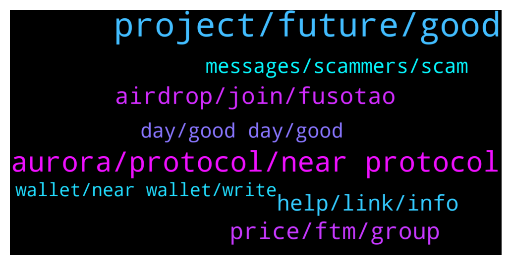

# **@cryptonear**
 ## Analysis for **2022-01-29** - **2022-01-30**.

---

## 📊 **Basic Stats**

**n_messages_sent**: 336

---

---

## 🔝 **Top keywords and related messages**

1. **project, future, good**

    @praveen9008 --- *That's a really amazing project. I'm so excited and happy to be participating in this project. I hope this project will gain more popularity in the future. ❤️🎉* **--->** [TG Discussion](https://t.me/cryptonear/315516)

    @demafx --- *There is a lot of info😅* **--->** [TG Discussion](https://t.me/cryptonear/313580)

    @Rkrishna123 --- *Please help me to give information regarding the projects* **--->** [TG Discussion](https://t.me/cryptonear/319460)

    @iamkemoo --- *Yes, it is a web3 project becoming fully decentralized* **--->** [TG Discussion](https://t.me/cryptonear/319039)

    @Crypsola --- *Thank you for making this great project and hopefully everyone can help to progress this project to achieve roadmap target* **--->** [TG Discussion](https://t.me/cryptonear/313680)

    @CLARORUM --- *Good project!!!   I wish development and success to the project !!!* **--->** [TG Discussion](https://t.me/cryptonear/318087)

2. **aurora, protocol, near protocol**

    @the1cheeto --- *Any ideas how to bridge from avax? Can’t seem to figure that out.* **--->** [TG Discussion](https://t.me/cryptonear/320138)

    @larry_lang --- *also this bridge seems to be the smoothest, but it works for stablecoin: https://synapseprotocol.com/* **--->** [TG Discussion](https://t.me/cryptonear/320144)

    @larry_lang --- *https://app.multichain.org/#/router i think multichain works as well along with allbridge that Vikash mentioned=))0* **--->** [TG Discussion](https://t.me/cryptonear/320143)

    @cuiking --- *One of the reason I prefer and love NEAR is because there will no hardware issue in future* **--->** [TG Discussion](https://t.me/cryptonear/319099)

    @Sergo_borod --- *Hello everyone, I'm looking for a team of programmers to create an NFT collection on NEAR* **--->** [TG Discussion](https://t.me/cryptonear/320903)

    @MadhusudanDeep --- *I have added the network from official website and trying to use rainbow bridge but I'm getting json rpc error.* **--->** [TG Discussion](https://t.me/cryptonear/320664)

3. **airdrop, join, fusotao**

    @cryptodance27 --- *how to we get notified about upcoming projects and airdrops* **--->** [TG Discussion](https://t.me/cryptonear/320451)

    @Sheriff --- *I was just asking about the airdrop you guys tweeted about the other day.* **--->** [TG Discussion](https://t.me/cryptonear/316069)

    @goldturn --- *Is there an airdrop that's going on?* **--->** [TG Discussion](https://t.me/cryptonear/320579)

    @larry_lang --- *^^ also keep in mind that we do not have airdrop bots or others airdrops that requires u to give out 12 seedphares^^ so pls double check with us when u see others events* **--->** [TG Discussion](https://t.me/cryptonear/321145)

    @afshinvatan --- *hi bro does your team have an Airdrop??* **--->** [TG Discussion](https://t.me/cryptonear/321469)

    @NearFritz --- *Seems a legit airdrop... And these could be bots ..* **--->** [TG Discussion](https://t.me/cryptonear/313902)

4. **price, ftm, group**

    @iamkemoo --- *Hey, for price discussion please go to the unofficial price chat: https://t.me/merchantsofnear* **--->** [TG Discussion](https://t.me/cryptonear/318950)

    @fc66800 --- *The crypto market has been really bad lately* **--->** [TG Discussion](https://t.me/cryptonear/314063)

    @Nick_Li101 --- *Those are simple to understand. But if I’m looking at this random one I found  https://explorer.mainnet.near.org/transactions/CvwJzk5oqNMc7nkNCnLjeRh4e23QdHzTNtBsndx97VBt   I see there’s a swap. But I have no idea what was swapped for what and what the rate was* **--->** [TG Discussion](https://t.me/cryptonear/314351)

    @Onemobo --- *I've just read a article on tomb and how it's causing price suppression for FTM. Is there anything to prevent something like this launching on near* **--->** [TG Discussion](https://t.me/cryptonear/314153)

    @Onemobo --- *Not a tokenomics questions. Basically there's a stable coin pegged to the price of ftm on ftm which is damaging FTM in the longer term. I was wondering if something like this  can happen on near also. If you like I can send over the article.* **--->** [TG Discussion](https://t.me/cryptonear/314175)

    @UNIC2020 --- *Are prices on different chains the same?* **--->** [TG Discussion](https://t.me/cryptonear/319382)

5. **help, link, info**

    @Xnba --- *I need some help from you my friends can you help* **--->** [TG Discussion](https://t.me/cryptonear/319083)

    @NearFritz --- *There is the link to the forum 🤟* **--->** [TG Discussion](https://t.me/cryptonear/313549)

    @cudam321 --- *dyor sounds like a good name for a fashion brand* **--->** [TG Discussion](https://t.me/cryptonear/321699)

    @behind_the_code --- *Can I contact you in private for assistance?* **--->** [TG Discussion](https://t.me/cryptonear/320978)

    @jerry --- *how to check profile link in twitter？* **--->** [TG Discussion](https://t.me/cryptonear/319081)

    @Dltac00 --- *yes, but it's for your posterity 😆😆* **--->** [TG Discussion](https://t.me/cryptonear/320284)

6. **messages, scammers, scam**

    @cuiking --- *I got scam. Any way to punish the scammer I have the scammer wallet address* **--->** [TG Discussion](https://t.me/cryptonear/319031)

    @Adnanstar43 --- *Can't understand this massege tell me it's scam or no simple says* **--->** [TG Discussion](https://t.me/cryptonear/318025)

    @cuiking --- *So how do people punish scammer?* **--->** [TG Discussion](https://t.me/cryptonear/319020)

    @Kripto_Raptor --- *⚠️⚠️Legit projects never do huge giveaways unless there is a big event like an AMA, a Hackaton, etc. and that giveaway would be symbolic. definitely nothing like deposit 100N get 200N ⚠️ ⚠️ Never share your Private keys, connect your wallet into suspicious sites* **--->** [TG Discussion](https://t.me/cryptonear/321476)

    @Saliec --- *Do i need to fill form twice ? First it didn't have a telegram task now it does* **--->** [TG Discussion](https://t.me/cryptonear/313092)

    @oppzsmoKe --- *People stop falling for the scams* **--->** [TG Discussion](https://t.me/cryptonear/314543)

7. **day, good day, good**

    @zenkert --- *We are just humans. I hope you got my point, positively.* **--->** [TG Discussion](https://t.me/cryptonear/313926)

    @NearFritz --- *Hey welcome, how are you ? share something about you with us please* **--->** [TG Discussion](https://t.me/cryptonear/313483)

    @Sam --- *Why do I always see Rose asking me to prove I’m human 🤣* **--->** [TG Discussion](https://t.me/cryptonear/318010)

    @kv9990 --- *Why "test" msg after joining group xD =))* **--->** [TG Discussion](https://t.me/cryptonear/320342)

    @buncat --- *hello brothers, have a nice day all..* **--->** [TG Discussion](https://t.me/cryptonear/316128)

    @Garz_026 --- *Good evening everyone,have a good day* **--->** [TG Discussion](https://t.me/cryptonear/321339)

