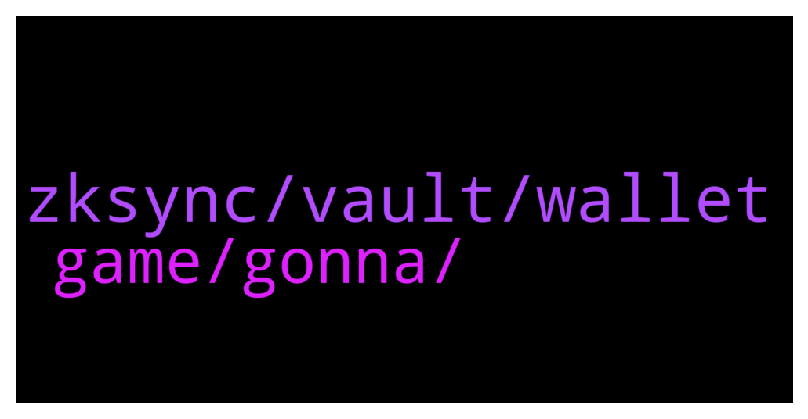

# **@de_fi**
 ## Analysis for **2022-01-29** - **2022-01-30**.

---

## 📊 **Basic Stats**

**n_messages_sent**: 28

---

---

## 🔝 **Top keywords and related messages**

1. **zksync, vault, wallet**

    @xnatasx --- *Will try a bit more later. Send you pic/recording...* **--->** [TG Discussion](https://t.me/de_fi/245289)

    @xnatasx --- *@blckwd or @itamarl   So I sent funds to a friend's brand new argent wallet. Zksync to zksync. But then when she wants to use the received eth, wallet says it's $90 to active!  Should that still be the case? We are inside of zksync section. Have I missed something?* **--->** [TG Discussion](https://t.me/de_fi/245277)

    @TonTons --- *Did anyone else here stake to get their Daxe airdrop?* **--->** [TG Discussion](https://t.me/de_fi/244941)

    @blckwd --- *If you DM me some screenshots or better a screen recording (if iOs it’s easy) – that will help me understand. Also can you confirm that the app was a new install, and what the version is? (Account switcher > Settings > scroll to bottom)* **--->** [TG Discussion](https://t.me/de_fi/245286)

    @blckwd --- *Ok so maybe she accidentally found her way into the Vault account? She may just need to tap the account switcher top left and switch to zkSync* **--->** [TG Discussion](https://t.me/de_fi/245283)

    @xnatasx --- *Sent a few dollars over to try. She never used a wallet before. But then when wanted to show, was asked to pay $90 to activate first...* **--->** [TG Discussion](https://t.me/de_fi/245282)

2. **game, gonna, **

    @irishka159 --- *r there any crypto experts? What do you think of MetaSoccer? Is there any sense in investing there? Their game features r good pumps for my assets.* **--->** [TG Discussion](https://t.me/de_fi/245233)

    @altstrom --- *Many projects out there told the same, but ya lets see* **--->** [TG Discussion](https://t.me/de_fi/245162)

    @altstrom --- *Is that gonna be next ETH killer? Lmao* **--->** [TG Discussion](https://t.me/de_fi/245161)

    @Adneycal --- *Bet y'all not too familiar with Radix, isnt it? It has big chance to be the next Layer 1 which gonna be massive IMO, can say it has unlimited potential growth since having better scalling solution and Scrypto is now live. Game changer is here!* **--->** [TG Discussion](https://t.me/de_fi/245160)

    @Deltasets --- *Hi, we think about it.  https://twitter.com/deltasets* **--->** [TG Discussion](https://t.me/de_fi/245186)

    @nittycrazy1 --- *But I don't know much about it* **--->** [TG Discussion](https://t.me/de_fi/245245)

