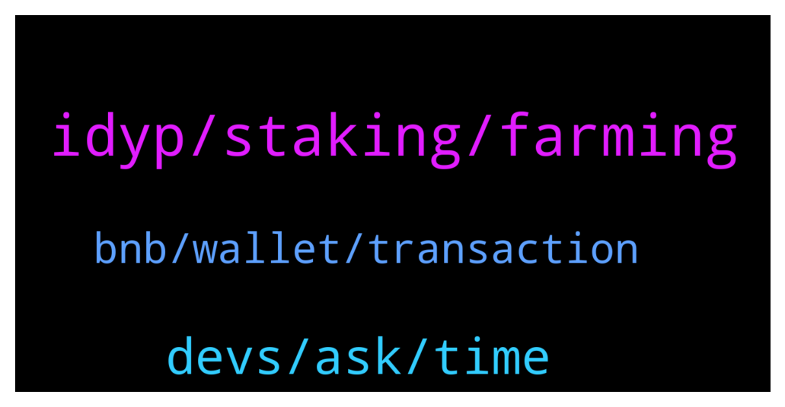

# **@dypfinance**
 ## Analysis for **2022-01-29** - **2022-01-30**.

---

## 📊 **Basic Stats**

**n_messages_sent**: 107

---

---

## 🔝 **Top keywords and related messages**

1. **idyp, staking, farming**

    @Abaddabi --- *Hi sir.. IDYP balance on eth network is empty.. please refill it sir.. because I cant withdrawal my idyp in eth network* **--->** [TG Discussion](https://t.me/dypfinance/243545)

    @Cimmy_revenger --- *Bridge iDYP BSC to Eth not working for withdraw , why sir  ? I have  a little problem* **--->** [TG Discussion](https://t.me/dypfinance/243506)

    @DhoniMSD516 --- *Hey iDYP is new token only few months of its launch and yes we have utility like farming, staking and Bridge for iDYP, moving forward there ill be more utilities for no Lending and Borrowing is confirmed which will come this year, more utilities will be available too, for launchpad DYP will be used* **--->** [TG Discussion](https://t.me/dypfinance/243601)

    @DhoniMSD516 --- *Hey iDYP is part of the new smart contracts strategies, you can find more info here and this is not bad :)  https://dypfinance.medium.com/the-new-contracts-and-idyp-token-snapshot-airdrop-and-community-allocation-760a2be599c* **--->** [TG Discussion](https://t.me/dypfinance/243391)

    @iamJubi --- *🔥Join Cats and Watches Society #NFTs Whitelist 🎉One Brand New Rolex Daytona Ceramic 116500LN worth $40k Giveaway  To win the watch: ✅Join dyp.finance/whitelist ✅Mint one #NFT once available ✅Like & Retweet this post ✅Join discord.gg/dypcaws ✅Tag 3 friends  👉https://twitter.com/dypfinance/status/1480623073208549380* **--->** [TG Discussion](https://t.me/dypfinance/243569)

    @DanielFraser --- *That's a lot of loss for a few hours staking. I was Just testing before I locked the amount up.* **--->** [TG Discussion](https://t.me/dypfinance/243631)

2. **devs, ask, time**

    @Cocopanji89 --- *Almost 20 hours waiting for it sir* **--->** [TG Discussion](https://t.me/dypfinance/243584)

    @Alejandrogonzalezespinosa --- *Do you have plan in the future create your blochain* **--->** [TG Discussion](https://t.me/dypfinance/243279)

    @hemanrock --- *hey, admins never DM first. please ask if you have Q regarding project or marketing.* **--->** [TG Discussion](https://t.me/dypfinance/243283)

    @Anthonydm76 --- *Whom I should contact for marketing proposal* **--->** [TG Discussion](https://t.me/dypfinance/243637)

    @Cj --- *alright! duly noted. thanks DoniMSD for your neverending support and patience* **--->** [TG Discussion](https://t.me/dypfinance/243624)

    @DhoniMSD516 --- *Ok I will ask our devs to recheck, but also if you can try on desktop and let me know how it goes* **--->** [TG Discussion](https://t.me/dypfinance/243372)

3. **bnb, wallet, transaction**

    @DhoniMSD516 --- *Ok I checked contract and I noticed that your friend transactions are failed with error insufficient amount, which mean there is no DYP to claim or reinvest but he is doing it so it is failing* **--->** [TG Discussion](https://t.me/dypfinance/243355)

    @DhoniMSD516 --- *Hey can you please dm me his wallet address so that I can check what error he got, or if you can please let me know his error* **--->** [TG Discussion](https://t.me/dypfinance/243347)

    @Nubarv --- *As far as i remember, his transaction was failing because it showed $0 bnb durring claim,   but in his wallet he does have bnb* **--->** [TG Discussion](https://t.me/dypfinance/243350)

    @Nubarv --- *I did clear cache, still did not work.  I do have bnb in my trust wallet so its not the funds.* **--->** [TG Discussion](https://t.me/dypfinance/243328)

    @iamJubi --- *Hello. Claiming and reinvesting works without any issue on our side using Trust wallet as we tried to do these transactions. Can you try again? And try to confirm the transaction even if it shows 0 BNB.* **--->** [TG Discussion](https://t.me/dypfinance/243345)

    @Nubarv --- *My friend attempted to complete the transaction twice, his bnb got deducted, but transaction failed* **--->** [TG Discussion](https://t.me/dypfinance/243346)

