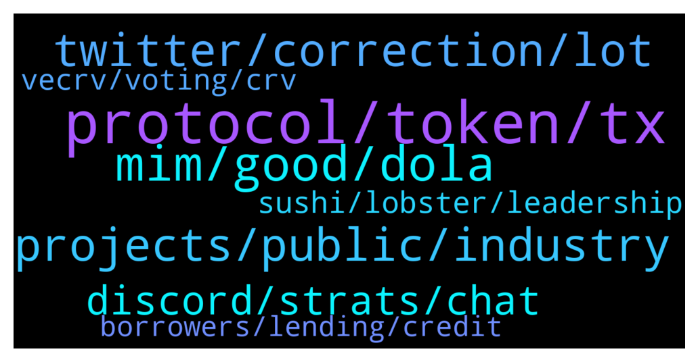

# **@lobsters_chat**
 ## Analysis for **2022-01-29** - **2022-01-30**.

---

## 📊 **Basic Stats**

**n_messages_sent**: 547

---

---

## 🔝 **Top keywords and related messages**

1. **protocol, token, tx**

    @ivangbi --- *1. these protocols are likely not getting much usage, the idea of them is silly to me 2. mgnr went for this mercenary trade, and the protocol had nothing else to do and approved it cause otherwise it wouldn’t be able to show usage and revenue 3. the protocol hoped TVL numbers would be fine for everyone to eat the narrative 4. bad washing was uncovered, showing people r not is using the protocol  -> now the question is, does anybody give a f  there is likely a level of insider bs for such approvals, can’t go without it? is that criminal?  i dunno what their kyc terms blabla are if they allow for re-entering* **--->** [TG Discussion](https://t.me/lobsters_chat/320676)

    @koeppelmann --- *5% to all GNO holders and 5% to all traders. Given that the protocol was previously 100% GNO tokens holder owned I think that is a decent deal for all sides.  Find full rules here: https://twitter.com/MEVprotection/status/1487140241102319622* **--->** [TG Discussion](https://t.me/lobsters_chat/320609)

    @ivangbi --- *They give a fkload to GNO holders and almost 0 to those who actually used the protocol* **--->** [TG Discussion](https://t.me/lobsters_chat/320605)

    @alexinlife --- *Its not necessarily a failure of the protocol or the system if they made a misjudement which produced data which can be relied on for future use.* **--->** [TG Discussion](https://t.me/lobsters_chat/320808)

    @ivangbi --- *This is dope if it works, can u make a test example for some protocol?* **--->** [TG Discussion](https://t.me/lobsters_chat/320941)

    @koeppelmann --- *https://twitter.com/MEVprotection/status/1487140243035799557 Slightly more trader than GNO holder but pretty similar numbers* **--->** [TG Discussion](https://t.me/lobsters_chat/320624)

2. **mim, good, dola**

    @tracksuitcat --- *Hey! I'm with a DAO that wants to move out of $MIM (1.3mm) but doesn't know - should we panic? What's the best route? We haven't done anything like this before 😰* **--->** [TG Discussion](https://t.me/lobsters_chat/320581)

    @Felix --- *Has the MIM drama created opportunity to farm MIM with super high APR at least?* **--->** [TG Discussion](https://t.me/lobsters_chat/321315)

    @nourharidy --- *So maybe MIM should respect the hard work of other projects if it expects us to do the same* **--->** [TG Discussion](https://t.me/lobsters_chat/321179)

    @ivangbi --- *@nourharidy MIM’s collaterals r safu, why would you think it’s rekt? The way I read it* **--->** [TG Discussion](https://t.me/lobsters_chat/321098)

    @nourharidy --- *The question is if MIM price and liquidity can both be restored without restoring demand* **--->** [TG Discussion](https://t.me/lobsters_chat/321147)

    @zeThrouzz --- *in case of a market crash, which always happen in crypto, there will be a huge demand to buy mim in order to do liquidation and get the underlying asset.* **--->** [TG Discussion](https://t.me/lobsters_chat/321174)

3. **twitter, correction, lot**

    @ivangbi --- *Isn’t that “bad” for contributors or did I misunderstand the lingo here* **--->** [TG Discussion](https://t.me/lobsters_chat/320590)

    @kindeagle --- *I enjoyed this twitter space sid from maple & index coop https://twitter.com/indexcoop/status/1486816981735153669?s=21* **--->** [TG Discussion](https://t.me/lobsters_chat/320934)

    @optional1t --- *Haha more like it's twitter folks farming attention* **--->** [TG Discussion](https://t.me/lobsters_chat/320574)

    @tesslerc --- *https://github.com/DanoshiFusermoto/cassandra  This is the network itself, front end stuff for hosting Twitter etc I think isn't in the git, not sure if it will be (need to ask Dan).* **--->** [TG Discussion](https://t.me/lobsters_chat/321044)

    @khanHamzah --- *https://forum.sushi.com/t/proposing-sushibancor-a-bancor-sushi-merger/6866/9  this is waht you meant i guess* **--->** [TG Discussion](https://t.me/lobsters_chat/321088)

    @ivangbi --- *I didn’t even see this here… I guess nobody every interacted w it even* **--->** [TG Discussion](https://t.me/lobsters_chat/320864)

4. **projects, public, industry**

    @yic_alex --- *Yeah. I am sure they put that money to some legal/regulatory use. Just weird to call it an education fund. Maybe one day we will learn the full story.  Hows the lobbying game for crypto going anyway? We ngmi without participating, all big industries do. We should allocate some of the crypto market cap for buying senators.* **--->** [TG Discussion](https://t.me/lobsters_chat/320946)

    @lesterenzo --- *a lot of people are rooting to take luna down though right now, like an organized campaing, very suspicious. or people just find it fun to cause chaos* **--->** [TG Discussion](https://t.me/lobsters_chat/320567)

    @lesterenzo --- *All this depegging etc. can be a government op. or not the goverment, but something with big pockets. a lot of projects can be attacked easily if you have enough cash (or a money printer). it's not bitcoin. stack up a lot of layers of fud at the same time and it would be easier to pass legislation stifling crypto.* **--->** [TG Discussion](https://t.me/lobsters_chat/320611)

    @John TG --- *https://bitcoinmagazine.com/.amp/markets/bill-introduced-to-make-bitcoin-a-legal-tender-in-arizona anybody know if this is legit?* **--->** [TG Discussion](https://t.me/lobsters_chat/320698)

    @midgetwhale --- *Thats pretty true. What are some notable projects that are truely decentralized in your opinion?* **--->** [TG Discussion](https://t.me/lobsters_chat/321280)

    @lesterenzo --- *If I was the government - I would destabilize all these crypto projects, stress test them. Smart thing to do. And not very expensive.* **--->** [TG Discussion](https://t.me/lobsters_chat/320622)

5. **discord, strats, chat**

    @defiahab --- *You can go look into the CREAM discord yourself* **--->** [TG Discussion](https://t.me/lobsters_chat/320749)

    @czaknun --- *I am happy to talk about that. I think this is a very educated community but I dont think ivan approves of such topics in his chat.* **--->** [TG Discussion](https://t.me/lobsters_chat/321275)

    @degengineer --- *The discord is pretty helpful https://discord.gg/nansen* **--->** [TG Discussion](https://t.me/lobsters_chat/320737)

    @DARYLLAUTK --- *but they can/will expand to more strats i guess just if you go w their discord u dont really see any strats being discussed* **--->** [TG Discussion](https://t.me/lobsters_chat/321306)

    @tracksuitcat --- *DM me if you a smart guy and I'll invite you to our team call on Discord* **--->** [TG Discussion](https://t.me/lobsters_chat/320582)

    @Sunny --- *I've been in this chat for months now and I still have no idea how tf to get one* **--->** [TG Discussion](https://t.me/lobsters_chat/320714)

6. **sushi, lobster, leadership**

    @Dave2Diamond --- *1) Because the tech with @bancor 3 doesn’t need a uni fork. Bancor is OG for AMM and no other group has put in the due diligence to fix AMM shortcomings - it’s not close.  2) the composability of B3 will unlock additional capabilities (phase 2 and 3) later this year and beyond that will be unmatched by existing forks. 2) the sushi front end, while nice, isn’t a strong reason on its own 3) all the deployments of the existing sushi solutions across chains will need to sunset and that will be a huge burden 4) there are no cultural synergies across leadership (even more so now) 5) the devs that have been victims (not the contributors) to the leadership saga at sushi would have no problem achieving a better long term outcome by choosing to be part of Bancor directly.  That’s my abbreviated list without full context and without all nuances accounted for.* **--->** [TG Discussion](https://t.me/lobsters_chat/321105)

    @Jecherio --- *i tought the only thing that made sushiswap special that it was still rewarding people with tokens.* **--->** [TG Discussion](https://t.me/lobsters_chat/321090)

    @<UNK> --- *You have experience in leading. How do you think Sushiswap could move forward and find some success?* **--->** [TG Discussion](https://t.me/lobsters_chat/321071)

    @ivangbi --- *Let’s say there is a good dev team, and there is interest in taking over. I don’t even know what to propose to the sushi community. What would you pivot it to?* **--->** [TG Discussion](https://t.me/lobsters_chat/321080)

    @ivangbi --- *Shall lobsters buy sushi? Idk wtf to do w it tho* **--->** [TG Discussion](https://t.me/lobsters_chat/321063)

    @tesslerc --- *Well the original point of sushi was to provide real value to the governance token. I'm still amazed UNI is holding up with no ROI and only "voting rights".* **--->** [TG Discussion](https://t.me/lobsters_chat/321084)

7. **vecrv, voting, crv**

    @godefi --- *Why are veCRV made non transferrable in curve? I know for voting you don't want people moving tokens to vote again, but that's normally solved by staking. Did this locking help grow the bribing system? I don't see why bribes can't be done given transferrable voting tokens also. How does Convex etc contract leverage veCRV tokens to vote on behalf of the briber?* **--->** [TG Discussion](https://t.me/lobsters_chat/321003)

    @godefi --- *Smart. And why is veCRV voting power made to fall in time, while no other veCRV benefits do?* **--->** [TG Discussion](https://t.me/lobsters_chat/321015)

    @nourharidy --- *And setting an A param this high for a stablecoin that has 0 tools for managing its peg in exchange for a vote bribe was a reckless and irresponsible move by veCRV voters* **--->** [TG Discussion](https://t.me/lobsters_chat/321162)

    @chase_arena --- *errr... ser, so that you always have to lock more CRV* **--->** [TG Discussion](https://t.me/lobsters_chat/321016)

    @van0k --- *Still to prevent attacks. Suppose that there is a large veCRV position that was locked for 4 years, but will unlock in just a few days. If voting power doesn’t decay, then an attacker can buy this position from the current owner to attack governance and quickly liquidate the CRV once it unlocks.  Computing voting power as CRV locked * time left until unlock neutralizes this vector.* **--->** [TG Discussion](https://t.me/lobsters_chat/321039)

    @kendrickllama555 --- *to prevent governance vector attack, like someone could buy a bunch of CRV, lock for veCRV, vote for malicious proposals then sell those transferable veCRV to secondary market* **--->** [TG Discussion](https://t.me/lobsters_chat/321011)

