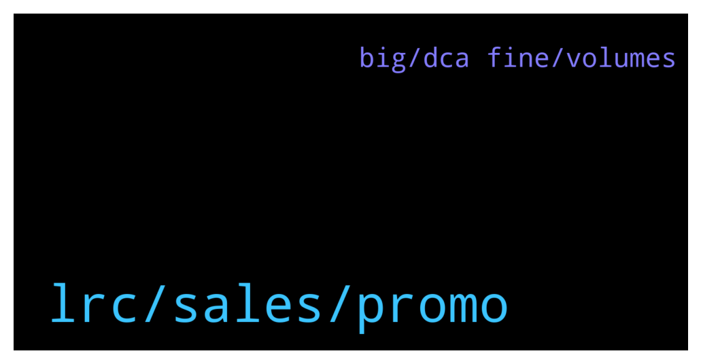

# **@loopringofficial_chat**
 ## Analysis for **2022-01-29** - **2022-01-30**.

---

## 📊 **Basic Stats**

**n_messages_sent**: 281

---

---

## 🔝 **Top keywords and related messages**

1. **lrc, sales, promo**

    @Beverly --- *It's a New Season Not giving up on Crypto just yet. Now is the time to BUY more Thank you LRC for the promo sales* **--->** [TG Discussion](https://t.me/loopringofficial_chat/28250)

    @etchenrobin05 --- *If there is the biggest lesson to learn from Crypto Investment, for me it would be patience* **--->** [TG Discussion](https://t.me/loopringofficial_chat/28627)

    @etchenrobin05 --- *Patience with BUYing Patience with HODLing Patience with SELLING* **--->** [TG Discussion](https://t.me/loopringofficial_chat/28628)

    @crypto_beast462 --- *Had I had more patience in the past, I'd be way better than I am now.* **--->** [TG Discussion](https://t.me/loopringofficial_chat/28751)

    @Cryptokid91 --- *This sub told me $50k was the bottom so I went *All* *in*.* **--->** [TG Discussion](https://t.me/loopringofficial_chat/28668)

    @adriel829 --- *Crypto is volatile and you normally see people making 1000%, 10000%  or even more in a particular project.* **--->** [TG Discussion](https://t.me/loopringofficial_chat/28640)

2. **big, dca fine, volumes**

    @sariabdul --- *I think this correction will have a larger window than May-Aug 21 crash. The current macro economic indicators are not favourable and crypto is just part of that.  Also the volumes are terribly low and until we see the volumes pick up, to either a big red candle, or a big green candle, it will be crabbing between $35k-$38k for a while.  So DCA now is fine. But don’t go all in.* **--->** [TG Discussion](https://t.me/loopringofficial_chat/28736)

    @Cryptokid91 --- *Patience with buying     This, this is my struggle. DCA is all fine and dandy, but then price goes down and ... yeah* **--->** [TG Discussion](https://t.me/loopringofficial_chat/28735)

    @yozhai06 --- *But it's a good idea to ALWAYS DCA out near the top.* **--->** [TG Discussion](https://t.me/loopringofficial_chat/28665)

    @jochill044 --- *It's better to just DCA when it dips* **--->** [TG Discussion](https://t.me/loopringofficial_chat/28536)

    @gramlyla --- *The best thing to do, in my opinion, is to DCA out just as you do in.  You can’t time the market, so don’t try to.* **--->** [TG Discussion](https://t.me/loopringofficial_chat/28309)

    @opsahl --- *Dca will never do you wrong* **--->** [TG Discussion](https://t.me/loopringofficial_chat/28539)

