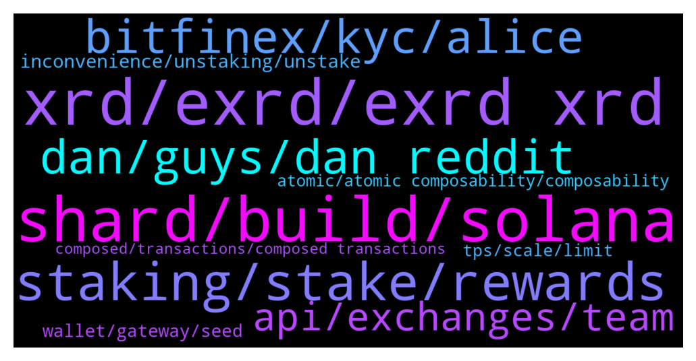

# **@radix_dlt**
 ## Analysis for **2022-01-29** - **2022-01-30**.

---

## 📊 **Basic Stats**

**n_messages_sent**: 530

---

---

## 🔝 **Top keywords and related messages**

1. **xrd, exrd, exrd xrd**

    @Shang En --- *It sounds like apart from flash loan it doesn’t have much more use in traditional trading… What I expect is we can use XRD to buy your daily life stuff, in internet, or hang around market and shopping with XRD. But I don’t know how far we are from now.  And thanks for the web3 answer.* **--->** [TG Discussion](https://t.me/radix_dlt/348364)

    @satoshixy --- *I have some e-XRD, what did you guys say is the best way to convert to XRD. Cannot use instapass* **--->** [TG Discussion](https://t.me/radix_dlt/347471)

    @isaaaaaaaaaaaac --- *Yes, both eXRD and XRD will follow the same price.* **--->** [TG Discussion](https://t.me/radix_dlt/348182)

    @Shang En --- *I just see the potential of XRD and want it to melt in our life* **--->** [TG Discussion](https://t.me/radix_dlt/348377)

    @peterkimkz --- *Lol no, it's a new crypto which is not get much adoption yet, and you expect they can use to buy groceries? Wait for maybe a decade and comeback when XRD become mainstream in Defi around the world, and you will see how much groceries it can buy :))* **--->** [TG Discussion](https://t.me/radix_dlt/348367)

    @Wolf Speakers --- *What about XRP, I hear people talking about that sometimes. Can't find it in the 'pedia* **--->** [TG Discussion](https://t.me/radix_dlt/347735)

2. **shard, build, solana**

    @Burns246 --- *Thanks all. Just one last question to pick your brains.  Solana adoption has exploded because its quite easy for developers to build on it. Whereas developers are struggling to build on Cardano due to its complexity. How does Radix compare? Will there be an EVM so that projects ob Ethereum can switch over to Radix easily?* **--->** [TG Discussion](https://t.me/radix_dlt/347898)

    @Ee09Vee --- *@danhughes I don’t know whether SBF is the right person to try to get attention from. He is too skin in the game with Solana and it’s entire ecosystem. Alameda Research is involved in almost each DeFi and each GameFi etc on Solana. And he is committed to making it work. And I would not be surprised he knows about Radix already but eludes any tweet about it.* **--->** [TG Discussion](https://t.me/radix_dlt/348412)

    @KUserM --- *Did someone hear about Devvio? How does Radix compete to it, what are the pros and cons? And what about another one: Aleph Zero? Thanks in advance!* **--->** [TG Discussion](https://t.me/radix_dlt/347725)

    @ttsg99 --- *My friend think radix is just a talk talk and marketing thing like ada. I want to look for the comparison btw radix and ada* **--->** [TG Discussion](https://t.me/radix_dlt/348160)

    @TaserFace6937 --- *This is a good read to explain why Radix is being built differently:  https://www.radixdlt.com/post/reducing-defi-hacks-exploits-failures-on-radix* **--->** [TG Discussion](https://t.me/radix_dlt/347907)

    @Jazzer9F --- *Excellent article from Coin Telegraph highlighting the current issues faced by Solidity developers, and detailing how Radix will give developers the power to build quickly, securely, and know that scale will never be a bottleneck!  https://cointelegraph.com/news/watch-out-solidity-new-project-aims-to-tackle-downsides-of-coding-defi-projects* **--->** [TG Discussion](https://t.me/radix_dlt/348173)

3. **staking, stake, rewards**

    @Krypto --- *Will we still get rewards while instaking* **--->** [TG Discussion](https://t.me/radix_dlt/347969)

    @fersarra --- *What is the current staking API? I am staking but since a while I have the same amount of tokens* **--->** [TG Discussion](https://t.me/radix_dlt/347415)

    @Bitbay --- *I was asked and told them that it is impossible to lose your original coins by staking. I mean you can lose stake by choosing a poor validator but not your original coins.   That was correct wasnt it?* **--->** [TG Discussion](https://t.me/radix_dlt/347799)

    @Radstakes --- *It's only future rewards that are currently at risk, just to be clear* **--->** [TG Discussion](https://t.me/radix_dlt/347819)

    @fpieper --- *I am not running the Ocinode, I am only running my own validator Florian Pieper Staking 😜.  You don't get additional bonus if you stake now on Ocinode because it is over 2% stake already. Though I am below and you get 25% bonus 😜  L G* **--->** [TG Discussion](https://t.me/radix_dlt/347794)

    @Krypto --- *Yes but for those who have massive amount staked....will we still receive rewards while instakimg* **--->** [TG Discussion](https://t.me/radix_dlt/347963)

4. **dan, guys, dan reddit**

    @TaserFace6937 --- *I commented on Dan's reddit post but got rejected for not having enough comment karma (21 points short).  Do I need to earn them or can someone award them to me, please?  https://www.reddit.com/u/RadixStake* **--->** [TG Discussion](https://t.me/radix_dlt/348123)

    @MDK192 --- *Defo mind blown 🤯 well done dan! 🔥🚀* **--->** [TG Discussion](https://t.me/radix_dlt/348047)

    @TaserFace6937 --- *Great job as always Dan!  🎉* **--->** [TG Discussion](https://t.me/radix_dlt/348050)

    @Tokyorider1611 --- *Better: Go to Dan‘s Reddit profile (link above), there you can see his posts in all different subreddits 😊* **--->** [TG Discussion](https://t.me/radix_dlt/348119)

    @Retikiti --- *You just tweeted and finished already. You are amazing Dan!* **--->** [TG Discussion](https://t.me/radix_dlt/348058)

    @Mik3ology --- *Thanks 🙏 Dan  My claim to fame.* **--->** [TG Discussion](https://t.me/radix_dlt/348057)

5. **bitfinex, kyc, alice**

    @nicolaiibrahim --- *hello  i am wondering why, in a permissionless network, i need KYC to get Access to the native token.  Bitfinex i need KYC and for Instabridge as well....* **--->** [TG Discussion](https://t.me/radix_dlt/347780)

    @Natethegreat762 --- *Do you need to kyc for bitfinex?* **--->** [TG Discussion](https://t.me/radix_dlt/348307)

    @Magal36 --- *If you are not a US citizen or any other excluded countries in Bitfinex than you can bridge without KYC, otherwise you have to use Instabridge that requires KYC.* **--->** [TG Discussion](https://t.me/radix_dlt/348298)

    @Magal36 --- *You can open it just with an email, no KYC* **--->** [TG Discussion](https://t.me/radix_dlt/348318)

    @Suitssss --- *Just did the transfer today from kucoin , fee was 80exrd , so go through bitfinex for sure of yoh want to stake* **--->** [TG Discussion](https://t.me/radix_dlt/348200)

    @Magal36 --- *If you're dealing small amounts you can risk using Bitfinex over a VPN, but they can freeze your funds if caught.* **--->** [TG Discussion](https://t.me/radix_dlt/348312)

6. **api, exchanges, team**

    @Ibmakzee --- *Hello. Whats the API update cos it seems as u claimed the cause of delay in Listings* **--->** [TG Discussion](https://t.me/radix_dlt/348002)

    @Byron --- *so if they updated the api exchanges are next right?* **--->** [TG Discussion](https://t.me/radix_dlt/348084)

    @BlAzAk --- *All my features which use message doesn't work anymore. Since the last API update. Is it a bug a do I have to adapt my code ?* **--->** [TG Discussion](https://t.me/radix_dlt/347257)

    @Magal36 --- *We can't give any ETA, but API is delivered and exchanges are in the works* **--->** [TG Discussion](https://t.me/radix_dlt/348007)

    @aus87 --- *exchanges likely also need to build according to the new api as well* **--->** [TG Discussion](https://t.me/radix_dlt/348006)

    @Radstakes --- *Soon, the team cannot give details until a few days before listings go live, but now that the API has been released by the team, this should facilitate more exchanges listing us* **--->** [TG Discussion](https://t.me/radix_dlt/347952)

7. **inconvenience, unstaking, unstake**

    @Blind5ight --- *Is the stake off the nodes at the moment of the unstaking tx? @Magal36  I thought not, which would mean, network is not less secure* **--->** [TG Discussion](https://t.me/radix_dlt/347968)

    @Shang En --- *Oh I see, never heard about it, my bad* **--->** [TG Discussion](https://t.me/radix_dlt/348403)

    @Krypto --- *Wow that is a massive inconvenience* **--->** [TG Discussion](https://t.me/radix_dlt/347961)

    @CaviarNine --- *The large unstake from 2 weeks ago has now been re-staked! https://twitter.com/CaviarNine/status/1487341053363761155* **--->** [TG Discussion](https://t.me/radix_dlt/347717)

    @danhughes --- *Hope the network has enough juice to stand up against all that traffic eeek* **--->** [TG Discussion](https://t.me/radix_dlt/348122)

    @Magal36 --- *It's off the node but since remains locked for the unstaking delay security isn't compromised* **--->** [TG Discussion](https://t.me/radix_dlt/347972)

8. **wallet, gateway, seed**

    @Magal36 --- *The security of the hardware wallet comes from the fact it's seed and private key have never been exposed with 100% certainty if it's a genuine device. The wallet has to generate address from that seed. If you import your software wallet into your hardware device you nullify the security of the hw wallet (the 100% certainty that private key has never been exposed)* **--->** [TG Discussion](https://t.me/radix_dlt/347966)

    @loveprotein00 --- *Radix wallet devs, should take a close look at Luna desktop wallet. prob 1 of the best looking and performing wallets ive tried in the last 5 years. the UI is great aswell* **--->** [TG Discussion](https://t.me/radix_dlt/347270)

    @Magal36 --- *Well, you now have the software wallet on two devices. Software wallets can be compromised if your device is compromised. You just doubled the chance on two devices. Read:. https://learn.radixdlt.com/article/using-a-crypto-software-wallet-securely* **--->** [TG Discussion](https://t.me/radix_dlt/347911)

    @Krypto --- *I don't use a hard ware wallet....why not advisable* **--->** [TG Discussion](https://t.me/radix_dlt/347906)

    @TaserFace6937 --- *I highly recommend a hardware wallet, for Radix specifically the Ledger Nano S.  I see it like 2 factor authentication for your Radix wallet and it costs only $59:  https://shop.ledger.com/products/ledger-nano-s    The problem with a software wallet is if someone were to gain access to your computer through malware, exploit, brute force, etc. with some work they could get your seed phrase.    With a hardware wallet even if someone were physically sitting in front of your computer they still could not get your seed phrase (private key) as it is securely stored offline in your hardware wallet.      Watch this video to learn more about the Ledger Nano S:  https://www.youtube.com/watch?v=53vN-VmFdi0&t=59s* **--->** [TG Discussion](https://t.me/radix_dlt/347927)

    @Jazzer9F --- *Radix Desktop Wallet v1.3 has been released!  Get the latest at https://wallet.radixdlt.com/ - or accept the automatic update if you're on the latest v1.2.6.  This is an important update that we strongly recommend everyone take. Details below.  This release is mostly about migrating to the new API and Gateway service under the hood. That's important because once everyone has moved to this version, we will be able to obsolete our old Archive nodes that were severely limiting our ability to scale to peak demand, causing periodic problems with not being able to connect. Use of the Gateway service also resolves some spotty issues a few people were having with balances being shown incorrectly or inconsistently.  Features: * Seed phrases can now be 12, 18, or 24 words. For the more security-conscious, you may wish to create a new wallet using a longer seed phrase. (It is not possible to upgrade an existing address to one using a different seed phrase.)  * You can now hide tokens you aren't interested in. These tokens will no longer appear on your balances screen and shall upset you no further. If you change your mind, you can unhide a token in the wallet's settings.  * A warning is now presented whenever sending or staking of XRD would drop your balance below 10 XRD. This is to help prevent the "oops" situation of not having sufficient XRD to pay for further transactions.  Fixes: * Error messages are much improved overall. This is a direct consequence of the new API and hopefully should provide a more clear idea why a transaction wasn't possible.  * When connecting to a custom Gateway node, the wallet now offers a clear warning that you must trust the Gateway to not present you with bogus transactions. This is a very important bit of information that we communicated socially when we first added custom archive node capability to the wallet, but we overlooked adding a clear warning in the wallet itself. Thanks to community member @devmannic  for pointing out the lack of this warning message.  * More information about staking and unstaking status is shown in your list of validators. In particular, we now show "pending stake" for stake that is awaiting the end of the epoch to take effect - and thus cannot yet be requested to be unstaked.  * A validator that is not currently in the top-100 now presents a visible warning, indicating that it is not currently producing emissions XRD for you.  * Password fields now show if you're typing a password with caps lock set.  * Improved handling when a hardware wallet is disconnected during usage.  * Wallet now remembers the last account that you had selected when you last quit.* **--->** [TG Discussion](https://t.me/radix_dlt/347924)

9. **tps, scale, limit**

    @Burns246 --- *Thanks Austin, this is useful. Are there any blockchains that claims to scale to infinitly when fully released* **--->** [TG Discussion](https://t.me/radix_dlt/347880)

    @aus87 --- *right, but infinite scalability at the cost of what?  I am not satisfied with that cost in general for the other projects I have seen* **--->** [TG Discussion](https://t.me/radix_dlt/347885)

    @Burns246 --- *This is interesting. In the future we will need 1m+ plus TPS to handle so any blockchain that can start scaling now will destroy the competition. Imagine when blockchain gaming really kicks off* **--->** [TG Discussion](https://t.me/radix_dlt/347884)

    @mx471 --- *Mathematically proven and practically demonstrated with Cassandra. Not on a large "real world" scale, but sufficiently decentralized. And with unoptimized code (and yet it's going pretty well). Xi'an will become the production-ready version.* **--->** [TG Discussion](https://t.me/radix_dlt/348387)

    @aj4269 --- *And eth or any other L1 have no solution or roadmap on how to scale without breaking composability.* **--->** [TG Discussion](https://t.me/radix_dlt/348214)

    @aus87 --- *you also need to look at what requirements there are for these other platforms are claiming about tps.  Solana just for example, will require basically super computer nodes in the not so distant future to keep up with their speed which will end up contributing to less nodes and more centralization* **--->** [TG Discussion](https://t.me/radix_dlt/347882)

10. **atomic, atomic composability, composability**

    @aj4269 --- *Atomic composability allows defi to function in its current form like uniswap aave all of them work seamlessly because they all are on eth L1. By sharding or use of layer 2s, this cross application communication breaks and hence most of the defi won't function.* **--->** [TG Discussion](https://t.me/radix_dlt/348212)

    @Shang En --- *So it’s the atomic composability makes XRD sharding good and when Xi’an launch it will be sharded. Seems like atomic composability is really important. Am I right? Or do I misunderstood?* **--->** [TG Discussion](https://t.me/radix_dlt/348270)

    @Magal36 --- *Many are claiming infinite scalability but none has atomic composability across the whole platform.* **--->** [TG Discussion](https://t.me/radix_dlt/347883)

    @Shang En --- *The composed one is relying on atomic composability? So the others didn’t use what XRD’s method will be a misery cause they can’t handle one transaction have one fail but they just let it go and have high risk to makes the whole system chaos?* **--->** [TG Discussion](https://t.me/radix_dlt/348289)

    @Magal36 --- *Sorry, I don't quite follow you.  What can happen in other chains which break atomic composability is that they introduce bottlenecks at cross shard composed transactions and possibly an additional error possibilities at those, and sometimes they do make devs work more complex.  In the end, it will take time for those bottlenecks in competitors to show and Radix scalability to shine as the solution.* **--->** [TG Discussion](https://t.me/radix_dlt/348290)

    @Shang En --- *So seems like atomic composability is really important* **--->** [TG Discussion](https://t.me/radix_dlt/348225)

