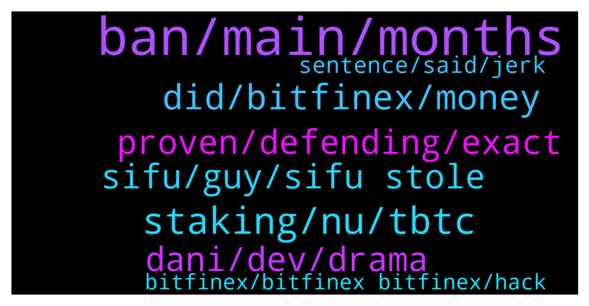

# **@shitpool**
 ## Analysis for **2022-01-29** - **2022-01-30**.

---

## 📊 **Basic Stats**

**n_messages_sent**: 319

---

---

## 🔝 **Top keywords and related messages**

1. **ban, main, months**

    @Karida663 --- *I wish your future, flowers bloom* **--->** [TG Discussion](https://t.me/shitpool/721285)

    @Horselorde --- *You’re still going on about this lmao* **--->** [TG Discussion](https://t.me/shitpool/721394)

    @da0man --- *we need a bot to ban anyone mentioning common scams like NWC, “X Inu”* **--->** [TG Discussion](https://t.me/shitpool/721321)

    @Horselorde --- *Too bad yours involves swallowing shit.* **--->** [TG Discussion](https://t.me/shitpool/721917)

    @trollkotze --- *so you would get banned for saying this* **--->** [TG Discussion](https://t.me/shitpool/721322)

    @pk12022 --- *Glad that you like it. 👍🚀🚀🚀* **--->** [TG Discussion](https://t.me/shitpool/721903)

2. **staking, nu, tbtc**

    @gr1mst0n1 --- *So I'll have to stake keep and Nu for the new T token?* **--->** [TG Discussion](https://t.me/shitpool/721765)

    @da0man --- *at the start T staking might need you to run a node (a bit complicated), but later on it will have coverage pools which is simply like clicking a button.* **--->** [TG Discussion](https://t.me/shitpool/721781)

    @da0man --- *KEEP staking will still work for a few weeks until tBTC 2.0 is released and tBTC 1.0 is depreciated* **--->** [TG Discussion](https://t.me/shitpool/721780)

    @da0man --- *for staking GUI goes live within a day* **--->** [TG Discussion](https://t.me/shitpool/721775)

    @da0man --- *KEEP staking is for tBTC. NU for running the nodes for proxy-reencryption. T staking is one token for both* **--->** [TG Discussion](https://t.me/shitpool/721755)

    @da0man --- *probably yes unless you think you can handle running a node and having a PC that never shuts down* **--->** [TG Discussion](https://t.me/shitpool/721787)

3. **did, bitfinex, money**

    @MoneroPal --- *Have you been living under a rock? Daniele is in person with this guy in Dubai. They collaborated on this project and dumped on investors from day 1. They did this by getting their 5% of free time as salary, per the whitepaper, wrapped it into wMEMO, then borrowed MIM against wMEMO on Abra, then dumped this into fiat via USDT. This was the “lick” the robbery, this allowed them to exit without moving price and maintaining that they too got liquidated when it did, but they received the token for free, the investors did not...  Daniele is linked to known Italian money launders, he has a company in Switzerland where the person was a director, the person was convicted and is serving prison time.   Sifu is a gigacriminal, the entire Wonderland, Abra, Popsicle team is non-doxxed outside of Dani and now Sifu, they’re all Bitfinex employees, 0xMerlin has been uncovered to be the CFO of Bitfinex* **--->** [TG Discussion](https://t.me/shitpool/721393)

    @onchainjoe --- *suspicious for armchair investigators, finex is just an exchange and sesta probably kyc'ed there nothing criminal afaik* **--->** [TG Discussion](https://t.me/shitpool/721604)

    @MoneroPal --- *Nothing is alleged, it’s proven. Dani is also proven to have been a director on a Swiss company for Zulu Republic his bogus KYC blockchain project from 2016 with a now convicted money launderer for the Italian mob. Futhermore, there is a lot of evidence that points to 0xMerlin being the CFO of Bitfinex. This is not proven, but it’s pretty plausible. The other details were all uncovered and proven with facts such as conversations with Dani, corporate records, and court cases. You sound like a frog sympathizer…* **--->** [TG Discussion](https://t.me/shitpool/721588)

    @MoneroPal --- *100% US prosecutors will go after Daniele and he will be extradicted from Dubai to New York to face crimianal charges for running an unregulated investment fund that targeted American Citizens and fradulently claimed it was managed by a financial professional with prior asset managmenet experience. Not to mention the connection to money laundering, Bitfinex, and faux investments such as Betswap to continue to maintain a positive image for the purpose of exit liquidity.* **--->** [TG Discussion](https://t.me/shitpool/721417)

    @onchainjoe --- *apparently sesta got scammed by dokwon* **--->** [TG Discussion](https://t.me/shitpool/721398)

    @wojackdegreate --- *They did indeed lie, but it was because they got fucked from a 3rd party that was handling their money (crypto capital)* **--->** [TG Discussion](https://t.me/shitpool/721572)

4. **proven, defending, exact**

    @MoneroPal --- *Not much is proven, but it’s speculative and believable* **--->** [TG Discussion](https://t.me/shitpool/721515)

    @ptsolorid --- *Strong amount proof then not much is proven. Your brain must be quite a gymnast.* **--->** [TG Discussion](https://t.me/shitpool/721711)

    @onchainjoe --- *nah, the merlin thing is too far fetched it really has to be regarded as coincidental until real proofs* **--->** [TG Discussion](https://t.me/shitpool/721589)

    @AsianFever --- *Is it time for the king to obliterate Filimena?* **--->** [TG Discussion](https://t.me/shitpool/721896)

    @onchainjoe --- *not defending anyone there but this merlin stuff is not serious* **--->** [TG Discussion](https://t.me/shitpool/721591)

    @ptsolorid --- *and then that shines through in teh exact same way you say things like," its not proven, but strong proof exists." or whatever exact poppycock you said before.* **--->** [TG Discussion](https://t.me/shitpool/721887)

5. **dani, dev, drama**

    @MoneroPal --- *Subtract Merlin, the rest is true, Dani is a total and outright fraud to the height degree...* **--->** [TG Discussion](https://t.me/shitpool/721592)

    @da0man --- *does Dani even dev? he is always tweeting drama* **--->** [TG Discussion](https://t.me/shitpool/721819)

    @hosermage --- *Dani is defi nerd but isn't a dev* **--->** [TG Discussion](https://t.me/shitpool/721825)

    @MoneroPal --- *Dani admitted sifu is Michael patryn* **--->** [TG Discussion](https://t.me/shitpool/721812)

    @pizza_dog --- *“Oh no Dani is going to step down”* **--->** [TG Discussion](https://t.me/shitpool/721642)

    @MoneroPal --- *There are many more behind the scenes, Dani is just a puppet, there was definitely massive criminality involved* **--->** [TG Discussion](https://t.me/shitpool/721504)

6. **sifu, guy, sifu stole**

    @wojackdegreate --- *Sifu is allegedly they guy from Canadian exchange quadra-whatever* **--->** [TG Discussion](https://t.me/shitpool/721585)

    @MoneroPal --- *No the clown is asking about if Sifu actually stole anything, motherfucker has been under a rock or some shit* **--->** [TG Discussion](https://t.me/shitpool/721396)

    @pizza_dog --- *The guy who reported sifu is a little sketch too. Still an anon who received a bunch of donations after breaking this news* **--->** [TG Discussion](https://t.me/shitpool/721808)

    @Horselorde --- *From what at I’ve gathered there hasn’t been any actual proof Sifu stole anything though* **--->** [TG Discussion](https://t.me/shitpool/721401)

    @pizza_dog --- *If sifu is even real and not like an alt account* **--->** [TG Discussion](https://t.me/shitpool/721811)

    @Bigjoeyf --- *What will be new sifu name now btw* **--->** [TG Discussion](https://t.me/shitpool/721629)

7. **sentence, said, jerk**

    @ptsolorid --- *and worse still you cite people of the same kind of flawed logic.* **--->** [TG Discussion](https://t.me/shitpool/721872)

    @ptsolorid --- *its deliberately written in ambiguous language* **--->** [TG Discussion](https://t.me/shitpool/721884)

    @ptsolorid --- *yeh reading comprehension is not your strong point. I said based upon the readers mood.* **--->** [TG Discussion](https://t.me/shitpool/721883)

    @ptsolorid --- *meaning you are blind to it.* **--->** [TG Discussion](https://t.me/shitpool/721873)

    @ptsolorid --- *this is what you just said and why you are demonstrating yourself to be quite frankly. an imbecile.* **--->** [TG Discussion](https://t.me/shitpool/721857)

    @MoneroPal --- *What did you just write dude, read it out loud, what are you saying? LOL* **--->** [TG Discussion](https://t.me/shitpool/721609)

