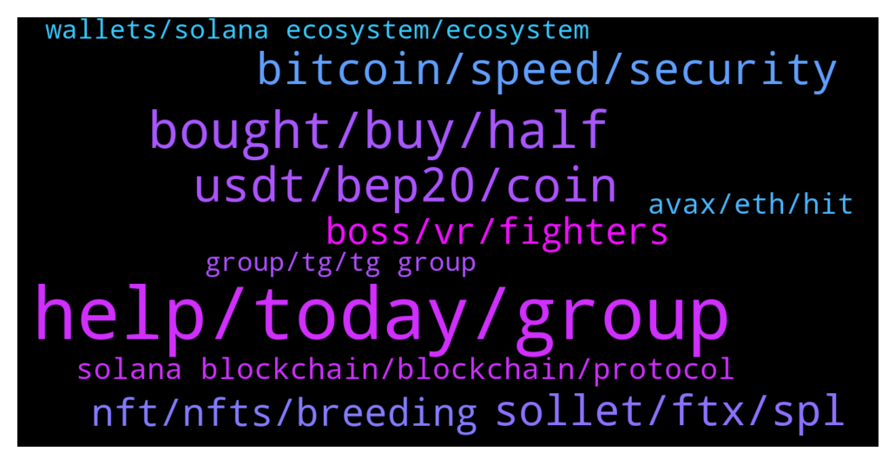

# **@solana**
 ## Analysis for **2022-01-29** - **2022-01-30**.

---

## 📊 **Basic Stats**

**n_messages_sent**: 292

---

---

## 🔝 **Top keywords and related messages**

1. **help, today, group**

    @lsaga --- *i don't even ask to you* **--->** [TG Discussion](https://t.me/solana/924263)

    @KingOfTheTown --- *what are you laughing at piece of shit 😡😡* **--->** [TG Discussion](https://t.me/solana/923396)

    @dumsthegreat --- *haha you have no idea how old i am. :)* **--->** [TG Discussion](https://t.me/solana/924262)

    @LemonPepper2 --- *Do not listen to any DMs you're about to get. They are ALL scammers* **--->** [TG Discussion](https://t.me/solana/924215)

    @o920nsoq --- *they said they are admins though?* **--->** [TG Discussion](https://t.me/solana/924218)

    @kaitye --- *Who can I contact, I made my friend join this group but as she was about to answer the security bot question... Her network lagged and now she can't access this Solana group chat, what should be done, who can I contact to unban her??* **--->** [TG Discussion](https://t.me/solana/924470)

2. **bought, buy, half**

    @pnzfox --- *Is it possible to see a $50 sol？* **--->** [TG Discussion](https://t.me/solana/922905)

    @pnzfox --- *i used have 30k sol，i sell at 20，40，120😹. I want buy them back in this bear market.* **--->** [TG Discussion](https://t.me/solana/922935)

    @clinto08 --- *I bought at $240 and you guys are crying* **--->** [TG Discussion](https://t.me/solana/923815)

    @Pisa --- *And you buying the 96$ dip??? 😂😂* **--->** [TG Discussion](https://t.me/solana/924281)

    @Elsa6688 --- *The market is up, so happy* **--->** [TG Discussion](https://t.me/solana/924210)

    @temirov_91 --- *hello guys. I bought sol at 260 ☹️* **--->** [TG Discussion](https://t.me/solana/923592)

3. **usdt, bep20, coin**

    @Alliwantishere --- *Could someone help? I want to get SOL on Kucoin (SOL/USDT pair) but new to using USDT.  My plan is to swap my Mcontent (Bep20) for USDT on PancakeSwap in Trustwallet, then send the USDT to Kucoin for the final exchange to SOL.  In this process do I need to worry about whether I'm using USDT ERC20 or USDT Bep20?  Thank you.* **--->** [TG Discussion](https://t.me/solana/923197)

    @Mustafa 🇧🇦 --- *Hi does anyone know how can i change token from BEP20 to ERC20?* **--->** [TG Discussion](https://t.me/solana/922887)

    @cryptolover1987 --- *Before send your bep-20 usdt , make sure your are copying bep-20 usdt deposit address from kucoin* **--->** [TG Discussion](https://t.me/solana/923249)

    @cryptolover1987 --- *I am talking about swap on kucoin with your usdt.* **--->** [TG Discussion](https://t.me/solana/923218)

    @Floris_9 --- *I tried but I receibe wormhole usdt. I dont receive correct usdt* **--->** [TG Discussion](https://t.me/solana/922972)

    @Mustafa 🇧🇦 --- *I buyed ETHM on Pancakeswap and get it on trust wallet with network bep20, but i use STEX exchange and they only accetp this coin on ERC20. I tryed on some bridges  ćto change network but this coin is not able on that bridges* **--->** [TG Discussion](https://t.me/solana/922899)

4. **bitcoin, speed, security**

    @jinYi_Liu --- *The crypto sphere amidst the economic turbulence has been skittish over the future prospects of the industry.* **--->** [TG Discussion](https://t.me/solana/923432)

    @Genesis_Solidity --- *If you're holding for 5 years, you're much better off with Bitcoin, having alts for long term plays is highly risky* **--->** [TG Discussion](https://t.me/solana/922923)

    @Tumull --- *That said, if things fall in place for the star altcoin, it could rise above Bitcoin, provided the ETH 2.0 arrives prior to Bitcoin’s spot ETF.* **--->** [TG Discussion](https://t.me/solana/923556)

    @pnzfox --- *To make the blockchain accessible to most people, it is worthwhile and necessary to sacrifice some decentralization* **--->** [TG Discussion](https://t.me/solana/922965)

    @cryptolover1987 --- *No doesn’t need to worry at all.* **--->** [TG Discussion](https://t.me/solana/923201)

    @Pisa --- *This is crypto. Kid making more money than adults 😂* **--->** [TG Discussion](https://t.me/solana/924260)

5. **sollet, ftx, spl**

    @Amir --- *I need 0.00001 sol for withdrawal  Who can help??* **--->** [TG Discussion](https://t.me/solana/922710)

    @Ogoochi --- *please how do I get my withdrawal ID and Txid from sollet. my withdrawal hasn't arrived* **--->** [TG Discussion](https://t.me/solana/923662)

    @o920nsoq --- *can someone help me with solana transaction* **--->** [TG Discussion](https://t.me/solana/923948)

    @magicunikorn --- *I sent sol to a metamask wallet using BSC, and I got some problems. Can I ask your help?* **--->** [TG Discussion](https://t.me/solana/924050)

    @mahib45 --- *Bridge guidance   ❇️ Option 1 : Sollet wallet  Sollet allows you to convert ERC20 to SPL and vice versa using your MetaMask Wallet.  You can deposit ERC20 tokens and convert them to SPL tokens using the convert function of Sollet.io and Metamask (to learn how to convert ERC20 to SPL.  🔗 https://www.sollet.io  How to use: https://solpadfinance.medium.com/convert-usdt-from-erc-20-blockchain-to-solana-blockchain-4871780493af  Telegram : https://t.me/ProjectSerum  ❇️ Option 2: FTX exchange  You can use FTX to deposit tokens (ERC20, XRP, BTC etc) and withdraw from FTX to Sollet.io. FTX will automatically wrap your crypto in an SPL token to be used with the Serum DEX. Please note that to convert wrapped SPL assets back into their native chain, you can deposit into FTX and withdraw the unwrapped assets.  🔗 https://ftx.com  Telegram: https://t.me/FTX_Official  ❇️ Option 3: Wormhole  🔗 www.wormholebridge.com  🔗 https://github.com/certusone/wormhole  Telegram: https://t.me/wormholecrypto  ❇️ Option 4: Allbridge  🔗 https://app.solbridge.io/bridge  Telegram: https://t.me/allbridge_official* **--->** [TG Discussion](https://t.me/solana/922931)

    @itsschad --- *how can i sell my solana for usd from my solflare wallet?* **--->** [TG Discussion](https://t.me/solana/924091)

6. **nft, nfts, breeding**

    @Dany014 --- *How does avalanche compare with solana* **--->** [TG Discussion](https://t.me/solana/924653)

    @CryptoTheDreamer --- *Is solana gonna fix the serious  issues it faced? To regain trust from millions investors* **--->** [TG Discussion](https://t.me/solana/923901)

    @cryptolover1987 --- *No but you can try other Solana nft marketplace  https://t.me/solana/895277* **--->** [TG Discussion](https://t.me/solana/923459)

    @Raam --- *Solana has a great potential in Nfts* **--->** [TG Discussion](https://t.me/solana/924308)

    @Pisa --- *Solana is a chain controled by VC's. People buying token at low price think they will make money but guess what VC's have so many token that it can go lower and still make money. While random people are exit liquidity 😂* **--->** [TG Discussion](https://t.me/solana/924273)

    @Rad --- *Solana is a overhyped piece of crap* **--->** [TG Discussion](https://t.me/solana/924232)

7. **boss, vr, fighters**

    @Cesssst --- *Boss Fighters is a VR  game on Solana. VR player as a Boss fighting against a team of PC players. You can check their page for wholesome information👌😉* **--->** [TG Discussion](https://t.me/solana/923284)

    @Cesssst --- *it is never seen before in Play to Earn games. Boss Fighter is  VR vs PC* **--->** [TG Discussion](https://t.me/solana/923272)

    @Carey --- *Hey there’s this p2e VR game that offers amazing NFTs 🤩* **--->** [TG Discussion](https://t.me/solana/924365)

    @pan --- *Boss fighters? it seems like  not familiar to me can you tell me more about it?* **--->** [TG Discussion](https://t.me/solana/923279)

    @Cesssst --- *There's still no exact schedule for the release of Boss Fighters since the project just started 😄* **--->** [TG Discussion](https://t.me/solana/923286)

    @Carey --- *Right? It’s called Boss Fighters btw :)* **--->** [TG Discussion](https://t.me/solana/924392)

8. **solana blockchain, blockchain, protocol**

    @Ramu V V --- *Hi I am techie guy ..but new to blockchain and   solana. Please guide me how to learn blockchain and solana* **--->** [TG Discussion](https://t.me/solana/924431)

    @mahib45 --- *Hello 👋 Always do your own research! Solana is a blockchain that anyone can build on!  The latest update can be found here  https://twitter.com/Solana_Mates* **--->** [TG Discussion](https://t.me/solana/924761)

    @mahib45 --- *Hello !!  Try this👇🏻👇🏻 Yield farming/ lending/borrowing platforms :  1️⃣ Oxygen  It is a DeFi Prime Brokerage Protocol built for the future to support 100s of millions of people. It can help you, as a holder of digital assets, generate liquidity, earn yield, borrow assets to go short, get trading leverage against portfolio of assets.   🔗https://www.oxygen.org/  2️⃣Solaris  It is a Lending/Borrowing protocol that brings Flashloans to Solana blockchain (inspired by Aave and Compound)  🔗https://solana.com/ecosystem/solaris  3️⃣ Orca  you can provide liquidity to a trading pool to earn trading fees.  🔗https://www.orca.so/pools  4️⃣ Raydium  🔗 https://raydium.io/farms/  5️⃣ Jet protocol  Jet Protocol is a borrowing and lending protocol built on the Solana blockchain.  🔗 https://www.jetprotocol.io  6️⃣ Solfarm SolFarm is the first yield aggregation platform built on Solana with auto-compounding vault strategies.  🔗 https://solfarm.io  7️⃣ Solend Soled is an algorithmic, decentralized protocol for lending and borrowing.   🔗 https://solend.fi* **--->** [TG Discussion](https://t.me/solana/922771)

    @lovingcrypto_mytelegram --- *Is $SYS part of the solana blockchain* **--->** [TG Discussion](https://t.me/solana/924735)

    @Rad --- *D in solana stands for decentralisation* **--->** [TG Discussion](https://t.me/solana/924250)

    @cryptolover1987 --- *Please click on pinned message to know everything about Solana blockchain…. We have attached all kind of materials there.* **--->** [TG Discussion](https://t.me/solana/924541)

9. **avax, eth, hit**

    @dumsthegreat --- *# of transactions in AVAX doesnt even come close to SOL ;)* **--->** [TG Discussion](https://t.me/solana/924251)

    @dumsthegreat --- *haha then why are you here? go transfer your SOL to AVAX. no one forbids you :D* **--->** [TG Discussion](https://t.me/solana/924245)

    @Pisa --- *Yeah Imagine when # of transaction get higher than Solana, the price of Avax will hit 1000$ while Solana already hit the peak* **--->** [TG Discussion](https://t.me/solana/924257)

    @Genesis_Solidity --- *I hope it does, it's slipping down the ranks fast, I'm 100% into SOL except for having 1 ETH, degen mistake but I believed in the project that's why, let's see how it goes* **--->** [TG Discussion](https://t.me/solana/922920)

    @Spacembu --- *Avax gas fees are no way different from ethereum,when many dapps are deployed on the network you will detest it* **--->** [TG Discussion](https://t.me/solana/924324)

    @Spacembu --- *Avax is no way near solana, sol is a beast, the little problem they have about booting in and off will be solved soon, eth had high gas fees with low scalability and still did great. Solana will rise to become the biggest project, fastest and cheapest.🚀🚀* **--->** [TG Discussion](https://t.me/solana/924316)

10. **group, tg, tg group**

    @H4n0nc0q --- *? Search for it on tg. This group here isn’t for Price talk* **--->** [TG Discussion](https://t.me/solana/923361)

    @Carey --- *No announcements regarding IDO yet, but I joined their TG group so that I’ll be notified about their upcoming events like their IDO. If you’re interested, you should join there too to be updated* **--->** [TG Discussion](https://t.me/solana/924394)

    @Satashi_Nakamata --- *Most likely wrooong place to ask* **--->** [TG Discussion](https://t.me/solana/924372)

    @pan --- *for now bud i don`t have enough idea . but you can join their TG for updates😉* **--->** [TG Discussion](https://t.me/solana/923293)

    @Monterrey_Rice --- *I would check on twitter for their community group* **--->** [TG Discussion](https://t.me/solana/922673)

    @Arianne ✨ --- *Ok thanks can I ask for the link?* **--->** [TG Discussion](https://t.me/solana/924395)

