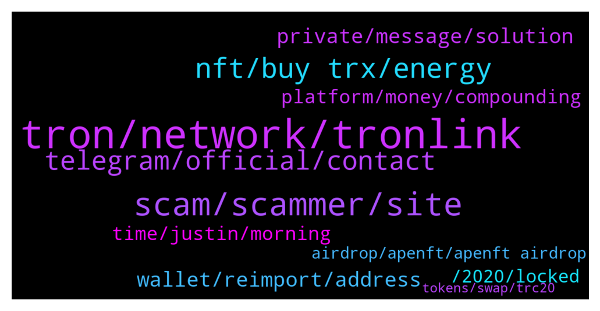

# **@tronnetworkEN**
 ## Analysis for **2022-01-29** - **2022-01-30**.

---

## 📊 **Basic Stats**

**n_messages_sent**: 277

---

---

## 🔝 **Top keywords and related messages**

1. **tron, network, tronlink**

    @geniuswithluck --- *Am I now finally real tron official group? I am tired of scam message about tron..* **--->** [TG Discussion](https://t.me/tronnetworkEN/3860601)

    @Anthony Udoka --- *I needed a loan from Tron how possible it is* **--->** [TG Discussion](https://t.me/tronnetworkEN/3859843)

    @richard_brandon --- *According to Tronwiki you are dedicated to decentralization of the internet. Why do you ban Nick Funtes and Baked Alaska from DLive?* **--->** [TG Discussion](https://t.me/tronnetworkEN/3861567)

    @Alina --- *Even the Cardano currency, which does not provide any real services, reminds its investors for a year and a half until now, that they have made huge profits, unlike a leading network such as the Tron network, this is very unfortunate and incomprehensible 😔* **--->** [TG Discussion](https://t.me/tronnetworkEN/3860479)

    @babak_niroomand --- *Cause their site accept only trons!* **--->** [TG Discussion](https://t.me/tronnetworkEN/3861030)

    @agentpiki --- *Many investors have blind eye on tron.  They do not know the strengths of what tron can provide.  As Justin Sun once said  "they don't have the balls to try tron blockchain"* **--->** [TG Discussion](https://t.me/tronnetworkEN/3860478)

2. **scam, scammer, site**

    @babak_niroomand --- *Dude just answer my question if you know the answer and If you don't, there's no need to call me scammer! I'm just asking!* **--->** [TG Discussion](https://t.me/tronnetworkEN/3861012)

    @davedine --- *Many scammer trying to advertise here* **--->** [TG Discussion](https://t.me/tronnetworkEN/3860987)

    @Jay --- *Buddy of mine was scammed from a shit hole in India, but they didn't know he was US Marine,...and was stationed out there. He is putting together a task force of some of his military buddies to show up and kick doors in pretty crazy* **--->** [TG Discussion](https://t.me/tronnetworkEN/3861300)

    @Alei1122 --- *Like if I buy 1000 he will add 50% of amount I will buy as promotions but I need to send money first* **--->** [TG Discussion](https://t.me/tronnetworkEN/3861048)

    @babak_niroomand --- *Some of my friends are risking on this in the past two months. And they have received profits til now!* **--->** [TG Discussion](https://t.me/tronnetworkEN/3860989)

    @ebrahim474 --- *Hello, it would be polite to say that this site is for your company. Right or wrong* **--->** [TG Discussion](https://t.me/tronnetworkEN/3860768)

3. **nft, buy trx, energy**

    @Abelrajuz --- *I was unaware of trx that time lol* **--->** [TG Discussion](https://t.me/tronnetworkEN/3859789)

    @Tumulamye --- *But they offer trx just trying to inquire please* **--->** [TG Discussion](https://t.me/tronnetworkEN/3862328)

    @MilNoslen --- *TRX itself doesn't need energy, only uses bandwidth* **--->** [TG Discussion](https://t.me/tronnetworkEN/3862142)

    @Vedat --- *don't trust this trx they are fake* **--->** [TG Discussion](https://t.me/tronnetworkEN/3861676)

    @baiduri95 --- *Why me can’t send my trx ? Notice : out of energy, please help admin* **--->** [TG Discussion](https://t.me/tronnetworkEN/3862141)

    @suPerJack0 --- *https://sunswap.com/#/home  Go to pool and remove liquidity of nft-trx* **--->** [TG Discussion](https://t.me/tronnetworkEN/3862874)

4. **telegram, official, contact**

    @Paiwandfuad --- *They do not have live chat* **--->** [TG Discussion](https://t.me/tronnetworkEN/3859631)

    @simon866 --- *You can also find more info in the official Justlend telegram here 👍  https://t.me/officialjustlend* **--->** [TG Discussion](https://t.me/tronnetworkEN/3859968)

    @agentpiki --- *You can disable it in your telegram settings bro* **--->** [TG Discussion](https://t.me/tronnetworkEN/3860977)

    @simon866 --- *Best to contact them on their official email or telegram, be careful as scammers will message you on telegram claiming to be support 👍* **--->** [TG Discussion](https://t.me/tronnetworkEN/3859619)

    @simon866 --- *You in the right telegram group??* **--->** [TG Discussion](https://t.me/tronnetworkEN/3862680)

    @simon866 --- *So head to gate.io telegram or contact them through official email but don't respond to anyone claiming to be their admin who messages you as they are scammers* **--->** [TG Discussion](https://t.me/tronnetworkEN/3859625)

5. **private, message, solution**

    @Paiwandfuad --- *Can you guide me at private?* **--->** [TG Discussion](https://t.me/tronnetworkEN/3859620)

    @Habeeb'llah --- *Have been receiving a lot of private messages telling me that they can help* **--->** [TG Discussion](https://t.me/tronnetworkEN/3859890)

    @davedine --- *Who invite me into some groups or message me by private , i will BLOCK and REPORT. GO !* **--->** [TG Discussion](https://t.me/tronnetworkEN/3860976)

    @simon866 --- *Talk here please to avoid impersonators in private chat* **--->** [TG Discussion](https://t.me/tronnetworkEN/3859790)

    @agentpiki --- *Sometimes, prevention is better than cure. Less stress* **--->** [TG Discussion](https://t.me/tronnetworkEN/3860983)

    @davedine --- *Yes. But i really need to report them 😅😅😅😅😅* **--->** [TG Discussion](https://t.me/tronnetworkEN/3860979)

6. **wallet, reimport, address**

    @Zer0log --- *How can i connect my wallet?* **--->** [TG Discussion](https://t.me/tronnetworkEN/3862548)

    @Alei1122 --- *In Trust wallet or any wallet?* **--->** [TG Discussion](https://t.me/tronnetworkEN/3860680)

    @Alei1122 --- *Can anyone lock our wallet via address?* **--->** [TG Discussion](https://t.me/tronnetworkEN/3860675)

    @MilNoslen --- *Stuck how? It's in your wallet* **--->** [TG Discussion](https://t.me/tronnetworkEN/3861973)

    @Alei1122 --- *He asked me the wallet address* **--->** [TG Discussion](https://t.me/tronnetworkEN/3860700)

    @Alei1122 --- *Sometime we just see the amount but can't withdraw it* **--->** [TG Discussion](https://t.me/tronnetworkEN/3861034)

7. **time, justin, morning**

    @SadrSadat --- *Whenever Mr. Justin Sun stops traveling and receiving gifts, he can move.* **--->** [TG Discussion](https://t.me/tronnetworkEN/3859991)

    @Alei1122 --- *This is my first time to meet this* **--->** [TG Discussion](https://t.me/tronnetworkEN/3861069)

    @Ealaings --- *Hello everyone  I'm  Rebecca from Belgium* **--->** [TG Discussion](https://t.me/tronnetworkEN/3859908)

    @Moneyversac --- *I have been hodling since 4 years as well haha* **--->** [TG Discussion](https://t.me/tronnetworkEN/3859797)

    @amiddy --- *Hello everyone hope you all had a wonderful time* **--->** [TG Discussion](https://t.me/tronnetworkEN/3859935)

    @YJump --- *Where do you live sir ?* **--->** [TG Discussion](https://t.me/tronnetworkEN/3861571)

8. **platform, money, compounding**

    @Nomi1043 --- *Is there any real platform where i just put my money and mine trx* **--->** [TG Discussion](https://t.me/tronnetworkEN/3860481)

    @simon866 --- *You can check the platform for the different types of crypto that can be used as there are many options* **--->** [TG Discussion](https://t.me/tronnetworkEN/3859966)

    @simon866 --- *You can gain a loan in various stable coins and other crypto by providing collateral on the official Justlend platform here 👍  https://justlend.org/#/home* **--->** [TG Discussion](https://t.me/tronnetworkEN/3859958)

    @<UNK> --- *I have 1000 trx where to invest best platform* **--->** [TG Discussion](https://t.me/tronnetworkEN/3861656)

    @davedine --- *I do trade. Sell stock when its high, buy crypto when its low, etc. Keep that in circle, combining commodities like xau, crude oil, cpo by margin,  stocks market,  currencies market, crypto and property market. Common there are LOT of instruments outhere. Do your math ! Compounding is exponential.* **--->** [TG Discussion](https://t.me/tronnetworkEN/3861438)

    @davedine --- *I am compounding $40 into more than  $500k on 3 years by combining stocks currencies xau and crypto offcourse. No need to try stupid scam investment like that LOL* **--->** [TG Discussion](https://t.me/tronnetworkEN/3860995)

9. **, 2020, locked**

    @PiterSpain --- *Suddenly is the same supply since January 2020 😅* **--->** [TG Discussion](https://t.me/tronnetworkEN/3861471)

    @agentpiki --- *Snapshot period 10th of every month.  Distribution prriod 11-15* **--->** [TG Discussion](https://t.me/tronnetworkEN/3862319)

    @Pablo_oss --- *Guys, why did the total supply of trx from 70b suddenly become 100b a in coinmarketcap?   Has the team released that locked 28b?* **--->** [TG Discussion](https://t.me/tronnetworkEN/3861450)

    @Pablo_oss --- *But they said 28b is locked and 72b is in circulation. Am I wrong mate?* **--->** [TG Discussion](https://t.me/tronnetworkEN/3861479)

    @PiterSpain --- *Locked until 1st of january, 2020.  There is 100B circulating supply since 2020.  Source: tronscan.org* **--->** [TG Discussion](https://t.me/tronnetworkEN/3861487)

    @ChulSooTVMain --- *so I wonder it is only deflationary or still Inflationary + deflationary system* **--->** [TG Discussion](https://t.me/tronnetworkEN/3860322)

10. **airdrop, apenft, apenft airdrop**

    @Vickiestiano --- *So the next airdrop is February 10 right* **--->** [TG Discussion](https://t.me/tronnetworkEN/3862375)

    @agentpiki --- *No. APENFT airdrop will continue once per month until June 2023* **--->** [TG Discussion](https://t.me/tronnetworkEN/3862337)

    @Vickiestiano --- *The link of the airdrop sir* **--->** [TG Discussion](https://t.me/tronnetworkEN/3862326)

    @agentpiki --- *https://apenftorg.medium.com/january-s-apenft-nft-airdrop-to-tron-token-holders-has-concluded-65179df94d7  This is the link of January airdrop* **--->** [TG Discussion](https://t.me/tronnetworkEN/3862330)

    @Vickiestiano --- *When next will the airdrop take place* **--->** [TG Discussion](https://t.me/tronnetworkEN/3862324)

    @agentpiki --- *Snapshot is 10th  Airdrop given on 11th until 15th* **--->** [TG Discussion](https://t.me/tronnetworkEN/3862376)

