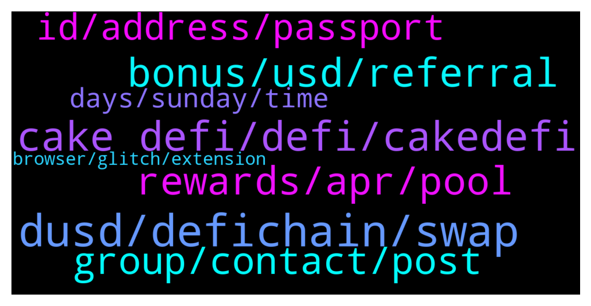

# **@CakeDeFi_EN**
 ## Analysis for **2022-01-30** - **2022-01-31**.

---

## 📊 **Basic Stats**

**n_messages_sent**: 232

---

---

## 🔝 **Top keywords and related messages**

1. **dusd, defichain, swap**

    @mm_phoenix --- *you can swap directly to cake dfi in dusd, because you thought you could buy it cheaper somewhere, it became inconvenient. ☹️* **--->** [TG Discussion](https://t.me/CakeDeFi_EN/170208)

    @Aimun_J --- *Hi. I am trying to deposit DUSD into my cake wallet however the wallet address is flagged as invalid. Can I not transfer DUSD from my MetaMask in order to liquidity mine?* **--->** [TG Discussion](https://t.me/CakeDeFi_EN/170190)

    @Kassius84 --- *The dUSD coin you need for the Cake DeFi and the DeFiChain is only available on Cake or DeFiChain DEX. I guess you bought another ERC20 token called DUSD which is not compatible with the DeFiChain.* **--->** [TG Discussion](https://t.me/CakeDeFi_EN/170195)

    @Aimun_J --- *I’m working with 6 figures and I can’t take a risk of swapping 1 stable coin for 0.9 of another just to have it reverse on me. I haven’t been able to find a clear explanation to why this is so* **--->** [TG Discussion](https://t.me/CakeDeFi_EN/170211)

    @Kassius84 --- *It depends on the price you bought for the "wrong" DUSD for.* **--->** [TG Discussion](https://t.me/CakeDeFi_EN/170203)

    @Aimun_J --- *What the hell…   I swapped it on curve finance* **--->** [TG Discussion](https://t.me/CakeDeFi_EN/170198)

2. **cake defi, defi, cakedefi**

    @emirrrrrrrrrrrrrrr --- *is ferhat official worker from CakeDefi* **--->** [TG Discussion](https://t.me/CakeDeFi_EN/170055)

    @DmgBautista --- *Honestly, I would only trust in the official partners that appear in the Cakedefi partners list when you try in the website or app. If any other existed, Cake would have made a statement on it. My bank never had any issue with Cake official partners, if your bank has made that statement, I would consider that an alert signal.* **--->** [TG Discussion](https://t.me/CakeDeFi_EN/169729)

    @d1788 --- *This CakeDefi app on AppStore are official ?* **--->** [TG Discussion](https://t.me/CakeDeFi_EN/169685)

    @DmgBautista --- *👉 Cake DeFi Safety Notice 👈  ❌ The Cake DeFi team will never ask you for your log-in details ❌ Never provide your log-in details to anyone (including your password or 2FA) ❌ Our team members will never DM you on Telegram  ✅ Send your support requests to: https://cake.zendesk.com/hc/en-us/requests/new ✅ Stay alert. Beware of phishing sites and scams. Store your log in information privately and securely.* **--->** [TG Discussion](https://t.me/CakeDeFi_EN/170038)

    @Kadir --- *İs there Cake Defi Tr Official ?* **--->** [TG Discussion](https://t.me/CakeDeFi_EN/170028)

    @Aimun_J --- *Let’s just say I used to love cake and DFI and recommend it to friends and family, now I’m just getting frustrated with how awkward it is* **--->** [TG Discussion](https://t.me/CakeDeFi_EN/170207)

3. **bonus, usd, referral**

    @imohitss --- *I have created acc on dec 11 can i deposit now to get bonus* **--->** [TG Discussion](https://t.me/CakeDeFi_EN/170086)

    @MehmetnuriDilek --- *hello I registered 6 months ago and won an award but still my rewards are locked* **--->** [TG Discussion](https://t.me/CakeDeFi_EN/170304)

    @gaytanmisael --- *So id just be freezing my rewards for a year and making more Because of less fees correct?* **--->** [TG Discussion](https://t.me/CakeDeFi_EN/170002)

    @gaytanmisael --- *But I would still be getting my daily rewards?* **--->** [TG Discussion](https://t.me/CakeDeFi_EN/170005)

    @gaytanmisael --- *So I'd be getting rewards from LM and from the freezer?* **--->** [TG Discussion](https://t.me/CakeDeFi_EN/170008)

    @Michael_Schredl --- *He maybe also got the sign up bonus* **--->** [TG Discussion](https://t.me/CakeDeFi_EN/170289)

4. **rewards, apr, pool**

    @Peter --- *thanks. assuming I own 1% of the total pool (USDC/DFI)  and pool size is  100million, and APR is 50%, this means that I will get 1% of the 50million rewards = 0.5mil.  I will get 0.25mil of  USDC, and 0.25mil worth of DFI. The number of DFI tokens I get, will depend on the market price of DFI at that time.* **--->** [TG Discussion](https://t.me/CakeDeFi_EN/170250)

    @Peter --- *thanks. are the rewards calculated based on number of DFI equivalent tokens initially when you joined the pool?  So the price fluctuations of DFI after you joined the pool, will not affect the quantity of DFI rewards you get.* **--->** [TG Discussion](https://t.me/CakeDeFi_EN/170241)

    @DmgBautista --- *Hi! No, the rewards you will get will be something like 99.9...% DFI. The rewards must be in the form of the blockchain token, therefore DFI, as the blockchain cannot generate other kind of token. Any residual percentage of the other coin in your LM pool pair that you may receive will be only due to the fee transactions on the DEX which are in part redistributed by the LM providers.* **--->** [TG Discussion](https://t.me/CakeDeFi_EN/170251)

    @Peter --- *Does the APR of 59.85% reduce by 1.658% every 11 days like the DefiChain?* **--->** [TG Discussion](https://t.me/CakeDeFi_EN/170236)

    @YyeapY --- *compounding to LM earns more (to gain more shares), or use those rewards swap d token to dfi and stake those rewards will earn more?* **--->** [TG Discussion](https://t.me/CakeDeFi_EN/169758)

    @Peter --- *assuming I own 1% of the total pool (USDC/DFI)  and pool size is  100million, and APR is 50%, this means that I will get 1% of the 50million rewards = 0.5mil in DFI,   the number of DFI I get will depend on the price of DFI at that time, when the reward is being credited?* **--->** [TG Discussion](https://t.me/CakeDeFi_EN/170255)

5. **group, contact, post**

    @DmgBautista --- *Hi! @ferhat_lorem_ipsum will DM you a one time message with the group channel immediatelly and only that. Stay safe 🙂 You can ask here after you check. He cannot post it here as he will get banned by the bot* **--->** [TG Discussion](https://t.me/CakeDeFi_EN/170052)

    @Robert --- *So who contact me? If u dont DM first?* **--->** [TG Discussion](https://t.me/CakeDeFi_EN/169719)

    @DmgBautista --- *Good morning Zachary! And thanks for answering to the user while I was in my rest time! Good answer! Best regards :)* **--->** [TG Discussion](https://t.me/CakeDeFi_EN/170125)

    @mm_phoenix --- *@robpark https://cakedefi.com/jobs/ if you are looking for a job :)* **--->** [TG Discussion](https://t.me/CakeDeFi_EN/170176)

    @DmgBautista --- *It's a firm no. Scammer 100%. Just look at the username that appears when you click in the name, and me here* **--->** [TG Discussion](https://t.me/CakeDeFi_EN/170036)

    @Michael_Schredl --- *Mods will never DM you first - make sure it isn't a fake account* **--->** [TG Discussion](https://t.me/CakeDeFi_EN/169721)

6. **id, address, passport**

    @papai699 --- *Thank you i have submitted a request as the adress proof was again rejected, the income tax return file is the last government adress proof available now.. And it is of year 2021-22* **--->** [TG Discussion](https://t.me/CakeDeFi_EN/169791)

    @mm_phoenix --- *then let change your address on your ID card 😇* **--->** [TG Discussion](https://t.me/CakeDeFi_EN/170160)

    @Michael_Schredl --- *Depends on the country you are in - if you only have the passport option you cannot use national ID* **--->** [TG Discussion](https://t.me/CakeDeFi_EN/169902)

    @mm_phoenix --- *It depends on which country you live in. In our country, they stick something over the address. it can be done in one day if you get an appointment. But actually the data on the ID card and your proof of address must match.😇* **--->** [TG Discussion](https://t.me/CakeDeFi_EN/170163)

    @kokdokuzyuzaltmisbir --- *Hello, I wrote my name wrong while registering. Can I change it?* **--->** [TG Discussion](https://t.me/CakeDeFi_EN/169710)

    @mosto1962 --- *Hello my friend set up an account on Cake Defi when trying to verify the account, there was a problem, namely his current address does not match the address in the ID card or is there any way to successfully verify the account? I will add that he has bills or account statements only with a new address* **--->** [TG Discussion](https://t.me/CakeDeFi_EN/170159)

7. **days, sunday, time**

    @TheRaskoln --- *Which days do we withdraw crypto* **--->** [TG Discussion](https://t.me/CakeDeFi_EN/169743)

    @<UNK> --- *Every single withdrawal delays at least 1-2 days. This is ridiculous* **--->** [TG Discussion](https://t.me/CakeDeFi_EN/169911)

    @mm_phoenix --- *for me it is from monday to sunday, but you should see in the mail the timeframe :)* **--->** [TG Discussion](https://t.me/CakeDeFi_EN/169841)

    @Andre --- *Can someone please answer this: The time frame for the weekly cash flow report is from Sunday to Saturday, correct?* **--->** [TG Discussion](https://t.me/CakeDeFi_EN/169840)

    @BerndMack --- *Please check out the link to the FAQ and the withdrawal times, 🙏* **--->** [TG Discussion](https://t.me/CakeDeFi_EN/169915)

    @johnMurpy --- *Sir I sent DASH it but waiting 20 minutes pending ?* **--->** [TG Discussion](https://t.me/CakeDeFi_EN/169981)

