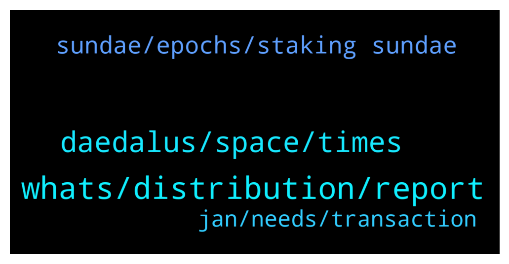

# **@Cardano**
 ## Analysis for **2022-01-30** - **2022-01-31**.

---

## 📊 **Basic Stats**

**n_messages_sent**: 49

---

---

## 🔝 **Top keywords and related messages**

1. **whats, distribution, report**

    @Ravi --- *Hi. Am new to this group* **--->** [TG Discussion](https://t.me/Cardano/776857)

    @rodney_fury --- *People. Just because I asked for an admin doesn't open the door for you to spam my dm....stay out* **--->** [TG Discussion](https://t.me/Cardano/777137)

    @glitch04 --- *if you need #support use the channel listed below* **--->** [TG Discussion](https://t.me/Cardano/777062)

    @glitch04 --- *Anyone that dm's you offering support is a scammer so block and ignore them* **--->** [TG Discussion](https://t.me/Cardano/777061)

    @Zyroxa --- *You can quote a post and reply with /report to send a report notification to the mods 😊 @MONEY_P00L_UK @crnicripto81* **--->** [TG Discussion](https://t.me/Cardano/777019)

    @crnicripto81 --- *please block this profile, it is a scammer.* **--->** [TG Discussion](https://t.me/Cardano/777018)

2. **daedalus, space, times**

    @Fibbow --- *Will it take more data and download times to use Daedalus?  Will Daedalus LITE us the same keyphrase? I'm on a metered internet and it's getting tough to synch Daedalus with each wallet upgrade* **--->** [TG Discussion](https://t.me/Cardano/776873)

    @Zyroxa --- *The network is currently under heavy load.* **--->** [TG Discussion](https://t.me/Cardano/776986)

    @crnicripto81 --- *hi guys, I noticed that the sending times do Ada have lengthened. There could be a problem or and the blockchein is clogged.* **--->** [TG Discussion](https://t.me/Cardano/776985)

    @crnicripto81 --- *it could be good for Ada .....* **--->** [TG Discussion](https://t.me/Cardano/776987)

    @pigeonfarmer --- *Hey everyone, I'm held ADA for several years and love Charles vision and passion for this space.   What I don't love, is using the network right now.   It's great that we have additional traffic, but is this user experience really what it's going to be like for the next few months? Or are there some remedies around the corner?* **--->** [TG Discussion](https://t.me/Cardano/777269)

    @JamesDao --- *Is daedalus taking long to verify and load ?* **--->** [TG Discussion](https://t.me/Cardano/777057)

3. **sundae, epochs, staking sundae**

    @Angeri8 --- *Guys I staked my ada to receive Sundaep: when am I going to receive them?* **--->** [TG Discussion](https://t.me/Cardano/777041)

    @ExInfernis --- *The staking for sundae awards started before several days. After 4 or 5 epochs it will be clear how they will be distributed.* **--->** [TG Discussion](https://t.me/Cardano/777052)

    @fptphuong --- *When's my first reward send back?* **--->** [TG Discussion](https://t.me/Cardano/776960)

    @ExInfernis --- *The staking for sundae rewards will finish then.* **--->** [TG Discussion](https://t.me/Cardano/777053)

    @glitch04 --- *takes 3 full epochs before you see #rewards 15-20 days depending on when you delegated you can read more at the FAQ linked below* **--->** [TG Discussion](https://t.me/Cardano/776966)

    @glitch04 --- *I don't think this will be correct it's best to get your information direct from the Sundae support channels* **--->** [TG Discussion](https://t.me/Cardano/777022)

4. **jan, needs, transaction**

    @AP_ADA --- *Why i can not make transactions on Yoroi? What happened with this system? And the wallet needs very much time to go online …* **--->** [TG Discussion](https://t.me/Cardano/777237)

    @Fibbow --- *No, Big Pey's Jan 28 youtube said either distributed by smart contract or through drip. Drip each user enters their wallet address on a 3rd party site. Hasn't been decided yet.* **--->** [TG Discussion](https://t.me/Cardano/777020)

    @Poe --- *There is no nami web wallet* **--->** [TG Discussion](https://t.me/Cardano/777365)

    @glitch04 --- *It does as it is a full node and needs to sync every transaction on the block chain* **--->** [TG Discussion](https://t.me/Cardano/777060)

    @fptphuong --- *I have a question, my first stack is 19-JAN-2022 in yoroi wallet* **--->** [TG Discussion](https://t.me/Cardano/776958)

    @HL_Lysis --- *That's generally how blockchains work yeah* **--->** [TG Discussion](https://t.me/Cardano/776909)

