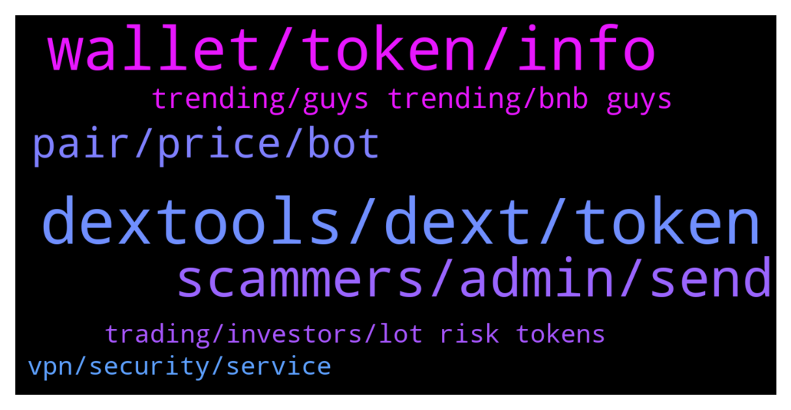

# **@DEXToolsCommunity**
 ## Analysis for **2022-01-29** - **2022-01-31**.

---

## 📊 **Basic Stats**

**n_messages_sent**: 183

---

---

## 🔝 **Top keywords and related messages**

1. **dextools, dext, token**

    @whisardly --- *Hey can someone tell me what this contract is? I used dextools to purchase tokens and it interacted here.  https://bscscan.com/address/0xdef1c0ded9bec7f1a1670819833240f027b25eff* **--->** [TG Discussion](https://t.me/DEXToolsCommunity/329520)

    @golh30 --- *From where dext chart data is coming* **--->** [TG Discussion](https://t.me/DEXToolsCommunity/329591)

    @farhad13345 --- *How can i trend my token in dextools* **--->** [TG Discussion](https://t.me/DEXToolsCommunity/329598)

    @Yaknota --- *How can i get the dextool link* **--->** [TG Discussion](https://t.me/DEXToolsCommunity/329603)

    @Jhongamadeo --- *Hi is dex only on uniswap for buying* **--->** [TG Discussion](https://t.me/DEXToolsCommunity/329475)

    @Astromooner --- *Hi how does a token update their details that are not showing on dextool eg website address* **--->** [TG Discussion](https://t.me/DEXToolsCommunity/329402)

2. **wallet, token, info**

    @Trucker427 --- *Is it possible to have more than one wallet for monthly membership? Think I joined from wrong wallet I need to do some history checking on* **--->** [TG Discussion](https://t.me/DEXToolsCommunity/329893)

    @stanes --- *About social Information for your token, please update etherscan.io or bscscan.com or coingecko.com  We pull info from there.    For the logo please update coinGecko or TrustWallet.* **--->** [TG Discussion](https://t.me/DEXToolsCommunity/329378)

    @stanes --- *Sure, just click the Swap button and connect your wallet.* **--->** [TG Discussion](https://t.me/DEXToolsCommunity/329349)

    @JoeyDieleman --- *For now it isn't. You could scroll back at the date/time of the tx and add it also. In the future just add it directly with the + sign.* **--->** [TG Discussion](https://t.me/DEXToolsCommunity/329561)

    @bastardganpunk --- *What do you mean by that? You just need to hold the tokens in one wallet.* **--->** [TG Discussion](https://t.me/DEXToolsCommunity/329897)

    @FredericDEXT --- *You need to click on the + next to your buy* **--->** [TG Discussion](https://t.me/DEXToolsCommunity/329557)

3. **scammers, admin, send**

    @bastardganpunk --- *For ads and marketing please send a DM to @guillermorodriguez78  Admins NEVER DM FIRST* **--->** [TG Discussion](https://t.me/DEXToolsCommunity/329400)

    @granini7 --- *Ok I now, but I must send 319 DXT also yes?* **--->** [TG Discussion](https://t.me/DEXToolsCommunity/329831)

    @bastardganpunk --- *That means a scammer DMed you! Careful please, no admin will ever DM you first!* **--->** [TG Discussion](https://t.me/DEXToolsCommunity/329668)

    @stanes --- *Hi, Please DM @guillermorodriguez78 he is the person-in-charge.  Be aware of scammers, HE WILL NEVER DM YOU FIRST.* **--->** [TG Discussion](https://t.me/DEXToolsCommunity/330040)

    @kingkhalil --- *Sorry, I only talk to admins 🤐* **--->** [TG Discussion](https://t.me/DEXToolsCommunity/329663)

    @Shah_of_Prussia --- *thanks. I dmed him, if you could let him know that'd be great.* **--->** [TG Discussion](https://t.me/DEXToolsCommunity/330041)

4. **pair, price, bot**

    @kingkhalil --- *The issue is that I have set the price bot in the group but it does not let us know about the price* **--->** [TG Discussion](https://t.me/DEXToolsCommunity/329670)

    @kingkhalil --- *What does it mean I have set DexScreener price bot to the group but it gives this message??????????* **--->** [TG Discussion](https://t.me/DEXToolsCommunity/329664)

    @kingkhalil --- *Can we add price pair list inside in dex pricing bot and then add it to group?* **--->** [TG Discussion](https://t.me/DEXToolsCommunity/329685)

    @pabloescobaris --- *Admin needs to change SHAMAN KING telegram official link group to this : https://t.me/shamankinglnuofficial* **--->** [TG Discussion](https://t.me/DEXToolsCommunity/329890)

    @Jack_the_Crypto --- *Got some issue by adding dex price bot. Setted pair, but after adking price its shows no pair found 😂  Used command to set price /set_pair 1 bsc 0xfbd57367524b389425c4adfb5a6f97b0e7ad3690* **--->** [TG Discussion](https://t.me/DEXToolsCommunity/329253)

    @JoeyDieleman --- *We don't remove pairs, this is the idea of centralizatuon.  We deliver tools to help identifying scams. And community can vote down pairs to give the pair a clear warning.* **--->** [TG Discussion](https://t.me/DEXToolsCommunity/329854)

5. **trending, guys trending, bnb guys**

    @Jay --- *Bro you guys system was trending it for over 24 hours* **--->** [TG Discussion](https://t.me/DEXToolsCommunity/329984)

    @Jay --- *Lost 5 bnb due to you guys trending a honey pot* **--->** [TG Discussion](https://t.me/DEXToolsCommunity/329973)

    @Jay --- *Better fix your systems curse to you guys I’m out bruv* **--->** [TG Discussion](https://t.me/DEXToolsCommunity/329985)

    @napascual --- *FYI, ultra mini dodge is not a honeypot but some kind of time-locked/rebase sell system* **--->** [TG Discussion](https://t.me/DEXToolsCommunity/329995)

    @Jay --- *Your allowing people to put into honeypot that’s trending on BSC* **--->** [TG Discussion](https://t.me/DEXToolsCommunity/329853)

    @WeakEndPlayer --- *Ill probably just selloff if it stays like this. See ya* **--->** [TG Discussion](https://t.me/DEXToolsCommunity/329803)

6. **vpn, security, service**

    @Madsumo --- *I have tried both UK and US servers and it is the same for both.* **--->** [TG Discussion](https://t.me/DEXToolsCommunity/329742)

    @JoeyDieleman --- *This has to do with cloudflare not trusting the vpn its ip address* **--->** [TG Discussion](https://t.me/DEXToolsCommunity/329739)

    @Madsumo --- *Hi.  Recently my laptop was compromised and so I rebuilt it from the bottom up, i.e. complete reinstall from the OS up.  I have then set all apps where possible to 2FA and installed Norton360 plus their SecureVPN service.  On startup, with the VPN enabled, I can still access all my apps, exchanges, and wallets but I cannot access the DEXTools App. I get an error stating your site has security to stop security attacks. If I stop the VPN, connect to your site first, and then restart the VPN, it is fine.  I believe this is then bypassing my VPN as the session was started without it enabled.  I am not a security expert but is there anything I can do so I do not have to stop and re-enable the VPN?* **--->** [TG Discussion](https://t.me/DEXToolsCommunity/329736)

    @napascual --- *Maybe try with different countries then uk/us as well, check that the ip comes from a trusted ASN* **--->** [TG Discussion](https://t.me/DEXToolsCommunity/329752)

    @napascual --- *I remember a user that had norton 360 vpn service using non trusted ASNs. I encourage you to use a different vpn provider* **--->** [TG Discussion](https://t.me/DEXToolsCommunity/329750)

    @JoeyDieleman --- *You could try, if the vpn supports, to connect to another node/country or try another vpn service* **--->** [TG Discussion](https://t.me/DEXToolsCommunity/329740)

7. **trading, investors, lot risk tokens**

    @napascual --- *Take into account hotpairs is based on a custom algo and it doesn’t represent any investment advice. You should always DYOR, There’s a lot of risk on tokens with no social networks links and almost no sells.* **--->** [TG Discussion](https://t.me/DEXToolsCommunity/329980)

    @IdaZharris --- *Do you have trading  experience* **--->** [TG Discussion](https://t.me/DEXToolsCommunity/329350)

    @WeakEndPlayer --- *Ok would have thought you guys would have an idea why or want it fixed for your investors but whatever* **--->** [TG Discussion](https://t.me/DEXToolsCommunity/329799)

    @bastardganpunk --- *You will also find valuable info on how to learn trading and find the right projects to invest in.* **--->** [TG Discussion](https://t.me/DEXToolsCommunity/329352)

    @bastardganpunk --- *I havent heard of it. Feel free to join our trading group* **--->** [TG Discussion](https://t.me/DEXToolsCommunity/329244)

    @Khmerkickass --- *is there anyone I can talk to about slippage on ssell?* **--->** [TG Discussion](https://t.me/DEXToolsCommunity/329436)

