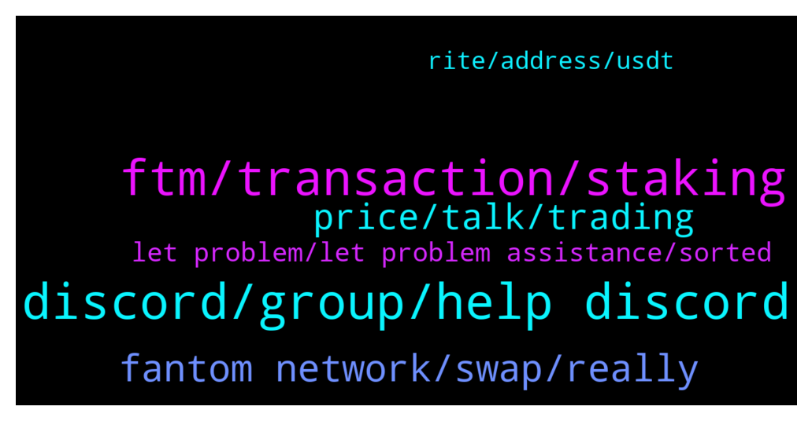

# **@Fantom_English**
 ## Analysis for **2022-01-30** - **2022-01-31**.

---

## 📊 **Basic Stats**

**n_messages_sent**: 154

---

---

## 🔝 **Top keywords and related messages**

1. **discord, group, help discord**

    @Janevietani --- *marines are run by community , we dont have control over it* **--->** [TG Discussion](https://t.me/Fantom_English/645334)

    @Ambiora --- *😂😂 It's not only my thinking dude but as an investor many of us have the same thought. However, admin is the best one to convey the thoughts to dev team as they are frequent in touch with dev teams.* **--->** [TG Discussion](https://t.me/Fantom_English/644420)

    @MODOdekunle --- *Have you tried to join again* **--->** [TG Discussion](https://t.me/Fantom_English/644490)

    @taymcmahxn --- *Hi guys, could I please have my discord account unblocked? My account was hacked last week and got removed but I have fixed the issue.* **--->** [TG Discussion](https://t.me/Fantom_English/644488)

    @TaniRay --- *yes, get chat support they sort it out fast* **--->** [TG Discussion](https://t.me/Fantom_English/644601)

    @Johnnyfantom --- *We cannot hurry the Devs or Andre, he works at his own pace.* **--->** [TG Discussion](https://t.me/Fantom_English/644422)

2. **ftm, transaction, staking**

    @Mt --- *Hi Team ,  i have recently sent over FTM  from a binance account to my fantom opera wallet-  24hrs ago -  the transaction has been confirmed however i dont have anything in my wallet ?* **--->** [TG Discussion](https://t.me/Fantom_English/645349)

    @maxxmoro --- *I would like to stake my ftm on Tomb. My ftm are on metamask Fantom chain. Can you suggest a tutorial or a procedure ? Thanks* **--->** [TG Discussion](https://t.me/Fantom_English/645047)

    @TaniRay --- *anyone else have a trouble with sending ftm ? my transaction is over 2 days and counting 🙄* **--->** [TG Discussion](https://t.me/Fantom_English/644482)

    @Mt --- *however theres no trace of the transaction on ftm scan* **--->** [TG Discussion](https://t.me/Fantom_English/645378)

    @Riquacrpt0 --- *I have a noob question — thanks for your help.  I bought ftm on kucoin and binance us. I withdrew from both places via the FTM network to Metamask FTM network.  Is it possible to just use the FTM on the FTM network for staking and LPs? Or do I need to move them to the native fantom wallet? I want to use the FTM with my ledger, but every guide I look up seems to have FTM on the Eth network.* **--->** [TG Discussion](https://t.me/Fantom_English/645114)

    @javadi1998 --- *How can I take out my Spirit Token from staking ? Thanks  I made my tokens at Beethoven staking!* **--->** [TG Discussion](https://t.me/Fantom_English/644778)

3. **fantom network, swap, really**

    @Ambiora --- *That's really not good  for Fantom's growth man. We really need this if we want to be a market leader. Fantom has only 50 validator node which makes him not fully decentralized to attract DeFi protocols. We need FVM so that validator node can be increased in order to make Fantom really big. We had heard about FVM in 2018 but since then we are waiting for the same. And still there is not promising date. Hope you can convey these concerns to Andre Cronje* **--->** [TG Discussion](https://t.me/Fantom_English/644413)

    @Racing_spirit1 --- *Surely there must be an easy way to bridge to fantom?* **--->** [TG Discussion](https://t.me/Fantom_English/644502)

    @Mcjig --- *when using a ledger with fantom/ you will use the eth app with metamask* **--->** [TG Discussion](https://t.me/Fantom_English/645119)

    @Janevietani --- *Fantom RPC : 1. https://rpc.ftm.tools/ 2. https://rpc.ankr.com/fantom 3. https://ftmrpc.ultimatenodes.io/   ChainID: 250 Symbol: FTM Browser : https://ftmscan.com  Another explorer is  https://explorer.fantom.network* **--->** [TG Discussion](https://t.me/Fantom_English/645163)

    @slickrick6 --- *Fantom on TG  Official: t.me/Fantom_English Announcements (official) : t.me/fantomfoundation Trading: t.me/FantomTrading French (Française): t.me/FantomFR Chinese (中文): https://t.me/FantomChinese Russian (русский): http://t.me/Fantom_Russian Vietnam : https://t.me/FantomVietnamGroup Turkey : https://t.me/Fantomir1  Fantom on DIscord: chat.fantom.network  Fantom on Twitter: twitter.com/fantomfdn* **--->** [TG Discussion](https://t.me/Fantom_English/645288)

    @Racing_spirit1 --- *Can someone tell me how to bridge fantom to fantom network? I bridged usdc on spookyswap but can’t bridge fantom and now I can’t swap usdc because I don’t have fantom* **--->** [TG Discussion](https://t.me/Fantom_English/644497)

4. **price, talk, trading**

    @Wwoorking25 --- *The tvl/price ratio is very low, compared with Solana, BSC or avax, see in defillama* **--->** [TG Discussion](https://t.me/Fantom_English/644959)

    @pajamasfreak --- *No price talk here, trading group can scroll above* **--->** [TG Discussion](https://t.me/Fantom_English/644740)

    @pajamasfreak --- *No price talk here and do read trading group above* **--->** [TG Discussion](https://t.me/Fantom_English/644672)

    @kumar3060 --- *Is this place to talk price* **--->** [TG Discussion](https://t.me/Fantom_English/644662)

    @Johnnyfantom --- *This is not a price chat* **--->** [TG Discussion](https://t.me/Fantom_English/644547)

    @Mcjig --- *Price discussion and FA/TA trading:  • chat.fantom.network • @fantommarines* **--->** [TG Discussion](https://t.me/Fantom_English/645002)

5. **let problem, let problem assistance, sorted**

    @yanperor --- *no i use metamask app on Android* **--->** [TG Discussion](https://t.me/Fantom_English/645162)

    @Johnnyfantom --- *Reset metamask, go to settings, advanced* **--->** [TG Discussion](https://t.me/Fantom_English/644540)

    @TaniRay --- *mine is sorted. turned out was an exchange issue* **--->** [TG Discussion](https://t.me/Fantom_English/644599)

    @Riquacrpt0 --- *Thanks for confirming this. So I guess I should move them to the Fwallet then.* **--->** [TG Discussion](https://t.me/Fantom_English/645122)

    @bingo_inu --- *Really? Okay let me try that. Thanks* **--->** [TG Discussion](https://t.me/Fantom_English/644630)

    @MODOdekunle --- *Ooh so sorry about that I guessed you should try to message one of the Admin or Dev for help* **--->** [TG Discussion](https://t.me/Fantom_English/644501)

6. **rite, address, usdt**

    @INapoleone --- *@Janevietani  is there a form to fill?* **--->** [TG Discussion](https://t.me/Fantom_English/645433)

    @pajamasfreak --- *hi, you can ask directly https://discord.com/invite/jedS4zGk28* **--->** [TG Discussion](https://t.me/Fantom_English/644780)

    @Torcaskev --- *My question was how can I get it* **--->** [TG Discussion](https://t.me/Fantom_English/644768)

    @Dustin --- *Where do I get that rite on there site* **--->** [TG Discussion](https://t.me/Fantom_English/644602)

    @Dustin --- *Everything check out when I look it up but idk it says success the address are rite but haven actually received it* **--->** [TG Discussion](https://t.me/Fantom_English/644590)

    @artemicko --- *Hi, I have a doubt, if I have fusdt can I send it to a usdt address?* **--->** [TG Discussion](https://t.me/Fantom_English/645021)

