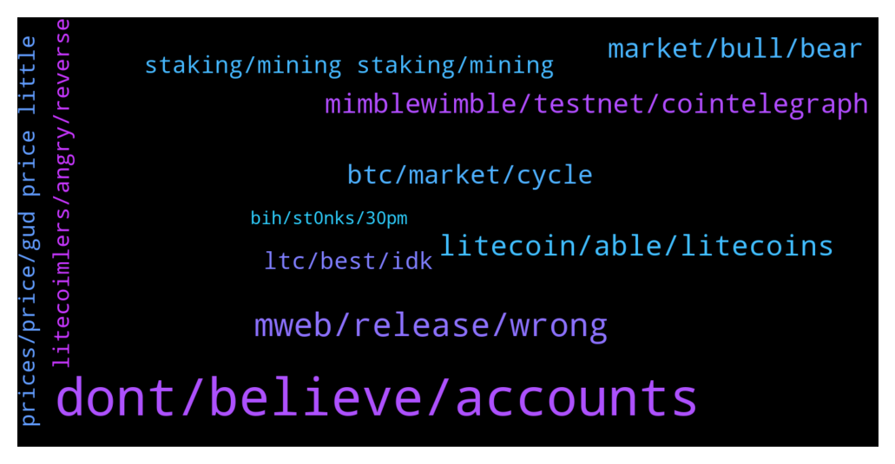

# **@Litecoin**
 ## Analysis for **2022-01-30** - **2022-01-31**.

---

## 📊 **Basic Stats**

**n_messages_sent**: 241

---

---

## 🔝 **Top keywords and related messages**

1. **dont, believe, accounts**

    @finitemaz --- *Yeah I wouldn’t bother wasting your time responding to him lol just another troll* **--->** [TG Discussion](https://t.me/Litecoin/2054888)

    @twoYEARbear --- *You banned me over a year ago* **--->** [TG Discussion](https://t.me/Litecoin/2055147)

    @FFCosta --- *I never believe on random accounts* **--->** [TG Discussion](https://t.me/Litecoin/2055303)

    @Kemiodigwe --- *Okay. Speak to you really soon* **--->** [TG Discussion](https://t.me/Litecoin/2055337)

    @TonyNakamoto --- *U know r can't short eBen if I wanted 2* **--->** [TG Discussion](https://t.me/Litecoin/2055261)

    @Kemiodigwe --- *Lol. Who asked you to? Scroll up. Wasn't talking to u. You money got nothing to do with me* **--->** [TG Discussion](https://t.me/Litecoin/2055352)

2. **mweb, release, wrong**

    @FFCosta --- *Not yet. Just waiting the launch to test it sir.* **--->** [TG Discussion](https://t.me/Litecoin/2055384)

    @Yhtrcgtfv566 --- *There's more to mweb than coding* **--->** [TG Discussion](https://t.me/Litecoin/2054882)

    @cloudlite15 --- *I pray that I will live long enough to see mweb release in my lifetime. 🙏* **--->** [TG Discussion](https://t.me/Litecoin/2054937)

    @Yhtrcgtfv566 --- *Where can I apply to be a developer and join the unmuted?* **--->** [TG Discussion](https://t.me/Litecoin/2054879)

    @TonyNakamoto --- *Well 2day is Mw0b so mayB things turn aroumd* **--->** [TG Discussion](https://t.me/Litecoin/2055585)

    @Yhtrcgtfv566 --- *Well, the mweb telegram group has turned it's censorhip switch on.* **--->** [TG Discussion](https://t.me/Litecoin/2054873)

3. **litecoin, able, litecoins**

    @FFCosta --- *Fudleur is another one deep balls on Litecoin. Poor soul* **--->** [TG Discussion](https://t.me/Litecoin/2055101)

    @njiawoa --- *Will litecoin rise back to $110?* **--->** [TG Discussion](https://t.me/Litecoin/2055553)

    @Jim --- *Well guys where is the announcement on litecoin on twitter for the upcoming update? It is important to be posted and make some saspens for new investors 🤔* **--->** [TG Discussion](https://t.me/Litecoin/2055410)

    @Kemiodigwe --- *This is supposed to be a community for people who believe in litecoin* **--->** [TG Discussion](https://t.me/Litecoin/2055321)

    @Kemiodigwe --- *Many think litecoin is dead. It's the rise of a sleeping lion.* **--->** [TG Discussion](https://t.me/Litecoin/2055297)

    @YuumuraKirika --- *Just saw on Twitter. We should call litecoins on MWEB, darkcoins. 😃* **--->** [TG Discussion](https://t.me/Litecoin/2054835)

4. **mimblewimble, testnet, cointelegraph**

    @morningzone --- *afaik ya stil need to wait for activaton in mainnet* **--->** [TG Discussion](https://t.me/Litecoin/2055386)

    @nltox --- *wake up and press the mimblewimble button* **--->** [TG Discussion](https://t.me/Litecoin/2055533)

    @nltox --- *would be nice to see mimblewimble and moonsie release at the same time* **--->** [TG Discussion](https://t.me/Litecoin/2055519)

    @morningzone --- *(only do work in testnet, cant be send/used in mainnet, 0 value)* **--->** [TG Discussion](https://t.me/Litecoin/2055392)

    @FFCosta --- *You can test it on testnet* **--->** [TG Discussion](https://t.me/Litecoin/2055387)

    @Musashi_Kansai --- *It’s the very first Mimblewimble address.* **--->** [TG Discussion](https://t.me/Litecoin/2055158)

5. **market, bull, bear**

    @FFCosta --- *Last bull many ones sell houses and buy at top* **--->** [TG Discussion](https://t.me/Litecoin/2055309)

    @Carlos_PRO_Holder --- *We are in a bear market, just check the charts 😭* **--->** [TG Discussion](https://t.me/Litecoin/2054932)

    @Kemiodigwe --- *Have some faith. Dont be so negative. This isn't the bear market as you all think. You will simply end up missing out* **--->** [TG Discussion](https://t.me/Litecoin/2055289)

    @professional --- *Don’t worry about mw it’s bear market just pray for next bull market* **--->** [TG Discussion](https://t.me/Litecoin/2054900)

    @FFCosta --- *Open season kill bears and bulls ?* **--->** [TG Discussion](https://t.me/Litecoin/2055081)

    @Augusto --- *There are many reason to believe in bull market Q2 or in the end of Q1* **--->** [TG Discussion](https://t.me/Litecoin/2054916)

6. **btc, market, cycle**

    @bake_Crypto --- *more dump in btc is expect* **--->** [TG Discussion](https://t.me/Litecoin/2054842)

    @Furkan --- *Let's not be too pessimistic.  With the Asian opening, the market moves a little.  Uncle Powell spooked the market.  However, investors have already priced in before these statements.  Support point works fine.  I believe we will easily see 145-174-224 levels.  With the opening of the US stock market, the down nasdaq direction is important for bitcoins.  I am an Ltc investor with spot and leverage.  good luck everybody* **--->** [TG Discussion](https://t.me/Litecoin/2055176)

    @Kemiodigwe --- *Bitcoin this year will be 134,000 before it hits a decline* **--->** [TG Discussion](https://t.me/Litecoin/2055284)

    @Kemiodigwe --- *In 2021 I saw a vision that btc will hit 63,000 i didn't take it serious, after that i saw another that it will hit 69000, and it took only 2 months and it got there* **--->** [TG Discussion](https://t.me/Litecoin/2055280)

    @.. --- *Will btc pump next week ? (chinese new year)* **--->** [TG Discussion](https://t.me/Litecoin/2055082)

    @ForDaTek --- *Yup. While we preach ‘hodl’ the rich is cashing out the noob money that enters the market by dumping on them and actually buying real things and spending their profits. The other half just collects and trade to get more btc, never cashing out as they get older. Which is a good thing as they get older or suddenly die, their btc gets locked out of the market, great to increase price floors.* **--->** [TG Discussion](https://t.me/Litecoin/2054929)

7. **staking, mining staking, mining**

    @Jim --- *Do you think that the executive order for crypto will be bad? 🥲* **--->** [TG Discussion](https://t.me/Litecoin/2055421)

    @Congressional_Liason --- *Charlie has a nice size bag as evidenced by his last years post, and he uses it for development for a reason; advancement of his coin with no premine or downtime. Remember just recently him and his brother along with other crypto elites went to El Salvador.* **--->** [TG Discussion](https://t.me/Litecoin/2055448)

    @Alyssa --- *Still won't matter. Crypto is unstoppable.* **--->** [TG Discussion](https://t.me/Litecoin/2055444)

    @Jim --- *Some old men take actions about crypto... It is at least rediculus! Ask all of them if they know what is blockchain. 😂😁😂* **--->** [TG Discussion](https://t.me/Litecoin/2055424)

    @FFCosta --- *But is good to see one crypto with that option. 👍* **--->** [TG Discussion](https://t.me/Litecoin/2055385)

    @Kemiodigwe --- *This is crypto, it must come down to go yp* **--->** [TG Discussion](https://t.me/Litecoin/2055328)

8. **ltc, best, idk**

    @Safu_LTC --- *Imagine a day when the price of LTC exceeds $1000.  This group will explode.  🙈👀* **--->** [TG Discussion](https://t.me/Litecoin/2055127)

    @schaapje --- *Idk still not converting my btc to ltc  even rough the ratio is insane low. Prob smart but idk i just keep my position as is.* **--->** [TG Discussion](https://t.me/Litecoin/2055572)

    @morningzone --- *ltc will be always faster than btc, cos of smallr avg block time* **--->** [TG Discussion](https://t.me/Litecoin/2055372)

    @Kacskaringo --- *Hello everyone, what is the best place to get some extra ltc with farming it? How much is the apr on there? Give me the best options please* **--->** [TG Discussion](https://t.me/Litecoin/2055126)

    @Congressional_Liason --- *LTCMWEB is coming sooner than you may think. LTC has a pattern of rising quickly when least expected.   Do your research, pick your multiple prices if desired, and enjoy the ride. :)* **--->** [TG Discussion](https://t.me/Litecoin/2054955)

    @Safu_LTC --- *UP or Down, I will be with LTC and never sell any in such a low price.* **--->** [TG Discussion](https://t.me/Litecoin/2054847)

9. **litecoimlers, angry, reverse**

    @TonyNakamoto --- *Dey turn'd m0mdli into a scapem00n* **--->** [TG Discussion](https://t.me/Litecoin/2055592)

    @JohnTheApostle --- *The only person on the planet to fud something which he did an all in* **--->** [TG Discussion](https://t.me/Litecoin/2055505)

    @nltox --- *maybe he‘s just doing reverse psychology ser* **--->** [TG Discussion](https://t.me/Litecoin/2055508)

    @TonyNakamoto --- *He chop'd off his balls th0 so pr0blem solve'd* **--->** [TG Discussion](https://t.me/Litecoin/2055102)

    @TonyNakamoto --- *ratio and LiteCoimlers' mental health both hovering around ATL* **--->** [TG Discussion](https://t.me/Litecoin/2055061)

    @J --- *He is not a killer.. he has been smart and everyone things the opposite has just been frontrun by him and are angry with themselves* **--->** [TG Discussion](https://t.me/Litecoin/2054979)

10. **prices, price, gud price little**

    @FFCosta --- *Prices are good to re buy. But dont expect they will go further* **--->** [TG Discussion](https://t.me/Litecoin/2055335)

    @Safu_LTC --- *$27k will be the last chance for buying IMO, but its not 100% programmed and we may goes up from here to reach $40k+* **--->** [TG Discussion](https://t.me/Litecoin/2054846)

    @TonyNakamoto --- *r don't think de prices r any higher over there* **--->** [TG Discussion](https://t.me/Litecoin/2054833)

    @FFCosta --- *See prices drops 80% and most people complain after that very sed 🥲* **--->** [TG Discussion](https://t.me/Litecoin/2055323)

    @TonyNakamoto --- *Wat will price B tmrw sjr?* **--->** [TG Discussion](https://t.me/Litecoin/2055288)

    @FFCosta --- *May be price keeps same place* **--->** [TG Discussion](https://t.me/Litecoin/2055587)

