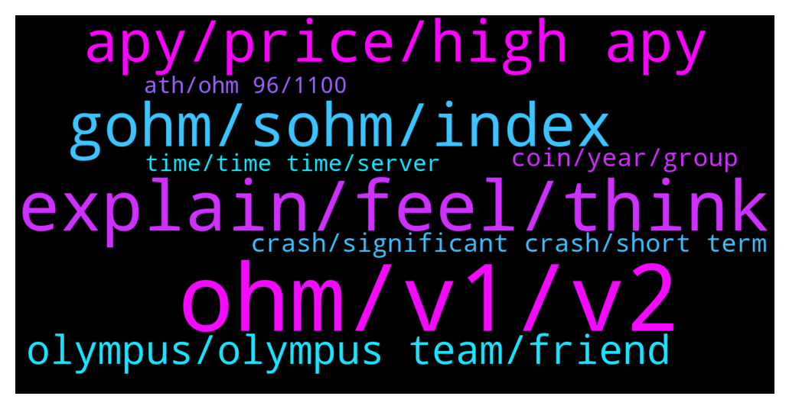

# **@OlympusTG**
 ## Analysis for **2022-01-30** - **2022-01-31**.

---

## 📊 **Basic Stats**

**n_messages_sent**: 1019

---

---

## 🔝 **Top keywords and related messages**

1. **ohm, v1, v2**

    @JM --- *Ohm price is $63 and backing per ohm in the treasury is $56. It’s been like this for a while.* **--->** [TG Discussion](https://t.me/OlympusTG/175329)

    @Host_Matt --- *You don’t even understand ohm @ishaqniz and you made that very clear* **--->** [TG Discussion](https://t.me/OlympusTG/175254)

    @timon_k --- *I just hoped "backing per ohm" was some kind of safety measure but haha, boy was I wrong.* **--->** [TG Discussion](https://t.me/OlympusTG/175183)

    @Host_Matt --- *do you know ohms revenue model* **--->** [TG Discussion](https://t.me/OlympusTG/174491)

    @nfwaple --- *people who bought at 1k mark would have doubled the OHM every 2 months, essentially cutting the cost in half* **--->** [TG Discussion](https://t.me/OlympusTG/174848)

    @chitangxxx --- *Yeah but ohm isn't run by an ex convict fraudster child porn peddler* **--->** [TG Discussion](https://t.me/OlympusTG/174910)

2. **explain, feel, think**

    @cdp279 --- *People got brunt for a lot more than that. You’re not alone* **--->** [TG Discussion](https://t.me/OlympusTG/175345)

    @rasputen1 --- *Yes but it discredits his statement tbh* **--->** [TG Discussion](https://t.me/OlympusTG/175479)

    @Host_Matt --- *i know but i want to hear him explain will be fun* **--->** [TG Discussion](https://t.me/OlympusTG/174277)

    @chitangxxx --- *Got a few more dms after that, I guess these Africans can't read English? Lol. Already told them I want to give them my seed phrase but they are asking me to explain the issue. Talk about not wanting this gift!* **--->** [TG Discussion](https://t.me/OlympusTG/175198)

    @georgitimenov --- *Many people think so, that's why will not happen 😂* **--->** [TG Discussion](https://t.me/OlympusTG/175889)

    @timon_k --- *they don't care haha. it's a numbers game..* **--->** [TG Discussion](https://t.me/OlympusTG/175204)

3. **gohm, sohm, index**

    @Kol --- *Could someone help me please. Is it a good idea to bond my Gohm stake into UST wormhole for 14 days if the roi rate for UST  is higher ? just trying to find ways to get back some of my losses. Thanks* **--->** [TG Discussion](https://t.me/OlympusTG/175849)

    @nfwaple --- *how is that possible, gOHM was never $50000* **--->** [TG Discussion](https://t.me/OlympusTG/175089)

    @Pallas1111 --- *I just don't understand why none of my numbers on the dashboard, sohm or gohm haven't changed in over a month.* **--->** [TG Discussion](https://t.me/OlympusTG/174176)

    @siir_billel --- *Then we can sell sohm ? Of yes what’s the price* **--->** [TG Discussion](https://t.me/OlympusTG/174207)

    @nfwaple --- *wrap OHM to gOHM using wrap on the website, then Bridge to gOHM* **--->** [TG Discussion](https://t.me/OlympusTG/174980)

    @ishaqniz --- *how can i move form ohm to goohm so i can sell it in avax to save fees* **--->** [TG Discussion](https://t.me/OlympusTG/174979)

4. **apy, price, high apy**

    @nfwaple --- *read OIP-18 OlympusDAO to get the APY schedule, APY decreases as token supply increases* **--->** [TG Discussion](https://t.me/OlympusTG/174184)

    @GordonTheGecko --- *The supply increasing and more people staking I believe? The apy has to be adjusted so that it can keep paying increasing holders...  Correct me if wrong admin* **--->** [TG Discussion](https://t.me/OlympusTG/175032)

    @rasputen1 --- *But what I will say is that this project hasn’t had low apy, and thinking dropping it to low levels will increase price can’t be guaranteed* **--->** [TG Discussion](https://t.me/OlympusTG/174323)

    @assimj --- *I hope APY stops at 1K% and doesn’t go further below ⬇️* **--->** [TG Discussion](https://t.me/OlympusTG/175020)

    @eatsandtravels --- *I got out! APY from 5000% to 1300% and $350 to $60* **--->** [TG Discussion](https://t.me/OlympusTG/174924)

    @Al_S1919 --- *Why is the APY so fkn low? It is awesomely dropped below 1000%! When do we need to sell our SOHM and leave the project?* **--->** [TG Discussion](https://t.me/OlympusTG/175752)

5. **olympus, olympus team, friend**

    @Derrick --- *Olympus is a genius idea, despite the market being bearish I'm bullish on Olympus!* **--->** [TG Discussion](https://t.me/OlympusTG/174514)

    @Derrick --- *You shouldn't invest in Olympus my friend if you can't be patient* **--->** [TG Discussion](https://t.me/OlympusTG/174660)

    @(3'3) --- *and if someone gets to Zeus, it would be convenient to enter the IOTA tangle that has zero transfer fees, better for everyone!!!😉👍* **--->** [TG Discussion](https://t.me/OlympusTG/174036)

    @MiaRomeo --- *We all trust Olympus even though we do not know the team right?* **--->** [TG Discussion](https://t.me/OlympusTG/174686)

    @theMagicUnicorn --- *We are pleased to present Olympus12, a 12-month action plan for how Olympus will achieve its goal of becoming Web3’s premiere decentralized reserve currency. The DAO has been actively involved in activities designed to strengthen OHM’s reserve currency status, with a special focus on dampening volatility and using the Treasury to significantly benefit and grow the Olympus ecosystem  https://olympusdao.medium.com/olympus12-building-a-strong-ecosystem-around-a-web3-native-reserve-currency-416f58175e74* **--->** [TG Discussion](https://t.me/OlympusTG/175480)

    @JvikG --- *What else does Olympus have. Smart contracts? Anything else that will serve more of a purpose. Could just invest in hex but that's just me* **--->** [TG Discussion](https://t.me/OlympusTG/175261)

6. **crash, significant crash, short term**

    @nfwaple --- *anything that crashed hard and managed to go back up was bullish af* **--->** [TG Discussion](https://t.me/OlympusTG/175460)

    @nfwaple --- *think about what it takes for something that crashed significantly to recover* **--->** [TG Discussion](https://t.me/OlympusTG/175486)

    @nfwaple --- *it's a recovery to ATH after a significant crash* **--->** [TG Discussion](https://t.me/OlympusTG/175516)

    @nfwaple --- *if they recover something must have been done right* **--->** [TG Discussion](https://t.me/OlympusTG/175503)

    @Kng3000 --- *Yea , I see that will justify short term pain for longer stability* **--->** [TG Discussion](https://t.me/OlympusTG/174535)

    @rasputen1 --- *Same way the recovery could have a variety of reasons rather than good work…* **--->** [TG Discussion](https://t.me/OlympusTG/175513)

7. **coin, year, group**

    @Alden_168 --- *Bullish. We can't compare traditional financial market with crypto, crypto is hottttt💥💥💥 at this current moment...Defi, Dao, GameFi, Metaverse etc. And the bear is short-live.* **--->** [TG Discussion](https://t.me/OlympusTG/175956)

    @MiaRomeo --- *since 2019 U.K, U.S, EU, Canada, Australia, IMF Central banks and their cronies been working on sinister plans to cripple crypto to extinction. that time has arrived with the America competes act, the executive order and the SEC going after DeFi, the end might be sooner that later. I am very worried.* **--->** [TG Discussion](https://t.me/OlympusTG/174773)

    @Host_Matt --- *if economy gg we have much bigger problems than crypto going down lol* **--->** [TG Discussion](https://t.me/OlympusTG/174531)

    @Ahmad --- *He will announce a coin called Biden coin. Hopefully not cos all the Crypto degens will buy and FOMO it to the moon.* **--->** [TG Discussion](https://t.me/OlympusTG/175983)

    @Lf1304 --- *I’m here for crypto not anything else 🥰🥰🥰* **--->** [TG Discussion](https://t.me/OlympusTG/175792)

    @nfwaple --- *crypto always down before lunar new year* **--->** [TG Discussion](https://t.me/OlympusTG/175687)

8. **time, time time, server**

    @Superman (WILL NOT DM FIRST) --- *Have you ever visited King Tut's TOMB?* **--->** [TG Discussion](https://t.me/OlympusTG/175069)

    @SinisterCyclops --- *Yes, hold on one sec lemme confirm* **--->** [TG Discussion](https://t.me/OlympusTG/174640)

    @Pallas1111 --- *Ok, thanks for your time and help.* **--->** [TG Discussion](https://t.me/OlympusTG/174187)

    @CryptoQween --- *Oh okay thanks for letting me know* **--->** [TG Discussion](https://t.me/OlympusTG/175304)

    @rasputen1 --- *Okay didn’t come out as I thought it* **--->** [TG Discussion](https://t.me/OlympusTG/174400)

    @ccryii --- *Can’t see now . Not on pc but later i will check* **--->** [TG Discussion](https://t.me/OlympusTG/175074)

