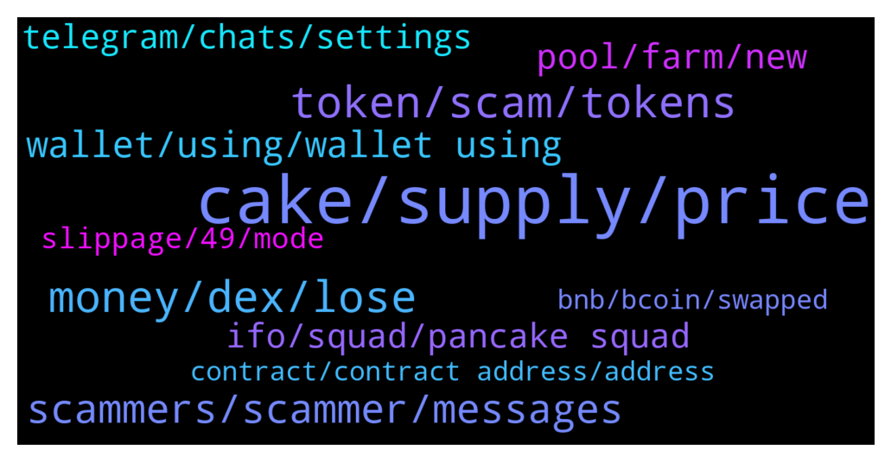

# **@PancakeSwap**
 ## Analysis for **2022-01-30** - **2022-01-31**.

---

## 📊 **Basic Stats**

**n_messages_sent**: 779

---

---

## 🔝 **Top keywords and related messages**

1. **cake, supply, price**

    @NoMoreMoonboy --- *in just 20 hours our supply grew with 320000 extra tokens* **--->** [TG Discussion](https://t.me/PancakeSwap/2311311)

    @hardeep_arora29 --- *I bought cake at 38 usdt now the cake price is 7 usdt, in huge huge loss, what happen to cake from long time not bullish behavior in cake* **--->** [TG Discussion](https://t.me/PancakeSwap/2311263)

    @hoseiinnnna --- *in discord nobody answer all people is usuall people no admin no chef  many user have question when price improve? becuase as the rest cake go down so much🙏🏽* **--->** [TG Discussion](https://t.me/PancakeSwap/2314563)

    @NoMoreMoonboy --- *no max supply or total supply. minting forever. i should have done my research before i bought.... never pay for VIP GROUPS NEVER!* **--->** [TG Discussion](https://t.me/PancakeSwap/2311488)

    @Ceddi200 --- *👩‍🏫 There are 2 common requests we see about CAKE.  1) Increase APR 2) Stop all Emissions  👏They👏cannot👏both👏happen.  ———  Q. Where does APR on farms and the CAKE-CAKE Syrup Pools come from? A. From CAKE emissions.   ⚠️If all CAKE emissions were cut to 0, APR would also drop to 0!  The CAKE you earn from the pools and farms are the CAKE that are emitted each block. Emmissions produce APR.  ———  So what are we doing about inflation?  📉We reduce emissions gradually, every month. We've already reduced from 40 to 14.5 CAKE /block.  🔥We burn CAKE every week + add burning mechanisms in new products.  The goal is, and always has been, for more CAKE to leave circulation than enters.  https://docs.pancakeswap.finance/tokenomics/cake/cake-tokenomics* **--->** [TG Discussion](https://t.me/PancakeSwap/2311329)

    @Le --- *Hello Admin Please help me with problem as following  After connect wallet, in Auto Cake syrup pool, i can't see balance of compounding and only see recent cake profit and Button Enable pool.   What happen with this case. Problem with my wallet or Pancakeswap..please share me solution for this case.* **--->** [TG Discussion](https://t.me/PancakeSwap/2312462)

2. **money, dex, lose**

    @ManBlyat --- *you're amazing, buy shitcoin withoud know tax fees 😂 did you know what is waste money ? like you do, buy shitcoin* **--->** [TG Discussion](https://t.me/PancakeSwap/2311162)

    @Tagvantage --- *yes im definetly doing that but im trying to figure out.. i want to invest more into a game i have already invested (thats why i bought the PVU) but they stole that money.. so that would probably go both ways.. i f i take money out of the game eventually they will steal it too unless i can stop it* **--->** [TG Discussion](https://t.me/PancakeSwap/2311077)

    @Ceddi200 --- *Loll. You sure you observing market. Check all dex tokens.* **--->** [TG Discussion](https://t.me/PancakeSwap/2311323)

    @mapartha --- *Just similar to a bank run. A bank cannot pay if everyone wants to withdraw.* **--->** [TG Discussion](https://t.me/PancakeSwap/2311815)

    @mapartha --- *If stable coin is pegged to a crypto, it can lose value* **--->** [TG Discussion](https://t.me/PancakeSwap/2311811)

    @Vishaljain2 --- *Okay Thanks.  But,it cannot be Volatile as Normal currency.* **--->** [TG Discussion](https://t.me/PancakeSwap/2311809)

3. **token, scam, tokens**

    @ajchouhan213 --- *Hello, do i need to enable same token again and again and pay the fees* **--->** [TG Discussion](https://t.me/PancakeSwap/2313627)

    @octa9 --- *may be you bought a fake token* **--->** [TG Discussion](https://t.me/PancakeSwap/2311076)

    @Luukku1 --- *Sure you didnt buy scam one? I see only few holders on that token and found another coingecko token with thousands of holders* **--->** [TG Discussion](https://t.me/PancakeSwap/2312631)

    @ajchouhan213 --- *Does it happen when the token is scam? Or the approval price goes to the owner who listed the token?* **--->** [TG Discussion](https://t.me/PancakeSwap/2313640)

    @Rasilmyx --- *Hello, please tell me if you bought a token, but you can't sell it, is it a scam?* **--->** [TG Discussion](https://t.me/PancakeSwap/2313727)

    @hoseiinnnna --- *You are constantly warning me that it is important to you that I bought your exchange token and I am in heavy loss and I am worried that you are only threatening me that I will remove it. Well, I am worried that I have lost a lot.* **--->** [TG Discussion](https://t.me/PancakeSwap/2314573)

4. **scammers, scammer, messages**

    @Ama --- *To many scammer  here  please attantione* **--->** [TG Discussion](https://t.me/PancakeSwap/2312697)

    @Million --- *There is a fake group with like 10000 scammers on it. Don't know what is going on* **--->** [TG Discussion](https://t.me/PancakeSwap/2313011)

    @Wegetables --- *Thank you for your help… man lots of scammers in here. Got like 30 dm’s lol* **--->** [TG Discussion](https://t.me/PancakeSwap/2312389)

    @Tni --- *Why is yours account tagged with scam ?* **--->** [TG Discussion](https://t.me/PancakeSwap/2312757)

    @Philson --- *Ffs 1 Message here and instantly getting 3 calls from Scmmers. Thx for the answer tho* **--->** [TG Discussion](https://t.me/PancakeSwap/2312043)

    @forc3r --- *Lol scamer is trolling with reaction 😂* **--->** [TG Discussion](https://t.me/PancakeSwap/2311995)

5. **wallet, using, wallet using**

    @CakeCompounder --- *Have you tried a different wallet?* **--->** [TG Discussion](https://t.me/PancakeSwap/2313375)

    @Sheila Fuller --- *I can’t see it on my wallet* **--->** [TG Discussion](https://t.me/PancakeSwap/2311439)

    @Ceddi200 --- *Can you try SafePal wallet or trustwallet if you can open the websites* **--->** [TG Discussion](https://t.me/PancakeSwap/2311444)

    @TomorrowlandForLife --- *I don't know but a few people have reported this.  Where are you from and which wallet are you using?* **--->** [TG Discussion](https://t.me/PancakeSwap/2312386)

    @Boriya13 --- *My currency is stolen from my wallet. Although I had a password. How is it possible* **--->** [TG Discussion](https://t.me/PancakeSwap/2313229)

    @Ceddi200 --- *Once is okay. Except you change your wallet or reinstall it* **--->** [TG Discussion](https://t.me/PancakeSwap/2313632)

6. **pool, farm, new**

    @Million --- *How do I know when a farm contract will expire?* **--->** [TG Discussion](https://t.me/PancakeSwap/2312662)

    @Criptomentoring --- *I'm clicking on the Froyo staked pool On View Contract* **--->** [TG Discussion](https://t.me/PancakeSwap/2313096)

    @Million --- *Hello guys, who would like to post a list of pairs that actually profitable on farming?  From what I've seen most of them are losing pairs* **--->** [TG Discussion](https://t.me/PancakeSwap/2311207)

    @Million --- *Where can I see how long the current listed farms will last?* **--->** [TG Discussion](https://t.me/PancakeSwap/2312664)

    @Sajad1998bt --- *When will the new farm project be announced?* **--->** [TG Discussion](https://t.me/PancakeSwap/2311505)

    @Sajad1998bt --- *I want to know when new farm projects will be released  And where?  Where I should see new projects?* **--->** [TG Discussion](https://t.me/PancakeSwap/2311524)

7. **ifo, squad, pancake squad**

    @Chris_TOF --- *New system of IFO 3.1 has been announced, I hope you have a Pancake squad 🐇🥞  https://twitter.com/PancakeSwap/status/1486308147291918343?t=FOag4gdaQFbb1m0ZIGjC6w&s=19* **--->** [TG Discussion](https://t.me/PancakeSwap/2313619)

    @Carco_Guardian --- *limited allocation for each squad.. and multiplier by the number of squads you hold in your wallet for IFO 3.1 can be a game-changer. People are waiting for 2 blur boxes in IFO 3.1 format.   Squad Allocation 4 X allocation for profile activation. 2 X allocation for holding in wallet / delist market.  Community Points/ 3rd Box 1 X allocation  Please forward it to Chefs.* **--->** [TG Discussion](https://t.me/PancakeSwap/2313766)

    @michael_scarn_ok --- *Weway please give IFO  on  Pancakeswap please* **--->** [TG Discussion](https://t.me/PancakeSwap/2313774)

    @Tigerhawk89 --- *All ready with your squad nft for ifo announcment?🔥🔥🔥🚀🚀🚀* **--->** [TG Discussion](https://t.me/PancakeSwap/2311385)

    @Carco_Guardian --- *wen PANCAKE Squad auction? IFO 3.1? ❤️‍🔥❤️‍🔥❤️‍🔥❤️‍🔥❤️‍🔥🔥🔥🔥🔥🔥* **--->** [TG Discussion](https://t.me/PancakeSwap/2313623)

    @Tigerhawk89 --- *All ready with their squad nfts for iFo? 10 remaining under 4.4 bnb for grabs for private ifo entry -NFA* **--->** [TG Discussion](https://t.me/PancakeSwap/2311850)

8. **telegram, chats, settings**

    @PanzerkampFren --- *can do it tommorow, telegram is doing banning maintenances on sundays* **--->** [TG Discussion](https://t.me/PancakeSwap/2311999)

    @al7842 --- *Is there any way to report them except from the chat?* **--->** [TG Discussion](https://t.me/PancakeSwap/2312778)

    @SecuestPcs --- *How to protect your self against spam chat:   ❗️ Read Me So You Can Keep Safe❗️  📌 Please do the following in your Telegram app 📱  1️⃣ Go to: Settings 2️⃣ Select: Privacy and Security -> Groups 3️⃣ Select: Who can add me to group chats? -> My Contacts  🔓 This will protect you from scammers adding you to FAKE groups/chats 🔓  1️⃣ Go to: Settings 2️⃣ Privacy And Security 3️⃣ Phone Number : Nobody 4️⃣ Forwarded Message : Nobody 5️⃣ CALLS : Nobody  Thank you. Stay #SAFU.* **--->** [TG Discussion](https://t.me/PancakeSwap/2313868)

    @vincenzo_btc --- *I’m using an alt account because I joined with my main account a few minutes ago and got spammed with calls and messages from scammers. I then somehow got banned from this telegram immediately because I’m assuming I didn’t click the verify link in time* **--->** [TG Discussion](https://t.me/PancakeSwap/2312113)

    @Dr_MRBartashk --- *But we can report them to Telegram to omit from their acc* **--->** [TG Discussion](https://t.me/PancakeSwap/2312787)

    @Rush_lover --- *For a CRYPTO KING u have to learn a LOT. This is not the telegram group of Metaverse. Nothing we can do anymore. So better DYOR next time and ban the FOMO.* **--->** [TG Discussion](https://t.me/PancakeSwap/2313507)

9. **slippage, 49, mode**

    @Million --- *I get you Point ☝️ yes, question for support here, why slippage so high when doing swap here, how can I find the right opportunity to use it at lower rate? There is a link for a live chart where I can find the right hours to do swap at lower slippage? ATM 15% is not cool* **--->** [TG Discussion](https://t.me/PancakeSwap/2311220)

    @Ceddi200 --- *Ask the team the amount of slippage you should use* **--->** [TG Discussion](https://t.me/PancakeSwap/2311128)

    @vincenzo_btc --- *Alright so I got a question about expert mode. It says “allows high slippage trades” yet I still can’t enter more than 49.99%? Is it still going to use a higher slippage than 49.99 when making a swap?* **--->** [TG Discussion](https://t.me/PancakeSwap/2312121)

    @ninahaus --- *the description gives the impression that you can trade with higher slippage in expert mode, but the limit is same with non-expert mode. I’ll note this point to improve.  Regarding your question, 49.99% is max limit on UI. You can trade with higher slippage via BSCScan but I don’t recommend it.* **--->** [TG Discussion](https://t.me/PancakeSwap/2312130)

    @MarkIII --- *Tried 50% and 25%, and increased the slippage, but result the same, and my lp is not of significant amount of value at all* **--->** [TG Discussion](https://t.me/PancakeSwap/2313374)

    @Iman_nazariii --- *how increase slippage??? what's your mean???* **--->** [TG Discussion](https://t.me/PancakeSwap/2313203)

10. **bnb, bcoin, swapped**

    @Zee --- *I cant seems to find my staked tokens and my wallet says low bnb balance any ideas? please* **--->** [TG Discussion](https://t.me/PancakeSwap/2311744)

    @C Mom 🇳🇱 --- *Can someone help me. I want to move some coins in trust wallet.   ETH to BNB to CAKE  What is the fastest way.* **--->** [TG Discussion](https://t.me/PancakeSwap/2311962)

    @JKDOCEAN --- *Hello Please help me – me by bcoin but not rcive in my wallet  Time Buy OF PancakeSwap  10:13 AM 01/05/2022  Wallet Address: 0x7cb09b4ce8839458e30361f5e6b4ca4be03774b2 Block: 13996855  Timestamp:  (Jan-01-2022 10:41:22 PM +UTC)  Amount Of Bcoin: 27.760448761031266398 ($62.46)  Bomber Coin (BCOIN) Status: failed Tx_hash: 0x515e1f7670d54b5a300d82462343ee2bf0bc2fb20ee3f97d923d14edebbf58d6* **--->** [TG Discussion](https://t.me/PancakeSwap/2314026)

    @aimarketing_support --- *A week a week ago I swapped BNBs against Tron on Pancakeswap unfortunately the BNBs were taken and I did not receive my trun bizarre thing is that on the site Pancakeswap when I connect my wallets* **--->** [TG Discussion](https://t.me/PancakeSwap/2312063)

    @CakeCompounder --- *If you sell a token, you can receive BNB in the trade.* **--->** [TG Discussion](https://t.me/PancakeSwap/2313992)

    @CakeCompounder --- *Try removing less than 100% and also try removing it into WBNB instead. See how you get on* **--->** [TG Discussion](https://t.me/PancakeSwap/2313369)

