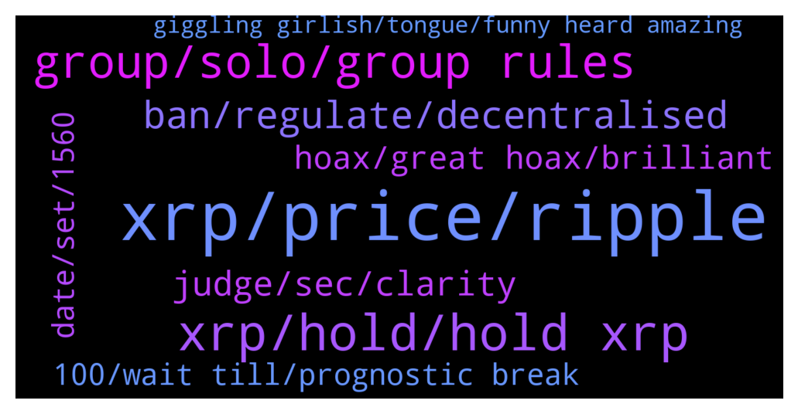

# **@Ripple**
 ## Analysis for **2022-01-30** - **2022-01-31**.

---

## 📊 **Basic Stats**

**n_messages_sent**: 157

---

---

## 🔝 **Top keywords and related messages**

1. **xrp, price, ripple**

    @Likeitorpumpit --- *Why are You Tubers (Bit Boy) saying XRP is going to go to $10,000. Never will it go that high in a month of Sunday’s, or am I missing something here ??* **--->** [TG Discussion](https://t.me/Ripple/3047590)

    @Kbron123 --- *After it wins against SEC past September do You believe xrp can go beyond 10$ ?* **--->** [TG Discussion](https://t.me/Ripple/3047813)

    @shaggy --- *What are future prospect for ripple coin.. I m holding it from a quite a long.. When can we expect game changer for ripple coin and same in price action?* **--->** [TG Discussion](https://t.me/Ripple/3047694)

    @marianmp --- *Only if ripple burns there xrp we will se big jump* **--->** [TG Discussion](https://t.me/Ripple/3047661)

    @FTWASM --- *Even so. Buying the dip and dca only goes so far. At one point or another price has to go up to make a profit, at least if you're not daytrading. And with the lawsuit dragging on without any concreet results I think the mayority of xrp investors are fed up with all the "postponing". We want clarity.* **--->** [TG Discussion](https://t.me/Ripple/3047540)

    @Likeitorpumpit --- *He just as bad some times saying BTC the road to $260,000.. few weeks ago.. Yes it will prob $260k after 5 years not before* **--->** [TG Discussion](https://t.me/Ripple/3047596)

2. **xrp, hold, hold xrp**

    @Ekkimukk10 --- *Only holding around 6k XRP though and it seems like most people hold over 100k lol'* **--->** [TG Discussion](https://t.me/Ripple/3047644)

    @CARXVV --- *Can anyone explain the reason why XRP is not centralized?* **--->** [TG Discussion](https://t.me/Ripple/3047873)

    @JesusJames --- *who said that i hold Xrp ?* **--->** [TG Discussion](https://t.me/Ripple/3047678)

    @Ekkimukk10 --- *(do you seriously not hold XRP tho)* **--->** [TG Discussion](https://t.me/Ripple/3047689)

    @Yagiz342935 --- *I wish they would answer.  I wanted to ask about xrp, so that people who know can help.  anyway i'm sorry* **--->** [TG Discussion](https://t.me/Ripple/3047382)

    @marianmp --- *If a few number of people have most of xrp ,that tells me something* **--->** [TG Discussion](https://t.me/Ripple/3047654)

3. **group, solo, group rules**

    @TraderAT --- *I noticed that and i blocked them. Thank you for the Info 👍🙂* **--->** [TG Discussion](https://t.me/Ripple/3047758)

    @JesusJames --- *@TraderAT the solo group you're in is a scam group do not give them your seed phrase* **--->** [TG Discussion](https://t.me/Ripple/3047757)

    @Yagiz342935 --- *I didn't understand, did I write something wrong* **--->** [TG Discussion](https://t.me/Ripple/3047380)

    @JesusJames --- *probably because you can't follow directions , you're not even in the solo group try going there first and reading some* **--->** [TG Discussion](https://t.me/Ripple/3047922)

    @Tinkabellagal --- *@Cezto Read only until offensive profile image is changed Also all messages have been removed  You can go to @rippleresolutions to talk about it* **--->** [TG Discussion](https://t.me/Ripple/3047900)

    @JesusJames --- *Ummm i am the admin lol* **--->** [TG Discussion](https://t.me/Ripple/3047682)

4. **ban, regulate, decentralised**

    @CARXVV --- *Well, I believe, decentralizing validation is critical for a blockchain, they can basically reverte anything if they agree. I assume Bitcoin wallet concentration is a consequence of the mining process and early adopters, not sure why aren't Reipple nodes more distributed or open for anyone to participate.* **--->** [TG Discussion](https://t.me/Ripple/3047895)

    @gerrymchugh --- *Eth are changing to concensus too, in fact they don't really seem to know what they're doing yet. BTC has most supply controlled by very small number of wallets, so while the validation is decentralised the supply is most definitely not.* **--->** [TG Discussion](https://t.me/Ripple/3047892)

    @CARXVV --- *Well, if you choose people that operate them, that is not very descentralized, anyone can mine bitcoin or Eth, I wonder why is it that way* **--->** [TG Discussion](https://t.me/Ripple/3047891)

    @gerrymchugh --- *I dont know that for definite, maybe someone else here does but even if it is, they don't own/operate them... Still decentralised* **--->** [TG Discussion](https://t.me/Ripple/3047888)

    @kokodjamba11 --- *Somewhere they want to ban cryptocurrency, why do it?* **--->** [TG Discussion](https://t.me/Ripple/3047866)

    @Intervene_Herbal --- *They will never ban something that is taxable, think of the millions they tax people then you'll realize crypto won't go anywhere soon* **--->** [TG Discussion](https://t.me/Ripple/3047890)

5. **judge, sec, clarity**

    @FTWASM --- *I need clarity on when the postponing stops and the judge start doing her work.* **--->** [TG Discussion](https://t.me/Ripple/3047572)

    @Ashish --- *Hello when is the final verdict on sec ?* **--->** [TG Discussion](https://t.me/Ripple/3047488)

    @Russty007 --- *I bet the judge will retire after this case* **--->** [TG Discussion](https://t.me/Ripple/3047748)

    @JustNNM --- *Think he just meant clarity from the SEC* **--->** [TG Discussion](https://t.me/Ripple/3047571)

    @Jake_ripple_XRP --- *I trust the judge sees the duplicity of the SEC... and the weakness of their case... and rules accordingly...* **--->** [TG Discussion](https://t.me/Ripple/3047450)

    @Rektallstar --- *Yeah unfortunately that is the way it works here. The judge can get away with alot that may not seen fair to us.* **--->** [TG Discussion](https://t.me/Ripple/3047574)

6. **hoax, great hoax, brilliant**

    @marianmp --- *Either it's something great or a hoax* **--->** [TG Discussion](https://t.me/Ripple/3047656)

    @Ekkimukk10 --- *It's a decision to believe at the end of the day. There's tons of sources to support whatever narrative you decide to pursue.* **--->** [TG Discussion](https://t.me/Ripple/3047637)

    @marianmp --- *Just saying aliens are real .....doesn t mean you are right...you need to have something to back it up* **--->** [TG Discussion](https://t.me/Ripple/3047679)

    @Ekkimukk10 --- *Not sure I agree with that dichotomy, there's a lot between great and hoax :) smart people rigging for themselves isn't neccessarily a hoax. It can still be wildly successful for everyone else.* **--->** [TG Discussion](https://t.me/Ripple/3047657)

    @Tinkabellagal --- *No conspiracies in here We add factual news* **--->** [TG Discussion](https://t.me/Ripple/3047505)

    @Ekkimukk10 --- *It's a brilliant focused distraction on top of a brilliant solution to a real-world problem, I feel you* **--->** [TG Discussion](https://t.me/Ripple/3047641)

7. **date, set, 1560**

    @Jodxb2311 --- *We have been in a range between 1560-1820 sats the last 8 months* **--->** [TG Discussion](https://t.me/Ripple/3047942)

    @Kingbtc1234 --- *Research but if u need guess probably soon 35k below* **--->** [TG Discussion](https://t.me/Ripple/3047933)

    @Akon924 --- *The date is set to september? Cool* **--->** [TG Discussion](https://t.me/Ripple/3047834)

    @JustNNM --- *No one knows, there is no set date.* **--->** [TG Discussion](https://t.me/Ripple/3047494)

    @Russty007 --- *Monday the 31st at 1:57pm ET brother* **--->** [TG Discussion](https://t.me/Ripple/3047397)

    @msw1968 --- *What date? Where is this date logged?* **--->** [TG Discussion](https://t.me/Ripple/3047837)

8. **100, wait till, prognostic break**

    @marianmp --- *Just wait till a great news gets out ....then FOMO kicks in* **--->** [TG Discussion](https://t.me/Ripple/3047673)

    @jarilitmanen1 --- *Break out happening in the 4 hour* **--->** [TG Discussion](https://t.me/Ripple/3047585)

    @marianmp --- *When people quit then it pumps* **--->** [TG Discussion](https://t.me/Ripple/3047583)

    @Rektallstar --- *Agree. The depos were pushed back as well to be in person* **--->** [TG Discussion](https://t.me/Ripple/3047577)

    @Rektallstar --- *Cases like this are never fast. But I think we approaching the final phase soon here* **--->** [TG Discussion](https://t.me/Ripple/3047576)

    @marianmp --- *Nobody knows exactly ....so don't listen to nobody for 100% certain prognostic* **--->** [TG Discussion](https://t.me/Ripple/3047633)

9. **giggling girlish, tongue, funny heard amazing**

    @Rektallstar --- *It's basically citrus sweet soy sauce. So alot of stuff 😁😁* **--->** [TG Discussion](https://t.me/Ripple/3047629)

    @vroomhmhmmhmmm --- *Chef, what is great to eat with Ponzu 😎* **--->** [TG Discussion](https://t.me/Ripple/3047627)

    @Ekkimukk10 --- *I am giggling with girlish delight. That was funny.* **--->** [TG Discussion](https://t.me/Ripple/3047686)

    @marianmp --- *I've heard something amazing this days* **--->** [TG Discussion](https://t.me/Ripple/3047665)

    @JesusJames --- *cat got your tongue  ?* **--->** [TG Discussion](https://t.me/Ripple/3047687)

