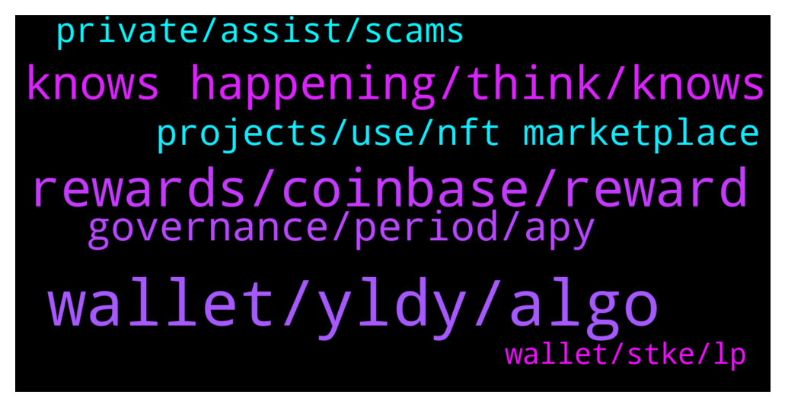

# **@algorand**
 ## Analysis for **2022-01-30** - **2022-01-31**.

---

## 📊 **Basic Stats**

**n_messages_sent**: 119

---

---

## 🔝 **Top keywords and related messages**

1. **wallet, yldy, algo**

    @MackDenver --- *Did you check your wallet balance in the Algo explorer?* **--->** [TG Discussion](https://t.me/algorand/336119)

    @rikaponti --- *Yes there are $Algo left but there is no trace of the $YLDY* **--->** [TG Discussion](https://t.me/algorand/336120)

    @defirlkp --- *check your transactions for when the $YLDY left your address and to which address it went to* **--->** [TG Discussion](https://t.me/algorand/336121)

    @yunusp24 --- *Sir why i cant confir my vote in my wallet* **--->** [TG Discussion](https://t.me/algorand/336236)

    @Dee --- *I put a screenshot up earlier* **--->** [TG Discussion](https://t.me/algorand/336203)

    @Elo82Elo --- *hello everyone, i have trouble collecting airdrop.  At the beginning, everything worked as it should and I have been getting an error for 3 weeks.  how can i solve this problem?* **--->** [TG Discussion](https://t.me/algorand/336139)

2. **rewards, coinbase, reward**

    @MackDenver --- *That is called Algorand governance rewards.* **--->** [TG Discussion](https://t.me/algorand/336142)

    @Abusaid01 --- *yes I am asking when distribute* **--->** [TG Discussion](https://t.me/algorand/336143)

    @patrick_crypto --- *Pretty sure it’s true.  Participation rewards end soon - only rewards are through governance.  Governance rewards are quarterly.* **--->** [TG Discussion](https://t.me/algorand/336089)

    @Mazharul72 --- *Sir, What About Domain Event? When it will End & Reward will distributed? Already i have Bought Domains.* **--->** [TG Discussion](https://t.me/algorand/336052)

    @etzYoung --- *Please how can i participate in the reward activities?* **--->** [TG Discussion](https://t.me/algorand/336145)

    @Gcko Coinsmaker --- *It is not. Staking take 7 days and most it always this future coins which doesn’t have value in investment. I prefer Bitcoin than any other coins so far* **--->** [TG Discussion](https://t.me/algorand/336094)

3. **knows happening, think, knows**

    @DiggityDoge --- *They might be trying to strategize a PR message which spins it the right way* **--->** [TG Discussion](https://t.me/algorand/336226)

    @DlHKl --- *wonder what marketing does all day, for a high profile ceo departure you normal make advance notice and thank them for their service etc.* **--->** [TG Discussion](https://t.me/algorand/336224)

    @DiggityDoge --- *No one knows if anything is actually happening, everything is speculation based on the linkedin update* **--->** [TG Discussion](https://t.me/algorand/336242)

    @DlHKl --- *you make it sound like he was sacked and there are no plans or replacement* **--->** [TG Discussion](https://t.me/algorand/336239)

    @DiggityDoge --- *Meanwhile he went ahead and updated his linked in* **--->** [TG Discussion](https://t.me/algorand/336227)

    @DiggityDoge --- *I'm any case, who knows what's happening behind the scenes, a statement might be coming* **--->** [TG Discussion](https://t.me/algorand/336180)

4. **governance, period, apy**

    @yabris --- *The first period of governance the apy was 16 PERC. What did it end? Because in this period apy is 10per a lot less* **--->** [TG Discussion](https://t.me/algorand/336056)

    @MackDenver --- *You can join the governance for extra APY.* **--->** [TG Discussion](https://t.me/algorand/336026)

    @yabris --- *Hey what was the final apy of period 1 governance vs the first list of eligible?* **--->** [TG Discussion](https://t.me/algorand/336018)

    @Patdogbaby --- *it is just me or is the governance info more difficult to find than it should be ?* **--->** [TG Discussion](https://t.me/algorand/336132)

    @fiskmen --- *I missed the Community Governance signup period unfortunately.. This is a long shot but is there any way to apply for period 2 anyways or do I have to wait for the next round?* **--->** [TG Discussion](https://t.me/algorand/336020)

    @MackDenver --- *Hello @Patdogbaby, Algorand governance information are easily accessible. You can take a look here: https://governance.algorand.foundation/* **--->** [TG Discussion](https://t.me/algorand/336134)

5. **projects, use, nft marketplace**

    @Broohere --- *Is there a crowdfunding site for algorand like gitcoin for eth??* **--->** [TG Discussion](https://t.me/algorand/335999)

    @NightAlgorand --- *Here is the price discussion group, please use this group for price discussion   https://t.me/algorand_price* **--->** [TG Discussion](https://t.me/algorand/336050)

    @NightAlgorand --- *We are currently focused on expanding our ecosystem, bringing more use cases, and onboard new projects 🙂 You can find more about us here https://algorand.foundation/ecosystem* **--->** [TG Discussion](https://t.me/algorand/335972)

    @MackDenver --- *You can talk about Algorand ecosystem projects, no worries.* **--->** [TG Discussion](https://t.me/algorand/336164)

    @Broohere --- *I am working on building an algorand nft marketplace   Anyone interested to join me* **--->** [TG Discussion](https://t.me/algorand/335994)

    @Broohere --- *Anyone here interested in getting involved in a nft marketplace project based on algorand??* **--->** [TG Discussion](https://t.me/algorand/336220)

6. **private, assist, scams**

    @MackDenver --- *Sure, how can I assist you?* **--->** [TG Discussion](https://t.me/algorand/336127)

    @rikaponti --- *some scams are writing me in private ... is it possible to get help from you?* **--->** [TG Discussion](https://t.me/algorand/336124)

    @DiggityDoge --- *Alright, sorry if I'm not stalking ppls social accounts* **--->** [TG Discussion](https://t.me/algorand/336179)

    @Crypt0Playa --- *What kind of question is that? 🤣* **--->** [TG Discussion](https://t.me/algorand/336048)

    @MackDenver --- *Hey KAPI, If it was something important, you can resend the message.* **--->** [TG Discussion](https://t.me/algorand/336162)

    @rikaponti --- *can I write to you in private?* **--->** [TG Discussion](https://t.me/algorand/336128)

7. **wallet, stke, lp**

    @MackDenver --- *The signup period for the governance has over. At the moment, you can hold ALGO in official wallet and earn staking rewards.* **--->** [TG Discussion](https://t.me/algorand/336146)

    @Dee --- *I created a Algo+stke lp. But I only got 141 lp tokens. Is that the right amount for 1500 algo and 150,000 stke?* **--->** [TG Discussion](https://t.me/algorand/336221)

    @marcooo_98 --- *Hi, at the moment I have my Algorand on Algorand wallet that give me 5%apy, there are platform that give a better return?* **--->** [TG Discussion](https://t.me/algorand/336025)

    @MackDenver --- *The APY for staking has reduced a bit. Maybe you can use official Algorand wallet.* **--->** [TG Discussion](https://t.me/algorand/336002)

    @therealthinkright --- *Try Atomic wallet. It available on pc and phone* **--->** [TG Discussion](https://t.me/algorand/335946)

