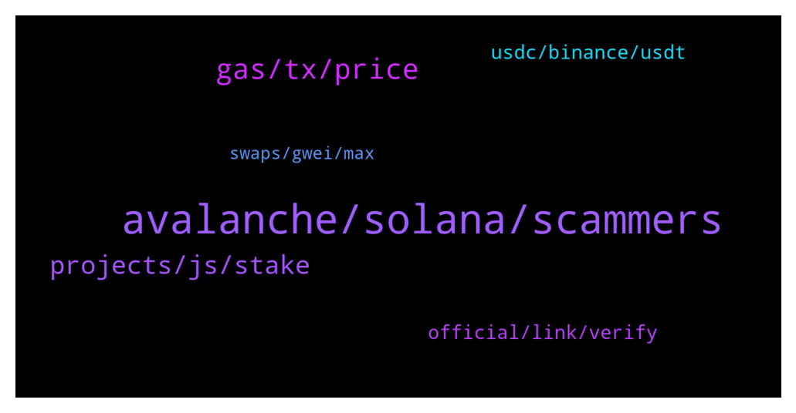

# **@avalancheavax**
 ## Analysis for **2022-01-30** - **2022-01-31**.

---

## 📊 **Basic Stats**

**n_messages_sent**: 173

---

---

## 🔝 **Top keywords and related messages**

1. **avalanche, solana, scammers**

    @Vico007 --- *To all the scammers: i wish that all your children pay the karma that you have left them through theft. I condemn them to eternal poverty.* **--->** [TG Discussion](https://t.me/avalancheavax/325591)

    @Patrick --- *Good morning. Please can anyone here confirm that Patrick Sutton works with avalanche and is a customer care representative ?* **--->** [TG Discussion](https://t.me/avalancheavax/325649)

    @oathtobarbatos --- *Be careful with anyone's DM, guys* **--->** [TG Discussion](https://t.me/avalancheavax/325333)

    @B_sh999 --- *Don't agree. Solana main net is beta . Ddos attack could be occurred on all blockchains.  U mentioned finding node for attacking is easy in POH but even without  consideration  a solution  for this, due to increasing the amount of node validators attacking on all them is impossible . Just like what makes attack on Bitcoin  is very hard and costly* **--->** [TG Discussion](https://t.me/avalancheavax/325484)

    @xChrisMoneyMakerx --- *this room is full of scammers lmao* **--->** [TG Discussion](https://t.me/avalancheavax/325540)

    @neirenoir --- *I think Solana is a total engineering blunder. Not sure how they have managed to get away with it.* **--->** [TG Discussion](https://t.me/avalancheavax/325483)

2. **gas, tx, price**

    @vicflair564 --- *Avax is pissing me off bro how are other people getting txs to go thru but mine are taking 30 minutes?* **--->** [TG Discussion](https://t.me/avalancheavax/325580)

    @oathtobarbatos --- *Your tx gas price is under the current market price, try increasing it* **--->** [TG Discussion](https://t.me/avalancheavax/325711)

    @oathtobarbatos --- *Try increasing the gas price, the current med gas price is 57 nAVAX ($0.08)* **--->** [TG Discussion](https://t.me/avalancheavax/325565)

    @Vico007 --- *Is your network, check it and update it* **--->** [TG Discussion](https://t.me/avalancheavax/325584)

    @cutyflame --- *it worked, but the tx on trader joe still pending. weird. thank u my friend* **--->** [TG Discussion](https://t.me/avalancheavax/325722)

    @moonormars --- *Does 1inch on avax have lower gas?* **--->** [TG Discussion](https://t.me/avalancheavax/325512)

3. **projects, js, stake**

    @ravasude --- *Is there a way to get free AVAX for staking purpose? (Similar to Matic Vault)* **--->** [TG Discussion](https://t.me/avalancheavax/325370)

    @arcterex --- *Thanks.  I've followed Avalaunch, Avaxholic, AvxLaunchpad, Avalanche Today....any other ones for new projects?* **--->** [TG Discussion](https://t.me/avalancheavax/325385)

    @DillonRookMN --- *Is Nino a legit Avax support? He told me in the group chat to dm him for instructions on how to stake. He asked if I had  validator and if I have connected to the Avax firmware Bridge.* **--->** [TG Discussion](https://t.me/avalancheavax/325657)

    @ofehmi --- *Is there any channel for avalaunch idos* **--->** [TG Discussion](https://t.me/avalancheavax/325498)

    @cutyflame --- *well thank u serr, so just import the avax web wallet & use metamask for dapps* **--->** [TG Discussion](https://t.me/avalancheavax/325642)

    @lclouis7 --- *i would like to start my own token on the avax blockchain i have unlimited time but no avax so if you donate i would be very appreciative if you did* **--->** [TG Discussion](https://t.me/avalancheavax/325367)

4. **official, link, verify**

    @DillonRookMN --- *Is that an actual Avax Telegram group?* **--->** [TG Discussion](https://t.me/avalancheavax/325663)

    @oathtobarbatos --- *Twitter is one good way to find them, for example!* **--->** [TG Discussion](https://t.me/avalancheavax/325382)

    @Nicolas_A --- *You can verify it's legit as the official website will link you to this channel* **--->** [TG Discussion](https://t.me/avalancheavax/325666)

    @Tech-Lover --- *It’s on a group tag avax official like that* **--->** [TG Discussion](https://t.me/avalancheavax/325610)

    @oathtobarbatos --- *As Nicolas said, you can verify this is the only main group on the official website, the invitation link will redirect you to this group again* **--->** [TG Discussion](https://t.me/avalancheavax/325670)

    @oathtobarbatos --- *This is the only official group, you can always double-check it looking at the member count. There's no airdrops and stuff like that* **--->** [TG Discussion](https://t.me/avalancheavax/325614)

5. **usdc, binance, usdt**

    @Nicolas_A --- *Hey Jonathan, Binance doesn't support direct withdrawals to Avalanche for USDT / USDT.e.  What you can do is withdraw USDT to another network such as BSC for Binance and then bridge it over to Avalanche with a bridge such as Celer Network or Synapse protocol* **--->** [TG Discussion](https://t.me/avalancheavax/325690)

    @TheSEOdude --- *Would  you just tell me about the overall fee for the process ?  I am also thinking of doing the same now.* **--->** [TG Discussion](https://t.me/avalancheavax/325694)

    @Ace422 --- *what about USDC & USDT, and what's the different between *.e and the regular ones?* **--->** [TG Discussion](https://t.me/avalancheavax/325424)

    @T Tom --- *hi, if i use multichain to bridge usdc to avax, is it usdc.e or native usdc from circle?* **--->** [TG Discussion](https://t.me/avalancheavax/325433)

    @Viro --- *It's not worth 4K, please don't touch it! It will drain your account empty!* **--->** [TG Discussion](https://t.me/avalancheavax/325720)

    @Nicolas_A --- *Really not much. Withdrawal from Binance fee + small bridge fee + tiny bit of slippage (like 0.1%). Don't have a dollar amount* **--->** [TG Discussion](https://t.me/avalancheavax/325695)

6. **swaps, gwei, max**

    @apollox --- *What is the max you can set to? How high can you go* **--->** [TG Discussion](https://t.me/avalancheavax/325567)

    @ramziakram --- *look into snowtrace for average gas fees. can speed up your transaction in metamask with new gas fees* **--->** [TG Discussion](https://t.me/avalancheavax/325582)

    @oathtobarbatos --- *I'm not sure but, I think it's 21000* **--->** [TG Discussion](https://t.me/avalancheavax/325570)

    @Lil_Dian --- *Didn't get any score below score below B👍* **--->** [TG Discussion](https://t.me/avalancheavax/325487)

    @oathtobarbatos --- *Yeah, try using 21000 as the gas limit. This is what I normally use for transactions and swaps and, everything else* **--->** [TG Discussion](https://t.me/avalancheavax/325572)

    @apollox --- *What is the max AMOUNT of gwei you can use in swaps on traderjoe?* **--->** [TG Discussion](https://t.me/avalancheavax/325559)

