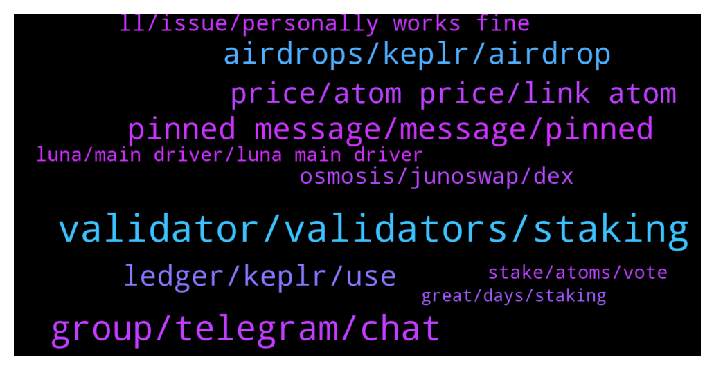

# **@cosmosproject**
 ## Analysis for **2022-01-30** - **2022-01-31**.

---

## 📊 **Basic Stats**

**n_messages_sent**: 235

---

---

## 🔝 **Top keywords and related messages**

1. **validator, validators, staking**

    @AtomJazz --- *It's the only way to vote actually. If you're not staking you can't vote* **--->** [TG Discussion](https://t.me/cosmosproject/483651)

    @Ilpaliuz --- *So the advice when i want unbonding it's wrong: "Trying to switch validators? Use the ‘Redelegate’ feature to instantly stake your assets to another validator."* **--->** [TG Discussion](https://t.me/cosmosproject/483056)

    @AtomJazz --- *Yeah you can redelegate instantly but only once per 21 days.* **--->** [TG Discussion](https://t.me/cosmosproject/483057)

    @AtomJazz --- *No need. As long as you're staked with another validator you're good* **--->** [TG Discussion](https://t.me/cosmosproject/483541)

    @soapsniffa --- *Why aren’t you staking all of yours* **--->** [TG Discussion](https://t.me/cosmosproject/483133)

    @De_Cryptopreneur --- *How long does it take for a redelegation To be completed??? @AtomJazz* **--->** [TG Discussion](https://t.me/cosmosproject/483455)

2. **group, telegram, chat**

    @defi_intern --- *I just dropped u a pm of it though 😅 do u mind sending the group tele link* **--->** [TG Discussion](https://t.me/cosmosproject/483724)

    @Wes --- *Is there a spam telegram group out there? I got a second ATOM group n my inbox now lol* **--->** [TG Discussion](https://t.me/cosmosproject/483401)

    @Xszeanx --- *I lost the Indonesian atomic chat group, because my Telegram account was delted* **--->** [TG Discussion](https://t.me/cosmosproject/483954)

    @defi_intern --- *Erm I clicked it but still says private though  https://cosmoscan.net/cosmos* **--->** [TG Discussion](https://t.me/cosmosproject/483727)

    @ZoltanAtom --- *You should try to pass the bot or you have been blocked before from their telegram. Try to reach them via twitter.* **--->** [TG Discussion](https://t.me/cosmosproject/483728)

    @defi_intern --- *The group seems private though :(* **--->** [TG Discussion](https://t.me/cosmosproject/483718)

3. **pinned message, message, pinned**

    @defi_intern --- *Yea I sent their cosmoscan link to ask them and I got kicked out immediately lol* **--->** [TG Discussion](https://t.me/cosmosproject/483732)

    @Butra1 --- *Hi, will there be a bridge between polygon and cosmos?* **--->** [TG Discussion](https://t.me/cosmosproject/483104)

    @Cosmos_HOSS --- *Crypto Rich new video about IBC/ Chihuahua/ Cosmos... Solid Video https://www.youtube.com/watch?v=t-Q7vc3Ks2k* **--->** [TG Discussion](https://t.me/cosmosproject/483490)

    @ZoltanAtom --- *Hi there,Cosmos official has a list of all tokens,apps and services. Have a look at it;  https://cosmos.network/ecosystem/apps* **--->** [TG Discussion](https://t.me/cosmosproject/483936)

    @ZoltanAtom --- *Please check it at Cosmos explorers. Links are at the pinned message.* **--->** [TG Discussion](https://t.me/cosmosproject/483772)

    @AtomJazz --- *Keplr or Cosmostation. Tutorials are in the pinned message* **--->** [TG Discussion](https://t.me/cosmosproject/483120)

4. **airdrops, keplr, airdrop**

    @ZoltanAtom --- *Just wait for a while! Hopefully there will be blog post related airdrop rules and more.* **--->** [TG Discussion](https://t.me/cosmosproject/483919)

    @TalcHands --- *And can we claim airdrops through the keplr wallet?* **--->** [TG Discussion](https://t.me/cosmosproject/483361)

    @LVpoker --- *Hi guys What’s the best wallet for staking to receive airdrops also?* **--->** [TG Discussion](https://t.me/cosmosproject/483259)

    @Gnolang --- *Question jazz you think larger airdrops should be allocated to stakers that held their tokens longer or the amount you have staked before knowing a snapshot is coming?* **--->** [TG Discussion](https://t.me/cosmosproject/483832)

    @Gj_ivan --- *I Heard we can take airdrops by staking ATOM... How It works?* **--->** [TG Discussion](https://t.me/cosmosproject/483136)

    @rus_UST --- *just checking, if you are in the undelegation period on Keplr for your Atom, you are not elibigle for airdrops that take their snapshot while you're undelegating, right?* **--->** [TG Discussion](https://t.me/cosmosproject/483910)

5. **price, atom price, link atom**

    @Jr --- *Is it a good time to buy* **--->** [TG Discussion](https://t.me/cosmosproject/483409)

    @AnonymousOceanStorm --- *If anyone is concerned about Atom price, come to the price chat, we got you covered. My advice: don’t think in $, think in airdrops!* **--->** [TG Discussion](https://t.me/cosmosproject/483786)

    @Atomgazua --- *Any problem with atom? Fuxk price* **--->** [TG Discussion](https://t.me/cosmosproject/483476)

    @PototskiyKostya --- *does anyone know how long atom will still fall?* **--->** [TG Discussion](https://t.me/cosmosproject/483774)

    @Andrea --- *Hi guys! I have atoms in stacking on Kepler, I can't find a way to check when I have started to stack them. Is it possible to find the date?* **--->** [TG Discussion](https://t.me/cosmosproject/483973)

    @ZoltanAtom --- *This is link of Atom price chat.   https://t.me/AtomPrice* **--->** [TG Discussion](https://t.me/cosmosproject/483952)

6. **ledger, keplr, use**

    @AtomJazz --- *Use Keplr with your ledger device* **--->** [TG Discussion](https://t.me/cosmosproject/483544)

    @Matt_Blocks_United --- *Plug your Nano into your PC and open Keplr.  Ledger Live is buggy. Use Keplr to manage your Cosmos ecosystem tokens.* **--->** [TG Discussion](https://t.me/cosmosproject/483600)

    @Fabien --- *hello anyone has any issue to get the rewards on ledgerlive? I have always the same message which fails (API HTTP 400)* **--->** [TG Discussion](https://t.me/cosmosproject/483543)

    @Andi_EWM --- *I wanted to import my Keplr Wallet(used with Ledger) into cosmosstation app. But the addresses saved with a ledger are not shown in cosmosstation app. Will you guys fix this?* **--->** [TG Discussion](https://t.me/cosmosproject/483288)

    @whirlingcrypto --- *hi fellow cosmonauts. can i ask for some help here regarding unstaking atom in ledger live? This gives a API 400 error* **--->** [TG Discussion](https://t.me/cosmosproject/483595)

    @Mark --- *Just set up a watch address  in cosmostation. If you want to import your private key from a ledger into cosmostation I would question  why you bought a ledger in the first place.* **--->** [TG Discussion](https://t.me/cosmosproject/483324)

7. **osmosis, junoswap, dex**

    @greekempire --- *is there a list of all the DEXes in the ecosystem? Emeris, Osmosis, Secretswap, Buttonswap, Sifchainswap, Junoswap, Terraswap* **--->** [TG Discussion](https://t.me/cosmosproject/483935)

    @Jonathan --- *Need some help with Luna in osmosis, should I dm a mod?* **--->** [TG Discussion](https://t.me/cosmosproject/483748)

    @ZoltanAtom --- *Hi there, please join Osmosis community and ask it there to Admins. You don’t need to dm anyone. Admins will be helping you there.  https://t.me/osmosis_chat* **--->** [TG Discussion](https://t.me/cosmosproject/483749)

    @ggwashinton1 --- *Yes. Connect it to a dapp like osmosis* **--->** [TG Discussion](https://t.me/cosmosproject/483368)

    @ggwashinton1 --- *Also provide liquidity on osmosis or JunoSwap* **--->** [TG Discussion](https://t.me/cosmosproject/483222)

    @ggwashinton1 --- *or provide liquidity on JUNOswap deX* **--->** [TG Discussion](https://t.me/cosmosproject/483697)

8. **ll, issue, personally works fine**

    @Jonathan --- *Wanted to make sure, sorry about that* **--->** [TG Discussion](https://t.me/cosmosproject/483518)

    @Sardon70 --- *Ok, thank for your kindness and precision in the answers 😊* **--->** [TG Discussion](https://t.me/cosmosproject/483448)

    @TicoJohnny --- *Yes there seems to be an issue* **--->** [TG Discussion](https://t.me/cosmosproject/483109)

    @ggwashinton1 --- *no issue. Just eth maxis making shit up* **--->** [TG Discussion](https://t.me/cosmosproject/483666)

    @najmiddinov_nuriddin --- *Never done that before... Ok, I'll check youtube tutorials.* **--->** [TG Discussion](https://t.me/cosmosproject/483416)

    @whirlingcrypto --- *Thx but it is resolved. Found out ll is buggy indeed* **--->** [TG Discussion](https://t.me/cosmosproject/483601)

9. **luna, main driver, luna main driver**

    @hleb_albau --- *we are all interconnected here and luna was main driver for months* **--->** [TG Discussion](https://t.me/cosmosproject/483780)

    @hleb_albau --- *till luna will fall, but when gravity will online it maybe bounces back* **--->** [TG Discussion](https://t.me/cosmosproject/483778)

    @AtomJazz --- *Pls move Luna discussion to their own channel* **--->** [TG Discussion](https://t.me/cosmosproject/483799)

    @AtomJazz --- *Agree to disagree. For sure ATOM JUNO and OSMO are correlated but not LUNA. This will probably change in the future since now we have it on IBC too but historically speaking this has not been the case* **--->** [TG Discussion](https://t.me/cosmosproject/483783)

    @AtomJazz --- *No it wasn't. Luna was a main driver for Luna not for ATOM* **--->** [TG Discussion](https://t.me/cosmosproject/483781)

    @AtomJazz --- *Wut? Luna is an application specific cosmos chain that has nothing to do with cosmos hub and ATOM specifically* **--->** [TG Discussion](https://t.me/cosmosproject/483779)

10. **stake, atoms, vote**

    @Antoniomarrazzo --- *hi guys, what is the best way to stake atoms? i'm new but actually i have some atoms stacking in binance* **--->** [TG Discussion](https://t.me/cosmosproject/483348)

    @pablo_flow --- *Ah OK, thanks so much ... i thought that the atom holder (in wallet, no stake) only could vote* **--->** [TG Discussion](https://t.me/cosmosproject/483653)

    @pablo_flow --- *Hi, ¿is it possible to vote in Cosmos Governance if all of my ATOMs are in Staking?. In other words ... ¿could i vote with ATOMs in Stake?* **--->** [TG Discussion](https://t.me/cosmosproject/483648)

    @najmiddinov_nuriddin --- *How can I send ATOM from Binance?* **--->** [TG Discussion](https://t.me/cosmosproject/483413)

    @ZoltanAtom --- *For nomic, you don’t need your Atoms at staked as far as I know. So I think you will be eligible for $Nom drop. Have you check Nomic website ? Join their telegram ?* **--->** [TG Discussion](https://t.me/cosmosproject/483915)

    @Sardon70 --- *Hi, I was thinking to put some Atom in stake but I have a couple of questions: 1) is inbounding period 21 days? In case is there a plan to reduce it and will it be changed from liquid staking? 2) do we get rewards during unbounding period?* **--->** [TG Discussion](https://t.me/cosmosproject/483427)

