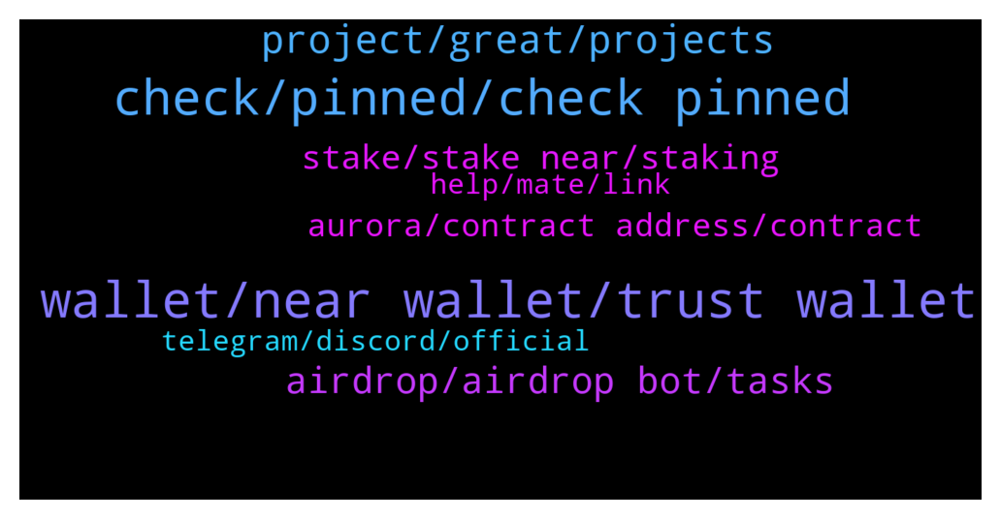

# **@cryptonear**
 ## Analysis for **2022-01-30** - **2022-01-31**.

---

## 📊 **Basic Stats**

**n_messages_sent**: 314

---

---

## 🔝 **Top keywords and related messages**

1. **wallet, near wallet, trust wallet**

    @Doganalpaslan1 --- *Are there any mobil application that developing for near wallet* **--->** [TG Discussion](https://t.me/cryptonear/323426)

    @preeti4141 --- *Sir last question clear me i want to withdraw near from binance what address should I give 64 digit correct?* **--->** [TG Discussion](https://t.me/cryptonear/322563)

    @iamkemoo --- *Hey, so when you didn’t write down your passphrase you can’t recover it. What you can do is disable the recovering mode via Passphrase and create a new Passphrase* **--->** [TG Discussion](https://t.me/cryptonear/319208)

    @anonymousrisk --- *Hello, my deposit from near to binance didn’t arrive how do I retrieve it ? It was already successful,* **--->** [TG Discussion](https://t.me/cryptonear/321422)

    @larry_lang --- *Well if u withdraw\deposit the fund the balance would still change, but that will be the balance of the id.near* **--->** [TG Discussion](https://t.me/cryptonear/322557)

    @Kripto_Raptor --- *we want but dont expect a mobile Near Wallet wallet.near.org anytime soon* **--->** [TG Discussion](https://t.me/cryptonear/323453)

2. **check, pinned, check pinned**

    @Laurenjamie --- *I got an issue  Any help team here Or admin Please i need assistance* **--->** [TG Discussion](https://t.me/cryptonear/323198)

    @becausetelegram --- *trying to see a list of admins. since you sent a link am just trying to make sure you are one* **--->** [TG Discussion](https://t.me/cryptonear/323376)

    @MadhusudanDeep --- *Hey what Is json rpc error* **--->** [TG Discussion](https://t.me/cryptonear/320623)

    @iforbusiness2 --- *seriously 😳 it not showing 'Community mod' tag ?* **--->** [TG Discussion](https://t.me/cryptonear/323379)

    @kv9990 --- *Yup. DM @larry_lang or @iamkemoo 😉* **--->** [TG Discussion](https://t.me/cryptonear/320984)

    @agathearts --- *@zubairansari07 in what channel should i report this.* **--->** [TG Discussion](https://t.me/cryptonear/322804)

3. **project, great, projects**

    @Rkrishna123 --- *Please help me to give information regarding the projects* **--->** [TG Discussion](https://t.me/cryptonear/319460)

    @larry_lang --- *and by near pad u meant this project right? https://twitter.com/NearPad* **--->** [TG Discussion](https://t.me/cryptonear/322362)

    @smartinvestor20212021 --- *This project can give sol a run for its money* **--->** [TG Discussion](https://t.me/cryptonear/319274)

    @naeem644 --- *Innovative project with amazing invention under the management of successful and brilliant teams. hope to be more and more popular!* **--->** [TG Discussion](https://t.me/cryptonear/320134)

    @Rkrishna123 --- *I am very new to know about this project* **--->** [TG Discussion](https://t.me/cryptonear/319458)

    @ljenniferjpharperay --- *all of project Near is very great!* **--->** [TG Discussion](https://t.me/cryptonear/319993)

4. **airdrop, airdrop bot, tasks**

    @larry_lang --- *^^ also keep in mind that we do not have airdrop bots or others airdrops that requires u to give out 12 seedphares^^ so pls double check with us when u see others events* **--->** [TG Discussion](https://t.me/cryptonear/321145)

    @jimmyshawn --- *Can't participate only want airdrop without doing much* **--->** [TG Discussion](https://t.me/cryptonear/322159)

    @afshinvatan --- *hi bro does your team have an Airdrop??* **--->** [TG Discussion](https://t.me/cryptonear/321469)

    @goldturn --- *Is there an airdrop that's going on?* **--->** [TG Discussion](https://t.me/cryptonear/320579)

    @cryptodance27 --- *how to we get notified about upcoming projects and airdrops* **--->** [TG Discussion](https://t.me/cryptonear/320451)

    @larry_lang --- *hehe im afraid we dont do airdrop like that=)))* **--->** [TG Discussion](https://t.me/cryptonear/322160)

5. **stake, stake near, staking**

    @crypto_blckhntr --- *Is that NEAR TOKENS or USA DOLLAR 💰💰* **--->** [TG Discussion](https://t.me/cryptonear/323535)

    @louismiguelcr --- *Hello everybody! I have a questio How to claim my tokens from CoinMarketCap Earn?* **--->** [TG Discussion](https://t.me/cryptonear/319836)

    @Alfalfaseeker --- *how do I buy this coin on meta mask?* **--->** [TG Discussion](https://t.me/cryptonear/322576)

    @Kripto_Raptor --- *⚠️⚠️Legit projects never do huge giveaways unless there is a big event like an AMA, a Hackaton, etc. and that giveaway would be symbolic. definitely nothing like deposit 100N get 200N ⚠️ ⚠️ Never share your Private keys, connect your wallet into suspicious sites* **--->** [TG Discussion](https://t.me/cryptonear/321476)

    @sanket_everstake --- *Hey, Everyone!  Our community is growing everyday. A lot of newcomers in here. Thus, I've made a list of all staking guides for you🙌  Feel free to contact me if you get any problem   🔶Staking via NearWallet   🔶How to Stake NEAR  in Moonlet Mobile Wallet  🔶How to stake NEAR at Dokia Capital  🔶How to stake NEAR in Math Wallet  🔶How to stake NEAR with Ledger  And video guides⬇️  🔷How to buy NEAR on Binance and how to stake via Moonlet wallet  🔷How to stake Near with Near wallet  Here is more articles about Near for you👇  ▪️Near Protocol contribution to the development of the Non-Fungible Token Market  ▪️ Rainbow bridge: foundation of global crypto adoption?  ▪️What is Near   ▪️How to stake NEAR  Hope it was helpful🤞* **--->** [TG Discussion](https://t.me/cryptonear/322228)

    @larry_lang --- *Double digit staking seem bullish indeed=]]]* **--->** [TG Discussion](https://t.me/cryptonear/322215)

6. **aurora, contract address, contract**

    @web0x --- *https://gov.near.org/t/proposal-1-000-billion-hak-airdrop-on-aurora-for-near-community/13286  Experience a crypto world without gas fees on Aurora* **--->** [TG Discussion](https://t.me/cryptonear/322422)

    @meekmary --- *Please what is the near contract address on Aurora* **--->** [TG Discussion](https://t.me/cryptonear/322807)

    @nearpunk --- *Hey guys! Somebody know a near wallet of Aurora CEO ?* **--->** [TG Discussion](https://t.me/cryptonear/321804)

    @NearFritz --- *$NEAR contract address on AURORA  "0xC42C30aC6Cc15faC9bD938618BcaA1a1FaE8501d"  $NEAR contract address on ETH "0x85F17Cf997934a597031b2E18a9aB6ebD4B9f6a4"  $NEAR contract address on BSC "0x1fa4a73a3f0133f0025378af00236f3abdee5d63"* **--->** [TG Discussion](https://t.me/cryptonear/319380)

    @Kripto_Raptor --- *you can check al defi on Near/Aurora at https://awesomenear.com/categories/defi* **--->** [TG Discussion](https://t.me/cryptonear/321772)

    @larry_lang --- *which route was that may i ask?* **--->** [TG Discussion](https://t.me/cryptonear/320943)

7. **telegram, discord, official**

    @TheGo1denBull --- *He's chatting on it now but that telegram is a ghost town at times. Better to use Discord imo* **--->** [TG Discussion](https://t.me/cryptonear/321847)

    @Zedrone --- *Don't know who is maintaining this English Telegram Announcement channel but you should learn from https://t.me/near_ru on both structure and aesthetics of correct Telegram Announcements.* **--->** [TG Discussion](https://t.me/cryptonear/323538)

    @becausetelegram --- *i dont see a tag next your name. but maybe its jst my telegram not working well, it happens ofter will rastart it and see.* **--->** [TG Discussion](https://t.me/cryptonear/323378)

    @TheGo1denBull --- *You can reach out to the dev channel on NEAR discord* **--->** [TG Discussion](https://t.me/cryptonear/321842)

    @Zedrone --- *Dropping tweet links in a Telegram news feed is a bad taste* **--->** [TG Discussion](https://t.me/cryptonear/323539)

    @Kripto_Raptor --- *yeah, and that devs don't often use telegram* **--->** [TG Discussion](https://t.me/cryptonear/321853)

