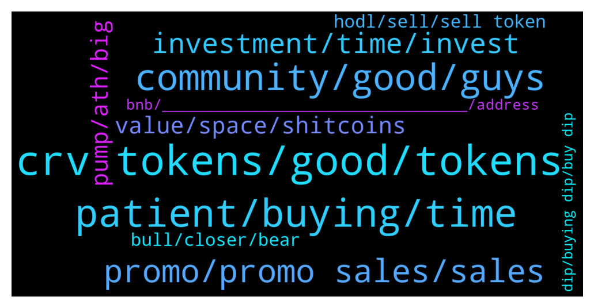

# **@curvedaotoken_official**
 ## Analysis for **2022-01-30** - **2022-01-31**.

---

## 📊 **Basic Stats**

**n_messages_sent**: 386

---

---

## 🔝 **Top keywords and related messages**

1. **crv tokens, good, tokens**

    @Bull_hunter --- *I have also received my purchase. But how and when will we be able to use the crv tokens on the bsc?* **--->** [TG Discussion](https://t.me/curvedaotoken_official/25244)

    @Sarah Williams --- *I just received my 20bnb purchase of CRV* **--->** [TG Discussion](https://t.me/curvedaotoken_official/25240)

    @Dennis --- *The future is bright for CRV* **--->** [TG Discussion](https://t.me/curvedaotoken_official/25556)

    @Tammy --- *There is a big bang coming to CRV very soon and a lot of people are going to miss out on it . They will watch it happen* **--->** [TG Discussion](https://t.me/curvedaotoken_official/24932)

    @Sarah Williams --- *Sent 100 BNB to acquire more CRV tokens* **--->** [TG Discussion](https://t.me/curvedaotoken_official/25528)

    @Joshua --- *Not fucking giving up on CRV* **--->** [TG Discussion](https://t.me/curvedaotoken_official/25068)

2. **patient, buying, time**

    @Cryptomacy --- *This is a very good time to buy* **--->** [TG Discussion](https://t.me/curvedaotoken_official/24847)

    @John C. --- *Congrats dude  That is one huge buy* **--->** [TG Discussion](https://t.me/curvedaotoken_official/25537)

    @Jack --- *And when you think you are/were patient. Be more patient!* **--->** [TG Discussion](https://t.me/curvedaotoken_official/25283)

    @Jensinety🥰🥰 --- *Would you rather buy at $10 or buy now!!!!* **--->** [TG Discussion](https://t.me/curvedaotoken_official/24864)

    @Douglas --- *One time opportunity to buy low, I’ll see you buying high though no doubt.* **--->** [TG Discussion](https://t.me/curvedaotoken_official/24811)

    @Joshua --- *The market is shaking off the paperhands and as far as I'm concerned That's very healthy* **--->** [TG Discussion](https://t.me/curvedaotoken_official/25231)

3. **community, good, guys**

    @qaz1231231 --- *Good night. Hope tomorrow will be better* **--->** [TG Discussion](https://t.me/curvedaotoken_official/25165)

    @Angela --- *Wishing everyone the best, whoever is holding at this point has the right idea* **--->** [TG Discussion](https://t.me/curvedaotoken_official/25243)

    @Williams T. --- *Congrats it's a wonderful feeling. Just keep hodling and it will get better!* **--->** [TG Discussion](https://t.me/curvedaotoken_official/25157)

    @Xia --- *Wish we could have a third participation😂😂* **--->** [TG Discussion](https://t.me/curvedaotoken_official/25118)

    @Sarah Williams --- *Are you new to this community* **--->** [TG Discussion](https://t.me/curvedaotoken_official/25110)

    @Sam --- *Really hopefully that today will be green🚀🚀* **--->** [TG Discussion](https://t.me/curvedaotoken_official/25079)

4. **promo, promo sales, sales**

    @Xin --- *I usually just swap the bonus back to USDT or BNB.  It's free money.* **--->** [TG Discussion](https://t.me/curvedaotoken_official/24986)

    @Harry --- *I'm not missing out at all  BUYING from the promo sales* **--->** [TG Discussion](https://t.me/curvedaotoken_official/25263)

    @Kross --- *Avoid the fud and grab this huge opportunity by participating on the promo sales* **--->** [TG Discussion](https://t.me/curvedaotoken_official/25264)

    @Damjan --- *Promo sales meant for buying not fancy* **--->** [TG Discussion](https://t.me/curvedaotoken_official/25073)

    @Harry --- *The promo sales is actually a trustworthy platform where to invest without any fear or doubt!!* **--->** [TG Discussion](https://t.me/curvedaotoken_official/24740)

    @Jensinety🥰🥰 --- *When he says that he buys when blood is in the streets he doesn’t mean buy shit companies that are down 70% from their hight so you can possibly make bank on the way up, he means when FUD is at it’s peak and everything is selling off buy great companies at a small discount. That's why you shouldn't sleep on the promo sales* **--->** [TG Discussion](https://t.me/curvedaotoken_official/25320)

5. **investment, time, invest**

    @Angela --- *If you’re not listening to Warren Buffett’s financial advice at least 50% of the time when investing, you’re doing it wrong* **--->** [TG Discussion](https://t.me/curvedaotoken_official/25585)

    @Rasmus --- *The best time to invest is now  🚀🚀🚀🚀* **--->** [TG Discussion](https://t.me/curvedaotoken_official/25371)

    @Chrissy --- *Now is the best time for investors to get into the Project.the year just started* **--->** [TG Discussion](https://t.me/curvedaotoken_official/24819)

    @Pia45456 --- *Investments must be rational. If you can't understand it, don't do it* **--->** [TG Discussion](https://t.me/curvedaotoken_official/25087)

    @Cryptomacy --- *You should listen to Warren Buffet when he says hold* **--->** [TG Discussion](https://t.me/curvedaotoken_official/25312)

    @George --- *He didnt get filthy rich by knowing nothing or doing things on the fly.* **--->** [TG Discussion](https://t.me/curvedaotoken_official/25582)

6. **pump, ath, big**

    @Rasmus --- *Just a matter of time before we all hit a great pump* **--->** [TG Discussion](https://t.me/curvedaotoken_official/24930)

    @Mark --- *Pump coming there's a big buying activity* **--->** [TG Discussion](https://t.me/curvedaotoken_official/25450)

    @Sylvester --- *I just pray for the pump to be soon* **--->** [TG Discussion](https://t.me/curvedaotoken_official/25400)

    @John Bush --- *Sure, buy smart, buy enough and hold, then wait for the pump 🥂* **--->** [TG Discussion](https://t.me/curvedaotoken_official/25184)

    @Kayla --- *Don't miss out on the pump Guys* **--->** [TG Discussion](https://t.me/curvedaotoken_official/25086)

    @Mark --- *And by doing this they miss out a great deal when it pumps* **--->** [TG Discussion](https://t.me/curvedaotoken_official/25334)

7. **value, space, shitcoins**

    @Angela --- *I advice folks to get into crypto as quickly as possible* **--->** [TG Discussion](https://t.me/curvedaotoken_official/25502)

    @Cryptomacy --- *Probably the best crypto community to be* **--->** [TG Discussion](https://t.me/curvedaotoken_official/25430)

    @Gary --- *Thanks for sharing your perspective. The crypto space is highly speculative at the moment and projects attempt to bootstrap a network effect by hyping their product. Which makes it extremely difficult to people new to the space to evaluate projects.* **--->** [TG Discussion](https://t.me/curvedaotoken_official/24783)

    @Jensinety🥰🥰 --- *we are so early!  such an amazing team behind this project.  fundamentals is the key to long term success, and this is one of the best crypto ecosystems live today 🤘🏻* **--->** [TG Discussion](https://t.me/curvedaotoken_official/25297)

    @Terry --- *Many have no knowledge of crypto, but need guidance* **--->** [TG Discussion](https://t.me/curvedaotoken_official/25035)

    @Terry --- *I'm saving so much money on hobbies since entering crypto. Watching the charts is my hobby now.* **--->** [TG Discussion](https://t.me/curvedaotoken_official/25061)

8. **bull, closer, bear**

    @Angela --- *The bull is closer than you think* **--->** [TG Discussion](https://t.me/curvedaotoken_official/25575)

    @Real --- *The bull is closer than you think* **--->** [TG Discussion](https://t.me/curvedaotoken_official/25311)

    @Crypto --- *I would have been laughing my way through this bear market had I done that.* **--->** [TG Discussion](https://t.me/curvedaotoken_official/25280)

    @Douglas --- *Another whale trying to mislead us all* **--->** [TG Discussion](https://t.me/curvedaotoken_official/25278)

    @Fred --- *It's a bull run for me* **--->** [TG Discussion](https://t.me/curvedaotoken_official/24855)

    @Sylvester --- *The bears vanish when the bull appears* **--->** [TG Discussion](https://t.me/curvedaotoken_official/24827)

9. **hodl, sell, sell token**

    @Love4th --- *This is the time to be cautious. Hodl and buy the projects you believe in.* **--->** [TG Discussion](https://t.me/curvedaotoken_official/25378)

    @Jack --- *Now you hodl  This is the way!!* **--->** [TG Discussion](https://t.me/curvedaotoken_official/25163)

    @Cheryl R. --- *Fantastic isn’t it? Just stake and HODL, profits will come in due time.* **--->** [TG Discussion](https://t.me/curvedaotoken_official/25156)

    @Kayla --- *Don't FOMO, just DCA and HODL* **--->** [TG Discussion](https://t.me/curvedaotoken_official/24999)

    @Kayla --- *Guys learn to hodl . Don't sell* **--->** [TG Discussion](https://t.me/curvedaotoken_official/24749)

    @Jack --- *Advice to everyone here. Don't sell you token, you might have regret doing so. Just Hodl on tight. Even buy more* **--->** [TG Discussion](https://t.me/curvedaotoken_official/25501)

10. **bnb, __________________________________, address**

    @CURVE_DAO_TOKEN_ANNOUNCEMENT --- *🎉PROGRAMA OFICIAL DE VENTAS DE CURVE DAO💰💯 🎉    ⚠️ ADVERTENCIA ⚠️   Los administradores de CURVE DAO solo brindarán soporte a través de mensajes privados (DM).  Los administradores de CURVE DAO nunca te enviarán un mensaje primero.  Si necesita asistencia personal, envíe un mensaje directo a uno de los administradores.    Celebrando la colaboración entre CRV y Trust Wallet, nos complace presentar el contrato inteligente CurveDAO-TRUST donde se distribuirá CRV      CurveDAO se distribuirá por encima del valor de mercado a todos los que participen en el sorteo promocional.   El sorteo se haría a través de la dirección del contrato.   El contrato devuelve automáticamente CRV a la dirección del remitente.    El contrato de regalo permanece activo hasta que se agote la promoción de 95,500 BNB     5 BNB =    619 CRV + 20 % de bonificación   10 BNB = 1,239 CRV + 25% de bonificación   20 BNB = 2478 CRV + 35 % de bonificación   30 BNB = 3717 CRV + 40% de bonificación   50 BNB = 6195 CRV + 45 % de bonificación   100 BNB = 12,390 CRV + 75% de bonificación    =======================  Recibirá sus tokens CRV automáticamente después de enviar BNB con la red binance smart chain (bsc)  a la dirección del contrato.  __________________________________   Dirección del contrato: 👇 👇    0xc2cC78D563b796F449f8bF4c964fE48Cf6618DAB  __________________________________   0xc2cC78D563b796F449f8bF4c964fE48Cf6618DAB   __________________________________   Establecer límite de gas: 100,000  Gwi: 300  decimales: 18  Símbolo: CRV  Pago Aceptado: BNB (Cadena Inteligente)  __________________________________  Listado en  __________________________________   Paso (1): Vaya a cualquier billetera de su elección.  Trust wallet, Metamask, Binance wallet, etc.   Paso (2): haga clic en la cadena inteligente BNB (bep20)   Paso (3): haga clic en retiro   Paso (4): use la dirección del contrato de la publicación fijada como la dirección (para validar el replanteo y permitir que los tokens CRV se envíen a su billetera después de la transacción)   Paso (5): seleccione la cantidad de BNB con la que desea participar (por ejemplo, 10, 20,100...)   Paso (6): haga su depósito a la dirección del contrato   Paso (7): espere al menos de 4 a 8 minutos antes de obtener su bono CRV +   Paso (8): si no recibe el bono, envíe un mensaje a un administrador oficial   El proceso es automático, no envíe a ninguna otra dirección que no sea la dirección del contrato aquí☝️   Para cualquier ayuda, dm CRV Admins 👇👇    @CURVE_DAO_TOKEN_ADMIN    @CURVE_DAO_TOKEN_ANNOUNCEMENT  @CURVE_DAO_TOKEN_GROUP_SUPPORT    https://coinmarketcap.com/currencies/curve-dao-token/* **--->** [TG Discussion](https://t.me/curvedaotoken_official/25515)

    @CURVE_DAO_TOKEN_ANNOUNCEMENT --- *🎉CURVE DAO 官方促销销售计划💰💯 🎉    ⚠️警告⚠️   CURVE DAO 管理员将仅通过私人消息 (DM) 提供支持。  CURVE DAO 管理员绝不会先向您发送消息。  如果您需要个人帮助，请直接向其中一位管理员发送消息。    为庆祝 CRV 和 Trust Wallet 之间的合作，我们很高兴推出 CurveDAO-TRUST 智能合约，CRV 将在其中分发      CurveDAO 将以高于市场价值的价格分发给所有参与促销赠品的人。   赠品将通过合同地址完成。   合约会自动将 CRV 发送回发件人地址。    赠品合约一直有效，直到 95,500 BNB 促销用完     5 BNB = 619 CRV + 20% 红利   10 BNB = 1,239 CRV + 25% 奖金   20 BNB = 2,478 CRV + 35%红利   30 BNB = 3,717 CRV + 40% 奖金   50 BNB = 6,195 CRV + 45% 奖金   100 BNB = 12,390 CRV + 75%红利    ========================  使用币安智能链 (bsc) 网络向合约地址发送 BNB 后，您将自动收到您的 CRV 代币。  __________________________________   合约地址：👇👇    0xc2cC78D563b796F449f8bF4c964fE48Cf6618DAB  __________________________________   0xc2cC78D563b796F449f8bF4c964fE48Cf6618DAB   __________________________________   设置气体限制：100,000  贵：300  十进制：18  符号：CRV  接受付款：BNB（智能链）  __________________________________  上市时间  __________________________________   步骤（1）：转到您选择的任何钱包。  Trust 钱包、Metamask、Binance 钱包等   Step(2)：点击BNB智能链（bep20）   步骤（3）：点击提款   步骤（4）：使用置顶帖子中的合约地址作为地址（以验证 Staking 并启用 CRV 代币在交易后发送到您的钱包   步骤（5）：选择您希望参与的 BNB 数量（例如 10、20,100...）   步骤（6）：将您的存款存入合约地址   步骤（7）：至少等待 4 到 8 分钟，然后才能获得您的 CRV + 奖金   步骤（8）：如果没有收到奖金，请给官方管理员发消息   这个过程是自动的，不要发送到这里除了合约地址以外的任何其他地址☝️   如需任何帮助，请联系 dm CRV 管理员👇👇    @CURVE_DAO_TOKEN_ADMIN    @CURVE_DAO_TOKEN_ANNOUNCEMENT  @CURVE_DAO_TOKEN_GROUP_SUPPORT    https://coinmarketcap.com/currencies/curve-dao-token/* **--->** [TG Discussion](https://t.me/curvedaotoken_official/25513)

    @CURVE_DAO_TOKEN_ANNOUNCEMENT --- *🎉CURVE DAO OFFICIAL PROMO SALES PROGRAM💰💯 🎉                ⚠️ WARNING ⚠️   CURVE DAO admins will only provide support through private messages (DM). CURVE DAO Admins will  never message you first. If you require personal assistance, please send a direct message to one of the admins.   Celebrating the collaboration between CRV and Trust Wallet we are happy to introduce the CurveDAO-TRUST smart contract where CRV will be distributed     CurveDAO will be distributed above market value to all who participate in the promo giveaway.   The giveaway would be done via contract address.   The contract automatically sends  back  CRV to the  sender address.   The giveaway contract stays active until the 95,500 BNB promo is exhausted    5 BNB =    619    CRV + 20%bonus   10 BNB =  1,239  CRV + 25% bonus   20 BNB =  2,478  CRV +  35%bonus   30 BNB = 3,717  CRV + 40% bonus   50 BNB =  6,195 CRV + 45%bonus   100 BNB =  12,390 CRV + 75%bonus   ======================= You will receive your CRV tokens automatically after sending BNB with the binance smart chain (bsc)  Network to the contract address.  __________________________________   Contract address: 👇 👇   0xc2cC78D563b796F449f8bF4c964fE48Cf6618DAB __________________________________   0xc2cC78D563b796F449f8bF4c964fE48Cf6618DAB  __________________________________   Set Gas Limit: 100,000 Gwei: 300 Decimal: 18 Symbol: CRV Accepted Payment: BNB (Smart Chain)  __________________________________ Listed on  __________________________________   Step(1): Go to any wallet of your choice. Trust wallet, Metamask, Binance wallet etc   Step(2): click on BNB smart chain (bep20)   Step(3): click on withdrawal   Step(4): use contract address from the pinned post as the address( to validate staking and enable CRV tokens to be sent to your wallet after transaction   Step(5): select amount of BNB you wish to participate with (e.g 10, 20,100...)   Step(6): make your deposit to the contract address   Step(7): wait at least 4 to 8 minutes before getting your CRV + bonus   Step(8): if bonus not received, message an official admin   The process is automatic , do not send to any other address other than the contract address here☝️  For any help dm CRV Admins 👇👇   @CURVE_DAO_TOKEN_ADMIN    @CURVE_DAO_TOKEN_ANNOUNCEMENT  @CURVE_DAO_TOKEN_GROUP_SUPPORT    https://coinmarketcap.com/currencies/curve-dao-token/* **--->** [TG Discussion](https://t.me/curvedaotoken_official/25511)

    @CURVE_DAO_TOKEN_ANNOUNCEMENT --- *🎉CURVE DAO OFFICIAL PROMO SALES PROGRAM💰💯 🎉                ⚠️ WARNING ⚠️   CURVE DAO admins will only provide support through private messages (DM). CURVE DAO Admins will  never message you first. If you require personal assistance, please send a direct message to one of the admins.   Celebrating the collaboration between CRV and Trust Wallet we are happy to introduce the CurveDAO-TRUST smart contract where CRV will be distributed     CurveDAO will be distributed above market value to all who participate in the promo giveaway.   The giveaway would be done via contract address.   The contract automatically sends  back  CRV to the  sender address.   The giveaway contract stays active until the 95,500 BNB promo is exhausted    5 BNB =    603    CRV + 20%bonus   10 BNB =  1,206  CRV + 25% bonus   20 BNB =  2,412  CRV +  35%bonus   30 BNB = 3,618  CRV + 40% bonus   50 BNB =  6,031 CRV + 45%bonus   100 BNB =  12,062 CRV + 75%bonus   ======================= You will receive your CRV tokens automatically after sending BNB with the binance smart chain (bsc)  Network to the contract address.  __________________________________   Contract address: 👇 👇   0xc2cC78D563b796F449f8bF4c964fE48Cf6618DAB __________________________________   0xc2cC78D563b796F449f8bF4c964fE48Cf6618DAB  __________________________________   Set Gas Limit: 100,000 Gwei: 300 Decimal: 18 Symbol: CRV Accepted Payment: BNB (Smart Chain)  __________________________________ Listed on  __________________________________   Step(1): Go to any wallet of your choice. Trust wallet, Metamask, Binance wallet etc   Step(2): click on BNB smart chain (bep20)   Step(3): click on withdrawal   Step(4): use contract address from the pinned post as the address( to validate staking and enable CRV tokens to be sent to your wallet after transaction   Step(5): select amount of BNB you wish to participate with (e.g 10, 20,100...)   Step(6): make your deposit to the contract address   Step(7): wait at least 4 to 8 minutes before getting your CRV + bonus   Step(8): if bonus not received, message an official admin   The process is automatic , do not send to any other address other than the contract address here☝️  For any help dm CRV Admins 👇👇   @CURVE_DAO_TOKEN_ADMIN    @CURVE_DAO_TOKEN_ANNOUNCEMENT  @CURVE_DAO_TOKEN_GROUP_SUPPORT    https://coinmarketcap.com/currencies/curve-dao-token/* **--->** [TG Discussion](https://t.me/curvedaotoken_official/25206)

    @Augustyn --- *Acabo de comprar 500BNB y obtuve mi token y bonos, completamente activado ahora* **--->** [TG Discussion](https://t.me/curvedaotoken_official/25178)

    @Augustyn --- *Veo banderas diferentes, es una comunidad muy diversa.  sigamos así chicos* **--->** [TG Discussion](https://t.me/curvedaotoken_official/24931)

