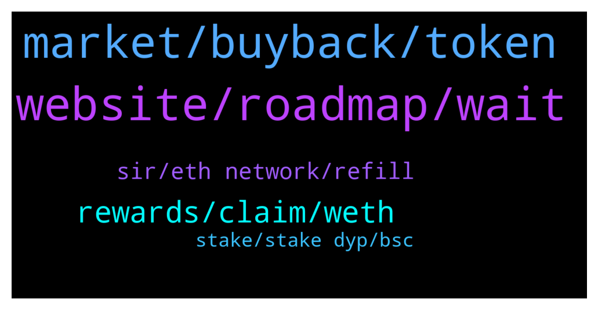

# **@dypfinance**
 ## Analysis for **2022-01-30** - **2022-01-31**.

---

## 📊 **Basic Stats**

**n_messages_sent**: 130

---

---

## 🔝 **Top keywords and related messages**

1. **website, roadmap, wait**

    @Cocopanji89 --- *Almost 20 hours waiting for it sir* **--->** [TG Discussion](https://t.me/dypfinance/243584)

    @cryptolobster --- *Ne website design is on roadmap ? I think it would worth a lot   more people would come.  had already recommended DYP to others.  some didn't trust the thing because the website is not that appealingly high quality #nohate :)♥️* **--->** [TG Discussion](https://t.me/dypfinance/243810)

    @Parker --- *Thanks for your assistance. What's a good/realistic GWEI target these days? I'm fine with waiting and keeping an eye on it.* **--->** [TG Discussion](https://t.me/dypfinance/243822)

    @Anthonydm76 --- *Whom I should contact for marketing proposal* **--->** [TG Discussion](https://t.me/dypfinance/243637)

    @maxwell0507 --- *The team consists of only 8 people or are they more in the backround* **--->** [TG Discussion](https://t.me/dypfinance/243733)

    @Cj --- *alright! duly noted. thanks DoniMSD for your neverending support and patience* **--->** [TG Discussion](https://t.me/dypfinance/243624)

2. **market, buyback, token**

    @joesumn --- *Was the listing on a new CEX a lie? The rumour been going round since November and is it legal to buy 1 million of your own DYP if you know it’s about to get listed on a new exchange? Doesn’t particularly add up* **--->** [TG Discussion](https://t.me/dypfinance/243769)

    @DhoniMSD516 --- *Hey please read about impermanent loss concept in yield farming Also your deposit is 75% converted to LP and 25% to DYP so when you withdraw you get 75% of your the asset you selected and 25% will be DYP.* **--->** [TG Discussion](https://t.me/dypfinance/243630)

    @DhoniMSD516 --- *Hey iDYP is new token only few months of its launch and yes we have utility like farming, staking and Bridge for iDYP, moving forward there ill be more utilities for no Lending and Borrowing is confirmed which will come this year, more utilities will be available too, for launchpad DYP will be used* **--->** [TG Discussion](https://t.me/dypfinance/243601)

    @hemanrock --- *DYP is native token of Defi yield Protocol. both are different tokens. both can be increased or decreased.  iDYP you can read more about it from here  https://dypfinance.medium.com/the-new-contracts-and-idyp-token-snapshot-airdrop-and-community-allocation-760a2be599c* **--->** [TG Discussion](https://t.me/dypfinance/243682)

    @Barry --- *Hey y’all, got a question. What exactly is the utility of the iDYP token? Will it be used in launchpad? Seems like just a farming token with no real utility. Thanks* **--->** [TG Discussion](https://t.me/dypfinance/243600)

    @DhoniMSD516 --- *We cannot control market fully, but if team feels it is needed just like how DYP is market bought may do the same for iDYP too, but iDYP is pretty new token so it needs some time, with more utilities coming it will have good movement, also in farming along with iDYP the other tokens like ETH/BNB/AVAX and also will be considered which are down too.* **--->** [TG Discussion](https://t.me/dypfinance/243745)

3. **rewards, claim, weth**

    @DhoniMSD516 --- *When you click claim and complete transaction you get rewards in WETH* **--->** [TG Discussion](https://t.me/dypfinance/243788)

    @DhoniMSD516 --- *That gets updated only if trigger happens, you can wait for someone in pool to trigger the claim then it shows up your rewards too* **--->** [TG Discussion](https://t.me/dypfinance/243786)

    @DhoniMSD516 --- *Yes it shows 0 ETH because rewards are paid in WETH, once your claim transaction is success you get WETH in your wallet* **--->** [TG Discussion](https://t.me/dypfinance/243784)

    @DanielFraser --- *It says I can claim when hovering over the button but it shows zero ETH rewards to claim which I should have some over 2 days. I don't want to claim just now but wondering why I don't see any ETH to claim.* **--->** [TG Discussion](https://t.me/dypfinance/243783)

    @DhoniMSD516 --- *Hey rewards are allotted every 24H and for the rewards to showup someone or you should click claim  Claim is the trigger to show up rewards on dApp screen, on desktop you can hover on Rewards and see if it says feel free to execute then rewards are ready to be claimed, as ETH fees are high ppl generally claim once in a while and not daily* **--->** [TG Discussion](https://t.me/dypfinance/243782)

    @DhoniMSD516 --- *The WETH balance updates if someone from pool triggers claim, this is why you can choose to wait for rewards to show or if you want to claim rewards you can just go ahead and claim* **--->** [TG Discussion](https://t.me/dypfinance/243795)

4. **sir, eth network, refill**

    @Abaddabi --- *Hi sir.. IDYP balance on eth network is empty.. please refill it sir.. because I cant withdrawal my idyp in eth network* **--->** [TG Discussion](https://t.me/dypfinance/243545)

    @Cimmy_revenger --- *Bridge iDYP BSC to Eth not working for withdraw , why sir  ? I have  a little problem* **--->** [TG Discussion](https://t.me/dypfinance/243506)

    @Cocopanji89 --- *Can u refill idyp ballance eth network sir pls.* **--->** [TG Discussion](https://t.me/dypfinance/243582)

    @DhoniMSD516 --- *Hey it is refilled now please go ahead with withdraw step. thanks for your patience* **--->** [TG Discussion](https://t.me/dypfinance/243586)

    @profit984 --- *Be patient, you just want to make your own advantage for it, the team has so much work to do, the refill is not only their priority* **--->** [TG Discussion](https://t.me/dypfinance/243546)

    @Abaddabi --- *Hi sir.. I can't withdrawal my idyp bridge from bsc to eth sir.. please help me* **--->** [TG Discussion](https://t.me/dypfinance/243544)

5. **stake, stake dyp, bsc**

    @Alejandrogonzalezespinosa --- *I can't stake my $dyp tokens in BSC pool. I don't know why. I'm losing my bnb in attempts* **--->** [TG Discussion](https://t.me/dypfinance/243486)

    @Cj --- *when i buy idyp i can not stake though. can't find a stake button on the website yet.. look at my balance vs what i can stake in picture* **--->** [TG Discussion](https://t.me/dypfinance/243620)

    @DhoniMSD516 --- *Yes you can stake DYP on ETH or BSC or AVAX chains https://dyp.finance/stakev2* **--->** [TG Discussion](https://t.me/dypfinance/243818)

    @Parker --- *Is there any place to stake dyp at the moment?* **--->** [TG Discussion](https://t.me/dypfinance/243817)

    @Disguy125 --- *So how many DYP coins are in circulation that are not held by the team in anyway or treasury.* **--->** [TG Discussion](https://t.me/dypfinance/243480)

