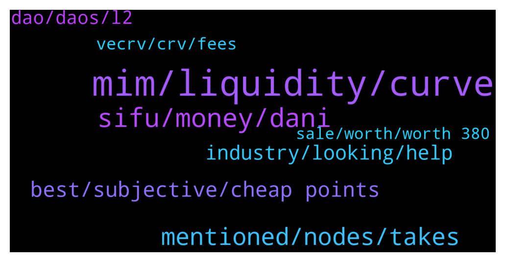

# **@lobsters_chat**
 ## Analysis for **2022-01-30** - **2022-01-31**.

---

## 📊 **Basic Stats**

**n_messages_sent**: 474

---

---

## 🔝 **Top keywords and related messages**

1. **mim, liquidity, curve**

    @ivangbi --- *@nourharidy MIM’s collaterals r safu, why would you think it’s rekt? The way I read it* **--->** [TG Discussion](https://t.me/lobsters_chat/321098)

    @Felix --- *Has the MIM drama created opportunity to farm MIM with super high APR at least?* **--->** [TG Discussion](https://t.me/lobsters_chat/321315)

    @fp --- *1. if MIM continues to fall below $1, at some point borrowers will deem the discount good enough and begin buying MIM to pay off their loans at a discount.  2.  if collateral becomes impaired, liquidators will buy MIM to obtain collateral below mkt value.  3.  if collateral goes up in value, the issued MIM is further collateralized and borrowers can withdraw it from the protocol via buying MIM.  so is there really a problem here in the long run, as long as the curve pool continues to exist?* **--->** [TG Discussion](https://t.me/lobsters_chat/321188)

    @ivangbi --- *Can you go do some work again @banteg. Do the wind down but inatead give them Yearn LP tokens so some might stay and just yield, some might withdraw haha* **--->** [TG Discussion](https://t.me/lobsters_chat/321407)

    @tandeloff --- *Mb they mean options by assets, so they send them to multi-sig before selling. collaterall should be sent to option protocol if DOV uses non-native options* **--->** [TG Discussion](https://t.me/lobsters_chat/321596)

    @nourharidy --- *And the answer is no unless Curve changes the A param, causing IL to all LPs* **--->** [TG Discussion](https://t.me/lobsters_chat/321148)

2. **sifu, money, dani**

    @GR33DY1 --- *Not being funny guys, but All of Sifu's money was sent directly to his wallet from public Quadriga wallets, couple of years ago near the time they exit scammed, Sifu was involved in defi heavily just a couple of months later how did no one notice until now?* **--->** [TG Discussion](https://t.me/lobsters_chat/321215)

    @MrSh1bz --- *He stole 169M 2 years ago now he’s back setting up a new con? I find it weird.* **--->** [TG Discussion](https://t.me/lobsters_chat/321239)

    @GR33DY1 --- *Yeah, but I'm trying to think from the view of Merlin or dani etc when they are doing very large deals with him. Would I done very basic DD on where his money came from? Yes, completely.* **--->** [TG Discussion](https://t.me/lobsters_chat/321236)

    @GR33DY1 --- *It clear to me that this was an attempt by him to launder his money. No way without these defi protocols could he have continued to withdraw to bank.   p.s. This all happened after Quadriga (and bitfinex) payent processor crypto capital went down (allegedly stealing 880m from bitfinex) (But I'm not inferring anything else from this public information)* **--->** [TG Discussion](https://t.me/lobsters_chat/321243)

    @GR33DY1 --- *Yes. Although I'm not sure all of the stolen money was sent to him, a decent chunk was.  Also, a lot of stolen money is still sitting in Abracadabra earning SIfu sweet yield. lol* **--->** [TG Discussion](https://t.me/lobsters_chat/321263)

    @paulogouveia --- *The first few eth to Sifu.eth for example comes from the guy’s wallet* **--->** [TG Discussion](https://t.me/lobsters_chat/321256)

3. **mentioned, nodes, takes**

    @degengineer --- *it takes 5 minutes. doesnt even have to bother with waiting. just make it look fresh* **--->** [TG Discussion](https://t.me/lobsters_chat/321221)

    @van0k --- *https://docs.snapshot.org/plugins/safesnap I don’t know the details either, it’s mentioned on the snapshot docs though* **--->** [TG Discussion](https://t.me/lobsters_chat/321654)

    @ivangbi --- *Why not actually make it? I am curious why not try @Dave2Diamond* **--->** [TG Discussion](https://t.me/lobsters_chat/321089)

    @ivangbi --- *Question is: so what?   (dumb q, trying to see the entire pic)* **--->** [TG Discussion](https://t.me/lobsters_chat/321127)

    @banteg --- *everything is always obvious in retrospect after it's been thoroughly explained to you. after every exploit/vuln people say the same stuff like "oh this bug was so simple, how come it went unnoticed for a year" right after reading a long ass explanation from mudit* **--->** [TG Discussion](https://t.me/lobsters_chat/321234)

    @ivangbi --- *This is a good q, don’t know if anybody checked just yet. Easy to track likely* **--->** [TG Discussion](https://t.me/lobsters_chat/321269)

4. **best, subjective, cheap points**

    @GR33DY1 --- *Like, is no one paying attention or is it more people don't care?* **--->** [TG Discussion](https://t.me/lobsters_chat/321216)

    @Swader --- *OR WILL THEY https://twitter.com/bitfalls/status/1487833470286155776?s=20&t=9Om8qj2Z-zG-o5r0MWn8XA  Absolute insanity, this ecosystem, every day 😄* **--->** [TG Discussion](https://t.me/lobsters_chat/321354)

    @charlie_eth --- *"I'm not trying to score cheap points"* **--->** [TG Discussion](https://t.me/lobsters_chat/321171)

    @banteg --- *posts like this always piss me off. drive the project to unsalvagable state and then offload all the responsiblity by calling a savior (and a person to blame) to come fix things? no sane person would want taht. how about the community does something?* **--->** [TG Discussion](https://t.me/lobsters_chat/321103)

    @czaknun --- *there is no incentive for people, so nobody looks into such things.* **--->** [TG Discussion](https://t.me/lobsters_chat/321222)

    @suzumiyachan --- *Solution: find a dev already in pit of despair so they are already there* **--->** [TG Discussion](https://t.me/lobsters_chat/321429)

5. **industry, looking, help**

    @Eviln9ne --- *Hey guys, does anyone have some decentralized social media to recommend looking into?* **--->** [TG Discussion](https://t.me/lobsters_chat/321598)

    @mempirate --- *Does anyone know of a quick and easy cross-chain uniswap v3 spot price API?* **--->** [TG Discussion](https://t.me/lobsters_chat/321693)

    @tesslerc --- *https://flexathon.net/twitter/index.html Not exactly a live product, but a pretty awesome demo* **--->** [TG Discussion](https://t.me/lobsters_chat/321607)

    @tesslerc --- *https://github.com/DanoshiFusermoto/cassandra  This is the network itself, front end stuff for hosting Twitter etc I think isn't in the git, not sure if it will be (need to ask Dan).* **--->** [TG Discussion](https://t.me/lobsters_chat/321044)

    @mempirate --- *I'm using this one for arbitrum: https://api.thegraph.com/subgraphs/name/imdsc/defil-uniswap-v3-arbitrum* **--->** [TG Discussion](https://t.me/lobsters_chat/321700)

    @van0k --- *https://rss3.io/#/ Came across this recently, although this is more like infra for distributed social media* **--->** [TG Discussion](https://t.me/lobsters_chat/321606)

6. **dao, daos, l2**

    @Swader --- *Been discussing something with a mate, wondering where this modern anti-DAO drive seems to come from: products like syndicate.io/clubs and more broadly treasuries like these wonderland thing etc.  Why did the ecosystem collectively move towards this ez-rug mode where share tokens are no longer used to govern by issuing collective decisions in a quadratic voting or positive turnout bias kind of way, but rather only signal so that the cartel of founders can maybe decide to listen to the community and execute how they vote?   Like… where did all the aragon / colony / daostack people go with their plans to have actual governable multisigs?* **--->** [TG Discussion](https://t.me/lobsters_chat/321636)

    @Sunny --- *DAOs would not exist if companies could legally create protocols in jurisdictions lol, they're a patchwork fill in the gap. Give them time and they will work but fuck right now if they're not unbelievably incompetent, shortsighted and idiotic. I remember reading a compound snapshot post resolving to require the developers to raise the price of a comp token to 2k. It passed. Unregistered securities need patchwork fixes otherwise the regulator shits on them from a great height* **--->** [TG Discussion](https://t.me/lobsters_chat/321458)

    @RobAnon --- *Depends on the DAO structure as well* **--->** [TG Discussion](https://t.me/lobsters_chat/321481)

    @ivangbi --- *We didn’t resort to doing it because it feels constrictive yet benefits are opaque. The idea is cool, but it didn’t seem so trivial when it came to the details. Like, there is a reason why a DAO is not at governor alpha stage yet, which means it should probably be more flexibly before it becomes an issue. That is only concerning legit projects though, anon rugs should be as safe as they can be even at the cost of customization* **--->** [TG Discussion](https://t.me/lobsters_chat/321657)

    @SpikeSpiege1 --- *Dao=whales deciding.  The team usual reserves the right to over rule community by exercising their tokens so it's kind of a farce.* **--->** [TG Discussion](https://t.me/lobsters_chat/321460)

    @ivangbi --- *Ser wait you are digging a hole there. If you want people to vote with money because protocols are aimed at making money, but you want stakeholders incstead of shareholders - then it becomes not really a DAO but an organization controlled by elected people. And if elected are voted in by the largest shareholders, you aren’t changing much either. TLDR old argument, nothing new* **--->** [TG Discussion](https://t.me/lobsters_chat/321514)

7. **vecrv, crv, fees**

    @godefi --- *Why are veCRV made non transferrable in curve? I know for voting you don't want people moving tokens to vote again, but that's normally solved by staking. Did this locking help grow the bribing system? I don't see why bribes can't be done given transferrable voting tokens also. How does Convex etc contract leverage veCRV tokens to vote on behalf of the briber?* **--->** [TG Discussion](https://t.me/lobsters_chat/321003)

    @van0k --- *Still to prevent attacks. Suppose that there is a large veCRV position that was locked for 4 years, but will unlock in just a few days. If voting power doesn’t decay, then an attacker can buy this position from the current owner to attack governance and quickly liquidate the CRV once it unlocks.  Computing voting power as CRV locked * time left until unlock neutralizes this vector.* **--->** [TG Discussion](https://t.me/lobsters_chat/321039)

    @garydefi --- *If all value accrued to veCRV + it kept its governance powers  Currently, veCRV admin fees accrue 50% of platform fees  What if they accrued 100% of fees, and CRV accrued none?* **--->** [TG Discussion](https://t.me/lobsters_chat/321565)

    @van0k --- *It’s split 50/50 between veCRV and LPs afaik, giving all of that to veCRV means LPs are rekt. Unless you want to make CRV issuance the entire LP business model, in which case everyone is rekt.* **--->** [TG Discussion](https://t.me/lobsters_chat/321575)

    @godefi --- *Smart. And why is veCRV voting power made to fall in time, while no other veCRV benefits do?* **--->** [TG Discussion](https://t.me/lobsters_chat/321015)

    @kendrickllama555 --- *to prevent governance vector attack, like someone could buy a bunch of CRV, lock for veCRV, vote for malicious proposals then sell those transferable veCRV to secondary market* **--->** [TG Discussion](https://t.me/lobsters_chat/321011)

