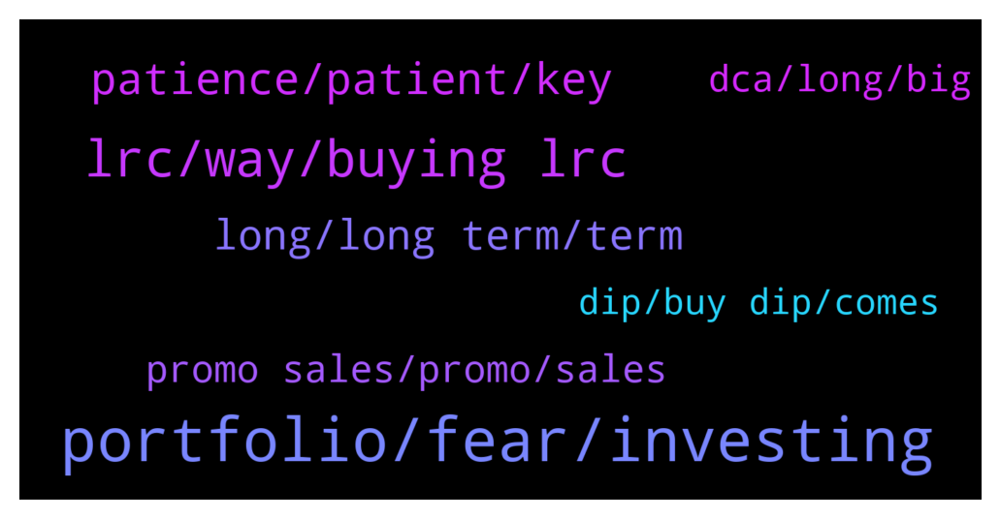

# **@loopringofficial_chat**
 ## Analysis for **2022-01-30** - **2022-01-31**.

---

## 📊 **Basic Stats**

**n_messages_sent**: 270

---

---

## 🔝 **Top keywords and related messages**

1. **portfolio, fear, investing**

    @etchenrobin05 --- *If there is the biggest lesson to learn from Crypto Investment, for me it would be patience* **--->** [TG Discussion](https://t.me/loopringofficial_chat/28627)

    @boRisthan --- *However I could see an average crypto investors lack patience because their coins are not going to the moon after a month.* **--->** [TG Discussion](https://t.me/loopringofficial_chat/28711)

    @Omalau739 --- *Nowadays everyone wants money quick and that’s how you lose money.    Crypto was / is never a get-rich-quick, it was always a long term hodl.* **--->** [TG Discussion](https://t.me/loopringofficial_chat/28889)

    @adriel829 --- *Crypto is volatile and you normally see people making 1000%, 10000%  or even more in a particular project.* **--->** [TG Discussion](https://t.me/loopringofficial_chat/28640)

    @baltasar078 --- *Real hodlers don't care about fear and greed index.* **--->** [TG Discussion](https://t.me/loopringofficial_chat/28839)

    @mahaliaetz05 --- *Biggest lesson I’ve learned from crypto investing is if I make a plan, make appropriate sacrifices and stick to it regardless of emotion good things will happen eventually* **--->** [TG Discussion](https://t.me/loopringofficial_chat/28702)

2. **lrc, way, buying lrc**

    @abtbeatrice6 --- *Is this possible Lrc = 5 usd?* **--->** [TG Discussion](https://t.me/loopringofficial_chat/28930)

    @gottoloveanna --- *Just wondering.  What are your longterm goals with LRC* **--->** [TG Discussion](https://t.me/loopringofficial_chat/28936)

    @abtbeatrice6 --- *I'm holding Lrc until the moon* **--->** [TG Discussion](https://t.me/loopringofficial_chat/28566)

    @fredclyde04 --- *Now is the perfect time to BUY LRC for future benefits* **--->** [TG Discussion](https://t.me/loopringofficial_chat/28615)

    @donaldrice04 --- *If you don't want to FOMO on LRC Now is your time to BUY more* **--->** [TG Discussion](https://t.me/loopringofficial_chat/28635)

    @Eustaquioemilly51 --- *Don't stop BUYing LRC guys It's our gate way to financial freedom 👍💯* **--->** [TG Discussion](https://t.me/loopringofficial_chat/28650)

3. **patience, patient, key**

    @crypto_beast462 --- *Had I had more patience in the past, I'd be way better than I am now.* **--->** [TG Discussion](https://t.me/loopringofficial_chat/28751)

    @opsahl --- *My dad always used to tell me that patience are for doctors* **--->** [TG Discussion](https://t.me/loopringofficial_chat/28761)

    @kirchnerbeauty055 --- *Are you sure he said "patience" or "patient"?* **--->** [TG Discussion](https://t.me/loopringofficial_chat/28762)

    @etchenrobin05 --- *Patience with BUYing Patience with HODLing Patience with SELLING* **--->** [TG Discussion](https://t.me/loopringofficial_chat/28628)

    @kirchnerbeauty055 --- *Patience is the name of the game? Unfortunately I have run out of it :)* **--->** [TG Discussion](https://t.me/loopringofficial_chat/28720)

    @donaldrice04 --- *Fallen victim of being impatient before, feeling was so bad* **--->** [TG Discussion](https://t.me/loopringofficial_chat/28734)

4. **long, long term, term**

    @bakti55 --- *Maybe we could go back to ATH already 🚀💥* **--->** [TG Discussion](https://t.me/loopringofficial_chat/28530)

    @Omalau739 --- *For me, I think a month is rather too small  HODL long term Guys* **--->** [TG Discussion](https://t.me/loopringofficial_chat/28713)

    @ismailluk03 --- *i am playing a long term game lol* **--->** [TG Discussion](https://t.me/loopringofficial_chat/28844)

    @gunturffx --- *There's still a long long way to go* **--->** [TG Discussion](https://t.me/loopringofficial_chat/28925)

    @BaiNeil --- *Long term benefits, pays of the longest* **--->** [TG Discussion](https://t.me/loopringofficial_chat/28807)

    @opsahl --- *I'm numb to pain. Longterm trend is always up.* **--->** [TG Discussion](https://t.me/loopringofficial_chat/28854)

5. **promo sales, promo, sales**

    @wellsHu --- *Hi Guys Please what is the promo sales about????* **--->** [TG Discussion](https://t.me/loopringofficial_chat/28749)

    @kirchnerbeauty055 --- *And I'm grateful for the promo sales ALWAYS 💯🪙* **--->** [TG Discussion](https://t.me/loopringofficial_chat/28830)

    @adriel829 --- *I love how everyone here, engages in the promo sales In conversations as well* **--->** [TG Discussion](https://t.me/loopringofficial_chat/28781)

    @gottoloveanna --- *The promo sales is truly a gift 🎁 A Gold mine 💥* **--->** [TG Discussion](https://t.me/loopringofficial_chat/28623)

    @rocwaysalan1 --- *Aren't we lucky to be able to participate in the promo sales* **--->** [TG Discussion](https://t.me/loopringofficial_chat/28607)

    @cfx956 --- *Even got better with the promo sales 🔥🔥🔥* **--->** [TG Discussion](https://t.me/loopringofficial_chat/28606)

6. **dca, long, big**

    @Kolisnykalfred001 --- *They was your mistake, never go all in because it can drop further, that's why you should have extra on the side to buy further dips in laddered steps to decrease your DCA. The same applies in reverse when you sell.* **--->** [TG Discussion](https://t.me/loopringofficial_chat/28676)

    @gesmith045 --- *Doesn't matter in the long run when you DCA, as long as you continue buying at regular intervals.* **--->** [TG Discussion](https://t.me/loopringofficial_chat/28541)

    @rocwaysalan1 --- *I have a dynamic DCA system, the size of the buy depends on the price of BTC. Big DCAs on the horizon* **--->** [TG Discussion](https://t.me/loopringofficial_chat/28537)

    @jasondi --- *DCA whatever way you can and you will achieve financial freedom.* **--->** [TG Discussion](https://t.me/loopringofficial_chat/28535)

    @ackerdbfx --- *I call it DCA, Don't Care Anyways* **--->** [TG Discussion](https://t.me/loopringofficial_chat/28534)

    @Cryptokid91 --- *Patience with buying     This, this is my struggle. DCA is all fine and dandy, but then price goes down and ... yeah* **--->** [TG Discussion](https://t.me/loopringofficial_chat/28735)

