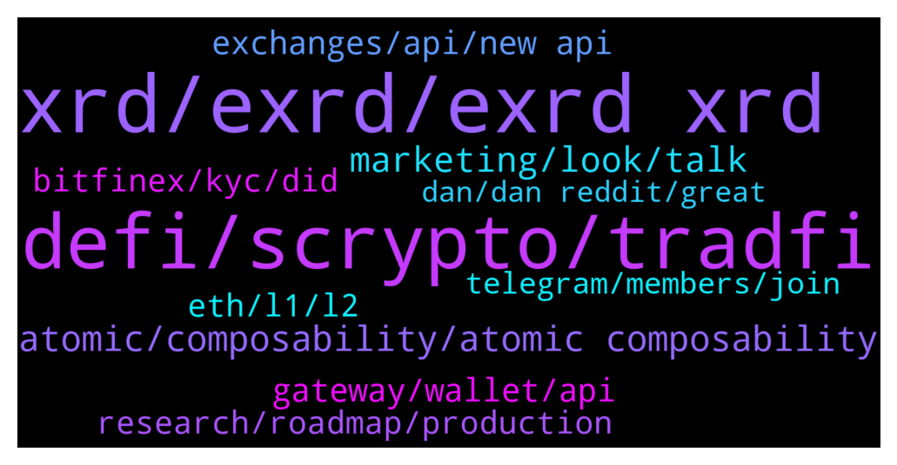

# **@radix_dlt**
 ## Analysis for **2022-01-30** - **2022-01-31**.

---

## 📊 **Basic Stats**

**n_messages_sent**: 553

---

---

## 🔝 **Top keywords and related messages**

1. **xrd, exrd, exrd xrd**

    @Shang En --- *It sounds like apart from flash loan it doesn’t have much more use in traditional trading… What I expect is we can use XRD to buy your daily life stuff, in internet, or hang around market and shopping with XRD. But I don’t know how far we are from now.  And thanks for the web3 answer.* **--->** [TG Discussion](https://t.me/radix_dlt/348364)

    @isaaaaaaaaaaaac --- *Yes, both eXRD and XRD will follow the same price.* **--->** [TG Discussion](https://t.me/radix_dlt/348182)

    @Cpt_Charles --- *Binance? eXRD is not available on BSC nor on Binance* **--->** [TG Discussion](https://t.me/radix_dlt/348236)

    @Donal --- *I already have exrd with binance but I want to stake as xrd* **--->** [TG Discussion](https://t.me/radix_dlt/348232)

    @Patrotheman --- *I’m jus waiting for exrd xrd pair in cex so I can transfer to ledger right away* **--->** [TG Discussion](https://t.me/radix_dlt/348542)

    @DMX --- *Is investing into EXRD the same as XRD?* **--->** [TG Discussion](https://t.me/radix_dlt/348181)

2. **defi, scrypto, tradfi**

    @Jazzer9F --- *In the 2nd installment of a four-part series the CEO of Radix Piers Ridyard and CPO Matthew Hine discuss why the Radix Engine is a game-changer for DeFi, and why the Ethereum Virtual Machine cant carry DeFi any further. 🚀  https://www.youtube.com/watch?v=fdG-JVT6bsc* **--->** [TG Discussion](https://t.me/radix_dlt/348348)

    @propeterly --- *Since "Layer 1 DeFi Done Right" is not about Twitter, Radflix or other experiments: Why should they?* **--->** [TG Discussion](https://t.me/radix_dlt/348631)

    @Magal36 --- *Think about DeFi on Ethereum as it is today. What makes it great is composability. You can take a uncollateralized flash loan and take advantage of an arbitrage opportunity with a composed transaction that completes or fails within one block. That's only one example. DEX aggregators like 1inch also use composability. Yield aggregators like YFI can only exist with composability...* **--->** [TG Discussion](https://t.me/radix_dlt/348293)

    @Magal36 --- *If DeFi wants to capture value from TradFi market and reach mass adoption, yes I do* **--->** [TG Discussion](https://t.me/radix_dlt/348322)

    @aj4269 --- *As it is an entirely new and better way of doing defi, the team expects and wants feedbacks on its language and other stuff so that they can ensure it doesn't run into the hiccups ethereum or solana face* **--->** [TG Discussion](https://t.me/radix_dlt/348230)

    @Natethegreat762 --- *Is there a link to the defi ecosystem projects or something? Just started looking in to this project* **--->** [TG Discussion](https://t.me/radix_dlt/348144)

3. **atomic, composability, atomic composability**

    @Shang En --- *The composed one is relying on atomic composability? So the others didn’t use what XRD’s method will be a misery cause they can’t handle one transaction have one fail but they just let it go and have high risk to makes the whole system chaos?* **--->** [TG Discussion](https://t.me/radix_dlt/348289)

    @Magal36 --- *That's not accurate, or maybe I misread. An atomic transaction doesn't order actions, all actions are executed or the transaction fails. Cerberus uses partial ordering in case two or more transactions touch the same shard(s).* **--->** [TG Discussion](https://t.me/radix_dlt/348281)

    @Shang En --- *Have a question here, if other crypto done sharding the wrong way, like break the atomic composability, but if they have 2^256 shards, won’t breaking the atomic composability be a non issue? Cause the shards are so many so breaking the atomic composability won’t effect the tps? Or I misunderstood something?* **--->** [TG Discussion](https://t.me/radix_dlt/348720)

    @Magal36 --- *Sharding done wrongly (breaking the network in Island of data with no seamless atomic composability) is bad, and can also decrease security. Radix unique way of sharding doesn't suffer any drawbacks, and it's a clear road to scalability* **--->** [TG Discussion](https://t.me/radix_dlt/348254)

    @ITProfligate --- *I doubt it. As I have understood sharding of a DB is splitting the DB across machines and enabling data to be stored and retrieved seemlessly from the DB querry POV.* **--->** [TG Discussion](https://t.me/radix_dlt/348465)

    @Shang En --- *So it’s the atomic composability makes XRD sharding good and when Xi’an launch it will be sharded. Seems like atomic composability is really important. Am I right? Or do I misunderstood?* **--->** [TG Discussion](https://t.me/radix_dlt/348270)

4. **marketing, look, talk**

    @tesslerc --- *I'll be brutally honest here. Biggest confusion, especially talking as a long time follower of Radix, is why amazing progress isn't shared.  We're at a stage in the project where there isn't a lot of fancy stuff to share and Dan has been delivering amazing results which official marketing is totally ignoring. Instead of using this material or helping it look "better" from a marketing POV, it's just "dismissed".  So instead of using this material to show Radix is alive, we look from the outside kinda dead.* **--->** [TG Discussion](https://t.me/radix_dlt/348665)

    @ttsg99 --- *My friend think radix is just a talk talk and marketing thing like ada. I want to look for the comparison btw radix and ada* **--->** [TG Discussion](https://t.me/radix_dlt/348160)

    @Ee09Vee --- *https://twitter.com/vaneck_eu/status/1479474413133254662?s=28  Inspiration for a Radix teaser 🤩🎥* **--->** [TG Discussion](https://t.me/radix_dlt/348100)

    @Blind5ight --- *Great to see this community come together and rally behind the Radix tech. Let's give a salute to the Radix validators who keep baby Olympia humming nicely :)  We will only grow and keep striving towards THE vision!  https://twitter.com/Radstakes/status/1487904640578564096?s=20&t=EpzNA6-_CsMPxslS-1_FsQ  👉 Follow Radix Push for inside sc👀ps:  https://t.me/joinchat/0BmQTbhjZuphZTQy 👈* **--->** [TG Discussion](https://t.me/radix_dlt/348489)

    @Jacob_XRD --- *.Yep its good feedback, and something we are looking into. As I mentioned above  we are working on additional clarification about Radix Labs, and how it sits with the main Radix roadmap* **--->** [TG Discussion](https://t.me/radix_dlt/348659)

    @Natethegreat762 --- *Any good working defi days? Built on radix?* **--->** [TG Discussion](https://t.me/radix_dlt/348142)

5. **gateway, wallet, api**

    @Stephen --- *What is the best (fastest) gateway to connect my wallet too? I upgraded my wallet v1.3.1 and still find it very slow.  Takes 10 to 15 seconds to load transaction history and about 10 seconds to load balances page. Is that normal?* **--->** [TG Discussion](https://t.me/radix_dlt/348127)

    @J0hnD_1 --- *How to view all the txn that is going on radix chain* **--->** [TG Discussion](https://t.me/radix_dlt/348250)

    @Magal36 --- *The explorer doesn't do that currently, although should be easier to build such a tool now with the new API* **--->** [TG Discussion](https://t.me/radix_dlt/348255)

    @Jazzer9F --- *Radix Desktop Wallet v1.3 has been released!  Get the latest at https://wallet.radixdlt.com/ - or accept the automatic update if you're on the latest v1.2.6.  This is an important update that we strongly recommend everyone take. Details below.  This release is mostly about migrating to the new API and Gateway service under the hood. That's important because once everyone has moved to this version, we will be able to obsolete our old Archive nodes that were severely limiting our ability to scale to peak demand, causing periodic problems with not being able to connect. Use of the Gateway service also resolves some spotty issues a few people were having with balances being shown incorrectly or inconsistently.  Features: * Seed phrases can now be 12, 18, or 24 words. For the more security-conscious, you may wish to create a new wallet using a longer seed phrase. (It is not possible to upgrade an existing address to one using a different seed phrase.)  * You can now hide tokens you aren't interested in. These tokens will no longer appear on your balances screen and shall upset you no further. If you change your mind, you can unhide a token in the wallet's settings.  * A warning is now presented whenever sending or staking of XRD would drop your balance below 10 XRD. This is to help prevent the "oops" situation of not having sufficient XRD to pay for further transactions.  Fixes: * Error messages are much improved overall. This is a direct consequence of the new API and hopefully should provide a more clear idea why a transaction wasn't possible.  * When connecting to a custom Gateway node, the wallet now offers a clear warning that you must trust the Gateway to not present you with bogus transactions. This is a very important bit of information that we communicated socially when we first added custom archive node capability to the wallet, but we overlooked adding a clear warning in the wallet itself. Thanks to community member @devmannic  for pointing out the lack of this warning message.  * More information about staking and unstaking status is shown in your list of validators. In particular, we now show "pending stake" for stake that is awaiting the end of the epoch to take effect - and thus cannot yet be requested to be unstaked.  * A validator that is not currently in the top-100 now presents a visible warning, indicating that it is not currently producing emissions XRD for you.  * Password fields now show if you're typing a password with caps lock set.  * Improved handling when a hardware wallet is disconnected during usage.  * Wallet now remembers the last account that you had selected when you last quit.* **--->** [TG Discussion](https://t.me/radix_dlt/348840)

    @Jazzer9F --- *🎉  Network Gateway v1 🎉   Along with the v1.1.0 release of the radix node, we are pleased to announce the release of a production-ready v1.0.0 of the Network Gateway: https://github.com/radixdlt/radixdlt-network-gateway/releases/tag/1.0.0  The Network Gateway exposes the Gateway API, and is intended to replace Archive node functionality. For information on how to interact with the Radix-run Gateway API, check out our docs site here: https://docs.radixdlt.com/main/apis/gateway-api.html or the code on github here: https://github.com/radixdlt/radixdlt-network-gateway  Requests to https://mainnet.radixdlt.com with a X-Radixdlt-Target-Gw-Api header will get routed to the new Gateway API. An example request is shared below.  New versions of the Explorer and Wallet will be released in the coming days to move over to using the Gateway API.  Whilst Archive Nodes will continue to function, we recommend those running Archive Nodes migrate to running a Network Gateway. We will continue to update the docs site in the coming days with more information on how to run your own Network Gateway.  We'll keep an eye on the #node-runners channel for any questions.* **--->** [TG Discussion](https://t.me/radix_dlt/348717)

    @Blind5ight --- *The latest Radix Report is now live! 📑  In this update, the big news is that the Radix Wallet and Explorer now utilize the Gateway API, so should consistently feel faster and more responsive.   Read the full report here: https://www.radixdlt.com/post/radix-report-27th-jan-2022* **--->** [TG Discussion](https://t.me/radix_dlt/348082)

6. **exchanges, api, new api**

    @Ibmakzee --- *Hello. Whats the API update cos it seems as u claimed the cause of delay in Listings* **--->** [TG Discussion](https://t.me/radix_dlt/348002)

    @Byron --- *so if they updated the api exchanges are next right?* **--->** [TG Discussion](https://t.me/radix_dlt/348084)

    @even_Phteven --- *Yes it is, maybe with the new API it will become a thing or someone will build it into a website but ATM there's nothing* **--->** [TG Discussion](https://t.me/radix_dlt/348263)

    @Blind5ight --- *Exchanges need the new API The API has been rebuilt (more info in the Radix report) So the road is open for integration of the Radix network by exchanges and all sorts of service providers "Wen" you say? I don't know and the team is under NDA in relation to /listings* **--->** [TG Discussion](https://t.me/radix_dlt/348085)

    @aus87 --- *exchanges likely also need to build according to the new api as well* **--->** [TG Discussion](https://t.me/radix_dlt/348006)

    @Magal36 --- *We can't give any ETA, but API is delivered and exchanges are in the works* **--->** [TG Discussion](https://t.me/radix_dlt/348007)

7. **research, roadmap, production**

    @PhilGibson --- *I'm a product manager myself so I know how terribly annoying this question can be. But is there anything that can be done to accelerate the roadmap? I read a piece of Coinbase research about Layer 1s and how the window of opportunity is really going to close significantly in H2 2022. At least by their research and estimates.  #roundtable* **--->** [TG Discussion](https://t.me/radix_dlt/348726)

    @Mr_TMA --- *Yes.  It might be an idea to put a research roadmap out there, in addition to a production roadmap. The research roadmap can tick off many accomplishments, and it will be visually clear that research is two years ahead of production.  #roundtable* **--->** [TG Discussion](https://t.me/radix_dlt/348690)

    @fpieper --- *I mean in the end it is the same the car industry is doing with their concept cars. Everyone know that these are kind of research and won't make it 1:1 into mass production ^^* **--->** [TG Discussion](https://t.me/radix_dlt/348658)

    @yr12345678 --- *This looks unnecessarily futuristic, but I like it anyway* **--->** [TG Discussion](https://t.me/radix_dlt/348671)

    @piersr --- *It is a good analogy for Dan's research for sure. Potential design direction rather than finished product.* **--->** [TG Discussion](https://t.me/radix_dlt/348662)

    @Natethegreat762 --- *Ya it's interesting to see the complete opposite approach from the more modular projects too* **--->** [TG Discussion](https://t.me/radix_dlt/348532)

8. **bitfinex, kyc, did**

    @Suitssss --- *Just did the transfer today from kucoin , fee was 80exrd , so go through bitfinex for sure of yoh want to stake* **--->** [TG Discussion](https://t.me/radix_dlt/348200)

    @Natethegreat762 --- *Do you need to kyc for bitfinex?* **--->** [TG Discussion](https://t.me/radix_dlt/348307)

    @Magal36 --- *If you're dealing small amounts you can risk using Bitfinex over a VPN, but they can freeze your funds if caught.* **--->** [TG Discussion](https://t.me/radix_dlt/348312)

    @Magal36 --- *You can open it just with an email, no KYC* **--->** [TG Discussion](https://t.me/radix_dlt/348318)

    @Donal --- *It was a hard time for me to set up bitfinex.but finally did it. Can you tell me next steps from kucoin to bitfinex to radix wallet so I can stake much appreciated 🙂* **--->** [TG Discussion](https://t.me/radix_dlt/348219)

    @Patrotheman --- *Do I need to do KYC in bitfinix?* **--->** [TG Discussion](https://t.me/radix_dlt/348549)

9. **eth, l1, l2**

    @rmf55 --- *The question I always think of when I see ETH maxis on CT talking about how great L2, modular chains, rollups, etc, are is "Would you be saying this if ETH had been able to scale its L1?"    it's a rhetorical question really because the answer is pretty obviously no. A scalable L1 is the solution, adding L2's (even now talking about L3 😂) is nothing more than a workaround because they failed to solve the problem and now have big bags to protect.* **--->** [TG Discussion](https://t.me/radix_dlt/348777)

    @NotBen --- *Sure. But from what we have seen in the last 6 months, other L1s and L2s are farther from the solution than they have claimed* **--->** [TG Discussion](https://t.me/radix_dlt/348801)

    @NotBen --- *IMO L2s will not work as claimed. My point here is that even if they do, eth maxis think it will keep pumping their bags but it wont* **--->** [TG Discussion](https://t.me/radix_dlt/348784)

    @NotBen --- *which is insane because if the L2s work as claimed, there is minimal reason for the L1 coin to grow in value or even retain its value* **--->** [TG Discussion](https://t.me/radix_dlt/348782)

    @saeglopur10 --- *You can say the same about Radix though, yeah? If eth L2s work as claimed, what role does Radix as an L1 fill?* **--->** [TG Discussion](https://t.me/radix_dlt/348783)

    @pspk_janasena --- *They are trying to migrate/offload some of the functionality to L2 / polygon just to  avoid the pain of Gas fees* **--->** [TG Discussion](https://t.me/radix_dlt/348703)

10. **telegram, members, join**

    @Avaunt --- *Hi there, you're in luck! Our Scorp Promo finishes this weekend.* **--->** [TG Discussion](https://t.me/radix_dlt/348746)

    @shibuya_masashi --- *@BlAzAk I am trying to contact you at "hello@xidar.io" but I get an error "relay access denied"* **--->** [TG Discussion](https://t.me/radix_dlt/348020)

    @bonafideplug --- *We are at almost 300 members on our Telegram for the Radish NFT. Please join our Telegram to show support.   https://t.me/RadishRoot* **--->** [TG Discussion](https://t.me/radix_dlt/348458)

    @shibuya_masashi --- *Only 23 hours left to participate in our Spike Bros giveaway.  Join our telegram for more information: https://t.me/spike_bros How to participate: https://twitter.com/spike_bros_xrd/status/1486414455030304771* **--->** [TG Discussion](https://t.me/radix_dlt/348087)

    @gummy558 --- *Almost 200+ Members ❤️ We'll launch when we hit this milestone https://t.me/windowsradix Join up, check the website out thx* **--->** [TG Discussion](https://t.me/radix_dlt/348012)

    @TaserFace6937 --- *Here is a list run by a community member https://www.radixlist.com/* **--->** [TG Discussion](https://t.me/radix_dlt/348145)

