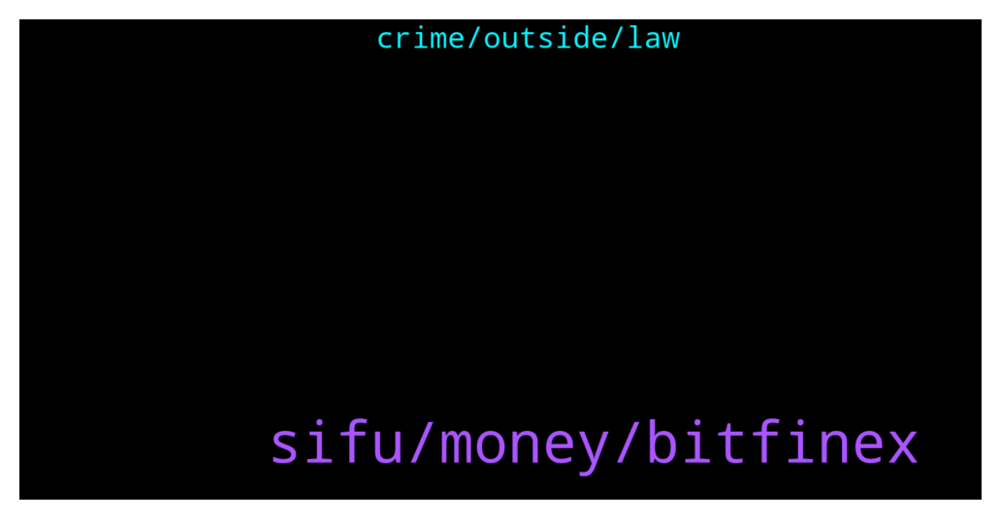

# **@shitpool**
 ## Analysis for **2022-01-30** - **2022-01-31**.

---

## 📊 **Basic Stats**

**n_messages_sent**: 254

---

---

## 🔝 **Top keywords and related messages**

1. **sifu, money, bitfinex**

    @MoneroPal --- *There is a 50/50 chance, unless you have proof to dispell the rumors, there is a 50% chance it’s true. It’s highly suspicious all of his transfers of USDT went to Bitfinex and not any other exchange. This is the same for Sifu…* **--->** [TG Discussion](https://t.me/shitpool/721607)

    @kekurikekukaka --- *Why are EOS and XRP not at 1000$ yet ?* **--->** [TG Discussion](https://t.me/shitpool/721946)

    @tdotballing --- *Are people actually making tons of money on all these nft drops? I keep seeing on Instagram basically copy pastes of bored apes with different animals like bulls and goats and the channels claiming ppl bought them for like 800 and then sell for 300k. Is this actually happening or is it just like wash trading and the channels hyping them up* **--->** [TG Discussion](https://t.me/shitpool/721970)

    @MoneroPal --- *The whole industry is obsessed it’s mentioned on every financial publicaton worldwide including Bloomberg. It is over though and the treasury doesn’t mean shit. They’re offering a $3x,000 buyback for wMEMO. The founders and insiders made off with hundreds of millions directly and indirectly. It’s satisfying seeing the frogs get fucked and still support the clown...* **--->** [TG Discussion](https://t.me/shitpool/721964)

    @da0man --- *successfully finished the first on-chain merger in history a few weeks ago with no problems so far so exchanges should list the new token anytime now* **--->** [TG Discussion](https://t.me/shitpool/721761)

    @Horselorde --- *Y’all are so obsessed with wonderland now even tho it’s ded lmao* **--->** [TG Discussion](https://t.me/shitpool/721931)

2. **crime, outside, law**

    @MoneroPal --- *Go lookup the thousands of cases in the US court docket system you can see all the Russians, Chinese, Australians, Europeans, South Americans that have been arrested and extradicted to the US for financial crimes, ransomwear, hacks, all sorts of shit that targeted US citizens, corporations, or used the US dollar somehow…* **--->** [TG Discussion](https://t.me/shitpool/721862)

    @MoneroPal --- *Wrong, US citizens must follow US laws wherever they are. In terms of a non-US citizen commiting a crime. If the US dollar is used in this crime or if the crime targeted and harmed US citizens, US prosecutors will go after this person or persons. You’re an absolute fucking retard…It’s honestly quite halarious how you think you have a clue, but you do not. You’re probably Eastern European or Chinese, nvm pajeet you’re probably pajeet, dalit caste shanty town dwelling pajeet...* **--->** [TG Discussion](https://t.me/shitpool/721861)

    @ptsolorid --- *if a us citizen breaches the law sure they can go for them although, if the crime is committed outside of teh USA, and in a jurisdiction where its not a crime, they cannot.* **--->** [TG Discussion](https://t.me/shitpool/721858)

    @ptsolorid --- *You do not understand the law at all, The us has no jurisdiction outside of the US. period.* **--->** [TG Discussion](https://t.me/shitpool/721855)

    @MoneroPal --- *You’re dumb as rocks, US owns whatever country you live in directly and indirectly. As for America, ya fuck it, but in the end, no matter your citizenship or country of residence, US law enforcement has jurisdiction over you and will get you and extradite you back to the US.* **--->** [TG Discussion](https://t.me/shitpool/721851)

    @ptsolorid --- *and it is not for US citizens because fuck america and its antiquated laws.* **--->** [TG Discussion](https://t.me/shitpool/721880)

