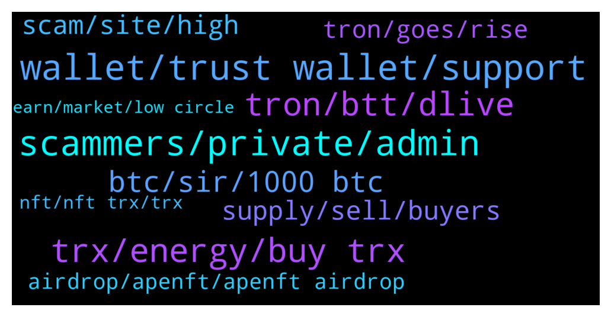

# **@tronnetworkEN**
 ## Analysis for **2022-01-30** - **2022-01-31**.

---

## 📊 **Basic Stats**

**n_messages_sent**: 279

---

---

## 🔝 **Top keywords and related messages**

1. **wallet, trust wallet, support**

    @Vaamanvaa --- *But profit amount is getting credited in wallet* **--->** [TG Discussion](https://t.me/tronnetworkEN/3864130)

    @Musabelloshelleng --- *I bought it transferred it to trust wallet and i want to swap it but it's not showing in pancake swap* **--->** [TG Discussion](https://t.me/tronnetworkEN/3863295)

    @simon866 --- *You will get that for a few days then be back here asking why you cant withdraw* **--->** [TG Discussion](https://t.me/tronnetworkEN/3864114)

    @Dandy1808 --- *I have staked 3 days but can't unstake in trust wallet* **--->** [TG Discussion](https://t.me/tronnetworkEN/3864619)

    @michael_aka_b --- *Thanks for answering. Well well well, what shall i do once i found my hash* **--->** [TG Discussion](https://t.me/tronnetworkEN/3864334)

    @Carlos_TRX --- *first, check the hash and and see where are your funds, network is working perfectly so probably some exchange has some issue,* **--->** [TG Discussion](https://t.me/tronnetworkEN/3861542)

2. **scammers, private, admin**

    @Tutor_rxce --- *You're not an admin but why so much concerned about this? 🤔* **--->** [TG Discussion](https://t.me/tronnetworkEN/3864432)

    @Haywhy_milla --- *I guess the admin should say something first* **--->** [TG Discussion](https://t.me/tronnetworkEN/3864322)

    @davedine --- *If admin is not online maybe some ppl here can help in PUBLIC chat. Avoid doing private message.* **--->** [TG Discussion](https://t.me/tronnetworkEN/3864325)

    @Gosh --- *People are just using the group icon changing themselves as administrators* **--->** [TG Discussion](https://t.me/tronnetworkEN/3864667)

    @Carlos_TRX --- *He is just as trustworthy as an admin, and a great help within the group, so you can trust anything he tells you.* **--->** [TG Discussion](https://t.me/tronnetworkEN/3864504)

    @agentpiki --- *Yes I am not admin, just the janitor here.  As a tronic, I care about Tron and all the members and aspiring tronics.   I won't tolerate scam activities here, so as admins and moderators, and will protect all members here from such scam activities. Now if you'll excuse me.* **--->** [TG Discussion](https://t.me/tronnetworkEN/3864436)

3. **trx, energy, buy trx**

    @Vedat --- *don't trust this trx they are fake* **--->** [TG Discussion](https://t.me/tronnetworkEN/3861676)

    @Tumulamye --- *But they offer trx just trying to inquire please* **--->** [TG Discussion](https://t.me/tronnetworkEN/3862328)

    @themmisi --- *I can't transfer because I need trx fees* **--->** [TG Discussion](https://t.me/tronnetworkEN/3861974)

    @agentpiki --- *I have never heard of trx chain.  Is this an investment platform where you transfer your trx and earn supposed to be "daily earnings"?* **--->** [TG Discussion](https://t.me/tronnetworkEN/3864387)

    @Apareechit --- *I've lost 90% trusting in TRX...  😭😔😔😭* **--->** [TG Discussion](https://t.me/tronnetworkEN/3863903)

    @baiduri95 --- *Why me can’t send my trx ? Notice : out of energy, please help admin* **--->** [TG Discussion](https://t.me/tronnetworkEN/3862141)

4. **tron, btt, dlive**

    @JiggiJackson --- *i have to check these.  I've only recently started using tron* **--->** [TG Discussion](https://t.me/tronnetworkEN/3864333)

    @JiggiJackson --- *which projects use the tron chain?* **--->** [TG Discussion](https://t.me/tronnetworkEN/3864320)

    @richard_brandon --- *is BTT connected to tron ?* **--->** [TG Discussion](https://t.me/tronnetworkEN/3861544)

    @Tort17 --- *Hi guys! Are there any problems with the network today? I have been going btt on the tron network for a very long time.* **--->** [TG Discussion](https://t.me/tronnetworkEN/3861502)

    @Zer0log --- *Is it safe and does tron verifies it?* **--->** [TG Discussion](https://t.me/tronnetworkEN/3862535)

    @hermes_mimema --- *Hey guys,  what is, in your opinion, the greatest contribution of Tron to blockchain innovation?* **--->** [TG Discussion](https://t.me/tronnetworkEN/3861512)

5. **btc, sir, 1000 btc**

    @Vaamanvaa --- *🙄Sir they are saying not 5 % but 40 % ,* **--->** [TG Discussion](https://t.me/tronnetworkEN/3864106)

    @agentpiki --- *9% APY is way more than bank bro.  You want those 5% daily and you'll get scammed 100% and come back here crying* **--->** [TG Discussion](https://t.me/tronnetworkEN/3864100)

    @Haywhy_milla --- *Really! Seriously I don’t know how to explain it.* **--->** [TG Discussion](https://t.me/tronnetworkEN/3864351)

    @🧱⛓ --- *Yes I do , but I know you are not serious* **--->** [TG Discussion](https://t.me/tronnetworkEN/3864839)

    @davedine --- *1000 btc? You are drinking to much* **--->** [TG Discussion](https://t.me/tronnetworkEN/3864856)

    @Mulrabbit --- *You are not serious with 1000 btc lol* **--->** [TG Discussion](https://t.me/tronnetworkEN/3864840)

6. **supply, sell, buyers**

    @agentpiki --- *There would be hundreds and thousands of sell orders if that is the case.  Instead, buyers ask there and let sellers fill buyers' needs.* **--->** [TG Discussion](https://t.me/tronnetworkEN/3862585)

    @Zer0log --- *That's ok but what is bothering is we can't even post our sell order.😕* **--->** [TG Discussion](https://t.me/tronnetworkEN/3862582)

    @agentpiki --- *Who will buy if no one is buying?* **--->** [TG Discussion](https://t.me/tronnetworkEN/3862566)

    @Zer0log --- *Why do we have to wait for buyers? Can't we just fill our sell order ?* **--->** [TG Discussion](https://t.me/tronnetworkEN/3862563)

    @Tutor_rxce --- *Oh ok, but there are only limited quantities in supply right? If someone holds that all? What will happen?* **--->** [TG Discussion](https://t.me/tronnetworkEN/3864548)

    @agentpiki --- *No. If buying power is stronger than selling power* **--->** [TG Discussion](https://t.me/tronnetworkEN/3864536)

7. **scam, site, high**

    @agentpiki --- *Many of you get blinded by high interest.  Always have this "Always Too Good To Be True" mindset, and ask here about the legitimacy of the dapp.  We might provide you answers. The rest are really up to you, DYOR.* **--->** [TG Discussion](https://t.me/tronnetworkEN/3864429)

    @davedine --- *Beware of scam dapps. Always do your own research. Make sure you have know if site is safe before interact your wallet into it. Do not open unknown site from your wallet browser* **--->** [TG Discussion](https://t.me/tronnetworkEN/3864336)

    @Ali --- *Hi every body  I'm new . And i want to know how Can WE find a site wich will scam or legit* **--->** [TG Discussion](https://t.me/tronnetworkEN/3862399)

    @Tumulamye --- *Anyone who Can advise about imtoken and new wealth app* **--->** [TG Discussion](https://t.me/tronnetworkEN/3862323)

    @Cmyview --- *No they won't.... Pretty sure they are on plenty of other platforms 👀👀 your tip/theory seems like great intentions but not enough.* **--->** [TG Discussion](https://t.me/tronnetworkEN/3862288)

    @simon866 --- *Thought so, high yield investment platforms with no use case for how they generate funds are scams  No such thing as free money apart from what they just got from scamming you* **--->** [TG Discussion](https://t.me/tronnetworkEN/3864413)

8. **tron, goes, rise**

    @Carlos_TRX --- *Is going down like the rest of the market, not only TRON* **--->** [TG Discussion](https://t.me/tronnetworkEN/3864509)

    @Tutor_rxce --- *Oh so if only 10000 people have tron, then it will become the most expensive currency,  right?* **--->** [TG Discussion](https://t.me/tronnetworkEN/3864531)

    @Tutor_rxce --- *Why tron price goes so much down? Will it rise?* **--->** [TG Discussion](https://t.me/tronnetworkEN/3864456)

    @hsudheer --- *Will tron ever reach $1 ?* **--->** [TG Discussion](https://t.me/tronnetworkEN/3864358)

    @zenen69 --- *Someone think that if btc goes down is an small probability that Tron will be up?* **--->** [TG Discussion](https://t.me/tronnetworkEN/3863448)

    @Tutor_rxce --- *Yes how does the Cryptocurrencies rise and fall?* **--->** [TG Discussion](https://t.me/tronnetworkEN/3864521)

9. **airdrop, apenft, apenft airdrop**

    @agentpiki --- *No. APENFT airdrop will continue once per month until June 2023* **--->** [TG Discussion](https://t.me/tronnetworkEN/3862337)

    @Vickiestiano --- *The link of the airdrop sir* **--->** [TG Discussion](https://t.me/tronnetworkEN/3862326)

    @Vickiestiano --- *So the next airdrop is February 10 right* **--->** [TG Discussion](https://t.me/tronnetworkEN/3862375)

    @agentpiki --- *Snapshot period 10th of every month.  Distribution prriod 11-15* **--->** [TG Discussion](https://t.me/tronnetworkEN/3862319)

    @agentpiki --- *https://apenftorg.medium.com/january-s-apenft-nft-airdrop-to-tron-token-holders-has-concluded-65179df94d7  This is the link of January airdrop* **--->** [TG Discussion](https://t.me/tronnetworkEN/3862330)

    @Alex8883 --- *Any free airdrop if we hold & stake TRX for energy?* **--->** [TG Discussion](https://t.me/tronnetworkEN/3863519)

10. **nft, nft trx, trx**

    @suPerJack0 --- *https://sunswap.com/#/home  Go to pool and remove liquidity of nft-trx* **--->** [TG Discussion](https://t.me/tronnetworkEN/3862874)

    @AntonM1979 --- *Finally I received about 7500 sunswap-nft-trx. But do not understand how to get trx and nft.* **--->** [TG Discussion](https://t.me/tronnetworkEN/3862870)

    @A fail --- *Quick question, if an nft is bought on Kraftly and pulled to Tronlink NFT section. Can it then be sold on any trc20 nft market place?* **--->** [TG Discussion](https://t.me/tronnetworkEN/3864695)

    @AntonM1979 --- *Where can I exchange LP tokens s-nft-trx to get initial tokens now?* **--->** [TG Discussion](https://t.me/tronnetworkEN/3862847)

    @agentpiki --- *If that nft marketplace supports that particular nft then yes* **--->** [TG Discussion](https://t.me/tronnetworkEN/3864717)

    @suPerJack0 --- *If u want to receive trx and nft individually* **--->** [TG Discussion](https://t.me/tronnetworkEN/3862880)

