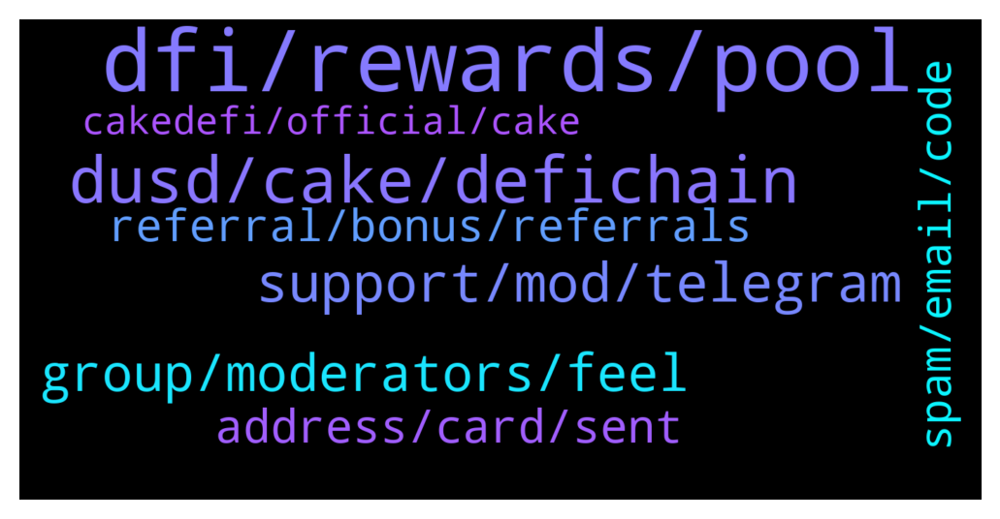

# **@CakeDeFi_EN**
 ## Analysis for **2022-01-31** - **2022-02-01**.

---

## 📊 **Basic Stats**

**n_messages_sent**: 277

---

---

## 🔝 **Top keywords and related messages**

1. **dfi, rewards, pool**

    @Tracey --- *Does the APR of 59.85% reduce by 1.658% every 11 days like the DefiChain?* **--->** [TG Discussion](https://t.me/CakeDeFi_EN/170236)

    @zachgax --- *I freeze Staked DFI for 10 years to get the 2X rewards, but I don’t think LM freezing has such additional bonus.   So I normally freeze LM for 12 months, as it seemed to me to be the best balance of fee reduction, additional % rewards and duration.   LM is something I might want to remove and reinvest in other pool. 10 years is too long a time.* **--->** [TG Discussion](https://t.me/CakeDeFi_EN/170501)

    @Tracey --- *thanks. assuming I own 1% of the total pool (USDC/DFI)  and pool size is  100million, and APR is 50%, this means that I will get 1% of the 50million rewards = 0.5mil.  I will get 0.25mil of  USDC, and 0.25mil worth of DFI. The number of DFI tokens I get, will depend on the market price of DFI at that time.* **--->** [TG Discussion](https://t.me/CakeDeFi_EN/170250)

    @Spikeboibeigel --- *Hmm, in that case I am confused. I have been testing it around a week. But the rewards are not near that on avg 90-91%. More like close to 60%. (I have frozen for 120 months)* **--->** [TG Discussion](https://t.me/CakeDeFi_EN/170500)

    @fabioandreatta --- *The 7 Most Frequently Asked Questions About Liquidity Mining  https://blog.cakedefi.com/the-7-most-frequently-asked-questions-about-liquidity-mining/* **--->** [TG Discussion](https://t.me/CakeDeFi_EN/170575)

    @Michael_Schredl --- *At the Freezer page you should see an entry that shows you how Long the DFI will be locked* **--->** [TG Discussion](https://t.me/CakeDeFi_EN/170307)

2. **dusd, cake, defichain**

    @Aimun_J --- *What the hell…   I swapped it on curve finance* **--->** [TG Discussion](https://t.me/CakeDeFi_EN/170198)

    @mm_phoenix --- *you can swap directly to cake dfi in dusd, because you thought you could buy it cheaper somewhere, it became inconvenient. ☹️* **--->** [TG Discussion](https://t.me/CakeDeFi_EN/170208)

    @Aimun_J --- *Hi. I am trying to deposit DUSD into my cake wallet however the wallet address is flagged as invalid. Can I not transfer DUSD from my MetaMask in order to liquidity mine?* **--->** [TG Discussion](https://t.me/CakeDeFi_EN/170190)

    @Tracey --- *How to get USDC onto DefiChain? Is the the same as decentralized asset  dUSDC ?* **--->** [TG Discussion](https://t.me/CakeDeFi_EN/170579)

    @Aimun_J --- *I’m working with 6 figures and I can’t take a risk of swapping 1 stable coin for 0.9 of another just to have it reverse on me. I haven’t been able to find a clear explanation to why this is so* **--->** [TG Discussion](https://t.me/CakeDeFi_EN/170211)

    @Kassius84 --- *The dUSD coin you need for the Cake DeFi and the DeFiChain is only available on Cake or DeFiChain DEX. I guess you bought another ERC20 token called DUSD which is not compatible with the DeFiChain.* **--->** [TG Discussion](https://t.me/CakeDeFi_EN/170195)

3. **support, mod, telegram**

    @agisma1 --- *A lot of people are texting me, who can I trust?* **--->** [TG Discussion](https://t.me/CakeDeFi_EN/170521)

    @Nazim66613 --- *Why doesn't it send SMS to Azerbaijan number?* **--->** [TG Discussion](https://t.me/CakeDeFi_EN/170597)

    @erikaa1997 --- *Minha conta ainda não foi aprovada, já passou 24 horas, alguém me ajuda* **--->** [TG Discussion](https://t.me/CakeDeFi_EN/170690)

    @Rathi2007 --- *Today I got this email...... What about this... Is it genuine?* **--->** [TG Discussion](https://t.me/CakeDeFi_EN/170665)

    @Ferhat04664 --- *Türk kimse var mı yardımcı olacak* **--->** [TG Discussion](https://t.me/CakeDeFi_EN/170064)

    @GumaaBaas430 --- *Why it is not available in Ethiopia and when shall it start?* **--->** [TG Discussion](https://t.me/CakeDeFi_EN/170375)

4. **group, moderators, feel**

    @DmgBautista --- *Moderators here! What can we help? :)* **--->** [TG Discussion](https://t.me/CakeDeFi_EN/170710)

    @DmgBautista --- *Hi! @ferhat_lorem_ipsum will DM you a one time message with the group channel immediatelly and only that. Stay safe 🙂 You can ask here after you check. He cannot post it here as he will get banned by the bot* **--->** [TG Discussion](https://t.me/CakeDeFi_EN/170052)

    @Welcomeus --- *Hello who is marketing staff here?* **--->** [TG Discussion](https://t.me/CakeDeFi_EN/170744)

    @DmgBautista --- *Good morning Zachary! And thanks for answering to the user while I was in my rest time! Good answer! Best regards :)* **--->** [TG Discussion](https://t.me/CakeDeFi_EN/170125)

    @DmgBautista --- *Don't have the group here now, as it's not an official group. That's why I identified the owner, as soon as he reads, he will surelly post the group :)* **--->** [TG Discussion](https://t.me/CakeDeFi_EN/170033)

    @Kassius84 --- *Moderators, feel free to ask directly here on the public chat.* **--->** [TG Discussion](https://t.me/CakeDeFi_EN/170646)

5. **address, card, sent**

    @mm_phoenix --- *It depends on which country you live in. In our country, they stick something over the address. it can be done in one day if you get an appointment. But actually the data on the ID card and your proof of address must match.😇* **--->** [TG Discussion](https://t.me/CakeDeFi_EN/170163)

    @mm_phoenix --- *then let change your address on your ID card 😇* **--->** [TG Discussion](https://t.me/CakeDeFi_EN/170160)

    @Aykut2234 --- *ok i understand but my process is just selfie photo all other steps are over* **--->** [TG Discussion](https://t.me/CakeDeFi_EN/170352)

    @Rathi2007 --- *On doing kyc it is asking for expire date of my identity card bt we on india we don't have expire date on our identity card that is adhaar card* **--->** [TG Discussion](https://t.me/CakeDeFi_EN/170676)

    @Michael_Schredl --- *The address has to be the exact same as on your documents* **--->** [TG Discussion](https://t.me/CakeDeFi_EN/170483)

    @Henry --- *As for me, I have done it 3 times with my bank statement. However, it denied it as it says it was photocopied, however I used camscanner to scan it.* **--->** [TG Discussion](https://t.me/CakeDeFi_EN/170479)

6. **referral, bonus, referrals**

    @MehmetnuriDilek --- *thank you bid I invited my friend but only 30 usd came to me and 50 usd for her(* **--->** [TG Discussion](https://t.me/CakeDeFi_EN/170309)

    @epoxyn --- *But it says both. But my referral gets 50 usd why am I get 30 ?* **--->** [TG Discussion](https://t.me/CakeDeFi_EN/170320)

    @Michael_Schredl --- *He maybe also got the sign up bonus* **--->** [TG Discussion](https://t.me/CakeDeFi_EN/170289)

    @Ahmet516 --- *Hello What is the award given to the referrer?* **--->** [TG Discussion](https://t.me/CakeDeFi_EN/170192)

    @fabioandreatta --- *Check your referral page, if you have valid Referrals, you only get rewards if your referrals have enough assets (more than $50 USD) - All referral rewards were paid out yesterday, meaning there is/was no issue* **--->** [TG Discussion](https://t.me/CakeDeFi_EN/170548)

    @LiquidX23 --- *Hello, is there a Problem with the weekly rewards for referrals? On monday I did not receive it* **--->** [TG Discussion](https://t.me/CakeDeFi_EN/170543)

7. **spam, email, code**

    @DmgBautista --- *Maybe because you whitelisted your sending adress before? If not, check your spam folder :)* **--->** [TG Discussion](https://t.me/CakeDeFi_EN/170226)

    @Kapszel --- *hi why i cant see email code verifi?* **--->** [TG Discussion](https://t.me/CakeDeFi_EN/170768)

    @emre84 --- *how to reset my google autenticor code incorrectly* **--->** [TG Discussion](https://t.me/CakeDeFi_EN/170406)

    @Emonkhan05 --- *no I don't mark Whitelisted  any problem?  what I do now??* **--->** [TG Discussion](https://t.me/CakeDeFi_EN/170267)

    @Kapszel --- *other email than gmial dont show ver code* **--->** [TG Discussion](https://t.me/CakeDeFi_EN/170772)

    @fabioandreatta --- *Make sure to check again, maybe in spam. Also make sure to check your email settings* **--->** [TG Discussion](https://t.me/CakeDeFi_EN/170545)

